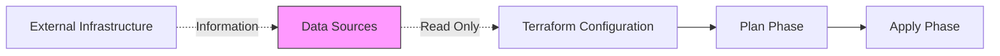

# Terraform Data Sources

## Introduction

When working with Terraform, you often need to reference resources that already exist in your infrastructure or retrieve information from your provider. This is where **data sources** come into play. Data sources allow you to fetch and use information defined outside of your Terraform configuration.

Think of data sources as "read-only" queries that fetch information you can use in your configuration. They're a crucial part of making your Terraform code more dynamic and flexible.

## What Are Data Sources?

Data sources in Terraform:

- Allow you to **fetch** existing information from your infrastructure provider
- Are **read-only** and don't create, modify, or delete resources
- Help you **reference** existing resources without managing them
- Make your configurations more **dynamic** by pulling in real-time data

Let's see how data sources fit into the Terraform workflow:



## Basic Syntax

Here's the basic syntax for defining a data source:

```hcl
data "provider_resource_type" "name" {
  // search criteria or filters
}
```

Let's break down this syntax:

- `data`: The keyword that identifies this block as a data source
- `provider_resource_type`: The type of resource you want information about
- `name`: A unique identifier you choose to refer to this specific data source
- The block content inside `{ }` contains filters or search criteria

## How to Reference Data Sources

To use data from a data source in your configuration, you use the following syntax:

```hcl
data.provider_resource_type.name.attribute
```

## Example 1: Finding an AWS AMI

Let's look at a common use case - finding the latest Amazon Machine Image (AMI) for an EC2 instance:

```hcl
data "aws_ami" "ubuntu" {
  most_recent = true
  
  filter {
    name   = "name"
    values = ["ubuntu/images/hvm-ssd/ubuntu-focal-20.04-amd64-server-*"]
  }
  
  filter {
    name   = "virtualization-type"
    values = ["hvm"]
  }
  
  owners = ["099720109477"] # Canonical's AWS account ID
}

resource "aws_instance" "web_server" {
  ami           = data.aws_ami.ubuntu.id
  instance_type = "t2.micro"
  
  tags = {
    Name = "Ubuntu Web Server"
  }
}
```

In this example:

1. We define a data source of type `aws_ami` named `ubuntu`
2. We use filters to find the most recent Ubuntu 20.04 image
3. We reference the AMI ID in our EC2 instance resource with `data.aws_ami.ubuntu.id`

## Example 2: Fetching Current AWS Region

To get information about the current AWS region:

```hcl
data "aws_region" "current" {}

output "current_region" {
  value = data.aws_region.current.name
}
```

This simple data source requires no arguments but provides useful information about your current region.

## Example 3: Reading a Local File

Terraform allows you to read local files using data sources:

```hcl
data "local_file" "example" {
  filename = "${path.module}/example.txt"
}

output "file_content" {
  value = data.local_file.example.content
}
```

This reads a local file and makes its content available for use in your configuration.

## Real-World Application: Multi-Environment Setup

Data sources are particularly useful in multi-environment setups. Let's create a configuration that adapts to different environments:

```hcl
# Define the environment from a variable
variable "environment" {
  type    = string
  default = "dev"
}

# Look up environment-specific VPC
data "aws_vpc" "selected" {
  tags = {
    Environment = var.environment
    Name        = "${var.environment}-vpc"
  }
}

# Look up subnets in that VPC
data "aws_subnet_ids" "selected" {
  vpc_id = data.aws_vpc.selected.id
  
  tags = {
    Tier = "application"
  }
}

# Deploy application in the correct environment
resource "aws_instance" "app" {
  count         = 2
  ami           = "ami-0c55b159cbfafe1f0"
  instance_type = var.environment == "prod" ? "t2.medium" : "t2.micro"
  subnet_id     = tolist(data.aws_subnet_ids.selected.ids)[count.index % length(data.aws_subnet_ids.selected.ids)]
  
  tags = {
    Name        = "app-server-${count.index + 1}"
    Environment = var.environment
  }
}
```

In this example:

1. We define an environment variable that can be set to "dev", "staging", or "prod"
2. We use data sources to look up the existing VPC and subnet IDs for that environment
3. We deploy instances into the correct environment with appropriate sizing

## Common Data Source Types

Here are some commonly used data sources across providers:

### AWS Provider

- `aws_ami`: Find Amazon Machine Images
- `aws_availability_zones`: List available AZs
- `aws_vpc`: Look up a VPC
- `aws_subnet_ids`: Find subnets in a VPC
- `aws_security_group`: Look up security groups

### Azure Provider

- `azurerm_resource_group`: Look up a resource group
- `azurerm_virtual_network`: Find a virtual network
- `azurerm_subnet`: Look up a subnet
- `azurerm_image`: Find VM images

### Google Cloud Provider

- `google_compute_image`: Find compute images
- `google_compute_network`: Look up a network
- `google_compute_zones`: List available zones

## Using Data Sources with `for_each` and `count`

Data sources can be combined with `for_each` and `count` for more dynamic configurations:

```hcl
data "aws_subnet_ids" "example" {
  vpc_id = var.vpc_id
}

resource "aws_instance" "web" {
  for_each = data.aws_subnet_ids.example.ids
  
  ami           = "ami-0c55b159cbfafe1f0"
  instance_type = "t2.micro"
  subnet_id     = each.value
  
  tags = {
    Name = "web-server-${each.key}"
  }
}
```

This creates one EC2 instance in each subnet returned by the data source.

## Data Source Dependencies

Data sources implicitly depend on their provider configuration but can also have explicit dependencies:

```hcl
data "aws_vpc" "example" {
  depends_on = [aws_vpc.new_vpc]
  default    = false
}
```

The `depends_on` attribute ensures the data source is only evaluated after the dependent resources are created.

## Practical Tips for Working with Data Sources

1. **Use data sources for information that may change** - Like AMI IDs or availability zones
2. **Avoid hardcoding values** that can be looked up with data sources
3. **Combine with variables** for maximum flexibility
4. **Filter specifically** to ensure you get the exact resources you expect
5. **Use data sources for cross-account or cross-region references**

## Debugging Data Sources

If you're having trouble with a data source, you can use outputs to inspect the returned data:

```hcl
output "debug_ami_info" {
  value = data.aws_ami.ubuntu
}
```

This will show all attributes of the data source in the Terraform output, which can be helpful for debugging.

## Summary

Data sources are a powerful feature in Terraform that allow you to query existing infrastructure and use that information in your configuration. They enable:

- More dynamic and flexible configurations
- Better integration with existing resources
- Reduced hardcoding of values that may change
- Creation of environment-agnostic configurations

By mastering data sources, you can create more maintainable and adaptable Terraform code.

## Exercises

1. Create a Terraform configuration that uses a data source to find the latest Amazon Linux 2 AMI and launches an EC2 instance using it.

2. Write a configuration that outputs a list of all availability zones in your current AWS region using data sources.

3. Use data sources to create a configuration that can be deployed to multiple environments (dev, test, prod) without changing the code, only by changing input variables.

## Additional Resources

- [Terraform Data Sources Documentation](https://www.terraform.io/docs/language/data-sources/index.html)
- [AWS Provider Data Sources](https://registry.terraform.io/providers/hashicorp/aws/latest/docs/data-sources)
- [Azure Provider Data Sources](https://registry.terraform.io/providers/hashicorp/azurerm/latest/docs/data-sources)
- [Google Cloud Provider Data Sources](https://registry.terraform.io/providers/hashicorp/google/latest/docs/data-sources)