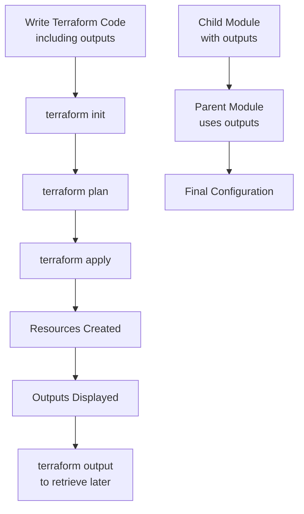

# Terraform Outputs

## Introduction

When working with Terraform, you often need to access and share information about the resources you've created. This is where **output values** come in. Outputs allow you to extract and display specific values from your infrastructure after it's been provisioned. They serve as a way to organize data that you might need for other operations or to share with other Terraform configurations.

In this tutorial, we'll explore how to define, use, and leverage output values in Terraform. By the end, you'll understand how outputs can enhance your infrastructure code and make it more modular and reusable.

## What Are Terraform Outputs?

Output values in Terraform serve these key purposes:

1. **Displaying information** about your infrastructure after applying changes
2. **Exposing data** from a module to the parent module
3. **Sharing data** between different Terraform configurations using remote state

Think of outputs as a way to "export" values from your Terraform configuration, making them available for external use.

## Basic Syntax

The basic syntax for defining an output in Terraform is straightforward:

```hcl
output "output_name" {
  value       = expression
  description = "Description of the output"
  sensitive   = false
}
```

Let's break down each component:

- `output_name`: A unique identifier for the output
- `value`: The actual data to be exposed
- `description`: Optional documentation explaining the output's purpose
- `sensitive`: Optional boolean flag to hide sensitive outputs (defaults to `false`)

## Simple Output Example

Let's start with a basic example where we create an AWS EC2 instance and output its public IP address:

```hcl
provider "aws" {
  region = "us-west-2"
}

resource "aws_instance" "web_server" {
  ami           = "ami-0c55b159cbfafe1f0"
  instance_type = "t2.micro"
  tags = {
    Name = "WebServer"
  }
}

output "public_ip" {
  value       = aws_instance.web_server.public_ip
  description = "The public IP address of the web server"
}
```

After running `terraform apply`, you'll see output like this:

```
Apply complete! Resources: 1 added, 0 changed, 0 destroyed.

Outputs:

public_ip = "34.211.42.108"
```

You can also access this output later by running `terraform output`:

```
$ terraform output
public_ip = "34.211.42.108"
```

Or access a specific output value:

```
$ terraform output public_ip
"34.211.42.108"
```

## Outputting Complex Values

Outputs can handle more than just simple strings or numbers. You can output complex data types like maps, lists, and objects:

```hcl
resource "aws_vpc" "main" {
  cidr_block = "10.0.0.0/16"
  
  tags = {
    Name = "MainVPC"
    Environment = "Production"
  }
}

resource "aws_subnet" "public" {
  count      = 2
  vpc_id     = aws_vpc.main.id
  cidr_block = "10.0.${count.index}.0/24"
  
  tags = {
    Name = "Public-${count.index}"
  }
}

output "vpc_info" {
  value = {
    id         = aws_vpc.main.id
    cidr_block = aws_vpc.main.cidr_block
    tags       = aws_vpc.main.tags
  }
  description = "Information about the created VPC"
}

output "public_subnet_ids" {
  value       = aws_subnet.public[*].id
  description = "List of public subnet IDs"
}
```

The output would look something like:

```
Outputs:

public_subnet_ids = [
  "subnet-0123456789abcdef0",
  "subnet-0123456789abcdef1",
]
vpc_info = {
  "cidr_block" = "10.0.0.0/16"
  "id" = "vpc-0123456789abcdef2"
  "tags" = {
    "Environment" = "Production"
    "Name" = "MainVPC"
  }
}
```

## Working with Sensitive Data

When dealing with sensitive information like passwords or secret keys, you can mark outputs as sensitive:

```hcl
resource "random_password" "db_password" {
  length           = 16
  special          = true
  override_special = "!#$%&*()-_=+[]{}<>:?"
}

output "db_password" {
  value       = random_password.db_password.result
  sensitive   = true
  description = "Database password"
}
```

When an output is marked as sensitive, Terraform will hide its value in the console output:

```
Apply complete! Resources: 1 added, 0 changed, 0 destroyed.

Outputs:

db_password = <sensitive>
```

However, you can still access the sensitive value using the `terraform output` command with the `-json` flag:

```
$ terraform output -json db_password
"mySecurePassword123!"
```

## Using Outputs Between Modules

One of the most powerful uses of outputs is to share data between Terraform modules. A module can expose certain values through outputs, which the parent module can then use:

```hcl
# networking/main.tf
resource "aws_vpc" "main" {
  cidr_block = var.vpc_cidr
}

resource "aws_subnet" "main" {
  vpc_id     = aws_vpc.main.id
  cidr_block = var.subnet_cidr
}

output "vpc_id" {
  value = aws_vpc.main.id
}

output "subnet_id" {
  value = aws_subnet.main.id
}
```

The parent module can then use these outputs:

```hcl
# main.tf
module "networking" {
  source      = "./networking"
  vpc_cidr    = "10.0.0.0/16"
  subnet_cidr = "10.0.1.0/24"
}

resource "aws_instance" "web" {
  ami           = "ami-0c55b159cbfafe1f0"
  instance_type = "t2.micro"
  subnet_id     = module.networking.subnet_id
  
  tags = {
    Name = "WebServer"
  }
}

output "instance_details" {
  value = {
    id        = aws_instance.web.id
    public_ip = aws_instance.web.public_ip
    vpc_id    = module.networking.vpc_id
  }
}
```

This demonstrates how modules can share information through outputs, allowing for better code organization and reusability.

## Terraform Outputs Workflow

Here's a visual representation of how outputs work in the Terraform workflow:



## Practical Use Cases for Outputs

### 1. Creating a Configuration File

You can use outputs to generate configuration files for applications:

```hcl
resource "aws_db_instance" "database" {
  allocated_storage    = 10
  engine               = "mysql"
  engine_version       = "5.7"
  instance_class       = "db.t3.micro"
  name                 = "mydb"
  username             = "admin"
  password             = var.db_password
  parameter_group_name = "default.mysql5.7"
  skip_final_snapshot  = true
}

output "database_config" {
  value = <<-EOT
    DB_HOST=${aws_db_instance.database.address}
    DB_PORT=${aws_db_instance.database.port}
    DB_NAME=${aws_db_instance.database.name}
    DB_USER=${aws_db_instance.database.username}
  EOT
  description = "Database configuration"
}
```

### 2. Sharing Information Between Workspaces

Outputs can be used to share information between different Terraform workspaces through remote state:

```hcl
# In networking workspace
output "vpc_id" {
  value = aws_vpc.main.id
}

# In application workspace
data "terraform_remote_state" "network" {
  backend = "s3"
  config = {
    bucket = "terraform-state"
    key    = "network/terraform.tfstate"
    region = "us-west-2"
  }
}

resource "aws_instance" "app" {
  # Use the VPC ID from the networking workspace
  subnet_id = data.terraform_remote_state.network.outputs.vpc_id
  # Other configuration...
}
```

### 3. Creating DNS Records Automatically

```hcl
resource "aws_instance" "web" {
  ami           = "ami-0c55b159cbfafe1f0"
  instance_type = "t2.micro"
}

resource "aws_route53_record" "www" {
  zone_id = aws_route53_zone.primary.zone_id
  name    = "www.example.com"
  type    = "A"
  ttl     = "300"
  records = [aws_instance.web.public_ip]
}

output "website_url" {
  value       = "http://${aws_route53_record.www.name}"
  description = "The URL of the website"
}
```

## Best Practices for Using Outputs

1. **Use meaningful names**: Choose descriptive output names that clearly indicate what information they provide.

2. **Always add descriptions**: Include a description for each output to document its purpose.

3. **Group related outputs**: Use complex types like maps to group related outputs together.

4. **Mark sensitive data**: Always use `sensitive = true` for passwords, tokens, and other sensitive information.

5. **Output only what's needed**: Don't expose unnecessary information that isn't used elsewhere.

6. **Format for consumption**: Consider the format that will be most useful for consuming the output (strings, JSON, etc.).

## Summary

In this tutorial, we've learned:

- How to define and use output values in Terraform
- Ways to output complex data structures
- How to handle sensitive information in outputs
- Using outputs to share data between modules
- Practical use cases for Terraform outputs
- Best practices for working with outputs

Outputs are a fundamental part of Terraform that help make your infrastructure code more modular, reusable, and user-friendly. By effectively using outputs, you can better organize your code and make it easier to integrate with other systems and workflows.

## Exercises

1. Create a Terraform configuration that provisions an AWS S3 bucket and outputs its name and ARN.
2. Write a module that creates an AWS VPC with public and private subnets, and outputs relevant information like subnet IDs, CIDR blocks, and route table IDs.
3. Create a configuration that generates sensitive credentials and outputs them securely.
4. Use outputs from one Terraform workspace as input to another using remote state.
5. Generate a configuration file for an application using Terraform outputs.

## Additional Resources

- [Terraform Output Values Documentation](https://www.terraform.io/docs/language/values/outputs.html)
- [Terraform Modules Documentation](https://www.terraform.io/docs/language/modules/develop/index.html)
- [Remote State Data Source](https://www.terraform.io/docs/language/state/remote-state-data.html)