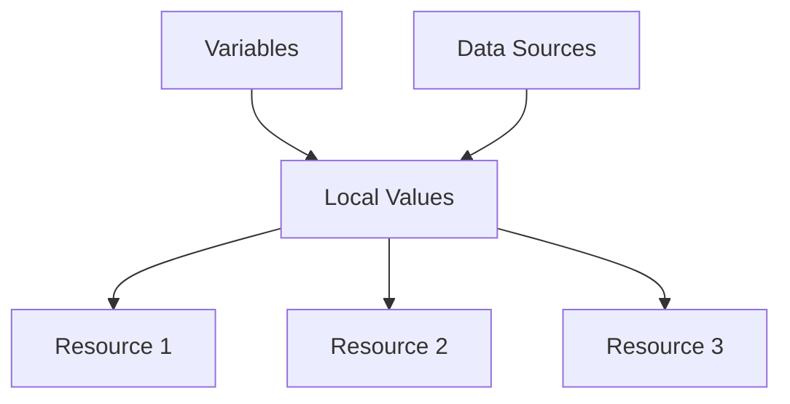

# Terraform Local Values

## Introduction

When working with Terraform configurations, you'll often find yourself repeating the same expressions or values across multiple resources. This can make your configuration harder to read, maintain, and update. This is where Terraform's **local values** (often called "locals") come to the rescue.

Local values allow you to assign a name to an expression, which you can then use multiple times within your configuration. Think of them as variables that are used only within your module or configuration file - they don't create any resources and aren't exposed to the outside world.

## Basic Syntax

Local values are defined in a `locals` block:

```hcl
locals {
  service_name = "forum"
  owner        = "Community Team"
  common_tags = {
    Service = local.service_name
    Owner   = local.owner
  }
}
```

You can then reference these locals elsewhere in your configuration using the `local.NAME` syntax:

```hcl
resource "aws_instance" "example" {
  # ...
  
  tags = local.common_tags
}
```

## Why Use Local Values?

Local values provide several benefits:

1. **Reduce Duplication**: Define a value once and reuse it throughout your configuration
2. **Improve Readability**: Give meaningful names to complex expressions
3. **Centralize Changes**: Update a value in one place instead of multiple places
4. **Compute Values Once**: Calculate a value only once instead of repeatedly

## When to Use Local Values vs. Variables

It's important to understand when to use local values versus variables:

| Local Values | Variables |
|--------------|-----------|
| Used within a module | Can be set from outside the module |
| Don't accept input | Accept input when module is called |
| For internal calculations | For module configuration |
| Not shown in plan outputs | Shown in plan outputs |

## Practical Examples

### Example 1: Standardizing Tags

One common use case is standardizing tags across resources:

```hcl
locals {
  common_tags = {
    Project     = "Learning-Terraform"
    Environment = "Development"
    CreatedBy   = "Terraform"
  }
}

resource "aws_s3_bucket" "example" {
  bucket = "my-terraform-bucket"
  
  tags = local.common_tags
}

resource "aws_instance" "server" {
  ami           = "ami-0c55b159cbfafe1f0"
  instance_type = "t2.micro"
  
  tags = local.common_tags
}
```

**Output:**
Both resources will have the same tags applied. If you need to update the tags, you only need to change them in one place.

### Example 2: Transforming Data

Locals are great for transforming data:

```hcl
locals {
  # Convert a list to a map
  user_map = {
    for user in var.users :
    user.name => user
  }
  
  # Filter a list
  admin_users = [
    for user in var.users :
    user.name
    if user.is_admin
  ]
}
```

### Example 3: Conditional Logic

Use locals for conditional logic:

```hcl
locals {
  is_production = var.environment == "production"
  instance_type = local.is_production ? "m5.large" : "t2.micro"
  instance_count = local.is_production ? 3 : 1
}

resource "aws_instance" "server" {
  count         = local.instance_count
  ami           = "ami-0c55b159cbfafe1f0"
  instance_type = local.instance_type
  
  tags = {
    Name = "server-${count.index}"
  }
}
```

**Output:**
In production, three `m5.large` instances will be created. In non-production environments, one `t2.micro` instance will be created.

### Example 4: Formatting and Normalizing Data

Use locals to format or normalize data:

```hcl
locals {
  # Convert to lowercase for consistency
  environment = lower(var.environment)
  
  # Format a name consistently
  resource_prefix = "${local.environment}-${var.project_name}"
}

resource "aws_dynamodb_table" "example" {
  name         = "${local.resource_prefix}-table"
  billing_mode = "PAY_PER_REQUEST"
  hash_key     = "id"
  
  attribute {
    name = "id"
    type = "S"
  }
}
```

## Best Practices

1. **Keep Locals Focused**: Define locals for specific purposes rather than creating a giant locals block.
2. **Use Meaningful Names**: Choose descriptive names that explain the purpose of the local value.
3. **Group Related Locals**: Keep related locals together for better organization.
4. **Comment Complex Transformations**: Explain complex transformations with comments.
5. **Avoid Circular References**: Don't create circular references between locals.

## Common Patterns

### Normalizing Inputs

```hcl
locals {
  normalized_name = replace(lower(var.resource_name), "/[^a-z0-9]/", "-")
}
```

### Creating Standard Resource Names

```hcl
locals {
  name_prefix = "${var.project}-${var.environment}"
  bucket_name = "${local.name_prefix}-data"
  lambda_name = "${local.name_prefix}-processor"
}
```

### Merging Maps

```hcl
locals {
  default_tags = {
    Terraform   = "true"
    Environment = var.environment
  }
  
  all_tags = merge(local.default_tags, var.custom_tags)
}
```

## Visualizing Local Values



## Summary

Local values are a powerful feature in Terraform that helps you write cleaner, more maintainable configurations. They allow you to define expressions once and reuse them throughout your configuration, reducing duplication and making your code more readable.

Key takeaways:
- Use locals to reduce duplication and improve readability
- Locals are different from variables—they're for internal use within a module
- Locals can reference other locals, variables, and data sources
- They're perfect for standardizing values, transforming data, and implementing conditional logic

## Additional Resources

- [Terraform Documentation: Local Values](https://www.terraform.io/docs/language/values/locals.html)
- [Terraform Best Practices](https://www.terraform-best-practices.com/)

## Exercises

1. Create a local value that generates a unique name for each resource based on a project name, environment, and resource type.
2. Use local values to implement different configuration settings for development, staging, and production environments.
3. Create a local value that transforms a list of user objects into a map keyed by user ID.
4. Use local values to implement conditional resource creation based on an environment variable.