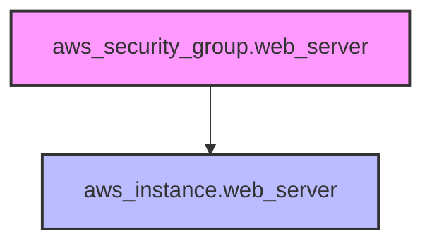
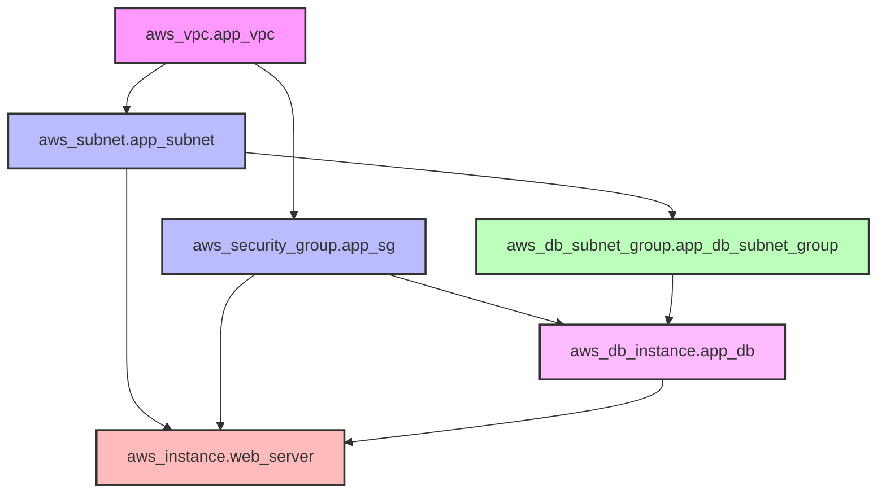

# Terraform Dependencies

## Introduction

In Terraform, dependencies define the relationships between resources and determine the order in which resources are created, modified, or destroyed. Understanding how to manage dependencies is crucial for building reliable infrastructure as code, as it ensures that resources are provisioned in the correct sequence.

For example, you can't attach an EBS volume to an EC2 instance before the instance exists, or configure a database connection string before the database is created. Terraform needs to know these relationships to create your infrastructure correctly.

This guide will walk you through the different types of dependencies in Terraform and show you how to work with them effectively.

## Types of Dependencies in Terraform

Terraform handles two main types of dependencies:

1. **Implicit Dependencies**: Automatically detected by Terraform based on references in your configuration
2. **Explicit Dependencies**: Manually defined using the `depends_on` argument

Let's explore each type in detail.

## Implicit Dependencies

Terraform automatically identifies dependencies when one resource references attributes of another resource. This is the most common and preferred way to handle dependencies.

### Example: Creating an EC2 Instance with a Security Group

```hcl
resource "aws_security_group" "web_server" {
  name        = "web-server-sg"
  description = "Allow HTTP and SSH traffic"
  
  ingress {
    from_port   = 80
    to_port     = 80
    protocol    = "tcp"
    cidr_blocks = ["0.0.0.0/0"]
  }
  
  ingress {
    from_port   = 22
    to_port     = 22
    protocol    = "tcp"
    cidr_blocks = ["0.0.0.0/0"]
  }
  
  egress {
    from_port   = 0
    to_port     = 0
    protocol    = "-1"
    cidr_blocks = ["0.0.0.0/0"]
  }
}

resource "aws_instance" "web_server" {
  ami           = "ami-0c55b159cbfafe1f0"
  instance_type = "t2.micro"
  
  # This reference creates an implicit dependency
  security_groups = [aws_security_group.web_server.name]
  
  tags = {
    Name = "WebServer"
  }
}
```

In this example, Terraform automatically determines that the EC2 instance depends on the security group because the instance references the security group's name. During execution, Terraform will create the security group first, and only then create the EC2 instance.

### How Implicit Dependencies Work

When you reference an attribute from another resource (like `aws_security_group.web_server.name`), Terraform builds a dependency graph. This graph helps Terraform determine the correct order of operations.

Let's visualize this process:



## Explicit Dependencies with depends_on

Sometimes resources have dependencies that aren't expressed through attribute references. In these cases, you can use the `depends_on` argument to explicitly define a dependency.

### Example: Creating an S3 Bucket with a CloudFront Distribution

```hcl
resource "aws_s3_bucket" "static_website" {
  bucket = "my-static-website"
  acl    = "public-read"
  
  website {
    index_document = "index.html"
    error_document = "error.html"
  }
}

resource "aws_cloudfront_distribution" "s3_distribution" {
  origin {
    domain_name = aws_s3_bucket.static_website.bucket_regional_domain_name
    origin_id   = "S3-${aws_s3_bucket.static_website.bucket}"
  }
  
  enabled             = true
  default_root_object = "index.html"
  
  # Additional CloudFront configuration...
  
  # Explicit dependency
  depends_on = [aws_s3_bucket.static_website]
}
```

In this example, even though there's already an implicit dependency through the `domain_name` attribute, we added an explicit dependency using `depends_on`. This might be necessary if there are operational dependencies not captured by configuration references.

### When to Use Explicit Dependencies

Use `depends_on` when:

1. The dependency isn't obvious from attribute references
2. You need to ensure a specific order of operations
3. The dependency is required for successful deployment but not reflected in the configuration

Remember, explicit dependencies should be used sparingly. Overuse can make your configuration harder to understand and maintain.

## Advanced Dependency Management

### Resource Lifecycle and Create Before Destroy

Sometimes you need more control over how resources are replaced. The `create_before_destroy` lifecycle setting is useful for zero-downtime deployments:

```hcl
resource "aws_instance" "web_server" {
  ami           = "ami-0c55b159cbfafe1f0"
  instance_type = "t2.micro"
  
  # Other configurations...
  
  lifecycle {
    create_before_destroy = true
  }
}
```

With this setting, Terraform creates a new instance before destroying the old one when a change requires replacement.

### Module Dependencies

Dependencies also apply to modules. When one module depends on resources created by another module, you can use the `depends_on` meta-argument at the module level:

```hcl
module "vpc" {
  source = "./modules/vpc"
  # VPC configuration...
}

module "web_servers" {
  source = "./modules/web_servers"
  vpc_id = module.vpc.vpc_id
  
  # Explicit module dependency
  depends_on = [module.vpc]
}
```

While there's an implicit dependency through the `vpc_id` attribute, adding an explicit dependency ensures that all resources in the VPC module are created before any resources in the web_servers module.

## Terraform Dependency Visualization

Terraform provides a way to visualize your resource dependencies using the `terraform graph` command. This generates a DOT format graph that you can convert to an image:

```bash
terraform graph > graph.dot
```

You can visualize this file using tools like Graphviz or online DOT visualization services.

## Common Dependency Challenges and Solutions

### Challenge 1: Circular Dependencies

Circular dependencies occur when two resources depend on each other, creating a loop that Terraform can't resolve.

**Solution:** Restructure your resources to break the circular dependency. This might involve creating intermediate resources or using a different approach to achieve your goal.

### Challenge 2: Missing Dependencies

Sometimes Terraform might not recognize a dependency that exists in the real world.

**Solution:** Use explicit `depends_on` to ensure the correct order of operations.

### Challenge 3: Over-constrained Dependencies

Too many dependencies can slow down your Terraform operations and make your configuration harder to understand.

**Solution:** Review your dependencies regularly and remove unnecessary `depends_on` statements. Let implicit dependencies handle most relationships.

## Real-world Example: Web Application Deployment

Let's put everything together in a comprehensive example of deploying a web application:

```hcl
# 1. Create a VPC for our application
resource "aws_vpc" "app_vpc" {
  cidr_block = "10.0.0.0/16"
  tags = {
    Name = "app-vpc"
  }
}

# 2. Create subnets
resource "aws_subnet" "app_subnet" {
  vpc_id     = aws_vpc.app_vpc.id
  cidr_block = "10.0.1.0/24"
  tags = {
    Name = "app-subnet"
  }
}

# 3. Create a security group
resource "aws_security_group" "app_sg" {
  name        = "app-sg"
  description = "Allow web traffic"
  vpc_id      = aws_vpc.app_vpc.id
  
  ingress {
    from_port   = 80
    to_port     = 80
    protocol    = "tcp"
    cidr_blocks = ["0.0.0.0/0"]
  }
  
  egress {
    from_port   = 0
    to_port     = 0
    protocol    = "-1"
    cidr_blocks = ["0.0.0.0/0"]
  }
}

# 4. Create a database
resource "aws_db_instance" "app_db" {
  allocated_storage    = 10
  engine               = "mysql"
  engine_version       = "5.7"
  instance_class       = "db.t3.micro"
  db_name              = "appdb"
  username             = "admin"
  password             = "password123"  # In production, use secrets management
  parameter_group_name = "default.mysql5.7"
  skip_final_snapshot  = true
  
  vpc_security_group_ids = [aws_security_group.app_sg.id]
  db_subnet_group_name   = aws_db_subnet_group.app_db_subnet_group.name
}

# 5. Create DB subnet group
resource "aws_db_subnet_group" "app_db_subnet_group" {
  name       = "app-db-subnet-group"
  subnet_ids = [aws_subnet.app_subnet.id]
}

# 6. Create web server
resource "aws_instance" "web_server" {
  ami           = "ami-0c55b159cbfafe1f0"
  instance_type = "t2.micro"
  subnet_id     = aws_subnet.app_subnet.id
  
  vpc_security_group_ids = [aws_security_group.app_sg.id]
  
  user_data = <<-EOF
    #!/bin/bash
    echo "export DB_HOST=${aws_db_instance.app_db.address}" >> /etc/environment
    echo "export DB_USER=${aws_db_instance.app_db.username}" >> /etc/environment
    echo "export DB_PASSWORD=${aws_db_instance.app_db.password}" >> /etc/environment
    echo "export DB_NAME=${aws_db_instance.app_db.db_name}" >> /etc/environment
    # Additional setup commands...
  EOF
  
  tags = {
    Name = "WebServer"
  }
  
  depends_on = [aws_db_instance.app_db]
}
```

In this example:

1. Terraform creates the VPC first
2. Then it creates the subnet, which depends on the VPC
3. The security group is created, which depends on the VPC
4. The DB subnet group is created, which depends on the subnet
5. The database is created, which depends on both the security group and DB subnet group
6. Finally, the web server is created, which depends on the subnet, security group, and explicitly on the database

The dependency graph for this would look like:



## Summary

Understanding dependencies in Terraform is essential for building reliable infrastructure as code. Here's what we've covered:

- **Implicit dependencies** are automatically detected when one resource references attributes of another
- **Explicit dependencies** are manually defined using the `depends_on` argument
- Use `depends_on` sparingly, only when necessary
- Lifecycle settings like `create_before_destroy` provide additional control over resource provisioning
- Module dependencies work similarly to resource dependencies
- The `terraform graph` command helps visualize your dependency structure
- Common challenges include circular dependencies, missing dependencies, and over-constrained dependencies

By mastering these concepts, you'll be able to create more robust and efficient Terraform configurations.

## Additional Resources

- Try implementing a multi-tier application with proper dependencies
- Experiment with the `terraform graph` command to visualize your resource relationships
- Practice resolving circular dependencies in a test environment

## Exercises

1. Create a Terraform configuration for a simple web application with a load balancer, EC2 instances, and an RDS database. Ensure proper dependencies are set up.
2. Modify an existing Terraform configuration to use `create_before_destroy` for zero-downtime deployment.
3. Identify and resolve circular dependencies in a provided Terraform configuration (available in the exercise files).
4. Use the `terraform graph` command to visualize the dependencies in your configuration and analyze the results.