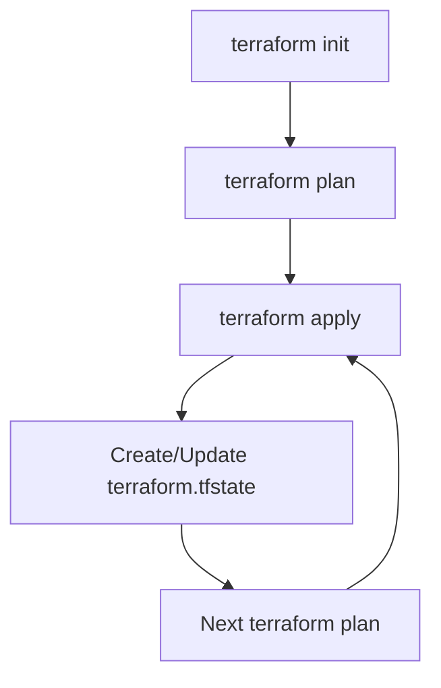

# Terraform State

## Introduction

Terraform state is one of the most important concepts to understand when working with Terraform. It's the mechanism that Terraform uses to keep track of the resources it manages and the relationships between them.

In this guide, you'll learn:
- What Terraform state is and why it's essential
- How Terraform uses state to manage infrastructure
- Different backends for storing state
- State locking and workspaces
- Best practices for state management

## What is Terraform State?

At its core, Terraform state is a mapping between your configured resources and the real-world infrastructure objects they represent. Terraform stores this mapping in a file called `terraform.tfstate` by default.

Let's understand why state is necessary:

1. **Resource Tracking**: State keeps track of which real-world resources correspond to which resources in your configuration
2. **Metadata Storage**: It stores metadata about your resources that can't be inferred from the infrastructure alone
3. **Performance**: State helps optimize performance by caching resource attributes
4. **Collaboration**: State facilitates team collaboration by providing a shared view of your infrastructure

### Example of a Terraform State File

When you run `terraform apply`, Terraform creates or updates a state file. Here's a simplified example of what a state file looks like:

```json
{
  "version": 4,
  "terraform_version": "1.5.7",
  "serial": 1,
  "lineage": "3f200cbc-3bec-643f-2a84-5793b6a9ca2f",
  "outputs": {},
  "resources": [
    {
      "mode": "managed",
      "type": "aws_instance",
      "name": "example",
      "provider": "provider[\"registry.terraform.io/hashicorp/aws\"]",
      "instances": [
        {
          "schema_version": 1,
          "attributes": {
            "ami": "ami-0c55b159cbfafe1f0",
            "instance_type": "t2.micro",
            "id": "i-0123456789abcdef0",
            "tags": {
              "Name": "example-instance"
            }
          }
        }
      ]
    }
  ]
}
```

This file contains detailed information about the resources Terraform is managing, including resource types, names, attributes, and dependencies.

## How Terraform Uses State

### The Terraform Workflow

Let's look at how state fits into the Terraform workflow:



1. When you run `terraform plan`, Terraform:
   - Reads your configuration files
   - Reads the current state file
   - Queries providers to find the real state of resources
   - Determines what changes need to be made

2. When you run `terraform apply`, Terraform:
   - Makes the necessary changes to your infrastructure
   - Updates the state file with the new resource information

### Example: Adding a Resource

Let's see how Terraform uses state when adding a new resource:

```hcl
# main.tf
provider "aws" {
  region = "us-west-2"
}

resource "aws_instance" "example" {
  ami           = "ami-0c55b159cbfafe1f0"
  instance_type = "t2.micro"
  
  tags = {
    Name = "example-instance"
  }
}
```

When you run `terraform apply` with this configuration:

1. Terraform checks if this resource exists in the state
2. Since it doesn't exist, Terraform creates the AWS instance
3. Terraform adds the resource to the state file
4. Future operations will use this state entry to track the resource

## Terraform State Storage: Backends

By default, Terraform stores state locally in a file called `terraform.tfstate`. However, this approach has limitations for team environments. Terraform supports different "backends" for storing state remotely.

### Popular Backends

- **Local**: The default backend, stores state in a local file
- **S3**: Store state in an AWS S3 bucket
- **Azure Storage**: Store state in Azure Blob Storage
- **Google Cloud Storage**: Store state in a GCS bucket
- **Terraform Cloud**: HashiCorp's managed service for Terraform
- **HTTP**: Store state using a REST client

### Configuring a Remote Backend

Here's how to configure an S3 backend:

```hcl
# backend.tf
terraform {
  backend "s3" {
    bucket = "my-terraform-state"
    key    = "prod/terraform.tfstate"
    region = "us-east-1"
    dynamodb_table = "terraform-locks"
    encrypt = true
  }
}
```

After configuring a backend, run `terraform init` to initialize it:

```bash
$ terraform init

Initializing the backend...
Successfully configured the backend "s3"! Terraform will automatically
use this backend unless the backend configuration changes.
```

## State Locking

When working in a team, multiple people might try to modify the same infrastructure simultaneously. To prevent conflicts, Terraform uses state locking.

State locking ensures that only one operation can modify the state at a time, preventing corruption or conflicts. Different backends support different locking mechanisms:

- **S3**: Uses DynamoDB for locking
- **Azure**: Uses blob leases
- **Terraform Cloud**: Has built-in locking

### Example: S3 Backend with DynamoDB Locking

```hcl
terraform {
  backend "s3" {
    bucket = "my-terraform-state"
    key    = "prod/terraform.tfstate"
    region = "us-east-1"
    dynamodb_table = "terraform-locks" # Table used for locking
    encrypt = true
  }
}
```

Create the DynamoDB table:

```hcl
resource "aws_dynamodb_table" "terraform_locks" {
  name         = "terraform-locks"
  billing_mode = "PAY_PER_REQUEST"
  hash_key     = "LockID"

  attribute {
    name = "LockID"
    type = "S"
  }
}
```

## Terraform Workspaces

Workspaces allow you to manage multiple states with the same configuration. This is useful for managing different environments (development, staging, production) with the same code.

### Basic Workspace Commands

```bash
# List workspaces
$ terraform workspace list
* default

# Create a new workspace
$ terraform workspace new dev
Created and switched to workspace "dev"!

# Switch between workspaces
$ terraform workspace select prod
Switched to workspace "prod".
```

### Using Workspaces in Configuration

You can reference the current workspace in your configuration:

```hcl
resource "aws_instance" "example" {
  count = terraform.workspace == "prod" ? 2 : 1
  
  ami           = "ami-0c55b159cbfafe1f0"
  instance_type = terraform.workspace == "prod" ? "t2.medium" : "t2.micro"
  
  tags = {
    Name = "example-${terraform.workspace}"
    Environment = terraform.workspace
  }
}
```

## Terraform State Commands

Terraform provides several commands for managing state:

### Inspecting State

```bash
# List all resources in state
$ terraform state list
aws_instance.example

# Show details about a specific resource
$ terraform state show aws_instance.example
# aws_instance.example:
resource "aws_instance" "example" {
    ami                          = "ami-0c55b159cbfafe1f0"
    instance_type                = "t2.micro"
    ...
}
```

### Manipulating State

```bash
# Move a resource in state (rename)
$ terraform state mv aws_instance.example aws_instance.web

# Remove a resource from state (without destroying it)
$ terraform state rm aws_instance.example

# Import existing infrastructure into state
$ terraform import aws_instance.imported i-0123456789abcdef0
```

## Best Practices for State Management

1. **Use Remote Backends**: Always use a remote backend for team environments
2. **Enable Encryption**: Make sure your state is encrypted, especially when it contains sensitive data
3. **Enable Locking**: Use a backend that supports locking to prevent conflicts
4. **Separate State by Environment**: Use different state files for development, staging, and production
5. **Backup Your State**: Regularly backup your state files or use a backend with versioning
6. **Restrict Access**: Limit who can access and modify your state files
7. **Don't Edit State Manually**: Never modify the state file by hand; use Terraform commands

### State Isolation Strategies

There are three main approaches to separating state by environment:

1. **Directories**: Separate configuration directories for each environment
2. **Workspaces**: Use Terraform workspaces for simpler environments
3. **File Layout**: Use a consistent file structure with environment-specific configurations

Example directory structure:

```
terraform/
├── modules/
│   ├── vpc/
│   ├── ec2/
│   └── rds/
├── environments/
│   ├── dev/
│   │   ├── main.tf
│   │   └── backend.tf
│   ├── staging/
│   │   ├── main.tf
│   │   └── backend.tf
│   └── prod/
│       ├── main.tf
│       └── backend.tf
└── global/
    └── iam/
        └── main.tf
```

## Real-world Example: Web Application Infrastructure

Let's put it all together with a real-world example of managing state for a web application infrastructure:

```hcl
# backend.tf
terraform {
  backend "s3" {
    bucket         = "company-terraform-state"
    key            = "webapp/prod/terraform.tfstate"
    region         = "us-east-1"
    dynamodb_table = "terraform-locks"
    encrypt        = true
  }
}

# main.tf
provider "aws" {
  region = "us-east-1"
}

module "vpc" {
  source = "terraform-aws-modules/vpc/aws"
  version = "3.14.0"
  
  name = "webapp-vpc"
  cidr = "10.0.0.0/16"
  
  azs             = ["us-east-1a", "us-east-1b", "us-east-1c"]
  private_subnets = ["10.0.1.0/24", "10.0.2.0/24", "10.0.3.0/24"]
  public_subnets  = ["10.0.101.0/24", "10.0.102.0/24", "10.0.103.0/24"]
  
  enable_nat_gateway = true
  single_nat_gateway = false
  
  tags = {
    Environment = "prod"
    Terraform   = "true"
  }
}

resource "aws_security_group" "web" {
  name        = "web-sg"
  description = "Security group for web servers"
  vpc_id      = module.vpc.vpc_id
  
  ingress {
    from_port   = 80
    to_port     = 80
    protocol    = "tcp"
    cidr_blocks = ["0.0.0.0/0"]
  }
  
  egress {
    from_port   = 0
    to_port     = 0
    protocol    = "-1"
    cidr_blocks = ["0.0.0.0/0"]
  }
}

resource "aws_instance" "web" {
  count = 2
  
  ami           = "ami-0c55b159cbfafe1f0"
  instance_type = "t2.micro"
  subnet_id     = module.vpc.public_subnets[count.index % 3]
  
  vpc_security_group_ids = [aws_security_group.web.id]
  
  tags = {
    Name = "web-server-${count.index + 1}"
    Environment = "prod"
  }
}

output "web_public_ips" {
  value = aws_instance.web[*].public_ip
}
```

## Handling State Errors

Sometimes you might encounter state errors. Here are some common issues and solutions:

### State Locking Errors

If Terraform can't acquire a lock, you might see:

```
Error: Error locking state: Error acquiring the state lock: ConditionalCheckFailedException
```

This usually means someone else is running Terraform. If you're sure no one else is, you can use the `-force-unlock` command:

```bash
$ terraform force-unlock LOCK_ID
```

### State Corruption

If your state file gets corrupted:

1. If using a remote backend with versioning, restore from a previous version
2. If you have a backup, restore from the backup
3. As a last resort, you might need to recreate your state by importing resources

```bash
# Remove the corrupted state
$ rm terraform.tfstate

# Import each resource
$ terraform import aws_instance.example i-0123456789abcdef0
```

## Summary

Terraform state is a crucial component that keeps track of the resources managed by Terraform. Key points to remember:

- State maps your configuration to real-world resources
- Remote backends provide collaboration features and improved security
- State locking prevents conflicts in team environments
- Workspaces help manage multiple environments
- Following best practices for state management is essential for production environments

By understanding and properly managing Terraform state, you'll avoid many common pitfalls and create more maintainable infrastructure code.

## Additional Resources

- [Terraform State Documentation](https://developer.hashicorp.com/terraform/language/state)
- [Remote Backend Documentation](https://developer.hashicorp.com/terraform/language/settings/backends/configuration)
- [Terraform Workspaces](https://developer.hashicorp.com/terraform/language/state/workspaces)

## Exercises

1. Set up a local Terraform configuration with an S3 backend and DynamoDB locking.
2. Create different workspaces for dev, staging, and production environments.
3. Practice importing an existing cloud resource into your Terraform state.
4. Try using state commands like `terraform state list` and `terraform state show` to explore your state.
5. Implement a module structure for a web application with proper state separation.