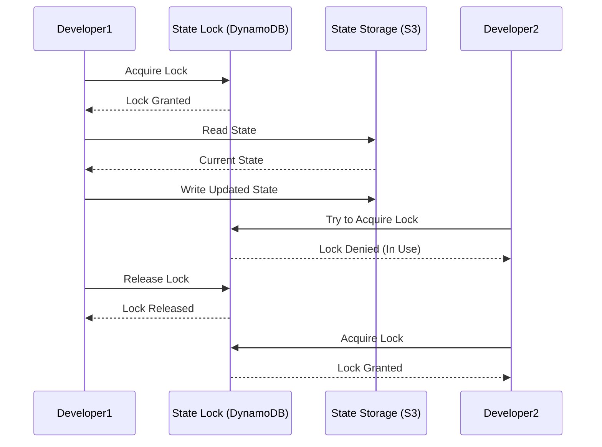

# Terraform State Management

## Introduction

When you use Terraform to manage infrastructure, it needs to keep track of all the resources it creates. This tracking information is called "state" - it's Terraform's way of mapping the resources in your configuration files to real-world infrastructure objects.

State management is one of the most important concepts to understand when working with Terraform, as it directly impacts how effectively you can collaborate, scale, and maintain your infrastructure code.

In this guide, we'll explore:

- What Terraform state is and why it's necessary
- How Terraform stores and manages state
- Common state management challenges
- Best practices for working with state in team environments

## What is Terraform State?

Terraform state is a snapshot of your infrastructure that Terraform uses to map real-world resources to your configuration, track metadata, and improve performance for large infrastructures.

### Key Functions of Terraform State

1. **Resource Mapping**: State tracks the relationship between configuration and real infrastructure
2. **Metadata Tracking**: Stores resource dependencies and other metadata
3. **Performance Optimization**: Enables Terraform to focus only on resources that need changing

Let's see what a simple state file looks like. Normally, you wouldn't edit this directly, but understanding its structure helps grasp the concept:

```json
{
  "version": 4,
  "terraform_version": "1.5.0",
  "serial": 1,
  "lineage": "3f38d1cf-1e8e-74a2-8999-a03557a7d14a",
  "outputs": {},
  "resources": [
    {
      "mode": "managed",
      "type": "aws_instance",
      "name": "example",
      "provider": "provider[\"registry.terraform.io/hashicorp/aws\"]",
      "instances": [
        {
          "schema_version": 1,
          "attributes": {
            "ami": "ami-0c55b159cbfafe1f0",
            "instance_type": "t2.micro",
            "id": "i-0123456789abcdef0"
          }
        }
      ]
    }
  ]
}
```

## Local vs. Remote State Storage

By default, Terraform stores state locally in a file called `terraform.tfstate`. However, this approach has limitations:

### Local State Challenges

- **Team Collaboration**: Multiple team members can't safely work on the same infrastructure
- **Secrets Management**: State may contain sensitive data
- **State Loss Risk**: Local files can be accidentally deleted or corrupted

### Remote State Solutions

Remote state storage addresses these issues by keeping state in a shared, secure location. Common backends include:

- **Amazon S3**
- **Azure Blob Storage**
- **Google Cloud Storage**
- **HashiCorp Terraform Cloud/Enterprise**
- **PostgreSQL/MySQL Databases**

## Configuring Remote State

Here's how to configure state to be stored in an AWS S3 bucket:

```hcl
terraform {
  backend "s3" {
    bucket = "my-terraform-state"
    key    = "prod/terraform.tfstate"
    region = "us-east-1"
    encrypt = true
    dynamodb_table = "terraform-locks"
  }
}
```

This configuration:
- Stores state in the S3 bucket `my-terraform-state`
- Uses the key `prod/terraform.tfstate` (the file path within the bucket)
- Enables encryption for the state file
- Uses a DynamoDB table for state locking (more on this later)

## State Commands

Terraform provides several commands for working with state:

### Inspect Current State

```bash
terraform state list
```

Output:
```
aws_instance.example
aws_s3_bucket.state_bucket
```

### Show Details of a Specific Resource

```bash
terraform state show aws_instance.example
```

Output:
```
# aws_instance.example:
resource "aws_instance" "example" {
    ami                          = "ami-0c55b159cbfafe1f0"
    availability_zone            = "us-east-1a"
    instance_type                = "t2.micro"
    id                           = "i-0123456789abcdef0"
    private_ip                   = "172.31.16.210"
    public_ip                    = "54.194.252.215"
    tags                         = {
        "Name" = "example-instance"
    }
}
```

### Moving Resources in State

If you rename a resource in your configuration, you need to update the state accordingly:

```bash
terraform state mv aws_instance.example aws_instance.web_server
```

### Removing Resources from State

If you want to remove a resource from state without destroying it:

```bash
terraform state rm aws_instance.example
```

## State Locking

When working in a team, it's crucial to prevent multiple people from modifying state simultaneously, which could corrupt it. 

State locking prevents this by allowing only one person to modify state at a time.



The S3 backend can use a DynamoDB table for locking:

```hcl
terraform {
  backend "s3" {
    bucket         = "terraform-state-prod"
    key            = "global/s3/terraform.tfstate"
    region         = "us-east-1"
    dynamodb_table = "terraform-locks"
    encrypt        = true
  }
}
```

You'll need to create the DynamoDB table first:

```hcl
resource "aws_dynamodb_table" "terraform_locks" {
  name         = "terraform-locks"
  billing_mode = "PAY_PER_REQUEST"
  hash_key     = "LockID"

  attribute {
    name = "LockID"
    type = "S"
  }
}
```

## State Workspaces

Workspaces allow managing multiple states using the same configuration. This is useful for maintaining different environments (dev, staging, prod) with minimal code duplication.

### Creating and Using Workspaces

```bash
# Create new workspaces
terraform workspace new dev
terraform workspace new staging
terraform workspace new prod

# List available workspaces
terraform workspace list

# Switch between workspaces
terraform workspace select prod
```

You can reference the current workspace in your configuration:

```hcl
resource "aws_instance" "example" {
  ami           = "ami-0c55b159cbfafe1f0"
  instance_type = terraform.workspace == "prod" ? "t2.medium" : "t2.micro"

  tags = {
    Name = "server-${terraform.workspace}"
    Environment = terraform.workspace
  }
}
```

## Sensitive Data in State

Terraform state can contain sensitive information, such as:
- Database passwords
- Private keys
- API tokens

### Best Practices for Sensitive Data

1. **Always use remote state with encryption**
2. **Set up proper access controls on your state backend**
3. **Consider using a secrets manager** like HashiCorp Vault or AWS Secrets Manager for truly sensitive values

## State Import

Sometimes you need to bring existing infrastructure under Terraform management. The `terraform import` command helps with this:

```bash
# First, write a resource block for the existing resource
resource "aws_instance" "imported_instance" {
  # Required attributes without specific values
  ami           = "ami-abc123"
  instance_type = "t2.micro"
  # Other attributes will be populated after import
}
```

Then import the existing resource:

```bash
terraform import aws_instance.imported_instance i-0123456789abcdef0
```

After importing, you can run `terraform plan` to see what changes Terraform would make to align the resource with your configuration.

## Practical Example: Multi-Environment State Management

Let's look at a complete example of managing infrastructure across multiple environments using remote state:

### Directory Structure

```
infrastructure/
├── environments/
│   ├── dev/
│   │   ├── main.tf
│   │   └── backend.tf
│   ├── staging/
│   │   ├── main.tf
│   │   └── backend.tf
│   └── prod/
│       ├── main.tf
│       └── backend.tf
└── modules/
    ├── networking/
    ├── compute/
    └── database/
```

### Backend Configuration (environments/prod/backend.tf)

```hcl
terraform {
  backend "s3" {
    bucket         = "company-terraform-states"
    key            = "prod/terraform.tfstate"
    region         = "us-east-1"
    dynamodb_table = "terraform-locks"
    encrypt        = true
  }
}
```

### Main Configuration (environments/prod/main.tf)

```hcl
provider "aws" {
  region = "us-east-1"
}

module "networking" {
  source = "../../modules/networking"
  
  vpc_cidr = "10.0.0.0/16"
  environment = "prod"
}

module "compute" {
  source = "../../modules/compute"
  
  vpc_id = module.networking.vpc_id
  environment = "prod"
  instance_type = "t2.medium"
  instance_count = 4
  
  depends_on = [module.networking]
}

module "database" {
  source = "../../modules/database"
  
  vpc_id = module.networking.vpc_id
  subnet_ids = module.networking.private_subnet_ids
  environment = "prod"
  instance_class = "db.t3.large"
  
  depends_on = [module.networking]
}
```

## Data Sharing Between State Files

Sometimes you need to use outputs from one state file in another. The `terraform_remote_state` data source enables this:

```hcl
# In your application infrastructure configuration
data "terraform_remote_state" "network" {
  backend = "s3"
  config = {
    bucket = "company-terraform-states"
    key    = "prod/network/terraform.tfstate"
    region = "us-east-1"
  }
}

resource "aws_instance" "app" {
  # Use an output from the networking state
  subnet_id = data.terraform_remote_state.network.outputs.private_subnet_id
  
  # Other configuration...
}
```

## Common State Management Challenges

### State Drift

State drift occurs when the actual infrastructure differs from what's in your state file. This can happen from:
- Manual changes made outside of Terraform
- Failed Terraform operations
- Corrupted state files

You can detect drift with:

```bash
terraform plan
```

### State Conflicts

Even with state locking, conflicts can occur if:
- Multiple team members have their own state files
- Lock mechanisms fail
- Someone forces an operation with `-lock=false`

To minimize conflicts:
- Always use remote state with locking
- Follow a clear workflow for making changes
- Consider using Terraform Cloud for managed state operations

## Summary

Terraform state management is essential for successfully managing infrastructure as code:

- State is Terraform's way of mapping configuration to real resources
- Remote state backends are critical for team environments
- State locking prevents concurrent modifications
- Workspaces help manage multiple environments
- Sensitive data in state requires proper security measures

Understanding state management will help you avoid common pitfalls and build scalable, maintainable infrastructure with Terraform.

## Additional Resources

- [Terraform State Documentation](https://www.terraform.io/docs/language/state/index.html)
- [Terraform Backend Configuration](https://www.terraform.io/docs/language/settings/backends/index.html)
- [Terraform Workspaces](https://www.terraform.io/docs/language/state/workspaces.html)

## Exercises

1. Set up a remote state backend using S3 and DynamoDB
2. Create a workspace-based configuration that deploys different sized instances based on environment
3. Practice importing an existing resource into Terraform state
4. Create a module structure that uses remote state data sources to reference shared infrastructure components