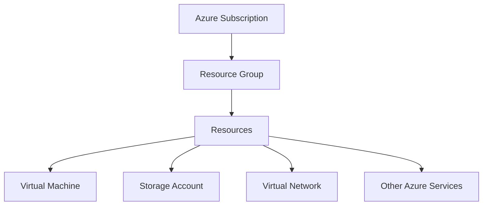

# Terraform Azure Provider

## Introduction

The Azure Provider for Terraform is an essential tool that allows you to create, manage, and update Microsoft Azure resources through Terraform's declarative configuration files. This provider acts as a bridge between Terraform and the Azure API, enabling you to treat your Azure infrastructure as code.

With the Azure Provider, you can manage virtually all Azure services—from virtual machines and storage accounts to complex resources like Kubernetes clusters—using the same consistent workflow regardless of the resource type. This approach offers numerous benefits:

- **Version control** for your infrastructure
- **Consistent deployments** across environments
- **Automated testing** and validation of changes
- **Dependency management** between resources

Let's explore how to configure and use the Azure Provider to deploy resources to Azure.

## Installing and Configuring the Azure Provider

### Prerequisites

Before using the Terraform Azure Provider, you need:

1. **Terraform CLI** installed (version 0.14.9 or newer)
2. **Azure subscription**
3. **Authentication credentials** for Azure

### Provider Configuration

To use the Azure Provider, you need to declare it in your Terraform configuration. The following example shows a basic provider configuration:

```hcl
terraform {
  required_providers {
    azurerm = {
      source  = "hashicorp/azurerm"
      version = "~> 3.0"
    }
  }
}

provider "azurerm" {
  features {}
}
```

This configuration:
- Specifies the Azure Resource Manager (azurerm) provider
- Uses version 3.0 or newer (but not 4.0 or newer)
- Enables the default feature set with the empty `features {}` block

### Authentication Methods

The Azure Provider supports several authentication methods:

1. **Azure CLI** (easiest for development)
2. **Service Principal with Client Secret**
3. **Service Principal with Client Certificate**
4. **Managed Identity**

#### Azure CLI Authentication

If you've already authenticated using the Azure CLI (`az login`), Terraform can use those credentials automatically:

```hcl
provider "azurerm" {
  features {}
  # No credentials needed - uses Azure CLI authentication
}
```

#### Service Principal Authentication

For automated workflows or CI/CD pipelines, a Service Principal is recommended:

```hcl
provider "azurerm" {
  features {}
  
  subscription_id = "your-subscription-id"
  client_id       = "your-app-id"
  client_secret   = "your-client-secret"
  tenant_id       = "your-tenant-id"
}
```

It's generally better to provide these values using environment variables rather than hardcoding them:

```hcl
provider "azurerm" {
  features {}
  # Credentials will be read from environment variables:
  # ARM_SUBSCRIPTION_ID
  # ARM_CLIENT_ID
  # ARM_CLIENT_SECRET
  # ARM_TENANT_ID
}
```

## Deploying Your First Azure Resource

Let's create a simple resource group as our first Azure deployment.

### Resource Group Example

```hcl
provider "azurerm" {
  features {}
}

resource "azurerm_resource_group" "example" {
  name     = "example-resources"
  location = "East US"
  
  tags = {
    environment = "Development"
    project     = "Terraform Learning"
  }
}
```

To deploy this resource:

1. Initialize Terraform:
   ```bash
   terraform init
   ```

2. Preview the changes:
   ```bash
   terraform plan
   ```

   Output (simplified):
   ```
   Terraform will perform the following actions:
   
     # azurerm_resource_group.example will be created
     + resource "azurerm_resource_group" "example" {
         + id       = (known after apply)
         + location = "eastus"
         + name     = "example-resources"
         + tags     = {
             + "environment" = "Development"
             + "project"     = "Terraform Learning"
           }
       }
   
   Plan: 1 to add, 0 to change, 0 to destroy.
   ```

3. Apply the changes:
   ```bash
   terraform apply
   ```

After confirming the apply operation, Terraform will create the resource group in Azure.

## Understanding Azure Provider Resources

The Azure Provider organizes resources according to Azure's resource model. Here's a simple diagram showing this organization:



Most Azure resources in Terraform follow this pattern where resources are grouped into resource groups.

### Commonly Used Azure Resources

Here are some commonly used Azure resources you can manage with Terraform:

#### Virtual Network

```hcl
resource "azurerm_virtual_network" "example" {
  name                = "example-network"
  resource_group_name = azurerm_resource_group.example.name
  location            = azurerm_resource_group.example.location
  address_space       = ["10.0.0.0/16"]
}

resource "azurerm_subnet" "example" {
  name                 = "internal"
  resource_group_name  = azurerm_resource_group.example.name
  virtual_network_name = azurerm_virtual_network.example.name
  address_prefixes     = ["10.0.2.0/24"]
}
```

#### Storage Account

```hcl
resource "azurerm_storage_account" "example" {
  name                     = "examplestorageacc"
  resource_group_name      = azurerm_resource_group.example.name
  location                 = azurerm_resource_group.example.location
  account_tier             = "Standard"
  account_replication_type = "LRS"
}
```

#### Virtual Machine

```hcl
resource "azurerm_linux_virtual_machine" "example" {
  name                = "example-vm"
  resource_group_name = azurerm_resource_group.example.name
  location            = azurerm_resource_group.example.location
  size                = "Standard_B1s"
  admin_username      = "adminuser"
  
  network_interface_ids = [
    azurerm_network_interface.example.id,
  ]

  admin_ssh_key {
    username   = "adminuser"
    public_key = file("~/.ssh/id_rsa.pub")
  }

  os_disk {
    caching              = "ReadWrite"
    storage_account_type = "Standard_LRS"
  }

  source_image_reference {
    publisher = "Canonical"
    offer     = "UbuntuServer"
    sku       = "18.04-LTS"
    version   = "latest"
  }
}
```

## Working with Azure Provider Data Sources

Data sources allow you to fetch information about existing Azure resources. This is useful when you need to reference resources that:

1. Were created outside of Terraform
2. Are managed by a different Terraform configuration
3. Need to be queried dynamically

### Example: Using Data Sources

```hcl
# Get information about an existing resource group
data "azurerm_resource_group" "example" {
  name = "existing-resource-group"
}

# Use information from the data source
resource "azurerm_virtual_network" "example" {
  name                = "example-network"
  location            = data.azurerm_resource_group.example.location
  resource_group_name = data.azurerm_resource_group.example.name
  address_space       = ["10.0.0.0/16"]
}
```

## Complete Project Example: Web Server with Database

Let's walk through a more complete example that provisions a web server with a database backend:

```hcl
provider "azurerm" {
  features {}
}

# Resource Group
resource "azurerm_resource_group" "example" {
  name     = "example-resources"
  location = "East US"
}

# Virtual Network
resource "azurerm_virtual_network" "example" {
  name                = "example-network"
  address_space       = ["10.0.0.0/16"]
  location            = azurerm_resource_group.example.location
  resource_group_name = azurerm_resource_group.example.name
}

# Subnet
resource "azurerm_subnet" "example" {
  name                 = "internal"
  resource_group_name  = azurerm_resource_group.example.name
  virtual_network_name = azurerm_virtual_network.example.name
  address_prefixes     = ["10.0.2.0/24"]
}

# Network Interface
resource "azurerm_network_interface" "example" {
  name                = "example-nic"
  location            = azurerm_resource_group.example.location
  resource_group_name = azurerm_resource_group.example.name

  ip_configuration {
    name                          = "internal"
    subnet_id                     = azurerm_subnet.example.id
    private_ip_address_allocation = "Dynamic"
    public_ip_address_id          = azurerm_public_ip.example.id
  }
}

# Public IP
resource "azurerm_public_ip" "example" {
  name                = "example-pip"
  location            = azurerm_resource_group.example.location
  resource_group_name = azurerm_resource_group.example.name
  allocation_method   = "Dynamic"
}

# Virtual Machine
resource "azurerm_linux_virtual_machine" "example" {
  name                = "example-vm"
  resource_group_name = azurerm_resource_group.example.name
  location            = azurerm_resource_group.example.location
  size                = "Standard_B1s"
  admin_username      = "adminuser"
  
  network_interface_ids = [
    azurerm_network_interface.example.id,
  ]

  admin_ssh_key {
    username   = "adminuser"
    public_key = file("~/.ssh/id_rsa.pub")
  }

  os_disk {
    caching              = "ReadWrite"
    storage_account_type = "Standard_LRS"
  }

  source_image_reference {
    publisher = "Canonical"
    offer     = "UbuntuServer"
    sku       = "18.04-LTS"
    version   = "latest"
  }

  custom_data = base64encode(<<-EOF
    #!/bin/bash
    apt-get update
    apt-get install -y apache2
    echo "Hello from Terraform Azure Provider Tutorial" > /var/www/html/index.html
    EOF
  )
}

# Database Server
resource "azurerm_mysql_server" "example" {
  name                         = "example-mysqlserver"
  location                     = azurerm_resource_group.example.location
  resource_group_name          = azurerm_resource_group.example.name
  administrator_login          = "mysqladmin"
  administrator_login_password = "H@Sh1CoR3!"  # Better to use variables or secrets management

  sku_name   = "B_Gen5_1"
  storage_mb = 5120
  version    = "5.7"

  ssl_enforcement_enabled = true
}

# Database
resource "azurerm_mysql_database" "example" {
  name                = "exampledb"
  resource_group_name = azurerm_resource_group.example.name
  server_name         = azurerm_mysql_server.example.name
  charset             = "utf8"
  collation           = "utf8_unicode_ci"
}

# Output the public IP address
output "public_ip_address" {
  value = azurerm_public_ip.example.ip_address
}
```

This configuration:
1. Creates a resource group
2. Sets up networking (VNet, subnet, NIC, public IP)
3. Deploys a virtual machine running Apache
4. Provisions a MySQL database server and database
5. Outputs the public IP address of the VM

## Best Practices for Azure Provider

### 1. Use Variables for Reusability

```hcl
variable "location" {
  description = "Azure region to deploy resources"
  default     = "East US"
}

variable "resource_prefix" {
  description = "Prefix for resource names"
  default     = "tfexample"
}

resource "azurerm_resource_group" "example" {
  name     = "${var.resource_prefix}-rg"
  location = var.location
}
```

### 2. Organize with Modules

Break complex configurations into reusable modules:

```hcl
module "web_server" {
  source              = "./modules/web_server"
  resource_group_name = azurerm_resource_group.example.name
  location            = azurerm_resource_group.example.location
  subnet_id           = azurerm_subnet.example.id
}
```

### 3. Use Terraform Backend for State Management

```hcl
terraform {
  backend "azurerm" {
    resource_group_name  = "terraform-state-rg"
    storage_account_name = "tfstate12345"
    container_name       = "tfstate"
    key                  = "prod.terraform.tfstate"
  }
}
```

### 4. Enable Provider Features Explicitly

```hcl
provider "azurerm" {
  features {
    virtual_machine {
      delete_os_disk_on_deletion = true
    }
    key_vault {
      purge_soft_delete_on_destroy = true
    }
  }
}
```

## Troubleshooting Common Issues

### Authentication Problems

If you encounter authentication errors:

1. Verify your credentials are correct
2. Check that your Service Principal has the necessary permissions
3. Ensure environment variables are properly set

```bash
# Set these variables for Service Principal authentication
export ARM_CLIENT_ID="00000000-0000-0000-0000-000000000000"
export ARM_CLIENT_SECRET="12345678-0000-0000-0000-000000000000"
export ARM_SUBSCRIPTION_ID="12345678-0000-0000-0000-000000000000"
export ARM_TENANT_ID="12345678-0000-0000-0000-000000000000"
```

### Resource Creation Failures

When resources fail to create:

1. Check the error message in the Terraform output
2. Verify that resource names meet Azure requirements
3. Ensure you have quota for the requested resources
4. Check that dependencies exist and are correctly referenced

### Rate Limiting

When hitting API rate limits:

```hcl
provider "azurerm" {
  features {}
  
  # Add rate limiting settings
  client_timeouts {
    read = "30m"
  }
}
```

## Summary

The Azure Provider for Terraform enables you to manage Azure resources using infrastructure as code. Key takeaways:

1. The Azure Provider bridges Terraform and Azure API
2. Multiple authentication methods are available, with Service Principal being ideal for automation
3. Resources are organized according to Azure's resource model
4. Data sources allow you to reference existing Azure resources
5. Best practices include using variables, modules, and proper state management

With the Azure Provider, you can create, update, and delete Azure resources in a consistent, repeatable way, ensuring your infrastructure is maintainable and version-controlled.

## Additional Resources

To continue your learning journey:

- Official [Terraform Azure Provider Documentation](https://registry.terraform.io/providers/hashicorp/azurerm/latest/docs)
- [Microsoft Learn Terraform Modules](https://learn.microsoft.com/en-us/azure/developer/terraform/)
- [Terraform on Azure GitHub Examples](https://github.com/Azure/terraform)

## Practice Exercises

1. Create a Terraform configuration that deploys a static website using Azure Storage Account static website hosting.
2. Modify the web server example to include an Azure Application Gateway as a load balancer.
3. Build a module that creates a fully configured Azure Kubernetes Service (AKS