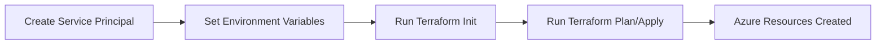

# Terraform Azure Authentication

## Introduction

When working with Terraform to provision resources in Azure, one of the first challenges you'll face is **authentication**. Before Terraform can create, modify, or destroy Azure resources on your behalf, it needs secure access to your Azure subscription. This article explains the different methods available for authenticating Terraform with Azure, their pros and cons, and how to implement them in your projects.

Authentication is the process of verifying the identity of your Terraform configuration so it can securely interact with Azure APIs. It's a critical security component that ensures only authorized processes can make changes to your cloud infrastructure.

## Authentication Methods Overview

There are several ways to authenticate Terraform with Azure:

1. **Azure CLI** - For local development
2. **Service Principal with Client Secret** - For automation and CI/CD pipelines 
3. **Service Principal with Client Certificate** - For enhanced security
4. **Managed Identities** - For Azure-hosted deployments
5. **Azure AD User** - For individual access

Let's explore each method in detail:

## Method 1: Azure CLI Authentication

Azure CLI authentication is the simplest method, particularly for local development and testing. With this approach, Terraform uses the Azure CLI's existing login session.

### Prerequisites:

1. Install the [Azure CLI](https://docs.microsoft.com/en-us/cli/azure/install-azure-cli)
2. Log in to Azure using `az login`

### Implementation:

```hcl
# Configure the Azure provider
terraform {
  required_providers {
    azurerm = {
      source  = "hashicorp/azurerm"
      version = "~> 3.0"
    }
  }
}

provider "azurerm" {
  features {}
  # No credentials needed here, using Azure CLI authentication
}
```

### How it works:

1. Run `az login` in your terminal
2. A browser window opens for you to authenticate
3. After successful login, Terraform will use your credentials automatically

### Output example:

```
$ az login
To sign in, use a web browser to open the page https://microsoft.com/devicelogin and enter the code ABC123DEF to authenticate.

[
  {
    "cloudName": "AzureCloud",
    "homeTenantId": "00000000-0000-0000-0000-000000000000",
    "id": "11111111-1111-1111-1111-111111111111",
    "isDefault": true,
    "managedByTenants": [],
    "name": "My Subscription",
    "state": "Enabled",
    "tenantId": "00000000-0000-0000-0000-000000000000",
    "user": {
      "name": "user@example.com",
      "type": "user"
    }
  }
]
```

### Advantages:
- Simple setup, no credentials to manage
- Great for local development

### Limitations:
- Not suitable for automation or CI/CD
- Session timeouts require re-authentication
- Tied to a user account

## Method 2: Service Principal with Client Secret

Service Principals are the most common way to authenticate Terraform with Azure in production and CI/CD environments. Think of a Service Principal as an "application user" that has specific permissions to your Azure resources.

### Creating a Service Principal:

```bash
az ad sp create-for-rbac --name "TerraformSP" --role Contributor --scopes /subscriptions/YOUR_SUBSCRIPTION_ID
```

This command will output JSON similar to:

```json
{
  "appId": "00000000-0000-0000-0000-000000000000",
  "displayName": "TerraformSP",
  "password": "RandomGeneratedPassword",
  "tenant": "00000000-0000-0000-0000-000000000000"
}
```

Save these values as they correspond to:
- `appId` = client_id
- `password` = client_secret
- `tenant` = tenant_id

### Using a Service Principal in Terraform:

```hcl
provider "azurerm" {
  features {}
  
  subscription_id = "YOUR_SUBSCRIPTION_ID"
  client_id       = "SERVICE_PRINCIPAL_APP_ID"
  client_secret   = "SERVICE_PRINCIPAL_PASSWORD"
  tenant_id       = "YOUR_TENANT_ID"
}
```

### Using Environment Variables (Recommended):

For better security, use environment variables instead of hardcoding credentials:

```hcl
provider "azurerm" {
  features {}
  
  # Credentials are provided by environment variables:
  # ARM_SUBSCRIPTION_ID
  # ARM_CLIENT_ID
  # ARM_CLIENT_SECRET
  # ARM_TENANT_ID
}
```

Set these environment variables before running Terraform:

```bash
export ARM_SUBSCRIPTION_ID="YOUR_SUBSCRIPTION_ID"
export ARM_CLIENT_ID="SERVICE_PRINCIPAL_APP_ID"
export ARM_CLIENT_SECRET="SERVICE_PRINCIPAL_PASSWORD"
export ARM_TENANT_ID="YOUR_TENANT_ID"
```

### Workflow diagram:



### Advantages:
- Suitable for automation and CI/CD pipelines
- Not tied to a specific user
- Can have precisely scoped permissions

### Limitations:
- Client secret needs secure storage
- Secrets can expire and require rotation

## Method 3: Service Principal with Client Certificate

Using a certificate instead of a secret provides enhanced security.

### Creating a Service Principal with Certificate:

First, generate a certificate:

```bash
# Generate a private key
openssl genrsa -out terraform.key 2048

# Generate a certificate
openssl req -new -key terraform.key -out terraform.csr

# Self-sign the certificate
openssl x509 -req -days 365 -in terraform.csr -signkey terraform.key -out terraform.crt

# Convert to PFX format
openssl pkcs12 -export -out terraform.pfx -inkey terraform.key -in terraform.crt
```

Create a service principal and upload the certificate:

```bash
az ad sp create-for-rbac --name "TerraformSP" --role Contributor \
  --scopes /subscriptions/YOUR_SUBSCRIPTION_ID \
  --cert @terraform.crt
```

### Using Certificate Authentication in Terraform:

```hcl
provider "azurerm" {
  features {}
  
  subscription_id      = "YOUR_SUBSCRIPTION_ID"
  client_id            = "SERVICE_PRINCIPAL_APP_ID"
  tenant_id            = "YOUR_TENANT_ID"
  client_certificate_path = "path/to/terraform.pfx"
  client_certificate_password = "pfx-password"
}
```

### Advantages:
- More secure than client secrets
- Longer validity periods possible
- No plaintext secrets in configuration

### Limitations:
- More complex setup
- Certificate management overhead

## Method 4: Managed Identities

Managed Identities are ideal when running Terraform from within Azure (like Azure DevOps, Azure VMs, or Azure Cloud Shell). They eliminate the need to manage credentials entirely.

### Using Managed Identity Authentication:

```hcl
provider "azurerm" {
  features {}
  
  use_msi = true
  subscription_id = "YOUR_SUBSCRIPTION_ID"
  tenant_id       = "YOUR_TENANT_ID"
}
```

### Practical Example - Azure VM with Managed Identity:

1. Create an Azure VM with a System-assigned Managed Identity
2. Assign the appropriate role (e.g., Contributor) to the Managed Identity
3. Install Terraform on the VM
4. Run Terraform with the configuration above

### Advantages:
- No credentials to manage
- Highly secure
- No secrets in code or environment variables

### Limitations:
- Only works when running from within Azure
- Requires Azure resources that support Managed Identities

## Method 5: Azure AD User

This method uses interactive login with Azure AD user credentials, similar to Azure CLI but through direct Azure AD authentication.

```hcl
provider "azurerm" {
  features {}
  
  use_cli = false
  subscription_id = "YOUR_SUBSCRIPTION_ID"
  tenant_id       = "YOUR_TENANT_ID"
}
```

When you run Terraform, it will prompt for interactive login through a web browser.

## Security Best Practices

When implementing Terraform Azure authentication, always follow these best practices:

1. **Use the Principle of Least Privilege**: Assign only the minimum permissions needed
2. **Never Hardcode Credentials**: Use environment variables or secure secret management
3. **Rotate Secrets Regularly**: Change service principal secrets periodically
4. **Use Managed Identities** when possible for Azure-hosted deployments
5. **Secure Your State File**: Ensure your Terraform state file is secured, as it may contain sensitive data
6. **Consider using Azure Key Vault** to store and retrieve secrets

## Troubleshooting Common Issues

### Authentication Failed Errors

If you encounter an error like:

```
Error: Error building AzureRM Client: obtain subscription() from Azure CLI: Error parsing json result from the Azure CLI: Error waiting for the Azure CLI: exit status 1
```

Possible solutions:
- Run `az login` again to refresh your credentials
- Check if your Service Principal has expired
- Verify your subscription ID and tenant ID

### Insufficient Permissions

If you see errors about not having permission to perform an action:

```
Error: authorization.RoleAssignmentsClient#Create: Failure responding to request: StatusCode=403 -- Original Error: autorest/azure: Service returned an error. Status=403 Code="AuthorizationFailed" Message="The client '00000000-0000-0000-0000-000000000000' with object id '00000000-0000-0000-0000-000000000000' does not have authorization to perform action 'Microsoft.Authorization/roleAssignments/write'
```

Solutions:
- Check the role assigned to your Service Principal
- Ensure the Service Principal has the required permissions for all resources you're trying to manage

## Comparing Authentication Methods

| Method | Security | Ease of Use | Automation Friendly | Best For |
|--------|----------|-------------|---------------------|----------|
| Azure CLI | Medium | Very Easy | No | Local development |
| Service Principal (Secret) | Medium | Easy | Yes | CI/CD, automation |
| Service Principal (Certificate) | High | Medium | Yes | Production, security-focused |
| Managed Identity | Very High | Easy | Yes | Azure-hosted deployments |
| Azure AD User | Medium | Medium | No | Individual access |

## Practical Example: CI/CD Pipeline with Service Principal

Let's look at a practical example using GitHub Actions to deploy Azure resources with Terraform:

```yaml
name: 'Terraform Azure Deploy'

on:
  push:
    branches: [ main ]

jobs:
  terraform:
    runs-on: ubuntu-latest
    steps:
    - uses: actions/checkout@v3
    
    - name: Setup Terraform
      uses: hashicorp/setup-terraform@v2
      
    - name: Terraform Init
      run: terraform init
      env:
        ARM_CLIENT_ID: ${{ secrets.ARM_CLIENT_ID }}
        ARM_CLIENT_SECRET: ${{ secrets.ARM_CLIENT_SECRET }}
        ARM_SUBSCRIPTION_ID: ${{ secrets.ARM_SUBSCRIPTION_ID }}
        ARM_TENANT_ID: ${{ secrets.ARM_TENANT_ID }}
        
    - name: Terraform Plan
      run: terraform plan
      env:
        ARM_CLIENT_ID: ${{ secrets.ARM_CLIENT_ID }}
        ARM_CLIENT_SECRET: ${{ secrets.ARM_CLIENT_SECRET }}
        ARM_SUBSCRIPTION_ID: ${{ secrets.ARM_SUBSCRIPTION_ID }}
        ARM_TENANT_ID: ${{ secrets.ARM_TENANT_ID }}
        
    - name: Terraform Apply
      if: github.ref == 'refs/heads/main'
      run: terraform apply -auto-approve
      env:
        ARM_CLIENT_ID: ${{ secrets.ARM_CLIENT_ID }}
        ARM_CLIENT_SECRET: ${{ secrets.ARM_CLIENT_SECRET }}
        ARM_SUBSCRIPTION_ID: ${{ secrets.ARM_SUBSCRIPTION_ID }}
        ARM_TENANT_ID: ${{ secrets.ARM_TENANT_ID }}
```

This workflow uses GitHub repository secrets to store the sensitive Service Principal credentials.

## Summary

Authentication is a crucial first step in working with Terraform and Azure. This article covered five authentication methods:

1. **Azure CLI authentication** - simple but best for local development only
2. **Service Principal with Client Secret** - versatile and commonly used for automation
3. **Service Principal with Client Certificate** - more secure alternative to client secrets
4. **Managed Identities** - the most secure option for Azure-hosted deployments
5. **Azure AD User** - for interactive, individual access

The best authentication method depends on your specific scenario:
- For local development: Azure CLI authentication
- For CI/CD pipelines: Service Principal with Client Secret or Certificate
- For Azure-hosted deployments: Managed Identities

By understanding these authentication methods and implementing them securely, you'll establish a solid foundation for your Terraform on Azure projects.

## Additional Resources

- [Terraform Azure Provider Documentation](https://registry.terraform.io/providers/hashicorp/azurerm/latest/docs)
- [Azure Service Principal Documentation](https://docs.microsoft.com/en-us/azure/active-directory/develop/app-objects-and-service-principals)
- [Azure Managed Identities](https://docs.microsoft.com/en-us/azure/active-directory/managed-identities-azure-resources/overview)

## Exercises

1. Create a Service Principal in Azure and use it to authenticate Terraform locally
2. Set up a GitHub Actions workflow to deploy a simple Azure resource using a Service Principal
3. Configure a VM in Azure with a Managed Identity and use it to run Terraform
4. Create a Service Principal with certificate authentication and use it with Terraform
5. Compare the different authentication methods by implementing each one for a simple Terraform configuration