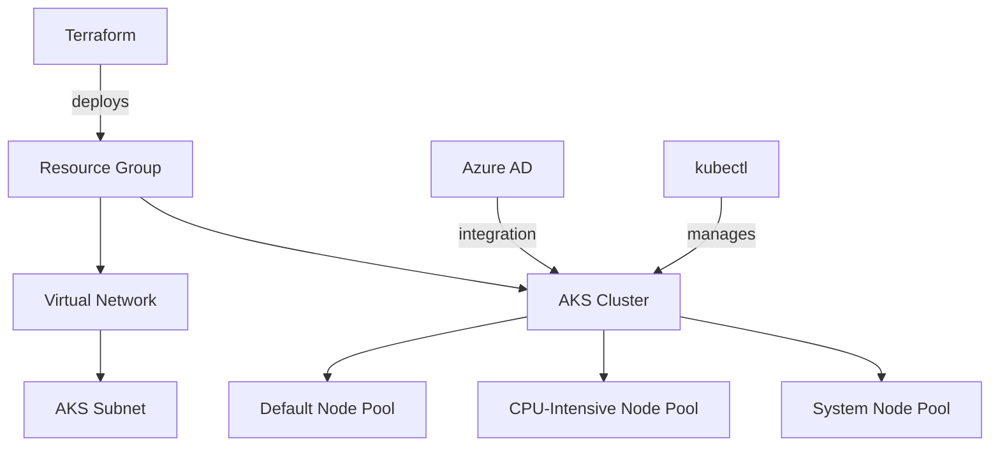

# Terraform Azure AKS

## Introduction

Azure Kubernetes Service (AKS) is a managed Kubernetes offering that simplifies deploying, managing, and scaling containerized applications on Azure. Terraform allows you to define your AKS infrastructure as code, making it reproducible, version-controlled, and easier to manage across environments.

In this guide, we'll explore how to:
- Deploy an AKS cluster using Terraform
- Configure key AKS features through Terraform
- Implement best practices for production-ready clusters
- Manage your AKS infrastructure through its lifecycle

## Prerequisites

Before we begin, ensure you have:

- An Azure account with an active subscription
- [Terraform](https://www.terraform.io/downloads.html) installed (version 1.0.0+)
- [Azure CLI](https://docs.microsoft.com/en-us/cli/azure/install-azure-cli) installed and configured
- [kubectl](https://kubernetes.io/docs/tasks/tools/install-kubectl/) installed (for interacting with your cluster)

## Project Structure

Let's start by creating a well-organized project structure:

```
terraform-aks-project/
├── main.tf         # Main Terraform configuration
├── variables.tf    # Input variables
├── outputs.tf      # Output values
├── providers.tf    # Provider configuration
└── terraform.tfvars # Variable values (not in version control)
```

## Provider Configuration

First, let's set up our `providers.tf` file:

```hcl
terraform {
  required_providers {
    azurerm = {
      source  = "hashicorp/azurerm"
      version = "~> 3.0"
    }
  }
}

provider "azurerm" {
  features {}
}
```

## Variables

Next, create a `variables.tf` file to define the inputs:

```hcl
variable "resource_group_name" {
  description = "Name of the resource group"
  type        = string
}

variable "location" {
  description = "Azure region for resources"
  type        = string
  default     = "East US"
}

variable "cluster_name" {
  description = "Name of the AKS cluster"
  type        = string
}

variable "kubernetes_version" {
  description = "Kubernetes version"
  type        = string
  default     = "1.27.3"
}

variable "node_count" {
  description = "Number of nodes in the default node pool"
  type        = number
  default     = 2
}

variable "vm_size" {
  description = "VM size for the nodes"
  type        = string
  default     = "Standard_DS2_v2"
}

variable "tags" {
  description = "Tags to apply to resources"
  type        = map(string)
  default     = {}
}
```

## Deploying a Basic AKS Cluster

Now, let's create a basic AKS cluster in our `main.tf`:

```hcl
# Create a resource group
resource "azurerm_resource_group" "aks_rg" {
  name     = var.resource_group_name
  location = var.location
  tags     = var.tags
}

# Create AKS cluster
resource "azurerm_kubernetes_cluster" "aks" {
  name                = var.cluster_name
  location            = azurerm_resource_group.aks_rg.location
  resource_group_name = azurerm_resource_group.aks_rg.name
  dns_prefix          = var.cluster_name
  kubernetes_version  = var.kubernetes_version

  default_node_pool {
    name       = "default"
    node_count = var.node_count
    vm_size    = var.vm_size
    os_disk_size_gb = 30
  }

  identity {
    type = "SystemAssigned"
  }

  tags = var.tags
}
```

## Outputs

Next, let's define the outputs we want in `outputs.tf`:

```hcl
output "kube_config" {
  value     = azurerm_kubernetes_cluster.aks.kube_config_raw
  sensitive = true
}

output "cluster_name" {
  value = azurerm_kubernetes_cluster.aks.name
}

output "resource_group_name" {
  value = azurerm_resource_group.aks_rg.name
}

output "host" {
  value     = azurerm_kubernetes_cluster.aks.kube_config.0.host
  sensitive = true
}
```

## Advanced Configuration

Let's enhance our AKS cluster with more advanced features:

### Multiple Node Pools

Node pools allow you to have different types of VMs in your cluster. Let's add a second node pool:

```hcl
# Add a second node pool
resource "azurerm_kubernetes_cluster_node_pool" "cpu_intensive" {
  name                  = "cpuintensive"
  kubernetes_cluster_id = azurerm_kubernetes_cluster.aks.id
  vm_size               = "Standard_D4s_v3"
  node_count            = 1
  
  # Labels to be applied to the nodes
  node_labels = {
    "workload_type" = "cpu-intensive"
  }
  
  # Taints to control pod scheduling
  node_taints = ["dedicated=cpu-intensive:NoSchedule"]
  
  tags = var.tags
}
```

### Network Configuration

For production environments, you should customize the networking:

```hcl
# Create a virtual network
resource "azurerm_virtual_network" "aks_vnet" {
  name                = "${var.cluster_name}-vnet"
  location            = azurerm_resource_group.aks_rg.location
  resource_group_name = azurerm_resource_group.aks_rg.name
  address_space       = ["10.0.0.0/16"]
  
  tags = var.tags
}

# Create a subnet for the AKS cluster
resource "azurerm_subnet" "aks_subnet" {
  name                 = "${var.cluster_name}-subnet"
  resource_group_name  = azurerm_resource_group.aks_rg.name
  virtual_network_name = azurerm_virtual_network.aks_vnet.name
  address_prefixes     = ["10.0.1.0/24"]
}

# Update AKS cluster with network configuration
resource "azurerm_kubernetes_cluster" "aks" {
  # ... existing configuration ...
  
  network_profile {
    network_plugin     = "azure"
    dns_service_ip     = "10.0.2.10"
    docker_bridge_cidr = "172.17.0.1/16"
    service_cidr       = "10.0.2.0/24"
    load_balancer_sku  = "standard"
  }
  
  default_node_pool {
    # ... existing configuration ...
    vnet_subnet_id = azurerm_subnet.aks_subnet.id
  }
}
```

### RBAC and Azure AD Integration

For improved security, let's integrate with Azure Active Directory:

```hcl
resource "azurerm_kubernetes_cluster" "aks" {
  # ... existing configuration ...
  
  role_based_access_control_enabled = true
  
  azure_active_directory_role_based_access_control {
    managed                = true
    admin_group_object_ids = ["xxxxxxxx-xxxx-xxxx-xxxx-xxxxxxxxxxxx"] # Replace with your AAD admin group ID
  }
}
```

## Deploying and Managing Your AKS Cluster

Let's walk through the steps to deploy and manage your AKS cluster:

### Deployment Workflow

1. Initialize your Terraform working directory:

```bash
terraform init
```

2. Review the execution plan:

```bash
terraform plan -out=tfplan
```

3. Apply the configuration:

```bash
terraform apply tfplan
```

The output should show the resources being created:

```
Apply complete! Resources: 4 added, 0 changed, 0 destroyed.

Outputs:
cluster_name = "my-aks-cluster"
resource_group_name = "my-aks-resource-group"
```

4. Configure kubectl to access your cluster:

```bash
az aks get-credentials --resource-group my-aks-resource-group --name my-aks-cluster
```

5. Verify the connection:

```bash
kubectl get nodes
```

You should see output similar to:

```
NAME                                STATUS   ROLES   AGE   VERSION
aks-default-26668310-vmss000000     Ready    agent   5m    v1.27.3
aks-default-26668310-vmss000001     Ready    agent   5m    v1.27.3
aks-cpuintensive-12345678-vmss000000  Ready  agent   4m    v1.27.3
```

## Infrastructure Lifecycle Management

### Updating the Cluster

To update your cluster (e.g., change node count or Kubernetes version):

1. Update the variables or configuration in your Terraform files
2. Run the plan and apply commands:

```bash
terraform plan -out=tfplan
terraform apply tfplan
```

### Destroying the Cluster

When you're done, you can destroy the resources:

```bash
terraform destroy
```

## Advanced Visualization

Let's visualize the key components of our AKS architecture:



## Production Best Practices

When deploying AKS for production, consider these best practices:

1. **High Availability**: Use multiple node pools across availability zones:

```hcl
resource "azurerm_kubernetes_cluster" "aks" {
  # ... existing configuration ...
  
  default_node_pool {
    # ... existing configuration ...
    availability_zones = [1, 2, 3]
  }
}
```

2. **Monitoring**: Enable monitoring with Azure Monitor:

```hcl
resource "azurerm_kubernetes_cluster" "aks" {
  # ... existing configuration ...
  
  oms_agent {
    log_analytics_workspace_id = azurerm_log_analytics_workspace.aks.id
  }
}

resource "azurerm_log_analytics_workspace" "aks" {
  name                = "${var.cluster_name}-logs"
  location            = azurerm_resource_group.aks_rg.location
  resource_group_name = azurerm_resource_group.aks_rg.name
  sku                 = "PerGB2018"
  retention_in_days   = 30
  
  tags = var.tags
}
```

3. **Auto-scaling**: Configure cluster autoscaler:

```hcl
resource "azurerm_kubernetes_cluster" "aks" {
  # ... existing configuration ...
  
  default_node_pool {
    # ... existing configuration ...
    enable_auto_scaling = true
    min_count           = 1
    max_count           = 5
  }
}
```

## Complete Example

Here's a complete example incorporating all the features we've discussed:

```hcl
# providers.tf
terraform {
  required_providers {
    azurerm = {
      source  = "hashicorp/azurerm"
      version = "~> 3.0"
    }
  }
}

provider "azurerm" {
  features {}
}

# variables.tf
# ... (as defined earlier) ...

# main.tf
resource "azurerm_resource_group" "aks_rg" {
  name     = var.resource_group_name
  location = var.location
  tags     = var.tags
}

resource "azurerm_virtual_network" "aks_vnet" {
  name                = "${var.cluster_name}-vnet"
  location            = azurerm_resource_group.aks_rg.location
  resource_group_name = azurerm_resource_group.aks_rg.name
  address_space       = ["10.0.0.0/16"]
  
  tags = var.tags
}

resource "azurerm_subnet" "aks_subnet" {
  name                 = "${var.cluster_name}-subnet"
  resource_group_name  = azurerm_resource_group.aks_rg.name
  virtual_network_name = azurerm_virtual_network.aks_vnet.name
  address_prefixes     = ["10.0.1.0/24"]
}

resource "azurerm_log_analytics_workspace" "aks" {
  name                = "${var.cluster_name}-logs"
  location            = azurerm_resource_group.aks_rg.location
  resource_group_name = azurerm_resource_group.aks_rg.name
  sku                 = "PerGB2018"
  retention_in_days   = 30
  
  tags = var.tags
}

resource "azurerm_kubernetes_cluster" "aks" {
  name                = var.cluster_name
  location            = azurerm_resource_group.aks_rg.location
  resource_group_name = azurerm_resource_group.aks_rg.name
  dns_prefix          = var.cluster_name
  kubernetes_version  = var.kubernetes_version

  default_node_pool {
    name                = "default"
    node_count          = var.node_count
    vm_size             = var.vm_size
    os_disk_size_gb     = 30
    vnet_subnet_id      = azurerm_subnet.aks_subnet.id
    availability_zones  = [1, 2, 3]
    enable_auto_scaling = true
    min_count           = 1
    max_count           = 5
  }

  identity {
    type = "SystemAssigned"
  }

  network_profile {
    network_plugin     = "azure"
    dns_service_ip     = "10.0.2.10"
    docker_bridge_cidr = "172.17.0.1/16"
    service_cidr       = "10.0.2.0/24"
    load_balancer_sku  = "standard"
  }
  
  role_based_access_control_enabled = true
  
  azure_active_directory_role_based_access_control {
    managed = true
    azure_rbac_enabled = true
  }
  
  oms_agent {
    log_analytics_workspace_id = azurerm_log_analytics_workspace.aks.id
  }

  tags = var.tags
}

resource "azurerm_kubernetes_cluster_node_pool" "cpu_intensive" {
  name                  = "cpupool"
  kubernetes_cluster_id = azurerm_kubernetes_cluster.aks.id
  vm_size               = "Standard_D4s_v3"
  node_count            = 1
  availability_zones    = [1, 2, 3]
  enable_auto_scaling   = true
  min_count             = 1
  max_count             = 3
  vnet_subnet_id        = azurerm_subnet.aks_subnet.id
  
  node_labels = {
    "workload_type" = "cpu-intensive"
  }
  
  node_taints = ["dedicated=cpu-intensive:NoSchedule"]
  
  tags = var.tags
}

# outputs.tf
# ... (as defined earlier) ...
```

## Example Usage Scenario

Let's work through a realistic scenario: deploying a microservices application on our AKS cluster.

1. Create