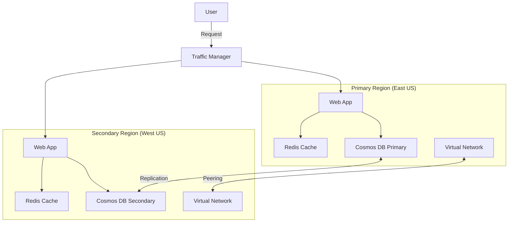

# Terraform Azure Multi-Region

## Introduction

In today's cloud-first world, building applications that can withstand regional outages is essential for businesses that require high availability and disaster recovery capabilities. Azure's global infrastructure spans numerous regions worldwide, giving you the flexibility to deploy resources close to your users or to meet regulatory requirements.

Terraform makes it easy to define and deploy multi-region architectures in Azure with consistent, repeatable infrastructure as code (IaC). In this guide, we'll explore how to leverage Terraform to create robust multi-region deployments in Azure.

## Why Deploy Across Multiple Regions?

Before diving into the implementation, let's understand why multi-region deployments are important:

1. **High Availability**: Protect against regional outages by having redundant resources in different geographic locations
2. **Disaster Recovery**: Maintain business continuity even if an entire region goes offline
3. **Performance**: Reduce latency by placing resources closer to your users
4. **Regulatory Compliance**: Meet data residency requirements by keeping data within specific geographic boundaries

## Prerequisites

To follow along with this guide, you'll need:

- Terraform installed (version 1.0.0+)
- Azure CLI installed and configured
- An Azure subscription
- Basic knowledge of Terraform and Azure concepts

## Setting Up Your Terraform Project

Let's start by organizing our Terraform project for multi-region deployment:

```bash
├── main.tf           # Main configuration file
├── variables.tf      # Input variables
├── outputs.tf        # Output values
├── providers.tf      # Provider configuration
└── modules/
    └── web-app/      # Reusable module for web application
        ├── main.tf
        ├── variables.tf
        └── outputs.tf
```

### Provider Configuration

First, let's set up the Azure provider in `providers.tf`:

```hcl
terraform {
  required_providers {
    azurerm = {
      source  = "hashicorp/azurerm"
      version = "~> 3.0"
    }
  }
}

provider "azurerm" {
  features {}
}
```

### Variables Definition

Next, define the variables in `variables.tf`:

```hcl
variable "primary_location" {
  description = "The Azure region for the primary deployment"
  type        = string
  default     = "eastus"
}

variable "secondary_location" {
  description = "The Azure region for the secondary deployment"
  type        = string
  default     = "westus"
}

variable "project_name" {
  description = "Name of the project"
  type        = string
  default     = "multiregion"
}

variable "environment" {
  description = "Deployment environment"
  type        = string
  default     = "dev"
}

variable "regions" {
  description = "Map of regions with their configurations"
  type        = map(object({
    location = string
    capacity = number
    is_primary = bool
  }))
  default = {
    primary = {
      location = "eastus"
      capacity = 2
      is_primary = true
    }
    secondary = {
      location = "westus"
      capacity = 1
      is_primary = false
    }
  }
}
```

## Creating Basic Multi-Region Resources

In our `main.tf` file, we'll create the basic resources needed in each region:

```hcl
# Create resource groups for each region
resource "azurerm_resource_group" "rg" {
  for_each = var.regions
  
  name     = "rg-${var.project_name}-${each.key}-${var.environment}"
  location = each.value.location
  
  tags = {
    Environment = var.environment
    Region      = each.key
  }
}

# Create a virtual network in each region
resource "azurerm_virtual_network" "vnet" {
  for_each = var.regions
  
  name                = "vnet-${var.project_name}-${each.key}"
  location            = each.value.location
  resource_group_name = azurerm_resource_group.rg[each.key].name
  address_space       = ["10.${each.key == "primary" ? 0 : 1}.0.0/16"]
  
  tags = {
    Environment = var.environment
    Region      = each.key
  }
}

# Create a subnet in each virtual network
resource "azurerm_subnet" "subnet" {
  for_each = var.regions
  
  name                 = "subnet-${var.project_name}-${each.key}"
  resource_group_name  = azurerm_resource_group.rg[each.key].name
  virtual_network_name = azurerm_virtual_network.vnet[each.key].name
  address_prefixes     = ["10.${each.key == "primary" ? 0 : 1}.1.0/24"]
}
```

## Traffic Manager for Multi-Region Load Balancing

To distribute traffic across regions, we'll use Azure Traffic Manager:

```hcl
# Create a Traffic Manager profile
resource "azurerm_traffic_manager_profile" "tm" {
  name                = "tm-${var.project_name}-${var.environment}"
  resource_group_name = azurerm_resource_group.rg["primary"].name
  
  traffic_routing_method = "Performance"
  
  dns_config {
    relative_name = "${var.project_name}-${var.environment}"
    ttl           = 60
  }
  
  monitor_config {
    protocol                     = "HTTP"
    port                         = 80
    path                         = "/"
    interval_in_seconds          = 30
    timeout_in_seconds           = 10
    tolerated_number_of_failures = 3
  }
  
  tags = {
    Environment = var.environment
  }
}
```

## Creating a Reusable Web App Module

Let's create a reusable module for deploying web apps. In the `modules/web-app/variables.tf` file:

```hcl
variable "name" {
  description = "Name of the web app"
  type        = string
}

variable "location" {
  description = "Azure region for the web app"
  type        = string
}

variable "resource_group_name" {
  description = "Resource group name"
  type        = string
}

variable "app_service_plan_id" {
  description = "App Service Plan ID"
  type        = string
}

variable "region_key" {
  description = "Key identifying the region (primary/secondary)"
  type        = string
}

variable "environment" {
  description = "Deployment environment"
  type        = string
}
```

In the `modules/web-app/main.tf` file:

```hcl
resource "azurerm_app_service" "webapp" {
  name                = "app-${var.name}-${var.region_key}"
  location            = var.location
  resource_group_name = var.resource_group_name
  app_service_plan_id = var.app_service_plan_id
  
  site_config {
    dotnet_framework_version = "v4.0"
    scm_type                 = "LocalGit"
  }
  
  app_settings = {
    "WEBSITE_NODE_DEFAULT_VERSION" = "10.14.1"
    "REGION"                       = var.region_key
    "ENVIRONMENT"                  = var.environment
  }
  
  tags = {
    Environment = var.environment
    Region      = var.region_key
  }
}
```

In the `modules/web-app/outputs.tf` file:

```hcl
output "app_service_name" {
  value = azurerm_app_service.webapp.name
}

output "app_service_default_hostname" {
  value = azurerm_app_service.webapp.default_site_hostname
}

output "app_service_id" {
  value = azurerm_app_service.webapp.id
}
```

## Deploying Web Apps Across Regions

Now, let's deploy web apps in multiple regions using our module:

```hcl
# Create App Service Plans for each region
resource "azurerm_app_service_plan" "asp" {
  for_each = var.regions
  
  name                = "asp-${var.project_name}-${each.key}"
  location            = each.value.location
  resource_group_name = azurerm_resource_group.rg[each.key].name
  
  sku {
    tier = "Standard"
    size = "S1"
    capacity = each.value.capacity
  }
  
  tags = {
    Environment = var.environment
    Region      = each.key
  }
}

# Deploy Web Apps using our module
module "webapp" {
  source = "./modules/web-app"
  
  for_each = var.regions
  
  name                = "${var.project_name}-${var.environment}"
  location            = each.value.location
  resource_group_name = azurerm_resource_group.rg[each.key].name
  app_service_plan_id = azurerm_app_service_plan.asp[each.key].id
  region_key          = each.key
  environment         = var.environment
}

# Add endpoints to Traffic Manager
resource "azurerm_traffic_manager_endpoint" "endpoint" {
  for_each = var.regions
  
  name                = "${each.key}-endpoint"
  resource_group_name = azurerm_resource_group.rg["primary"].name
  profile_name        = azurerm_traffic_manager_profile.tm.name
  type                = "azureEndpoints"
  target_resource_id  = module.webapp[each.key].app_service_id
  
  priority = each.value.is_primary ? 1 : 2
  weight   = 100
}
```

## Implementing Regional Failover with Traffic Manager

Let's configure our Traffic Manager for failover routing:

```hcl
# Update Traffic Manager profile to use priority routing for failover
resource "azurerm_traffic_manager_profile" "tm_failover" {
  name                = "tm-failover-${var.project_name}-${var.environment}"
  resource_group_name = azurerm_resource_group.rg["primary"].name
  
  traffic_routing_method = "Priority"
  
  dns_config {
    relative_name = "failover-${var.project_name}-${var.environment}"
    ttl           = 60
  }
  
  monitor_config {
    protocol                     = "HTTP"
    port                         = 80
    path                         = "/health"
    interval_in_seconds          = 30
    timeout_in_seconds           = 10
    tolerated_number_of_failures = 3
  }
  
  tags = {
    Environment = var.environment
  }
}

# Add endpoints to failover Traffic Manager
resource "azurerm_traffic_manager_endpoint" "failover_endpoint" {
  for_each = var.regions
  
  name                = "${each.key}-failover-endpoint"
  resource_group_name = azurerm_resource_group.rg["primary"].name
  profile_name        = azurerm_traffic_manager_profile.tm_failover.name
  type                = "azureEndpoints"
  target_resource_id  = module.webapp[each.key].app_service_id
  
  # Primary region gets priority 1, secondary gets priority 100
  priority = each.value.is_primary ? 1 : 100
}
```

## Cross-Region Data Replication

For applications that require data consistency across regions, we can use Azure Cosmos DB with multi-region support:

```hcl
resource "azurerm_cosmosdb_account" "db" {
  name                = "cosmos-${var.project_name}-${var.environment}"
  location            = var.regions["primary"].location
  resource_group_name = azurerm_resource_group.rg["primary"].name
  offer_type          = "Standard"
  kind                = "GlobalDocumentDB"
  
  enable_automatic_failover = true
  
  # Configure geo-replication
  geo_location {
    location          = var.regions["primary"].location
    failover_priority = 0
  }
  
  geo_location {
    location          = var.regions["secondary"].location
    failover_priority = 1
  }
  
  consistency_policy {
    consistency_level       = "BoundedStaleness"
    max_interval_in_seconds = 300
    max_staleness_prefix    = 100000
  }
  
  tags = {
    Environment = var.environment
  }
}
```

## Implementing Region-Aware Networking with Virtual Network Peering

Let's connect our regional virtual networks using VNet peering:

```hcl
resource "azurerm_virtual_network_peering" "primary_to_secondary" {
  name                         = "peer-primary-to-secondary"
  resource_group_name          = azurerm_resource_group.rg["primary"].name
  virtual_network_name         = azurerm_virtual_network.vnet["primary"].name
  remote_virtual_network_id    = azurerm_virtual_network.vnet["secondary"].id
  allow_virtual_network_access = true
  allow_forwarded_traffic      = true
  allow_gateway_transit        = false
}

resource "azurerm_virtual_network_peering" "secondary_to_primary" {
  name                         = "peer-secondary-to-primary"
  resource_group_name          = azurerm_resource_group.rg["secondary"].name
  virtual_network_name         = azurerm_virtual_network.vnet["secondary"].name
  remote_virtual_network_id    = azurerm_virtual_network.vnet["primary"].id
  allow_virtual_network_access = true
  allow_forwarded_traffic      = true
  allow_gateway_transit        = false
}
```

## Architecture Visualization

Let's include a diagram to help visualize our multi-region architecture:



## Outputs

Let's define the outputs in `outputs.tf`:

```hcl
output "resource_group_names" {
  description = "Names of the resource groups"
  value = {
    for k, rg in azurerm_resource_group.rg : k => rg.name
  }
}

output "webapp_urls" {
  description = "URLs of the deployed web apps"
  value = {
    for k, webapp in module.webapp : k => "https://${webapp.app_service_default_hostname}"
  }
}

output "traffic_manager_url" {
  description = "URL of the Traffic Manager profile"
  value = "http://${azurerm_traffic_manager_profile.tm.fqdn}"
}

output "failover_traffic_manager_url" {
  description = "URL of the failover Traffic Manager profile"
  value = "http://${azurerm_traffic_manager_profile.tm_failover.fqdn}"
}

output "cosmos_db_endpoint" {
  description = "Endpoint for the Cosmos DB account"
  value = azurerm_cosmosdb_account.db.endpoint