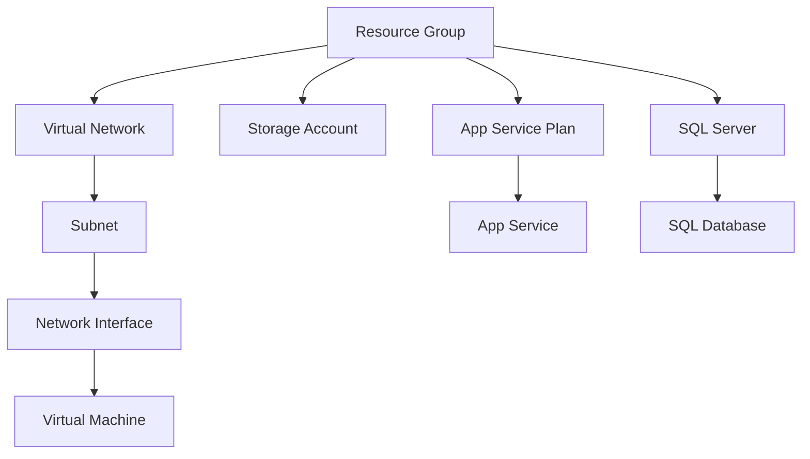

# Terraform Azure Resource Types

## Introduction

When working with Terraform to provision and manage Azure infrastructure, understanding the various Azure resource types is essential. Azure resource types in Terraform are the building blocks that define what cloud resources you want to create, modify, or destroy.

In this guide, we'll explore the common Azure resource types available in Terraform, how to define them in your configuration files, and best practices for working with them. Whether you're creating virtual machines, storage accounts, or networking components, mastering Azure resource types will help you build robust infrastructure as code solutions.

## Azure Provider Configuration

Before we dive into specific resource types, let's set up the Azure provider in Terraform. The provider configuration establishes the connection to Azure and authenticates your Terraform operations.

```hcl
terraform {
  required_providers {
    azurerm = {
      source  = "hashicorp/azurerm"
      version = "~> 3.0"
    }
  }
}

provider "azurerm" {
  features {}
}
```

This configuration:
- Specifies that we're using the `azurerm` provider from HashiCorp
- Sets a version constraint to ensure compatibility
- Configures the provider with default features

## Resource Group

In Azure, all resources must be deployed into a resource group. Think of it as a container that groups related resources for an Azure solution.

```hcl
resource "azurerm_resource_group" "example" {
  name     = "example-resources"
  location = "East US"
  
  tags = {
    environment = "Development"
    project     = "Learning"
  }
}
```

Output:
```
azurerm_resource_group.example: Creating...
azurerm_resource_group.example: Creation complete after 2s [id=/subscriptions/.../resourceGroups/example-resources]
```

## Virtual Network Resources

### Virtual Network

Virtual networks enable Azure resources to securely communicate with each other, the internet, and on-premises networks.

```hcl
resource "azurerm_virtual_network" "example" {
  name                = "example-network"
  address_space       = ["10.0.0.0/16"]
  location            = azurerm_resource_group.example.location
  resource_group_name = azurerm_resource_group.example.name
}
```

### Subnet

Subnets divide your virtual network into smaller address spaces.

```hcl
resource "azurerm_subnet" "example" {
  name                 = "internal"
  resource_group_name  = azurerm_resource_group.example.name
  virtual_network_name = azurerm_virtual_network.example.name
  address_prefixes     = ["10.0.2.0/24"]
}
```

### Network Security Group

Network Security Groups filter network traffic to and from Azure resources.

```hcl
resource "azurerm_network_security_group" "example" {
  name                = "example-nsg"
  location            = azurerm_resource_group.example.location
  resource_group_name = azurerm_resource_group.example.name

  security_rule {
    name                       = "SSH"
    priority                   = 1001
    direction                  = "Inbound"
    access                     = "Allow"
    protocol                   = "Tcp"
    source_port_range          = "*"
    destination_port_range     = "22"
    source_address_prefix      = "*"
    destination_address_prefix = "*"
  }
}
```

## Compute Resources

### Virtual Machine

Virtual machines provide computing resources in the cloud.

```hcl
resource "azurerm_network_interface" "example" {
  name                = "example-nic"
  location            = azurerm_resource_group.example.location
  resource_group_name = azurerm_resource_group.example.name

  ip_configuration {
    name                          = "internal"
    subnet_id                     = azurerm_subnet.example.id
    private_ip_address_allocation = "Dynamic"
  }
}

resource "azurerm_linux_virtual_machine" "example" {
  name                = "example-vm"
  resource_group_name = azurerm_resource_group.example.name
  location            = azurerm_resource_group.example.location
  size                = "Standard_B1s"
  admin_username      = "adminuser"
  
  network_interface_ids = [
    azurerm_network_interface.example.id,
  ]

  admin_ssh_key {
    username   = "adminuser"
    public_key = file("~/.ssh/id_rsa.pub")
  }

  os_disk {
    caching              = "ReadWrite"
    storage_account_type = "Standard_LRS"
  }

  source_image_reference {
    publisher = "Canonical"
    offer     = "UbuntuServer"
    sku       = "18.04-LTS"
    version   = "latest"
  }
}
```

### Azure Kubernetes Service (AKS)

AKS provides a managed Kubernetes service for running containerized applications.

```hcl
resource "azurerm_kubernetes_cluster" "example" {
  name                = "example-aks"
  location            = azurerm_resource_group.example.location
  resource_group_name = azurerm_resource_group.example.name
  dns_prefix          = "exampleaks"

  default_node_pool {
    name       = "default"
    node_count = 1
    vm_size    = "Standard_D2_v2"
  }

  identity {
    type = "SystemAssigned"
  }
}
```

## Storage Resources

### Storage Account

Storage accounts contain all your Azure Storage data objects: blobs, files, queues, and tables.

```hcl
resource "azurerm_storage_account" "example" {
  name                     = "examplestorageacc"
  resource_group_name      = azurerm_resource_group.example.name
  location                 = azurerm_resource_group.example.location
  account_tier             = "Standard"
  account_replication_type = "LRS"
}
```

### Storage Container

Containers organize sets of blobs, similar to a directory in a file system.

```hcl
resource "azurerm_storage_container" "example" {
  name                  = "content"
  storage_account_name  = azurerm_storage_account.example.name
  container_access_type = "private"
}
```

## Database Resources

### Azure SQL Database

Azure SQL Database is a fully managed relational database service.

```hcl
resource "azurerm_sql_server" "example" {
  name                         = "example-sqlserver"
  resource_group_name          = azurerm_resource_group.example.name
  location                     = azurerm_resource_group.example.location
  version                      = "12.0"
  administrator_login          = "sqladmin"
  administrator_login_password = "P@ssw0rd1234!"  # Use variables in production
}

resource "azurerm_sql_database" "example" {
  name                = "example-db"
  resource_group_name = azurerm_resource_group.example.name
  location            = azurerm_resource_group.example.location
  server_name         = azurerm_sql_server.example.name
  edition             = "Basic"
}
```

### Cosmos DB

Azure Cosmos DB is a globally distributed, multi-model database service.

```hcl
resource "azurerm_cosmosdb_account" "example" {
  name                = "example-cosmosdb"
  location            = azurerm_resource_group.example.location
  resource_group_name = azurerm_resource_group.example.name
  offer_type          = "Standard"
  kind                = "GlobalDocumentDB"

  consistency_policy {
    consistency_level = "Session"
  }

  geo_location {
    location          = azurerm_resource_group.example.location
    failover_priority = 0
  }
}
```

## App Service Resources

### App Service Plan

App Service Plans define the compute resources for your App Service applications.

```hcl
resource "azurerm_app_service_plan" "example" {
  name                = "example-appserviceplan"
  location            = azurerm_resource_group.example.location
  resource_group_name = azurerm_resource_group.example.name
  kind                = "Linux"
  reserved            = true

  sku {
    tier = "Basic"
    size = "B1"
  }
}
```

### App Service (Web App)

App Services provide a platform for hosting web applications, REST APIs, and mobile back ends.

```hcl
resource "azurerm_app_service" "example" {
  name                = "example-app-service"
  location            = azurerm_resource_group.example.location
  resource_group_name = azurerm_resource_group.example.name
  app_service_plan_id = azurerm_app_service_plan.example.id

  site_config {
    linux_fx_version = "DOCKER|nginx:latest"
  }
}
```

## Resource Relationships and Dependencies

Resources in Terraform can reference each other, creating implicit dependencies. Let's visualize the relationships between common Azure resources:



This diagram shows how resources relate to each other in a typical Azure infrastructure setup.

## Resource Addressing and Interpolation

Terraform uses a consistent addressing format to refer to resources and their attributes:

```
resource_type.resource_name.attribute
```

For example, to reference a resource group's name:

```hcl
resource "azurerm_virtual_network" "example" {
  name                = "example-network"
  address_space       = ["10.0.0.0/16"]
  location            = azurerm_resource_group.example.location  # Reference to resource group location
  resource_group_name = azurerm_resource_group.example.name      # Reference to resource group name
}
```

## Practical Example: Complete Web Application Infrastructure

Let's put it all together with a practical example of a web application infrastructure:

```hcl
# Resource Group
resource "azurerm_resource_group" "webapp" {
  name     = "webapp-resources"
  location = "East US"
  tags = {
    environment = "Production"
    application = "WebApp"
  }
}

# Networking
resource "azurerm_virtual_network" "webapp" {
  name                = "webapp-vnet"
  address_space       = ["10.0.0.0/16"]
  location            = azurerm_resource_group.webapp.location
  resource_group_name = azurerm_resource_group.webapp.name
}

resource "azurerm_subnet" "webapp" {
  name                 = "webapp-subnet"
  resource_group_name  = azurerm_resource_group.webapp.name
  virtual_network_name = azurerm_virtual_network.webapp.name
  address_prefixes     = ["10.0.1.0/24"]
  service_endpoints    = ["Microsoft.Sql", "Microsoft.Web"]
}

# Database
resource "azurerm_sql_server" "webapp" {
  name                         = "webapp-sqlserver"
  resource_group_name          = azurerm_resource_group.webapp.name
  location                     = azurerm_resource_group.webapp.location
  version                      = "12.0"
  administrator_login          = "sqladmin"
  administrator_login_password = "P@ssw0rd1234!"  # Use variables in production
}

resource "azurerm_sql_database" "webapp" {
  name                = "webapp-db"
  resource_group_name = azurerm_resource_group.webapp.name
  location            = azurerm_resource_group.webapp.location
  server_name         = azurerm_sql_server.webapp.name
  edition             = "Standard"
  requested_service_objective_name = "S0"
}

# Storage
resource "azurerm_storage_account" "webapp" {
  name                     = "webappstorage"
  resource_group_name      = azurerm_resource_group.webapp.name
  location                 = azurerm_resource_group.webapp.location
  account_tier             = "Standard"
  account_replication_type = "LRS"
}

resource "azurerm_storage_container" "webapp" {
  name                  = "content"
  storage_account_name  = azurerm_storage_account.webapp.name
  container_access_type = "private"
}

# App Service
resource "azurerm_app_service_plan" "webapp" {
  name                = "webapp-appserviceplan"
  location            = azurerm_resource_group.webapp.location
  resource_group_name = azurerm_resource_group.webapp.name
  kind                = "Linux"
  reserved            = true

  sku {
    tier = "Standard"
    size = "S1"
  }
}

resource "azurerm_app_service" "webapp" {
  name                = "example-webapp-service"
  location            = azurerm_resource_group.webapp.location
  resource_group_name = azurerm_resource_group.webapp.name
  app_service_plan_id = azurerm_app_service_plan.webapp.id

  site_config {
    linux_fx_version = "DOTNETCORE|3.1"
  }

  app_settings = {
    "WEBSITE_NODE_DEFAULT_VERSION" = "10.14.1"
    "DATABASE_URL"                 = azurerm_sql_database.webapp.connection_string
    "STORAGE_URL"                  = azurerm_storage_account.webapp.primary_blob_endpoint
  }
}
```

## Important Azure Resource Type Categories

Here's a summary of the major Azure resource type categories available in Terraform:

| Category | Examples | Common Use Cases |
|----------|----------|------------------|
| Compute | Virtual Machines, AKS, Virtual Machine Scale Sets | Running applications, hosting containers |
| Networking | VNets, Subnets, NSGs, Load Balancers | Connecting resources, security, traffic management |
| Storage | Storage Accounts, Containers, File Shares | Storing data, backups, static websites |
| Databases | SQL Database, Cosmos DB, MySQL | Data persistence, analytics |
| App Services | App Service Plans, Web Apps, Function Apps | Hosting web applications, serverless functions |
| Monitoring | Log Analytics, Application Insights | Tracking performance, debugging |
| Identity | Azure Active Directory, Managed Identities | Authentication, authorization |
| Containers | Container Instances, Container Registry | Running containerized workloads |

## Best Practices for Working with Azure Resource Types

1. **Use Variables for Resource Names**: Make your configuration reusable across environments.

```hcl
variable "environment" {
  description = "Environment name (dev, test, prod)"
  type        = string
  default     = "dev"
}

resource "azurerm_resource_group" "example" {
  name     = "rg-${var.environment}-application"
  location = "East US"
}
```

2. **Leverage Resource Dependencies**: Let Terraform handle the creation order:

```hcl
resource "azurerm_virtual_machine" "example" {
  # VM configuration
  
  depends_on = [
    azurerm_network_interface.example,
    azurerm_storage_account.example
  ]
}
```

3. **Use Modules for Reusable Components**: Encapsulate