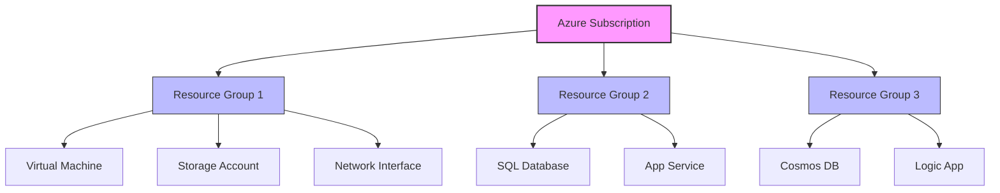

# Terraform Azure Resource Groups

## Introduction

Azure Resource Groups are logical containers that help you organize and manage your Azure resources. They serve as a fundamental organizational unit in Azure, allowing you to group related resources that share the same lifecycle, permissions, and policies. When working with Terraform and Azure, understanding how to properly create and manage resource groups is essential as they form the foundation of your infrastructure deployment.

In this tutorial, we'll explore how to use Terraform to create, configure, and manage Azure Resource Groups. We'll cover basic concepts, show you how to write Terraform configurations for resource groups, and provide practical examples for real-world applications.

## Prerequisites

Before getting started, make sure you have:

- [Terraform](https://www.terraform.io/downloads.html) installed (version 1.0.0 or later)
- [Azure CLI](https://docs.microsoft.com/en-us/cli/azure/install-azure-cli) installed and configured
- An active Azure subscription
- Basic knowledge of Terraform concepts

## Basic Concepts

### What is an Azure Resource Group?

A resource group in Azure is a container that holds related resources for an Azure solution. These resources share the same lifecycle, permissions, and policies. Every Azure resource must belong to exactly one resource group.

### Why use Terraform for Resource Groups?

Using Terraform to manage your Azure Resource Groups provides several benefits:

1. **Infrastructure as Code (IaC)**: Your infrastructure configuration is versioned, testable, and repeatable
2. **Consistency**: Ensures consistent deployment across different environments
3. **Automation**: Simplifies the creation and management of complex infrastructures
4. **State Management**: Terraform tracks the state of your resources, making updates and deletions safer

## Creating Azure Resource Groups with Terraform

### Basic Configuration

Let's start with a simple Terraform configuration to create an Azure Resource Group:

```hcl
# Configure the Azure provider
terraform {
  required_providers {
    azurerm = {
      source  = "hashicorp/azurerm"
      version = "~> 3.0"
    }
  }
}

# Configure the Microsoft Azure Provider
provider "azurerm" {
  features {}
}

# Create a resource group
resource "azurerm_resource_group" "example" {
  name     = "example-resources"
  location = "East US"
  
  tags = {
    environment = "Development"
    project     = "Learning"
  }
}
```

In this configuration:

- We specify the Azure provider and its version
- We create a resource group named "example-resources" in the "East US" region
- We add tags to help categorize and organize our resource group

### Deploying the Configuration

To deploy this configuration:

1. Save the code above in a file named `main.tf`
2. Initialize the Terraform working directory:

```bash
terraform init
```

3. Preview the changes that will be made:

```bash
terraform plan
```

4. Apply the configuration:

```bash
terraform plan -out=tfplan
terraform apply tfplan
```

The output will show that a new resource group has been created:

```
Apply complete! Resources: 1 added, 0 changed, 0 destroyed.

Outputs:

resource_group_id = "subscription_id/resourceGroups/example-resources"
```

## Advanced Resource Group Configurations

### Working with Variables

For better flexibility and reusability, let's modify our configuration to use variables:

```hcl
# variables.tf
variable "resource_group_name" {
  description = "Name of the resource group"
  type        = string
  default     = "example-resources"
}

variable "location" {
  description = "Azure region for the resource group"
  type        = string
  default     = "East US"
}

variable "tags" {
  description = "Tags to apply to the resource group"
  type        = map(string)
  default = {
    environment = "Development"
    project     = "Learning"
  }
}
```

```hcl
# main.tf
terraform {
  required_providers {
    azurerm = {
      source  = "hashicorp/azurerm"
      version = "~> 3.0"
    }
  }
}

provider "azurerm" {
  features {}
}

resource "azurerm_resource_group" "example" {
  name     = var.resource_group_name
  location = var.location
  tags     = var.tags
}

output "resource_group_id" {
  value = azurerm_resource_group.example.id
}
```

Now you can customize your resource group by providing different values for these variables either through command-line flags, a `terraform.tfvars` file, or environment variables.

### Conditional Resource Group Creation

Sometimes you might want to create resource groups conditionally. Here's how you can do that:

```hcl
variable "create_resource_group" {
  description = "Whether to create a new resource group or use an existing one"
  type        = bool
  default     = true
}

variable "existing_resource_group_name" {
  description = "Name of existing resource group (if create_resource_group is false)"
  type        = string
  default     = ""
}

resource "azurerm_resource_group" "example" {
  count    = var.create_resource_group ? 1 : 0
  name     = var.resource_group_name
  location = var.location
  tags     = var.tags
}

locals {
  resource_group_name = var.create_resource_group ? azurerm_resource_group.example[0].name : var.existing_resource_group_name
}
```

This configuration allows you to either create a new resource group or use an existing one based on the value of the `create_resource_group` variable.

## Working with Multiple Resource Groups

In real-world scenarios, you might need to create multiple resource groups for different environments or components. Here's how you can do that:

```hcl
variable "resource_groups" {
  description = "Map of resource group configurations"
  type = map(object({
    location = string
    tags     = map(string)
  }))
  default = {
    "dev" = {
      location = "East US"
      tags = {
        environment = "Development"
        project     = "MyProject"
      }
    },
    "staging" = {
      location = "West US"
      tags = {
        environment = "Staging"
        project     = "MyProject"
      }
    },
    "prod" = {
      location = "Central US"
      tags = {
        environment = "Production"
        project     = "MyProject"
      }
    }
  }
}

resource "azurerm_resource_group" "multiple" {
  for_each = var.resource_groups
  
  name     = "rg-${each.key}"
  location = each.value.location
  tags     = each.value.tags
}

output "resource_group_ids" {
  value = { for k, v in azurerm_resource_group.multiple : k => v.id }
}
```

This approach creates three resource groups with different names and locations but similar tag structures.

## Integrating Resource Groups with Resources

Resource groups really shine when you use them to organize related Azure resources. Here's an example that creates a resource group and a storage account within it:

```hcl
resource "azurerm_resource_group" "example" {
  name     = "example-resources"
  location = "East US"
  tags = {
    environment = "Development"
  }
}

resource "azurerm_storage_account" "example" {
  name                     = "examplestorage123"
  resource_group_name      = azurerm_resource_group.example.name
  location                 = azurerm_resource_group.example.location
  account_tier             = "Standard"
  account_replication_type = "LRS"
}
```

In this configuration, the storage account is created within the resource group. When the resource group is deleted, all resources within it (including the storage account) will also be deleted.

## Resource Group Locking for Protection

In production environments, you might want to protect your resource groups from accidental deletion. Azure provides resource locks for this purpose, and you can manage them with Terraform:

```hcl
resource "azurerm_resource_group" "example" {
  name     = "critical-resources"
  location = "East US"
}

resource "azurerm_management_lock" "example" {
  name       = "resource-group-lock"
  scope      = azurerm_resource_group.example.id
  lock_level = "CanNotDelete"
  notes      = "Locked to prevent accidental deletion"
}
```

This lock prevents the resource group from being deleted but still allows modifications to resources within it.

## Best Practices for Resource Groups

When working with Azure Resource Groups in Terraform, consider these best practices:

1. **Naming Convention**: Establish a clear naming convention for your resource groups (e.g., `rg-{environment}-{application}-{region}`)

2. **Logical Grouping**: Group resources that share the same lifecycle, permissions, and purpose

3. **Tag Everything**: Use tags consistently to track ownership, cost centers, environments, etc.

```hcl
resource "azurerm_resource_group" "example" {
  name     = "rg-prod-webapp-eastus"
  location = "East US"
  
  tags = {
    Environment   = "Production"
    Application   = "WebApp"
    CostCenter    = "IT-12345"
    Owner         = "app-team"
    BusinessUnit  = "Digital"
    DataSensitivity = "Public"
  }
}
```

4. **Limit Size**: Don't put too many resources in a single resource group; consider the management and lifecycle boundaries

5. **Regional Consistency**: When possible, keep resources in the same region as their resource group

## Visualizing Resource Group Structure

Resource groups help organize your Azure infrastructure. Here's a diagram illustrating how resource groups organize Azure resources:



## Common Issues and Troubleshooting

### Issue: Resource Group Cannot Be Deleted

If you're having trouble deleting a resource group with Terraform, check for:

- Resource locks on the resource group
- Resources still being deleted (asynchronous operations)
- Permission issues

Solution:

```hcl
# First, remove any locks
resource "azurerm_management_lock" "example" {
  name       = "resource-group-lock"
  scope      = azurerm_resource_group.example.id
  lock_level = "CanNotDelete"
  notes      = "Locked to prevent accidental deletion"
  
  # Add this line to remove the lock when destroying
  count = 0
}
```

### Issue: Resources Not Being Created in the Right Location

Always specify the location explicitly for each resource, or reference the resource group location:

```hcl
resource "azurerm_storage_account" "example" {
  name                     = "examplestorage123"
  resource_group_name      = azurerm_resource_group.example.name
  location                 = azurerm_resource_group.example.location  # Inherit location from resource group
  account_tier             = "Standard"
  account_replication_type = "LRS"
}
```

## Real-World Project Example

Let's put everything together in a practical example for a three-tier web application:

```hcl
# Define three resource groups for our application tiers
resource "azurerm_resource_group" "frontend" {
  name     = "rg-${var.project}-frontend-${var.environment}"
  location = var.location
  
  tags = {
    Environment = var.environment
    Project     = var.project
    Tier        = "Frontend"
  }
}

resource "azurerm_resource_group" "backend" {
  name     = "rg-${var.project}-backend-${var.environment}"
  location = var.location
  
  tags = {
    Environment = var.environment
    Project     = var.project
    Tier        = "Backend"
  }
}

resource "azurerm_resource_group" "data" {
  name     = "rg-${var.project}-data-${var.environment}"
  location = var.location
  
  tags = {
    Environment = var.environment
    Project     = var.project
    Tier        = "Data"
  }
}

# Frontend resources
resource "azurerm_app_service_plan" "frontend" {
  name                = "asp-${var.project}-frontend"
  location            = azurerm_resource_group.frontend.location
  resource_group_name = azurerm_resource_group.frontend.name
  
  sku {
    tier = "Standard"
    size = "S1"
  }
}

# Backend resources
resource "azurerm_app_service_plan" "backend" {
  name                = "asp-${var.project}-backend"
  location            = azurerm_resource_group.backend.location
  resource_group_name = azurerm_resource_group.backend.name
  
  sku {
    tier = "Standard"
    size = "S1"
  }
}

# Data resources
resource "azurerm_sql_server" "data" {
  name                = "sql-${var.project}-${var.environment}"
  location            = azurerm_resource_group.data.location
  resource_group_name = azurerm_resource_group.data.name
  version             = "12.0"
  
  administrator_login          = var.db_admin_username
  administrator_login_password = var.db_admin_password
}
```

This structure separates concerns by tier, making it easier to manage each component independently while maintaining logical connections between them.

## Summary

Azure Resource Groups are a foundational concept when working with Azure resources. They help you logically organize resources that share the same lifecycle and apply consistent access control and policies. With Terraform, you can automate the creation and management of resource groups, ensuring consistent deployment and facilitating infrastructure as code practices.

In this tutorial, we've covered:

- The basics of Azure Resource Groups
- How to create and configure resource groups using Terraform
- Advanced configurations including variables and conditional creation
- Best practices for organizing and managing resource groups
- Real-world examples showing how to structure multi-tier applications

By following these practices, you'll be well-equipped to manage your Azure infrastructure efficiently and effectively with Terraform.

## Additional Resources and Exercises

### Resources

- [Azure Resource Group Documentation](https://docs.microsoft.com/en-us/azure/azure-resource-manager/management/overview)
- [Terraform AzureRM Provider Documentation](https://registry.terraform.io/providers/hashicorp/azurerm/latest/docs)

### Exercises

1. **Basic**: Create a Terraform configuration that makes three different resource groups with different tags and locations.

2. **Intermediate**: Build a module that creates a resource group and a set of common resources (storage account, key vault, etc.) that you might reuse across projects.

3. **Advanced**: Create a multi-environment setup with separate resource groups for dev, test, and prod, using Terraform workspaces to switch between them.

4. **Challenge**: Implement a solution that can import existing resource groups into Terraform state and then manage them going forward.