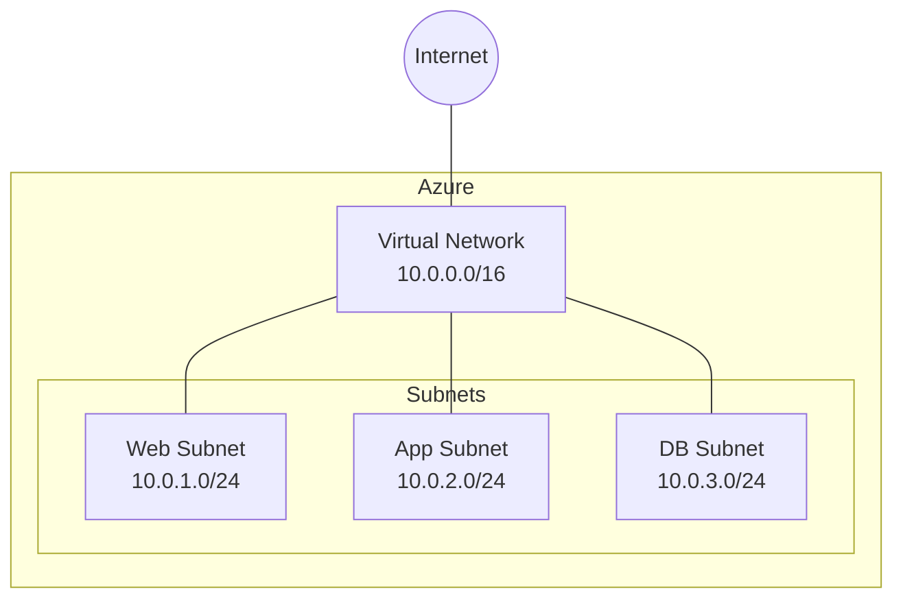

# Terraform Azure Virtual Networks

## Introduction

Azure Virtual Networks (VNets) are the fundamental building block for your private network in Azure. They enable many types of Azure resources to securely communicate with each other, the internet, and on-premises networks. In this tutorial, we'll learn how to create and manage Azure Virtual Networks using Terraform, allowing you to define your network infrastructure as code.

Virtual networks in Azure provide important capabilities:
- Network isolation and segmentation
- Internet and Azure resource communication
- Azure resource communication
- On-premises connectivity
- Network traffic filtering
- Routing network traffic

By using Terraform to manage your Azure Virtual Networks, you gain the benefits of infrastructure as code:
- Version control
- Consistent and repeatable deployments
- Automated provisioning
- Documentation as code

## Prerequisites

Before you begin, make sure you have:

1. An Azure account
2. Terraform installed (version 0.12+)
3. Azure CLI installed and configured
4. Basic understanding of networking concepts

## Setting Up Your Terraform Configuration

Let's start by creating a basic Terraform configuration for Azure. We'll create the following files:

- `main.tf` - Main configuration file
- `variables.tf` - Variable definitions
- `outputs.tf` - Output definitions
- `terraform.tfvars` - Variable values (not tracked in git)

### Provider Configuration

First, we need to configure the Azure provider in `main.tf`:

```hcl
terraform {
  required_providers {
    azurerm = {
      source  = "hashicorp/azurerm"
      version = ">=3.0.0"
    }
  }
}

provider "azurerm" {
  features {}
}

# Create a resource group
resource "azurerm_resource_group" "example" {
  name     = var.resource_group_name
  location = var.location
}
```

### Variables Definition

Let's define our variables in `variables.tf`:

```hcl
variable "resource_group_name" {
  description = "Name of the resource group"
  type        = string
}

variable "location" {
  description = "Azure region for resources"
  type        = string
  default     = "East US"
}

variable "vnet_name" {
  description = "Name of the virtual network"
  type        = string
}

variable "vnet_address_space" {
  description = "Address space for the virtual network"
  type        = list(string)
  default     = ["10.0.0.0/16"]
}

variable "subnet_names" {
  description = "Names of subnets to create"
  type        = list(string)
  default     = ["web", "app", "db"]
}

variable "subnet_prefixes" {
  description = "Address prefixes for subnets"
  type        = list(string)
  default     = ["10.0.1.0/24", "10.0.2.0/24", "10.0.3.0/24"]
}
```

## Creating an Azure Virtual Network

Now, let's add the configuration for creating a Virtual Network with subnets to our `main.tf`:

```hcl
# Create a Virtual Network
resource "azurerm_virtual_network" "example" {
  name                = var.vnet_name
  location            = azurerm_resource_group.example.location
  resource_group_name = azurerm_resource_group.example.name
  address_space       = var.vnet_address_space

  tags = {
    environment = "Development"
  }
}

# Create subnets
resource "azurerm_subnet" "example" {
  count                = length(var.subnet_names)
  name                 = var.subnet_names[count.index]
  resource_group_name  = azurerm_resource_group.example.name
  virtual_network_name = azurerm_virtual_network.example.name
  address_prefixes     = [var.subnet_prefixes[count.index]]
}
```

### Output Configuration

Let's create an `outputs.tf` file to display information about our created resources:

```hcl
output "vnet_id" {
  description = "ID of the created Virtual Network"
  value       = azurerm_virtual_network.example.id
}

output "vnet_name" {
  description = "Name of the created Virtual Network"
  value       = azurerm_virtual_network.example.name
}

output "subnet_ids" {
  description = "IDs of the created subnets"
  value       = azurerm_subnet.example[*].id
}
```

### Defining Variable Values

Create a `terraform.tfvars` file (which should be added to .gitignore) with your specific values:

```hcl
resource_group_name = "terraform-vnet-rg"
location            = "East US"
vnet_name           = "terraform-vnet"
vnet_address_space  = ["10.0.0.0/16"]
subnet_names        = ["web", "app", "db"]
subnet_prefixes     = ["10.0.1.0/24", "10.0.2.0/24", "10.0.3.0/24"]
```

## Network Architecture Visualization

Let's visualize our network architecture with a Mermaid diagram:



## Deploying Your Virtual Network

Now that we have our configuration files ready, let's deploy our Azure Virtual Network:

1. Initialize Terraform:

```bash
terraform init
```

2. Preview the changes:

```bash
terraform plan
```

The output will show what resources Terraform will create:

```
Plan: 5 resources to add
```

3. Apply the changes:

```bash
terraform apply
```

Type "yes" when prompted to confirm the creation of resources.

After a successful deployment, you'll see output values for your Virtual Network and subnets:

```
vnet_id = "/subscriptions/12345678-1234-1234-1234-123456789012/resourceGroups/terraform-vnet-rg/providers/Microsoft.Network/virtualNetworks/terraform-vnet"
vnet_name = "terraform-vnet"
subnet_ids = [
  "/subscriptions/12345678-1234-1234-1234-123456789012/resourceGroups/terraform-vnet-rg/providers/Microsoft.Network/virtualNetworks/terraform-vnet/subnets/web",
  "/subscriptions/12345678-1234-1234-1234-123456789012/resourceGroups/terraform-vnet-rg/providers/Microsoft.Network/virtualNetworks/terraform-vnet/subnets/app",
  "/subscriptions/12345678-1234-1234-1234-123456789012/resourceGroups/terraform-vnet-rg/providers/Microsoft.Network/virtualNetworks/terraform-vnet/subnets/db",
]
```

## Advanced Virtual Network Configurations

Let's explore some more advanced configurations for Azure Virtual Networks.

### Network Security Groups (NSGs)

Network Security Groups filter network traffic to and from Azure resources. Let's add an NSG to our web subnet:

```hcl
# Create a Network Security Group for the web subnet
resource "azurerm_network_security_group" "web" {
  name                = "web-nsg"
  location            = azurerm_resource_group.example.location
  resource_group_name = azurerm_resource_group.example.name

  # Allow HTTP traffic
  security_rule {
    name                       = "Allow-HTTP"
    priority                   = 100
    direction                  = "Inbound"
    access                     = "Allow"
    protocol                   = "Tcp"
    source_port_range          = "*"
    destination_port_range     = "80"
    source_address_prefix      = "*"
    destination_address_prefix = "*"
  }

  # Allow HTTPS traffic
  security_rule {
    name                       = "Allow-HTTPS"
    priority                   = 110
    direction                  = "Inbound"
    access                     = "Allow"
    protocol                   = "Tcp"
    source_port_range          = "*"
    destination_port_range     = "443"
    source_address_prefix      = "*"
    destination_address_prefix = "*"
  }

  # Deny all other inbound traffic
  security_rule {
    name                       = "Deny-All"
    priority                   = 1000
    direction                  = "Inbound"
    access                     = "Deny"
    protocol                   = "*"
    source_port_range          = "*"
    destination_port_range     = "*"
    source_address_prefix      = "*"
    destination_address_prefix = "*"
  }
}

# Associate the NSG with the web subnet
resource "azurerm_subnet_network_security_group_association" "web" {
  subnet_id                 = azurerm_subnet.example[0].id
  network_security_group_id = azurerm_network_security_group.web.id
}
```

### Route Tables and Custom Routes

Route tables define how network traffic is directed in Azure. Let's create a custom route for the app subnet:

```hcl
# Create a Route Table
resource "azurerm_route_table" "example" {
  name                = "app-route-table"
  location            = azurerm_resource_group.example.location
  resource_group_name = azurerm_resource_group.example.name

  # Route all traffic through a Network Virtual Appliance
  route {
    name                   = "route-through-nva"
    address_prefix         = "0.0.0.0/0"
    next_hop_type          = "VirtualAppliance"
    next_hop_in_ip_address = "10.0.2.4" # IP of a theoretical Network Virtual Appliance
  }
}

# Associate the Route Table with the app subnet
resource "azurerm_subnet_route_table_association" "example" {
  subnet_id      = azurerm_subnet.example[1].id
  route_table_id = azurerm_route_table.example.id
}
```

### Service Endpoints

Service endpoints provide secure and direct connectivity to Azure services. Let's add Service Endpoints to our database subnet:

```hcl
# Create a subnet with Service Endpoints for Azure SQL
resource "azurerm_subnet" "db_subnet" {
  name                 = "db-subnet"
  resource_group_name  = azurerm_resource_group.example.name
  virtual_network_name = azurerm_virtual_network.example.name
  address_prefixes     = ["10.0.4.0/24"]
  service_endpoints    = ["Microsoft.Sql"]
}
```

## Virtual Network Peering

Virtual Network peering enables you to connect two virtual networks. Let's create another VNet and peer it with our existing one:

```hcl
# Create a second Virtual Network
resource "azurerm_virtual_network" "example2" {
  name                = "${var.vnet_name}-peer"
  location            = azurerm_resource_group.example.location
  resource_group_name = azurerm_resource_group.example.name
  address_space       = ["10.1.0.0/16"]
}

# Create a subnet in the second VNet
resource "azurerm_subnet" "example2" {
  name                 = "default"
  resource_group_name  = azurerm_resource_group.example.name
  virtual_network_name = azurerm_virtual_network.example2.name
  address_prefixes     = ["10.1.1.0/24"]
}

# Create peering from first VNet to second VNet
resource "azurerm_virtual_network_peering" "example1_to_example2" {
  name                      = "peer-to-second-vnet"
  resource_group_name       = azurerm_resource_group.example.name
  virtual_network_name      = azurerm_virtual_network.example.name
  remote_virtual_network_id = azurerm_virtual_network.example2.id
  allow_virtual_network_access = true
  allow_forwarded_traffic      = true
}

# Create peering from second VNet to first VNet
resource "azurerm_virtual_network_peering" "example2_to_example1" {
  name                      = "peer-to-first-vnet"
  resource_group_name       = azurerm_resource_group.example.name
  virtual_network_name      = azurerm_virtual_network.example2.name
  remote_virtual_network_id = azurerm_virtual_network.example.id
  allow_virtual_network_access = true
  allow_forwarded_traffic      = true
}
```

## Complete Example: Three-Tier Web Application Network

Let's put everything together into a comprehensive example for a three-tier web application network:

```hcl
# Resource Group
resource "azurerm_resource_group" "example" {
  name     = "three-tier-app-rg"
  location = "East US"
}

# Virtual Network
resource "azurerm_virtual_network" "example" {
  name                = "three-tier-vnet"
  address_space       = ["10.0.0.0/16"]
  location            = azurerm_resource_group.example.location
  resource_group_name = azurerm_resource_group.example.name
}

# Subnets
resource "azurerm_subnet" "web" {
  name                 = "web-subnet"
  resource_group_name  = azurerm_resource_group.example.name
  virtual_network_name = azurerm_virtual_network.example.name
  address_prefixes     = ["10.0.1.0/24"]
}

resource "azurerm_subnet" "app" {
  name                 = "app-subnet"
  resource_group_name  = azurerm_resource_group.example.name
  virtual_network_name = azurerm_virtual_network.example.name
  address_prefixes     = ["10.0.2.0/24"]
}

resource "azurerm_subnet" "db" {
  name                 = "db-subnet"
  resource_group_name  = azurerm_resource_group.example.name
  virtual_network_name = azurerm_virtual_network.example.name
  address_prefixes     = ["10.0.3.0/24"]
  service_endpoints    = ["Microsoft.Sql"]
}

# Network Security Group for Web tier
resource "azurerm_network_security_group" "web" {
  name                = "web-nsg"
  location            = azurerm_resource_group.example.location
  resource_group_name = azurerm_resource_group.example.name

  security_rule {
    name                       = "Allow-HTTP"
    priority                   = 100
    direction                  = "Inbound"
    access                     = "Allow"
    protocol                   = "Tcp"
    source_port_range          = "*"
    destination_port_range     = "80"
    source_address_prefix      = "*"
    destination_address_prefix = "*"
  }

  security_rule {
    name                       = "Allow-HTTPS"
    priority                   = 110
    direction                  = "Inbound"
    access                     = "Allow"
    protocol                   = "Tcp"
    source_port_range          = "*"
    destination_port_range     = "443"
    source_address_prefix      = "*"
    destination_address_