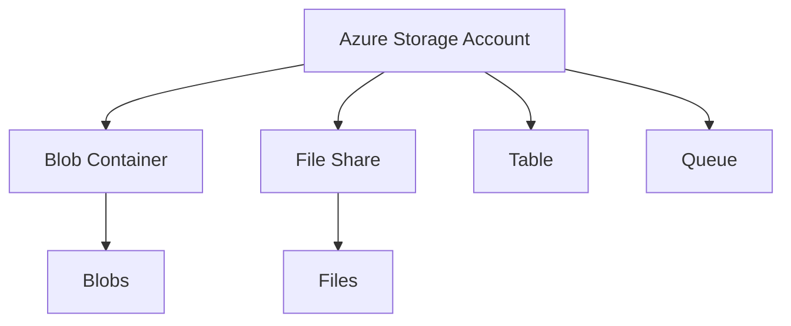

# Terraform Azure Storage

## Introduction

Azure Storage is a fundamental service in Microsoft Azure that provides scalable, secure cloud storage for various data types. When working with Infrastructure as Code (IaC) using Terraform, you can automate the creation and management of Azure Storage resources, ensuring consistent and repeatable deployments.

In this guide, we'll explore how to use Terraform to provision and manage Azure Storage resources including:

- Storage Accounts
- Storage Containers
- Blobs
- File Shares
- Tables
- Queues

## Prerequisites

Before diving into Azure Storage with Terraform, make sure you have:

1. Terraform installed (version 1.0.0+)
2. Azure CLI installed and configured
3. Basic understanding of Terraform concepts
4. An active Azure subscription

## Azure Storage Components

Let's understand the key components of Azure Storage before implementing them with Terraform:



## Setting Up Azure Provider

First, we need to configure the Azure provider in our Terraform configuration:

```hcl
terraform {
  required_providers {
    azurerm = {
      source  = "hashicorp/azurerm"
      version = "~> 3.0"
    }
  }
}

provider "azurerm" {
  features {}
}

resource "azurerm_resource_group" "example" {
  name     = "example-resources"
  location = "East US"
}
```

## Creating an Azure Storage Account

A storage account is the basic container that holds all your Azure Storage data objects. Let's create one:

```hcl
resource "azurerm_storage_account" "example" {
  name                     = "examplestorageacct"
  resource_group_name      = azurerm_resource_group.example.name
  location                 = azurerm_resource_group.example.location
  account_tier             = "Standard"
  account_replication_type = "LRS"
  
  tags = {
    environment = "development"
  }
}
```

Let's break down the key attributes:

- `name`: Must be unique across all of Azure, between 3-24 characters, lowercase letters and numbers only
- `resource_group_name`: The resource group where the storage account will be created
- `location`: Azure region for the storage account
- `account_tier`: Performance tier ("Standard" or "Premium")
- `account_replication_type`: Data replication strategy:
  - `LRS`: Locally redundant storage
  - `GRS`: Geo-redundant storage
  - `RAGRS`: Read-access geo-redundant storage
  - `ZRS`: Zone-redundant storage

## Creating a Blob Container

Blob storage is optimized for storing massive amounts of unstructured data:

```hcl
resource "azurerm_storage_container" "example" {
  name                  = "content"
  storage_account_name  = azurerm_storage_account.example.name
  container_access_type = "private"
}
```

Access types include:
- `private`: No anonymous access
- `blob`: Anonymous read access for blobs only
- `container`: Anonymous read access for the entire container

## Uploading a Blob

You can upload files as blobs using Terraform:

```hcl
resource "azurerm_storage_blob" "example" {
  name                   = "example.txt"
  storage_account_name   = azurerm_storage_account.example.name
  storage_container_name = azurerm_storage_container.example.name
  type                   = "Block"
  source                 = "path/to/local/file.txt"  # Local file path
  # Alternatively, use source_content to specify content directly
  # source_content        = "This is the content for my blob"
}
```

## Creating a File Share

Azure Files offers fully managed file shares in the cloud:

```hcl
resource "azurerm_storage_share" "example" {
  name                 = "sharename"
  storage_account_name = azurerm_storage_account.example.name
  quota                = 50  # Size in GB
}
```

## Working with Tables

Azure Table storage is a NoSQL datastore:

```hcl
resource "azurerm_storage_table" "example" {
  name                 = "exampletable"
  storage_account_name = azurerm_storage_account.example.name
}
```

## Setting Up a Queue

Queues are useful for handling asynchronous message processing:

```hcl
resource "azurerm_storage_queue" "example" {
  name                 = "examplequeue"
  storage_account_name = azurerm_storage_account.example.name
}
```

## Practical Example: Static Website Hosting

Azure Storage can host static websites. Here's how to set it up:

```hcl
resource "azurerm_storage_account" "website" {
  name                     = "examplewebsitestore"
  resource_group_name      = azurerm_resource_group.example.name
  location                 = azurerm_resource_group.example.location
  account_tier             = "Standard"
  account_replication_type = "LRS"
  
  static_website {
    index_document     = "index.html"
    error_404_document = "404.html"
  }
}

resource "azurerm_storage_blob" "index" {
  name                   = "index.html"
  storage_account_name   = azurerm_storage_account.website.name
  storage_container_name = "$web"  # Special container for static websites
  type                   = "Block"
  content_type           = "text/html"
  source_content         = "<html><body><h1>Hello, Terraform!</h1></body></html>"
}

output "website_url" {
  value = azurerm_storage_account.website.primary_web_endpoint
}
```

## Advanced Configuration: Lifecycle Management

You can set up lifecycle management rules to automatically move or delete data:

```hcl
resource "azurerm_storage_management_policy" "example" {
  storage_account_id = azurerm_storage_account.example.id

  rule {
    name    = "rule1"
    enabled = true
    filters {
      prefix_match = ["container1/prefix1"]
      blob_types   = ["blockBlob"]
    }
    actions {
      base_blob {
        tier_to_cool_after_days_since_modification_greater_than    = 30
        tier_to_archive_after_days_since_modification_greater_than = 90
        delete_after_days_since_modification_greater_than          = 365
      }
      snapshot {
        delete_after_days_since_creation_greater_than = 30
      }
    }
  }
}
```

## Security: Network Rules

Secure your storage account by restricting network access:

```hcl
resource "azurerm_storage_account_network_rules" "example" {
  storage_account_id = azurerm_storage_account.example.id
  
  default_action             = "Deny"
  virtual_network_subnet_ids = [azurerm_subnet.example.id]
  ip_rules                   = ["203.0.113.0/24"]
  bypass                     = ["Metrics", "Logging", "AzureServices"]
}
```

## Data Access: Shared Access Signatures (SAS)

You can generate SAS tokens for secure, temporary access to storage resources:

```hcl
data "azurerm_storage_account_sas" "example" {
  connection_string = azurerm_storage_account.example.primary_connection_string
  https_only        = true
  
  resource_types {
    service   = true
    container = true
    object    = true
  }
  
  services {
    blob  = true
    queue = false
    table = false
    file  = false
  }
  
  start  = "2023-01-01"
  expiry = "2023-12-31"
  
  permissions {
    read    = true
    write   = false
    delete  = false
    list    = true
    add     = false
    create  = false
    update  = false
    process = false
    tag     = false
    filter  = false
  }
}

output "sas_url_query_string" {
  value     = data.azurerm_storage_account_sas.example.sas
  sensitive = true
}
```

## Complete Example

Here's a complete example that brings together multiple storage resources:

```hcl
terraform {
  required_providers {
    azurerm = {
      source  = "hashicorp/azurerm"
      version = "~> 3.0"
    }
  }
}

provider "azurerm" {
  features {}
}

resource "azurerm_resource_group" "storage_demo" {
  name     = "storage-demo-rg"
  location = "West Europe"
}

resource "azurerm_storage_account" "demo" {
  name                     = "storagedemo${random_string.random.result}"
  resource_group_name      = azurerm_resource_group.storage_demo.name
  location                 = azurerm_resource_group.storage_demo.location
  account_tier             = "Standard"
  account_replication_type = "GRS"
  
  blob_properties {
    versioning_enabled = true
    
    container_delete_retention_policy {
      days = 7
    }
    
    delete_retention_policy {
      days = 30
    }
  }
  
  tags = {
    environment = "development"
    project     = "terraform-demo"
  }
}

resource "random_string" "random" {
  length  = 8
  special = false
  upper   = false
}

resource "azurerm_storage_container" "images" {
  name                  = "images"
  storage_account_name  = azurerm_storage_account.demo.name
  container_access_type = "blob"
}

resource "azurerm_storage_container" "documents" {
  name                  = "documents"
  storage_account_name  = azurerm_storage_account.demo.name
  container_access_type = "private"
}

resource "azurerm_storage_share" "app_config" {
  name                 = "app-config"
  storage_account_name = azurerm_storage_account.demo.name
  quota                = 10
}

resource "azurerm_storage_queue" "messages" {
  name                 = "messages"
  storage_account_name = azurerm_storage_account.demo.name
}

resource "azurerm_storage_table" "users" {
  name                 = "users"
  storage_account_name = azurerm_storage_account.demo.name
}

output "storage_account_name" {
  value = azurerm_storage_account.demo.name
}

output "primary_blob_endpoint" {
  value = azurerm_storage_account.demo.primary_blob_endpoint
}

output "primary_access_key" {
  value     = azurerm_storage_account.demo.primary_access_key
  sensitive = true
}
```

## Managing Terraform State with Azure Storage

One common practice is to store Terraform state files in Azure Storage for team collaboration:

```hcl
terraform {
  backend "azurerm" {
    resource_group_name  = "terraform-state-rg"
    storage_account_name = "terraformstate123"
    container_name       = "tfstate"
    key                  = "prod.terraform.tfstate"
  }
}
```

To initialize this backend, use:

```bash
terraform init \
  -backend-config="storage_account_name=terraformstate123" \
  -backend-config="container_name=tfstate" \
  -backend-config="access_key=$(az storage account keys list --resource-group terraform-state-rg --account-name terraformstate123 --query '[0].value' -o tsv)" \
  -backend-config="key=prod.terraform.tfstate"
```

## Best Practices

1. **Naming Convention**: Use a consistent naming pattern for your storage resources
2. **Redundancy**: Choose appropriate replication options based on your data criticality
3. **Security**: 
   - Always use network rules to restrict access
   - Enable secure transfer (HTTPS)
   - Use managed identities instead of access keys when possible
4. **Cost Optimization**:
   - Set up lifecycle management to move infrequently accessed data to cooler tiers
   - Delete unnecessary data automatically
5. **Monitoring**: Set up diagnostic settings to capture metrics and logs

## Common Issues and Troubleshooting

| Issue | Solution |
|-------|----------|
| "Storage account name already exists" | Storage account names must be globally unique. Add a random suffix or use your company prefix. |
| "Cannot modify immutable property" | Some properties cannot be changed after creation. You may need to recreate the resource. |
| Access denied errors | Check your Azure credentials, RBAC assignments, and network rules. |
| Slow performance | Check your storage account tier, location, and network configuration. |

## Summary

In this guide, we've explored how to use Terraform to manage Azure Storage resources effectively. We've covered:

- Creating and configuring Storage Accounts
- Working with different storage types (Blobs, Files, Tables, Queues)
- Securing your storage with network rules and SAS tokens
- Setting up lifecycle management policies
- Using Azure Storage as a Terraform backend

Terraform makes it easy to provision and manage Azure Storage resources in a consistent, repeatable manner—a key advantage when implementing Infrastructure as Code for your cloud environments.

## Exercises

1. Create a Terraform configuration to set up a storage account with private endpoints for secure access from a virtual network.
2. Implement a configuration to host a static website with custom domain and CDN integration.
3. Set up a storage account with hierarchical namespace enabled and configure appropriate RBAC roles.
4. Create a setup with multiple storage accounts across regions for disaster recovery scenarios.

## Additional Resources

- [Terraform Azure Provider Documentation](https://registry.terraform.io/providers/hashicorp/azurerm/latest/docs)
- [Azure Storage Documentation](https://docs.microsoft.com/en-us/azure/storage/)
- [Terraform Backend Configuration](https://www.terraform.io/docs/language/settings/backends/azurerm.html)