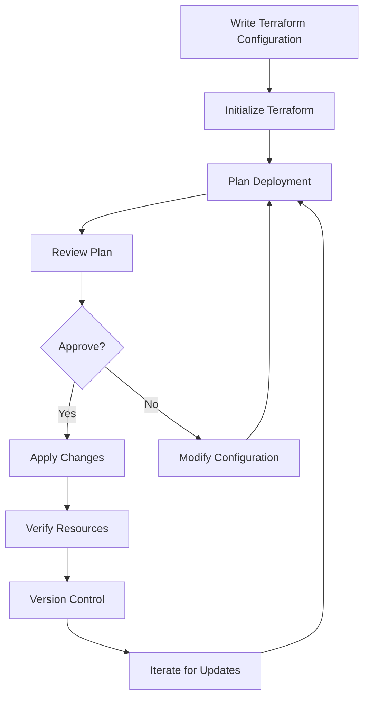

# Terraform Azure SQL

## Introduction

Azure SQL Database is Microsoft's fully managed relational database service in the cloud, providing SQL Server capabilities without the need to manage infrastructure. Terraform allows you to provision and manage these database resources through code, following Infrastructure as Code (IaC) principles.

In this guide, we'll explore how to use Terraform to create, configure, and manage Azure SQL resources. This approach ensures consistent, repeatable deployments and makes your database infrastructure part of your version-controlled codebase.

## Prerequisites

Before getting started, ensure you have:

- Terraform installed (version 1.0.0+)
- Azure CLI installed and configured
- An active Azure subscription
- Basic understanding of SQL concepts
- Basic knowledge of Terraform and HCL (HashiCorp Configuration Language)

## Setting Up Azure Provider

First, we need to configure the Azure provider in our Terraform configuration:

```hcl
terraform {
  required_providers {
    azurerm = {
      source  = "hashicorp/azurerm"
      version = "~> 3.0"
    }
  }
}

provider "azurerm" {
  features {}
}
```

## Creating Basic Azure SQL Resources

Let's start with a simple example that creates:
1. A resource group to contain our SQL resources
2. An Azure SQL Server
3. An Azure SQL Database

```hcl
# Resource Group
resource "azurerm_resource_group" "example" {
  name     = "example-sql-resources"
  location = "East US"
}

# Azure SQL Server
resource "azurerm_mssql_server" "example" {
  name                         = "example-sqlserver"
  resource_group_name          = azurerm_resource_group.example.name
  location                     = azurerm_resource_group.example.location
  version                      = "12.0"
  administrator_login          = "sqladmin"
  administrator_login_password = "P@ssw0rd1234!"  # In production, use a variable and a secure backend

  public_network_access_enabled    = true
  minimum_tls_version              = "1.2"
}

# Azure SQL Database
resource "azurerm_mssql_database" "example" {
  name           = "example-db"
  server_id      = azurerm_mssql_server.example.id
  collation      = "SQL_Latin1_General_CP1_CI_AS"
  license_type   = "LicenseIncluded"
  max_size_gb    = 4
  sku_name       = "Basic"
  zone_redundant = false
}
```

## Understanding the Configuration

Let's break down the components:

### Resource Group
The `azurerm_resource_group` creates a logical container for all our Azure resources. Azure requires every resource to belong to a resource group.

### Azure SQL Server
The `azurerm_mssql_server` resource creates the logical SQL server:
- `name`: A unique name for your SQL server
- `administrator_login` and `administrator_login_password`: SQL admin credentials
- `version`: The SQL Server version (12.0 is SQL Server 2017/2019)
- `minimum_tls_version`: Security setting for encryption

:::caution
Never hardcode passwords in your Terraform files. Use environment variables, Terraform variables, Azure Key Vault, or a secure backend like Terraform Cloud.
:::

### SQL Database
The `azurerm_mssql_database` creates the actual database:
- `name`: The database name
- `server_id`: References the parent SQL server
- `collation`: Determines sorting and comparison rules
- `sku_name`: Performance tier (Basic, Standard, Premium, etc.)
- `max_size_gb`: Maximum storage size

## Configuring Firewall Rules

By default, Azure SQL Server is not accessible from external networks. Let's add firewall rules to allow connections:

```hcl
# Allow Azure services
resource "azurerm_mssql_firewall_rule" "allow_azure_services" {
  name             = "AllowAzureServices"
  server_id        = azurerm_mssql_server.example.id
  start_ip_address = "0.0.0.0"
  end_ip_address   = "0.0.0.0"
}

# Allow specific IP range (example: office network)
resource "azurerm_mssql_firewall_rule" "allow_office" {
  name             = "AllowOfficeNetwork"
  server_id        = azurerm_mssql_server.example.id
  start_ip_address = "203.0.113.0"  # Example IP - replace with your IP
  end_ip_address   = "203.0.113.255"  # Example IP range - replace with your range
}
```

## Advanced Configuration: Performance Settings

Let's explore setting up a more production-ready SQL Database with specific performance settings:

```hcl
resource "azurerm_mssql_database" "production" {
  name           = "production-db"
  server_id      = azurerm_mssql_server.example.id
  collation      = "SQL_Latin1_General_CP1_CI_AS"
  
  # Performance settings
  sku_name       = "S1"  # Standard tier S1
  max_size_gb    = 20
  
  # High availability settings
  zone_redundant = true  # Only available in certain regions and SKUs
  
  # Backup settings
  short_term_retention_policy {
    retention_days = 7
  }
  
  # Auto-scaling (Preview feature - verify availability)
  # auto_pause_delay_in_minutes = 60
  # min_capacity = 0.5
  
  tags = {
    environment = "production"
    department  = "finance"
  }
}
```

## Implementing Security Best Practices

Security is critical for databases. Let's enhance our configuration with best practices:

```hcl
# Enable Advanced Threat Protection
resource "azurerm_mssql_server_security_alert_policy" "example" {
  resource_group_name        = azurerm_resource_group.example.name
  server_name                = azurerm_mssql_server.example.name
  state                      = "Enabled"
  email_account_admins       = true
  email_addresses            = ["dba@example.com"]
  retention_days             = 30
}

# Configure auditing
resource "azurerm_mssql_server_extended_auditing_policy" "example" {
  server_id                               = azurerm_mssql_server.example.id
  storage_endpoint                        = azurerm_storage_account.audit.primary_blob_endpoint
  storage_account_access_key              = azurerm_storage_account.audit.primary_access_key
  storage_account_access_key_is_secondary = false
  retention_in_days                       = 90
}

# Storage account for audit logs
resource "azurerm_storage_account" "audit" {
  name                     = "examplesqlaudit"
  resource_group_name      = azurerm_resource_group.example.name
  location                 = azurerm_resource_group.example.location
  account_tier             = "Standard"
  account_replication_type = "LRS"
  min_tls_version          = "TLS1_2"
}

# Private endpoint for SQL Server (for enhanced security)
resource "azurerm_private_endpoint" "example" {
  name                = "example-sql-endpoint"
  location            = azurerm_resource_group.example.location
  resource_group_name = azurerm_resource_group.example.name
  subnet_id           = azurerm_subnet.example.id  # You would need to define this subnet

  private_service_connection {
    name                           = "example-privateserviceconnection"
    private_connection_resource_id = azurerm_mssql_server.example.id
    subresource_names              = ["sqlServer"]
    is_manual_connection           = false
  }
}
```

## Working with Existing SQL Databases

Sometimes you need to import existing SQL resources into Terraform:

```bash
# First, identify the resource ID
az sql server show --name example-sqlserver --resource-group example-sql-resources --query id --output tsv

# Then use this ID to import into Terraform
terraform import azurerm_mssql_server.example /subscriptions/00000000-0000-0000-0000-000000000000/resourceGroups/example-sql-resources/providers/Microsoft.Sql/servers/example-sqlserver
```

## Terraform Deployment Workflow

Here's a typical workflow to deploy your Azure SQL resources:



The commands for this workflow are:

```bash
# Initialize Terraform
terraform init

# Plan deployment
terraform plan -out=sql.tfplan

# Apply changes
terraform apply sql.tfplan

# Destroy resources when no longer needed
terraform destroy
```

## Real-world Example: Multi-environment SQL Deployment

Here's how you might structure a more complex, real-world project:

```hcl
# Use variables for environment-specific settings
variable "environment" {
  description = "Deployment environment (dev, test, prod)"
  type        = string
  default     = "dev"
}

variable "sql_config" {
  description = "SQL configurations for different environments"
  type        = map(object({
    sku_name     = string
    max_size_gb  = number
    zone_redundant = bool
  }))
  default = {
    dev = {
      sku_name     = "Basic"
      max_size_gb  = 2
      zone_redundant = false
    }
    test = {
      sku_name     = "S1"
      max_size_gb  = 10
      zone_redundant = false
    }
    prod = {
      sku_name     = "P1"
      max_size_gb  = 50
      zone_redundant = true
    }
  }
}

# Create environment-specific resources
resource "azurerm_mssql_database" "environment" {
  name           = "${var.environment}-database"
  server_id      = azurerm_mssql_server.example.id
  
  # Use environment-specific settings
  sku_name       = var.sql_config[var.environment].sku_name
  max_size_gb    = var.sql_config[var.environment].max_size_gb
  zone_redundant = var.sql_config[var.environment].zone_redundant
  
  tags = {
    environment = var.environment
  }
}
```

This allows you to deploy the same codebase to different environments by simply changing the `environment` variable:

```bash
# Deploy to dev environment
terraform apply -var="environment=dev"

# Deploy to production environment
terraform apply -var="environment=prod"
```

## Using Terraform Modules for Reusable Components

For larger deployments, you might want to create a reusable module:

```hcl
# modules/sql/main.tf
variable "resource_group_name" {}
variable "location" {}
variable "sql_server_name" {}
variable "database_name" {}
variable "admin_username" {}
variable "admin_password" {}
variable "sku_name" { default = "Basic" }

resource "azurerm_mssql_server" "server" {
  name                         = var.sql_server_name
  resource_group_name          = var.resource_group_name
  location                     = var.location
  version                      = "12.0"
  administrator_login          = var.admin_username
  administrator_login_password = var.admin_password
}

resource "azurerm_mssql_database" "database" {
  name      = var.database_name
  server_id = azurerm_mssql_server.server.id
  sku_name  = var.sku_name
}

output "sql_server_id" {
  value = azurerm_mssql_server.server.id
}

output "database_id" {
  value = azurerm_mssql_database.database.id
}
```

Then use the module in your project:

```hcl
# main.tf
module "finance_sql" {
  source              = "./modules/sql"
  resource_group_name = azurerm_resource_group.example.name
  location            = azurerm_resource_group.example.location
  sql_server_name     = "finance-sql-server"
  database_name       = "finance-db"
  admin_username      = "finance_admin"
  admin_password      = var.finance_db_password
  sku_name            = "S1"
}

module "hr_sql" {
  source              = "./modules/sql"
  resource_group_name = azurerm_resource_group.example.name
  location            = azurerm_resource_group.example.location
  sql_server_name     = "hr-sql-server"
  database_name       = "hr-db"
  admin_username      = "hr_admin"
  admin_password      = var.hr_db_password
  sku_name            = "Basic"
}
```

## Troubleshooting Common Issues

### 1. Name Conflicts

Azure SQL Server names must be globally unique. If you encounter conflicts:

```hcl
resource "random_string" "sql_server_suffix" {
  length  = 6
  special = false
  upper   = false
}

resource "azurerm_mssql_server" "example" {
  name = "sqlserver-${random_string.sql_server_suffix.result}"
  # Other settings...
}
```

### 2. Firewall Issues

If you can't connect to your database, check your firewall rules:

```hcl
# Add your current IP for development
resource "azurerm_mssql_firewall_rule" "my_ip" {
  name             = "MyCurrentIP"
  server_id        = azurerm_mssql_server.example.id
  start_ip_address = "YOUR_IP_ADDRESS"
  end_ip_address   = "YOUR_IP_ADDRESS"
}
```

### 3. Permission Issues

Ensure your Azure account has sufficient permissions. You might need the "Contributor" role on your subscription or resource group.

## Summary

In this guide, we've covered:

- Basic Azure SQL setup with Terraform
- Advanced configuration options including performance and security settings
- Multi-environment deployment strategies
- Modular approaches for larger projects
- Common troubleshooting tips

Using Terraform to manage your Azure SQL resources brings several advantages:
- Consistent infrastructure across environments
- Version-controlled database configurations
- Automated deployments reducing human error
- Self-documenting infrastructure code

## Additional Resources

- [Terraform Azure Provider Documentation](https://registry.terraform.io/providers/hashicorp/azurerm/latest/docs)
- [Azure SQL Database Documentation](https://learn.microsoft.com/en-us/azure/azure-sql/)
- [Azure SQL Pricing Calculator](https://azure.microsoft.com/en-us/pricing/calculator/)

## Exercises

1. Create a Terraform configuration to provision an Azure SQL Database with a Basic tier, then modify it to upgrade to Standard tier.
2. Implement a solution that deploys different database configurations for development and production environments.
3. Create a Terraform module that provisions an Azure SQL Server with multiple databases.
4. Design a Terraform configuration that connects your Azure SQL Database to a virtual network, improving security.
5. Set up a geo-replicated Azure SQL Database for disaster recovery scenarios.