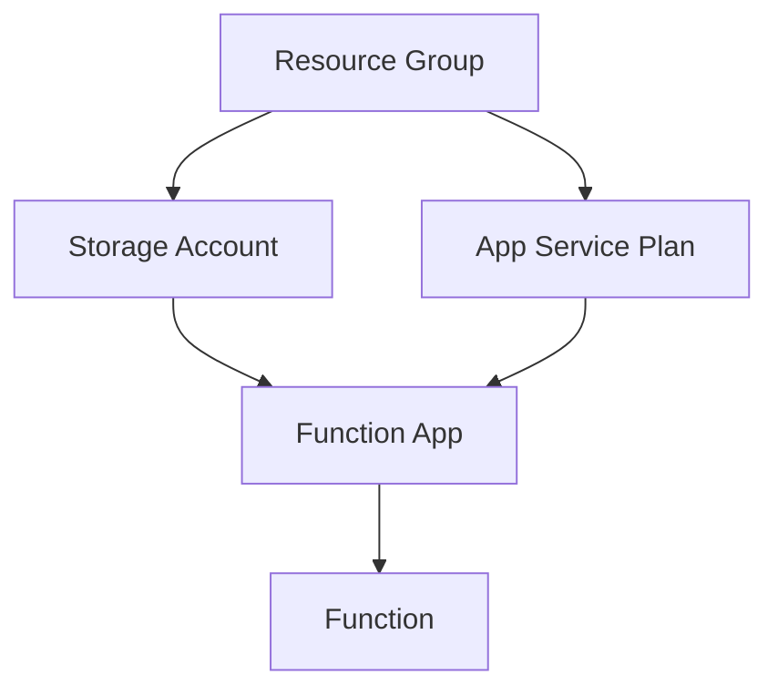

# Terraform Azure Functions

## Introduction

Azure Functions is Microsoft's serverless compute service that enables you to run code on-demand without having to explicitly provision or manage infrastructure. When combined with Terraform, you can automate the deployment, configuration, and management of your serverless functions using infrastructure as code principles. This approach brings consistency, version control, and repeatability to your serverless deployments.

In this guide, we'll explore how to use Terraform to create and manage Azure Functions, allowing you to define your serverless infrastructure as code and deploy it with confidence.

## Prerequisites

Before we begin, make sure you have:

- An Azure account
- [Terraform](https://www.terraform.io/downloads.html) installed (version 1.0.0+)
- [Azure CLI](https://docs.microsoft.com/en-us/cli/azure/install-azure-cli) installed and configured
- Basic understanding of Terraform concepts
- Familiarity with Azure Functions

## Azure Functions Components in Terraform

When working with Azure Functions in Terraform, we need to understand several key components:



Let's break down the process step by step:

1. Create a Resource Group
2. Create a Storage Account (required by Function Apps)
3. Create an App Service Plan (consumption plan or dedicated)
4. Create a Function App
5. Deploy your function code

## Basic Azure Function Deployment

Let's start with a simple example to deploy an Azure Function using Terraform:

```hcl
# Configure the Azure provider
provider "azurerm" {
  features {}
}

# Create a resource group
resource "azurerm_resource_group" "example" {
  name     = "example-functions-rg"
  location = "East US"
}

# Create a storage account
resource "azurerm_storage_account" "example" {
  name                     = "examplefuncsa"
  resource_group_name      = azurerm_resource_group.example.name
  location                 = azurerm_resource_group.example.location
  account_tier             = "Standard"
  account_replication_type = "LRS"
}

# Create an App Service Plan on consumption plan (serverless)
resource "azurerm_service_plan" "example" {
  name                = "example-asp"
  resource_group_name = azurerm_resource_group.example.name
  location            = azurerm_resource_group.example.location
  os_type             = "Windows"
  sku_name            = "Y1" # This is the consumption plan for serverless
}

# Create a Function App
resource "azurerm_windows_function_app" "example" {
  name                       = "example-function-app"
  resource_group_name        = azurerm_resource_group.example.name
  location                   = azurerm_resource_group.example.location
  service_plan_id            = azurerm_service_plan.example.id
  storage_account_name       = azurerm_storage_account.example.name
  storage_account_access_key = azurerm_storage_account.example.primary_access_key

  site_config {
    application_stack {
      node_version = "~18"
    }
  }

  app_settings = {
    "FUNCTIONS_WORKER_RUNTIME" = "node"
    "WEBSITE_NODE_DEFAULT_VERSION" = "~18"
    "WEBSITE_RUN_FROM_PACKAGE" = "1"
  }
}
```

This configuration creates:
- A resource group to hold all our resources
- A storage account that's required for function app operation
- A consumption-based App Service Plan (pay-per-execution)
- A Function App configured for Node.js runtime

## Deploying Function Code

While Terraform is great for provisioning infrastructure, deploying the actual function code is typically handled through a separate process. There are several approaches:

### 1. Using a deployment package URL

```hcl
resource "azurerm_windows_function_app" "example" {
  # ... other configuration ...

  app_settings = {
    "WEBSITE_RUN_FROM_PACKAGE" = "https://myaccount.blob.core.windows.net/packages/functionapp.zip"
  }
}
```

### 2. Using a local deployment package with Terraform archive provider

```hcl
data "archive_file" "function_app_package" {
  type        = "zip"
  source_dir  = "${path.module}/function_app"
  output_path = "${path.module}/function_app.zip"
}

resource "azurerm_storage_blob" "function_app_package" {
  name                   = "function_app.zip"
  storage_account_name   = azurerm_storage_account.example.name
  storage_container_name = "function-releases"
  type                   = "Block"
  source                 = data.archive_file.function_app_package.output_path
}

resource "azurerm_windows_function_app" "example" {
  # ... other configuration ...

  app_settings = {
    "WEBSITE_RUN_FROM_PACKAGE" = "https://${azurerm_storage_account.example.name}.blob.core.windows.net/${azurerm_storage_blob.function_app_package.storage_container_name}/${azurerm_storage_blob.function_app_package.name}"
  }
}
```

## Function App Configuration Options

Azure Functions have many configuration options that can be managed through Terraform:

### Environment Variables

```hcl
resource "azurerm_windows_function_app" "example" {
  # ... other configuration ...

  app_settings = {
    "FUNCTIONS_WORKER_RUNTIME" = "node"
    "DATABASE_CONNECTION_STRING" = "Server=myserver;Database=mydb;User Id=myuser;Password=mypassword;"    
    "API_KEY" = "my-secret-key"
    "CUSTOM_SETTING" = "custom-value"
  }
}
```

### Authentication Settings

```hcl
resource "azurerm_windows_function_app" "example" {
  # ... other configuration ...

  auth_settings {
    enabled                       = true
    issuer                        = "https://sts.windows.net/${data.azurerm_client_config.current.tenant_id}"
    unauthenticated_client_action = "RedirectToLoginPage"
    
    active_directory {
      client_id = "00000000-0000-0000-0000-000000000000"
    }
  }
}
```

### Configuring CORS (Cross-Origin Resource Sharing)

```hcl
resource "azurerm_windows_function_app" "example" {
  # ... other configuration ...

  site_config {
    cors {
      allowed_origins = ["https://www.example.com", "https://dev.example.com"]
      support_credentials = true
    }
  }
}
```

## Advanced Example: HTTP-Triggered Function with Custom Domain and SSL

Let's create a more sophisticated example of an HTTP-triggered function with a custom domain and SSL certificate:

```hcl
# Create a DNS Zone (if you don't already have one)
resource "azurerm_dns_zone" "example" {
  name                = "example.com"
  resource_group_name = azurerm_resource_group.example.name
}

# Create a custom domain for the function app
resource "azurerm_dns_cname_record" "example" {
  name                = "api"
  zone_name           = azurerm_dns_zone.example.name
  resource_group_name = azurerm_resource_group.example.name
  ttl                 = 300
  record              = "${azurerm_windows_function_app.example.name}.azurewebsites.net"
}

# Create a TXT record for domain verification
resource "azurerm_dns_txt_record" "example" {
  name                = "asuid.api"
  zone_name           = azurerm_dns_zone.example.name
  resource_group_name = azurerm_resource_group.example.name
  ttl                 = 300
  
  record {
    value = azurerm_windows_function_app.example.custom_domain_verification_id
  }
}

# Create a certificate for SSL
resource "azurerm_app_service_certificate" "example" {
  name                = "example-cert"
  resource_group_name = azurerm_resource_group.example.name
  location            = azurerm_resource_group.example.location
  pfx_blob            = filebase64("certificate.pfx")
  password            = "certificate-password"
}

# Bind the custom domain to the function app
resource "azurerm_app_service_custom_hostname_binding" "example" {
  hostname            = "api.example.com"
  app_service_name    = azurerm_windows_function_app.example.name
  resource_group_name = azurerm_resource_group.example.name
  ssl_state           = "SniEnabled"
  thumbprint          = azurerm_app_service_certificate.example.thumbprint
}

# Function App with HTTP trigger configuration
resource "azurerm_windows_function_app" "example" {
  name                       = "example-function-app"
  resource_group_name        = azurerm_resource_group.example.name
  location                   = azurerm_resource_group.example.location
  service_plan_id            = azurerm_service_plan.example.id
  storage_account_name       = azurerm_storage_account.example.name
  storage_account_access_key = azurerm_storage_account.example.primary_access_key
  
  site_config {
    application_stack {
      node_version = "~18"
    }
    
    http2_enabled = true
    
    application_insights_key = azurerm_application_insights.example.instrumentation_key
    application_insights_connection_string = azurerm_application_insights.example.connection_string
  }
  
  app_settings = {
    "FUNCTIONS_WORKER_RUNTIME" = "node"
    "WEBSITE_NODE_DEFAULT_VERSION" = "~18"
    "WEBSITE_RUN_FROM_PACKAGE" = "1"
  }
}

# Application Insights for monitoring
resource "azurerm_application_insights" "example" {
  name                = "example-appinsights"
  location            = azurerm_resource_group.example.location
  resource_group_name = azurerm_resource_group.example.name
  application_type    = "web"
}
```

## Working with Different Runtimes

Azure Functions support multiple programming languages. Here's how to configure different runtimes:

### Node.js

```hcl
resource "azurerm_windows_function_app" "nodejs" {
  # ... other configuration ...
  
  site_config {
    application_stack {
      node_version = "~18"
    }
  }
  
  app_settings = {
    "FUNCTIONS_WORKER_RUNTIME" = "node"
  }
}
```

### Python

```hcl
resource "azurerm_windows_function_app" "python" {
  # ... other configuration ...
  
  site_config {
    application_stack {
      python_version = "3.9"
    }
  }
  
  app_settings = {
    "FUNCTIONS_WORKER_RUNTIME" = "python"
  }
}
```

### .NET

```hcl
resource "azurerm_windows_function_app" "dotnet" {
  # ... other configuration ...
  
  site_config {
    application_stack {
      dotnet_version = "v6.0"
    }
  }
  
  app_settings = {
    "FUNCTIONS_WORKER_RUNTIME" = "dotnet"
  }
}
```

## Implementing CI/CD with Terraform and Azure Functions

While Terraform handles infrastructure provisioning, you'll likely want to integrate it with a CI/CD pipeline for your function code. Here's a general approach:

1. Use Terraform to provision and configure the Function App
2. Use separate CI/CD tools (GitHub Actions, Azure DevOps) to build and deploy function code

Here's an example GitHub Actions workflow that works with Terraform-provisioned infrastructure:

```yaml
name: Deploy Function App

on:
  push:
    branches: [ main ]

jobs:
  build-and-deploy:
    runs-on: ubuntu-latest
    steps:
    - uses: actions/checkout@v3
    
    - name: Setup Node.js
      uses: actions/setup-node@v3
      with:
        node-version: '18'
        
    - name: Install dependencies
      run: npm ci
      
    - name: Build
      run: npm run build
      
    - name: Package Function App
      run: zip -r function-app.zip .
      
    - name: Deploy to Azure Function App
      uses: azure/functions-action@v1
      with:
        app-name: example-function-app
        package: function-app.zip
        publish-profile: ${{ secrets.AZURE_FUNCTIONAPP_PUBLISH_PROFILE }}
```

## Best Practices for Terraform with Azure Functions

1. **Use Variables and Outputs**: Make your Terraform configurations reusable by parameterizing values.

```hcl
variable "location" {
  description = "The Azure region where resources will be created"
  default     = "East US"
}

variable "environment" {
  description = "Environment (dev, test, prod)"
  default     = "dev"
}

resource "azurerm_resource_group" "example" {
  name     = "functions-${var.environment}-rg"
  location = var.location
}

output "function_app_name" {
  value = azurerm_windows_function_app.example.name
}

output "function_app_default_hostname" {
  value = azurerm_windows_function_app.example.default_hostname
}
```

2. **Use Remote State**: Store Terraform state in Azure Storage for team collaboration.

```hcl
terraform {
  backend "azurerm" {
    resource_group_name  = "terraform-state-rg"
    storage_account_name = "terraformstate12345"
    container_name       = "tfstate"
    key                  = "functions.terraform.tfstate"
  }
}
```

3. **Use Modules**: Create reusable modules for common Function App patterns.

```hcl
module "function_app" {
  source              = "./modules/function-app"
  resource_group_name = azurerm_resource_group.example.name
  location            = azurerm_resource_group.example.location
  function_app_name   = "my-function-app"
  runtime             = "node"
  runtime_version     = "~18"
}
```

4. **Use Environment-Specific Configurations**: Maintain separate configurations for different environments.

```
project/
├── common.tf
├── variables.tf
├── outputs.tf
├── dev/
│   ├── main.tf
│   └── terraform.tfvars
├── prod/
│   ├── main.tf
│   └── terraform.tfvars
```

## Real-World Example: Event-Driven Processing System

Let's build a real-world example of an event-driven system using Azure Functions and Event Hub:

```hcl
# Resource Group
resource "azurerm_resource_group" "example" {
  name     = "event-processing-rg"
  location = "East US"
}

# Event Hub Namespace
resource "azurerm_eventhub_namespace" "example" {
  name                = "example-events"
  location            = azurerm_resource_group.example.location
  resource_group_name = azurerm_resource_group.example.name
  sku                 = "Standard"
  capacity            = 1
}