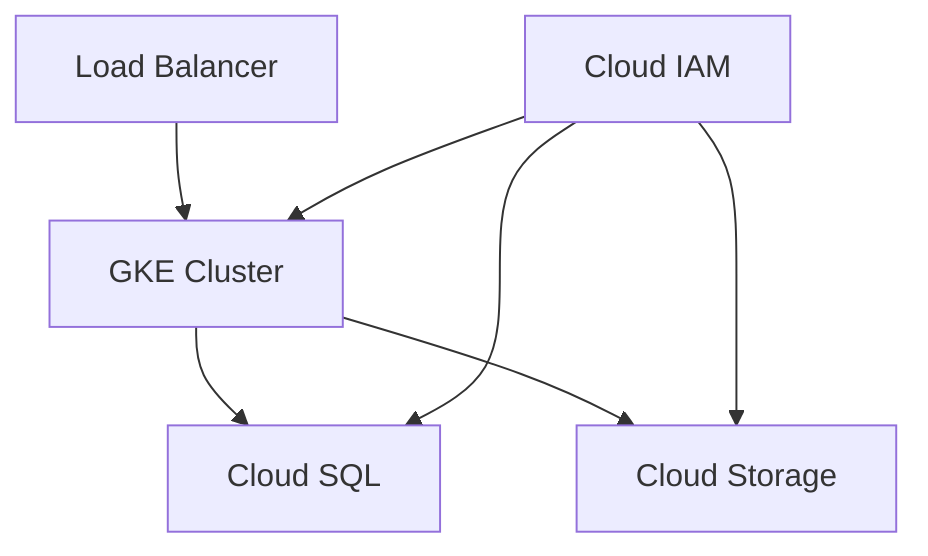

# Terraform GCP Provider

## Introduction

The Terraform Google Cloud Provider serves as the bridge between Terraform's infrastructure as code capabilities and Google Cloud Platform's extensive suite of services. This provider enables you to programmatically manage your GCP resources using Terraform's declarative configuration language, allowing for consistent, version-controlled infrastructure deployment.

In this guide, we'll explore how to set up and use the GCP Provider with Terraform to create, manage, and destroy Google Cloud resources. By the end of this tutorial, you'll be equipped with the knowledge to automate your GCP infrastructure deployments using Terraform.

## Setting Up the GCP Provider

### Prerequisites

Before you can use the Terraform GCP Provider, you'll need:

1. Terraform installed on your local machine
2. A Google Cloud Platform account
3. Google Cloud SDK (gcloud) installed
4. A GCP project with billing enabled

### Provider Configuration

To begin using the GCP Provider, you need to add it to your Terraform configuration. Create a new file called `provider.tf` and add the following code:

```hcl
terraform {
  required_providers {
    google = {
      source  = "hashicorp/google"
      version = "~> 4.80.0"
    }
  }
}

provider "google" {
  project = "your-gcp-project-id"
  region  = "us-central1"
  zone    = "us-central1-a"
}
```

This configuration specifies that we're using the Google provider from HashiCorp's provider registry. The `project`, `region`, and `zone` parameters tell Terraform which GCP project and location to target for resource creation.

### Authentication Methods

There are several ways to authenticate with GCP:

#### 1. Service Account Keys (Development Environments)

For development work, you can download a service account key file and point Terraform to it:

```hcl
provider "google" {
  credentials = file("path/to/service-account-key.json")
  project     = "your-gcp-project-id"
  region      = "us-central1"
  zone        = "us-central1-a"
}
```

#### 2. Application Default Credentials (Recommended)

For a more secure approach, you can use Application Default Credentials (ADC):

```bash
gcloud auth application-default login
```

Then simplify your provider configuration:

```hcl
provider "google" {
  project = "your-gcp-project-id"
  region  = "us-central1"
  zone    = "us-central1-a"
}
```

#### 3. Workload Identity (Production Environments)

For production environments, especially when running Terraform in GCP itself (like Cloud Build), Workload Identity is recommended:

```hcl
provider "google" {
  # No credentials specified - will use Workload Identity
  project = "your-gcp-project-id"
  region  = "us-central1"
  zone    = "us-central1-a"
}
```

## Your First GCP Resource

Let's create a simple Virtual Machine instance in GCP. Create a file called `main.tf`:

```hcl
resource "google_compute_instance" "example_vm" {
  name         = "terraform-example-vm"
  machine_type = "e2-micro"
  zone         = "us-central1-a"

  boot_disk {
    initialize_params {
      image = "debian-cloud/debian-11"
    }
  }

  network_interface {
    network = "default"
    access_config {
      // Ephemeral public IP
    }
  }

  metadata_startup_script = "echo 'Hello, World!' > /var/www/html/index.html"

  tags = ["http-server"]
}
```

To apply this configuration:

```bash
terraform init
terraform plan
terraform apply
```

**Output:**
```
...
google_compute_instance.example_vm: Creating...
google_compute_instance.example_vm: Still creating... [10s elapsed]
google_compute_instance.example_vm: Still creating... [20s elapsed]
google_compute_instance.example_vm: Creation complete after 25s [id=projects/your-gcp-project-id/zones/us-central1-a/instances/terraform-example-vm]

Apply complete! Resources: 1 added, 0 changed, 0 destroyed.
```

## Core GCP Resources

Let's look at some common GCP resources you can manage with Terraform:

### Storage Bucket

```hcl
resource "google_storage_bucket" "static_website" {
  name          = "my-unique-website-bucket-name"
  location      = "US"
  force_destroy = true

  website {
    main_page_suffix = "index.html"
    not_found_page   = "404.html"
  }

  uniform_bucket_level_access = true
}
```

### Cloud SQL Database

```hcl
resource "google_sql_database_instance" "postgres" {
  name             = "postgres-instance"
  database_version = "POSTGRES_14"
  region           = "us-central1"

  settings {
    tier = "db-f1-micro"
    
    backup_configuration {
      enabled = true
    }
  }

  deletion_protection = false  # Set to true for production
}

resource "google_sql_database" "database" {
  name     = "my-database"
  instance = google_sql_database_instance.postgres.name
}
```

### VPC Network and Firewall

```hcl
resource "google_compute_network" "vpc_network" {
  name                    = "terraform-network"
  auto_create_subnetworks = false
}

resource "google_compute_subnetwork" "subnet" {
  name          = "terraform-subnet"
  ip_cidr_range = "10.0.0.0/24"
  region        = "us-central1"
  network       = google_compute_network.vpc_network.id
}

resource "google_compute_firewall" "allow_http" {
  name    = "allow-http"
  network = google_compute_network.vpc_network.id

  allow {
    protocol = "tcp"
    ports    = ["80"]
  }

  source_ranges = ["0.0.0.0/0"]
  target_tags   = ["http-server"]
}
```

## Working with Terraform Modules

For complex infrastructures, Terraform modules help organize your code. GCP has many community-maintained modules available.

Here's an example using the Google Cloud Storage module:

```hcl
module "gcs_buckets" {
  source  = "terraform-google-modules/cloud-storage/google"
  version = "~> 3.4.0"
  
  project_id  = "your-gcp-project-id"
  names       = ["first-bucket", "second-bucket"]
  prefix      = "terraform-demo"
  location    = "us-central1"
  versioning  = {
    first-bucket  = true
    second-bucket = false
  }
}
```

## Advanced Provider Configuration

### Provider Aliasing

You can define multiple provider configurations to manage resources across different GCP projects or regions:

```hcl
provider "google" {
  project = "primary-project-id"
  region  = "us-central1"
}

provider "google" {
  alias   = "europe"
  project = "secondary-project-id"
  region  = "europe-west1"
}

resource "google_compute_instance" "us_instance" {
  name         = "us-instance"
  machine_type = "e2-micro"
  zone         = "us-central1-a"
  # Uses default provider
}

resource "google_compute_instance" "eu_instance" {
  provider     = google.europe
  name         = "eu-instance"
  machine_type = "e2-micro"
  zone         = "europe-west1-b"
}
```

### Terraform Backend Configuration

For team collaboration, you can store your Terraform state in a GCS bucket:

```hcl
terraform {
  backend "gcs" {
    bucket = "terraform-state-bucket"
    prefix = "terraform/state"
  }

  required_providers {
    google = {
      source  = "hashicorp/google"
      version = "~> 4.80.0"
    }
  }
}
```

## Real-World Example: Three-Tier Web Application

Let's put everything together in a real-world scenario for a three-tier web application:



First, create a `main.tf` file:

```hcl
# Create VPC Network
resource "google_compute_network" "vpc" {
  name                    = "webapp-network"
  auto_create_subnetworks = false
}

resource "google_compute_subnetwork" "subnet" {
  name          = "webapp-subnet"
  ip_cidr_range = "10.2.0.0/16"
  region        = "us-central1"
  network       = google_compute_network.vpc.id
}

# Create GKE Cluster
resource "google_container_cluster" "primary" {
  name     = "webapp-gke-cluster"
  location = "us-central1"
  
  # We can't create a cluster with no node pool defined, but we want to only use
  # separately managed node pools. So we create the smallest possible default
  # node pool and immediately delete it.
  remove_default_node_pool = true
  initial_node_count       = 1

  network    = google_compute_network.vpc.name
  subnetwork = google_compute_subnetwork.subnet.name
}

resource "google_container_node_pool" "primary_preemptible_nodes" {
  name       = "webapp-node-pool"
  location   = "us-central1"
  cluster    = google_container_cluster.primary.name
  node_count = 3

  node_config {
    preemptible  = true
    machine_type = "e2-medium"

    # Google recommends custom service accounts with minimal permissions
    service_account = google_service_account.gke_sa.email
    oauth_scopes    = [
      "https://www.googleapis.com/auth/cloud-platform"
    ]
  }
}

# Database
resource "google_sql_database_instance" "postgres" {
  name             = "webapp-db-instance"
  database_version = "POSTGRES_14"
  region           = "us-central1"

  settings {
    tier = "db-f1-micro"
    
    ip_configuration {
      ipv4_enabled    = false
      private_network = google_compute_network.vpc.id
    }
  }

  deletion_protection = false
}

resource "google_sql_database" "database" {
  name     = "webapp-database"
  instance = google_sql_database_instance.postgres.name
}

# Storage bucket for static assets
resource "google_storage_bucket" "static_assets" {
  name          = "webapp-static-assets-${random_id.bucket_suffix.hex}"
  location      = "US"
  force_destroy = true

  uniform_bucket_level_access = true
}

resource "random_id" "bucket_suffix" {
  byte_length = 4
}

# Service account for GKE
resource "google_service_account" "gke_sa" {
  account_id   = "gke-service-account"
  display_name = "GKE Service Account"
}

resource "google_project_iam_member" "gke_sa_roles" {
  for_each = toset([
    "roles/logging.logWriter",
    "roles/monitoring.metricWriter",
    "roles/storage.objectViewer",
    "roles/cloudsql.client"
  ])
  
  project = "your-gcp-project-id"
  role    = each.value
  member  = "serviceAccount:${google_service_account.gke_sa.email}"
}

# Load Balancer
resource "google_compute_global_address" "default" {
  name = "webapp-lb-ip"
}

# Output the important information
output "kubernetes_cluster_name" {
  value = google_container_cluster.primary.name
}

output "kubernetes_cluster_host" {
  value = google_container_cluster.primary.endpoint
}

output "db_instance_connection_name" {
  value = google_sql_database_instance.postgres.connection_name
}

output "static_bucket_url" {
  value = google_storage_bucket.static_assets.url
}

output "load_balancer_ip" {
  value = google_compute_global_address.default.address
}
```

## Terraform State Management

When working with Terraform and GCP, properly managing your state is crucial. Here are best practices:

1. **Remote State Storage**: Store state in GCS
2. **State Locking**: Prevent concurrent modifications 
3. **Workspaces**: Manage multiple environments

Example GCS backend configuration:

```hcl
terraform {
  backend "gcs" {
    bucket = "terraform-state-bucket-name"
    prefix = "terraform/state"
  }
}
```

To set up a GCS bucket for state storage:

```hcl
resource "google_storage_bucket" "terraform_state" {
  name          = "terraform-state-${var.project_id}"
  location      = "US"
  force_destroy = false

  versioning {
    enabled = true
  }

  uniform_bucket_level_access = true
}
```

## Terraform Import

You can import existing GCP resources into Terraform management. First, define the resource in your configuration:

```hcl
resource "google_compute_instance" "existing_vm" {
  name         = "existing-vm"
  machine_type = "e2-medium"
  zone         = "us-central1-a"
  
  # Other attributes will be filled in after import
}
```

Then import the resource:

```bash
terraform import google_compute_instance.existing_vm projects/your-gcp-project-id/zones/us-central1-a/instances/existing-vm
```

## Best Practices

1. **Use Variables**: Parameterize your configurations
   ```hcl
   variable "project_id" {
     description = "The ID of the GCP project"
     type        = string
   }
   
   variable "region" {
     description = "The region to deploy resources"
     type        = string
     default     = "us-central1"
   }
   ```

2. **Output Important Values**: Expose configuration values
   ```hcl
   output "vm_ip_address" {
     value = google_compute_instance.example_vm.network_interface[0].access_config[0].nat_ip
   }
   ```

3. **Use Data Sources**: Reference existing resources
   ```hcl
   data "google_compute_network" "default" {
     name = "default"
   }
   ```

4. **Tag Resources**: Add metadata for organization
   ```hcl
   resource "google_compute_instance" "vm" {
     # ...
     labels = {
       environment = "dev"
       team        = "infrastructure"
       application = "webserver"
     }
   }
   ```

5. **Use Modules**: Reuse code blocks
   ```hcl
   module "vpc" {
     source  = "terraform-google-modules/network/google//modules/vpc"
     version = "~> 7.0"
     
     project_id   = var.project_id
     network_name = "custom-vpc"
     routing_mode = "GLOBAL"
   }
   ```

## Summary

The Terraform GCP Provider offers a powerful way to manage your Google Cloud infrastructure as code. In this guide