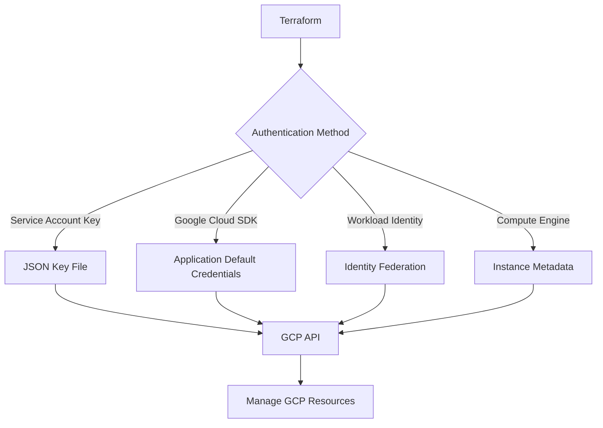

# Terraform GCP Authentication

## Introduction

When working with Terraform to manage Google Cloud Platform (GCP) resources, proper authentication is a crucial first step. Authentication ensures that Terraform has the necessary permissions to create, modify, and delete resources in your GCP environment. In this guide, we'll explore different methods of authenticating Terraform with GCP, their pros and cons, and provide step-by-step instructions for each approach.

## Why Authentication Matters

Before diving into the authentication methods, it's important to understand why proper authentication is critical:

- **Security**: Ensures only authorized tools and users can access your cloud resources
- **Access Control**: Provides appropriate permissions based on the principle of least privilege
- **Auditability**: Allows tracking of who (or which service) made changes to your infrastructure

## Authentication Methods

There are several ways to authenticate Terraform with GCP. Let's explore each method:

### 1. Service Account Keys

Service account keys are the most common way to authenticate Terraform with GCP, especially for automated pipelines.

#### Step 1: Create a Service Account

```bash
# Create a service account
gcloud iam service-accounts create terraform-sa \
  --display-name="Terraform Service Account"

# Get your project ID
PROJECT_ID=$(gcloud config get-value project)

# Grant the necessary roles to the service account
gcloud projects add-iam-policy-binding $PROJECT_ID \
  --member="serviceAccount:terraform-sa@$PROJECT_ID.iam.gserviceaccount.com" \
  --role="roles/editor"
```

#### Step 2: Generate a Service Account Key

```bash
# Create and download the key file
gcloud iam service-accounts keys create terraform-sa-key.json \
  --iam-account=terraform-sa@$PROJECT_ID.iam.gserviceaccount.com
```

#### Step 3: Configure Terraform to Use the Key

In your Terraform configuration file (`main.tf`):

```hcl
provider "google" {
  credentials = file("terraform-sa-key.json")
  project     = "your-project-id"
  region      = "us-central1"
  zone        = "us-central1-a"
}
```

Alternatively, you can set the environment variable:

```bash
export GOOGLE_APPLICATION_CREDENTIALS="path/to/terraform-sa-key.json"
```

Then your Terraform configuration simplifies to:

```hcl
provider "google" {
  project = "your-project-id"
  region  = "us-central1"
  zone    = "us-central1-a"
}
```

**Pros**:
- Works in any environment
- Easy to set up
- Perfect for CI/CD pipelines

**Cons**:
- Security risk if key file is not properly secured
- Needs key rotation for better security

### 2. Google Cloud SDK Authentication

If you're running Terraform on your local machine and have Google Cloud SDK installed, you can leverage the SDK's authentication.

#### Step 1: Install and Initialize Google Cloud SDK

Follow the [official installation guide](https://cloud.google.com/sdk/docs/install) for your operating system.

#### Step 2: Authenticate with GCP

```bash
# Log in to GCP
gcloud auth login

# Set the active project
gcloud config set project your-project-id

# Create application default credentials
gcloud auth application-default login
```

#### Step 3: Configure Terraform

In your Terraform configuration file:

```hcl
provider "google" {
  project = "your-project-id"
  region  = "us-central1"
  zone    = "us-central1-a"
}
```

**Pros**:
- No need to manage service account keys
- Convenient for local development
- Uses your own user credentials and permissions

**Cons**:
- Not suitable for automated environments
- Credentials expire and need to be refreshed

### 3. Workload Identity Federation

For production environments and especially for CI/CD pipelines running outside GCP (like GitHub Actions), Workload Identity Federation provides a more secure alternative to service account keys.

#### Step 1: Create a Workload Identity Pool

```bash
# Create a workload identity pool
gcloud iam workload-identity-pools create "terraform-pool" \
  --project="${PROJECT_ID}" \
  --location="global" \
  --display-name="Terraform Workload Identity Pool"

# Get the workload identity pool ID
POOL_ID=$(gcloud iam workload-identity-pools describe "terraform-pool" \
  --project="${PROJECT_ID}" \
  --location="global" \
  --format="value(name)")
```

#### Step 2: Create a Workload Identity Provider

For GitHub Actions:

```bash
# Create a workload identity provider for GitHub
gcloud iam workload-identity-pools providers create-oidc "github-provider" \
  --project="${PROJECT_ID}" \
  --location="global" \
  --workload-identity-pool="terraform-pool" \
  --display-name="GitHub provider" \
  --attribute-mapping="google.subject=assertion.sub,attribute.actor=assertion.actor,attribute.repository=assertion.repository" \
  --issuer-uri="https://token.actions.githubusercontent.com"
```

#### Step 3: Create a Service Account and Grant Access

```bash
# Create a service account
gcloud iam service-accounts create "terraform-github-sa" \
  --project="${PROJECT_ID}" \
  --display-name="Terraform GitHub Service Account"

# Add IAM policy binding
gcloud iam service-accounts add-iam-policy-binding "terraform-github-sa@${PROJECT_ID}.iam.gserviceaccount.com" \
  --project="${PROJECT_ID}" \
  --role="roles/iam.workloadIdentityUser" \
  --member="principalSet://iam.googleapis.com/${POOL_ID}/attribute.repository/YOUR-ORG/YOUR-REPO"

# Grant necessary permissions
gcloud projects add-iam-policy-binding "${PROJECT_ID}" \
  --member="serviceAccount:terraform-github-sa@${PROJECT_ID}.iam.gserviceaccount.com" \
  --role="roles/editor"
```

#### Step 4: Configure GitHub Actions Workflow

```yaml
name: Terraform Apply

on:
  push:
    branches:
      - main

jobs:
  terraform:
    runs-on: ubuntu-latest
    permissions:
      contents: read
      id-token: write

    steps:
      - name: Checkout code
        uses: actions/checkout@v3

      - name: Authenticate to Google Cloud
        id: auth
        uses: google-github-actions/auth@v1
        with:
          workload_identity_provider: projects/123456789/locations/global/workloadIdentityPools/terraform-pool/providers/github-provider
          service_account: terraform-github-sa@your-project-id.iam.gserviceaccount.com

      - name: Setup Terraform
        uses: hashicorp/setup-terraform@v2

      - name: Terraform Init
        run: terraform init

      - name: Terraform Apply
        run: terraform apply -auto-approve
```

**Pros**:
- No service account keys to manage
- Enhanced security
- Ideal for CI/CD pipelines
- Short-lived credentials

**Cons**:
- More complex setup
- Requires familiarity with IAM and workload identity concepts

### 4. Compute Engine Default Service Account

If you run Terraform on Compute Engine, Cloud Functions, or other GCP services, you can use the default service account.

#### Step 1: Create a Compute Engine VM

Create a VM instance with the appropriate service account or permissions.

#### Step 2: Configure Terraform

On the VM, your Terraform configuration will be simple:

```hcl
provider "google" {
  project = "your-project-id"
  region  = "us-central1"
  zone    = "us-central1-a"
}
```

Terraform will automatically use the VM's service account credentials.

**Pros**:
- No manual authentication required
- Credentials are managed by GCP
- Clean and simple setup

**Cons**:
- Only works within GCP
- Might require additional IAM configuration

## Authentication Flow

Here's a visual representation of how Terraform authenticates with GCP:



## Best Practices for GCP Authentication

1. **Use the Principle of Least Privilege**
   - Only grant the permissions needed for Terraform to perform its tasks
   - Create custom roles instead of using broad predefined roles like "Editor"

   ```bash
   # Create a custom role with specific permissions
   gcloud iam roles create terraformCustomRole \
     --project=$PROJECT_ID \
     --title="Terraform Custom Role" \
     --permissions=compute.instances.create,compute.instances.delete,compute.instances.get
   ```

2. **Rotate Service Account Keys Regularly**
   - If using service account keys, set up a rotation schedule
   - Automate key rotation when possible

   ```bash
   # Generate a new key
   gcloud iam service-accounts keys create new-key.json \
     --iam-account=terraform-sa@$PROJECT_ID.iam.gserviceaccount.com

   # Update your CI/CD system with the new key
   # Then delete the old key
   gcloud iam service-accounts keys delete KEY_ID \
     --iam-account=terraform-sa@$PROJECT_ID.iam.gserviceaccount.com
   ```

3. **Use Workload Identity Federation for CI/CD**
   - Avoid storing service account keys in CI/CD systems
   - Configure workload identity federation for secure authentication

4. **Separate Environments with Different Service Accounts**
   - Use different service accounts for development, staging, and production
   - Implement strict controls on production environments

   ```hcl
   # Example of using different providers for different environments
   provider "google" {
     alias       = "dev"
     credentials = file("dev-sa-key.json")
     project     = "dev-project-id"
   }

   provider "google" {
     alias       = "prod"
     credentials = file("prod-sa-key.json")
     project     = "prod-project-id"
   }
   ```

5. **Secure Storage of Credentials**
   - Use secrets management solutions (HashiCorp Vault, GCP Secret Manager)
   - Never commit credentials to version control

   ```bash
   # Store credentials in Secret Manager
   gcloud secrets create terraform-sa-key \
     --data-file=terraform-sa-key.json

   # Retrieve credentials when needed
   gcloud secrets versions access latest --secret=terraform-sa-key > terraform-sa-key.json
   ```

## Real-World Example: Setting Up a Complete Project

Let's put everything together in a real-world example. We'll create a GCP project, set up authentication, and deploy a simple VM using Terraform.

### Step 1: Project Setup

```bash
# Create a new project
gcloud projects create my-terraform-project --name="My Terraform Project"

# Set the project as active
gcloud config set project my-terraform-project

# Enable required APIs
gcloud services enable compute.googleapis.com
gcloud services enable iam.googleapis.com
```

### Step 2: Service Account Creation

```bash
# Create a service account
gcloud iam service-accounts create terraform-deployer \
  --display-name="Terraform Deployer"

# Grant necessary permissions
gcloud projects add-iam-policy-binding my-terraform-project \
  --member="serviceAccount:terraform-deployer@my-terraform-project.iam.gserviceaccount.com" \
  --role="roles/compute.admin"

gcloud projects add-iam-policy-binding my-terraform-project \
  --member="serviceAccount:terraform-deployer@my-terraform-project.iam.gserviceaccount.com" \
  --role="roles/iam.serviceAccountUser"

# Create and download service account key
gcloud iam service-accounts keys create terraform-deployer-key.json \
  --iam-account=terraform-deployer@my-terraform-project.iam.gserviceaccount.com
```

### Step 3: Terraform Configuration

Create a directory for your Terraform project and add the following files:

**main.tf**:
```hcl
provider "google" {
  credentials = file("terraform-deployer-key.json")
  project     = "my-terraform-project"
  region      = "us-central1"
  zone        = "us-central1-a"
}

resource "google_compute_instance" "vm_instance" {
  name         = "terraform-instance"
  machine_type = "e2-micro"

  boot_disk {
    initialize_params {
      image = "debian-cloud/debian-11"
    }
  }

  network_interface {
    network = "default"
    access_config {
      // Ephemeral IP
    }
  }

  metadata_startup_script = "echo 'Hello, World!' > /var/www/html/index.html"

  tags = ["web-server"]
}

output "ip" {
  value = google_compute_instance.vm_instance.network_interface[0].access_config[0].nat_ip
}
```

**versions.tf**:
```hcl
terraform {
  required_providers {
    google = {
      source  = "hashicorp/google"
      version = "~> 4.0"
    }
  }
  required_version = ">= 1.0.0"
}
```

### Step 4: Deploy with Terraform

```bash
# Initialize Terraform
terraform init

# Plan the deployment
terraform plan

# Apply the changes
terraform apply
```

## Troubleshooting Common Authentication Issues

| Issue | Possible Cause | Solution |
|-------|---------------|----------|
| `Error: Credentials not found` | Environment variable not set or file path incorrect | Check `GOOGLE_APPLICATION_CREDENTIALS` environment variable or credentials file path |
| `Error: Permission denied` | Insufficient IAM permissions | Grant necessary roles to the service account |
| `Error: Could not find default credentials` | SDK not authenticated | Run `gcloud auth application-default login` |
| `Error: Access token expired` | Token expiration | Re-authenticate or ensure token refresh works |
| `Error: Project not specified` | Project ID missing | Set project ID in provider block or environment variable |

## Summary

In this guide, we've explored various methods to authenticate Terraform with Google Cloud Platform:

1. **Service Account Keys**: The traditional method using JSON key files
2. **Google Cloud SDK**: Using application default credentials for local development
3. **Workload Identity Federation**: A more secure approach for CI/CD pipelines
4. **Compute Engine Default Service Account**: Simplified authentication within GCP

Remember to follow best practices for managing credentials and permissions to keep your infrastructure secure. The right authentication method depends on your specific use case, environment, and security requirements.

## Additional Resources

- [Terraform Google Provider Documentation](https://registry.terraform.io/providers/hashicorp/google/latest/docs)
- [GCP IAM Documentation](https://cloud.google.com/iam/docs)
- [Workload Identity Federation](https://cloud.google.com/iam/docs/workload-identity-federation)

## Exercises

1. Create a service account with the minimum permissions needed to deploy a Cloud Storage bucket.
2. Set up a GitHub Actions workflow using Workload Identity Federation to deploy a simple GCP resource.
3. Create a Terraform module that accepts different authentication methods based on input variables.
4. Implement a key rotation schedule for a service account using Terraform.
5. Configure a custom IAM role with only the permissions required for your specific Terraform deployment.