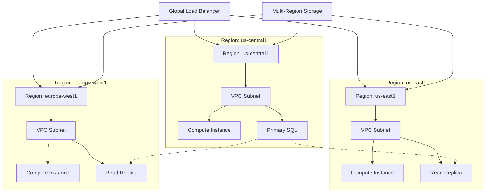

# Terraform GCP Multi-Region

## Introduction

When building production-ready applications on Google Cloud Platform (GCP), deploying your infrastructure across multiple regions is a critical best practice for achieving high availability and fault tolerance. Multi-region deployments protect your applications from region-specific failures, reduce latency for globally distributed users, and help meet compliance requirements for data sovereignty.

Terraform, with its declarative approach to infrastructure as code, makes it significantly easier to manage complex multi-region deployments on GCP. In this guide, we'll explore how to effectively use Terraform to create, manage, and maintain GCP resources across multiple regions.

## Why Multi-Region Deployments?

Before diving into the implementation, let's understand the key benefits of multi-region architectures:

1. **High Availability**: If one region experiences an outage, your application can continue running in other regions
2. **Disaster Recovery**: Geographic separation provides protection against natural disasters and regional failures
3. **Reduced Latency**: Serving users from the closest region improves application performance
4. **Data Sovereignty**: Meeting regulatory requirements by keeping data within specific geographic boundaries
5. **Load Distribution**: Distributing traffic across regions for better resource utilization

## Prerequisites

To follow along with this guide, you'll need:

- Terraform installed (version 1.0.0+)
- Google Cloud SDK installed and configured
- A GCP project with billing enabled
- Basic understanding of Terraform and GCP concepts

## Project Structure

For a multi-region deployment, organizing your Terraform code properly is essential. Here's a recommended project structure:

```
terraform-gcp-multi-region/
├── main.tf           # Main configuration file
├── variables.tf      # Input variables
├── outputs.tf        # Output values
├── providers.tf      # Provider configuration
├── modules/
│   ├── networking/   # Networking resources
│   ├── compute/      # Compute resources
│   └── storage/      # Storage resources
└── environments/
    ├── dev/          # Development environment
    ├── staging/      # Staging environment
    └── prod/         # Production environment
```

## Setting Up the Provider

First, let's configure the GCP provider in `providers.tf`:

```hcl
terraform {
  required_providers {
    google = {
      source  = "hashicorp/google"
      version = "~> 4.75.0"
    }
  }
  required_version = ">= 1.0.0"
}

provider "google" {
  project = var.project_id
  region  = var.default_region
}
```

## Defining Variables

In `variables.tf`, we'll define the regions and other parameters:

```hcl
variable "project_id" {
  description = "The GCP project ID"
  type        = string
}

variable "default_region" {
  description = "The default GCP region for resources"
  type        = string
  default     = "us-central1"
}

variable "regions" {
  description = "List of GCP regions for multi-region deployment"
  type        = list(string)
  default     = ["us-central1", "us-east1", "europe-west1"]
}

variable "environment" {
  description = "Deployment environment (dev, staging, prod)"
  type        = string
  default     = "dev"
}

variable "app_name" {
  description = "Name of the application"
  type        = string
  default     = "my-app"
}
```

## Creating Multi-Region VPC Network

Let's start by creating a global VPC network with subnets in each region:

```hcl
# In main.tf
resource "google_compute_network" "vpc_network" {
  name                    = "${var.app_name}-network-${var.environment}"
  auto_create_subnetworks = false
}

resource "google_compute_subnetwork" "subnets" {
  for_each      = toset(var.regions)
  name          = "${var.app_name}-subnet-${each.key}-${var.environment}"
  ip_cidr_range = "10.${index(var.regions, each.key) + 1}.0.0/20"
  region        = each.key
  network       = google_compute_network.vpc_network.id
}
```

The `for_each` loop creates a subnet in each region with a different CIDR block.

## Multi-Region Compute Instances

Now, let's deploy compute instances across regions:

```hcl
resource "google_compute_instance" "app_servers" {
  for_each     = toset(var.regions)
  name         = "${var.app_name}-server-${each.key}-${var.environment}"
  machine_type = "e2-medium"
  zone         = "${each.key}-b" # Using zone b in each region

  boot_disk {
    initialize_params {
      image = "debian-cloud/debian-11"
    }
  }

  network_interface {
    subnetwork = google_compute_subnetwork.subnets[each.key].self_link
    
    access_config {
      // Ephemeral public IP
    }
  }

  metadata_startup_script = <<-EOF
    #!/bin/bash
    apt-get update
    apt-get install -y nginx
    echo "Welcome to ${var.app_name} in region ${each.key}!" > /var/www/html/index.html
  EOF

  tags = ["http-server", "${var.environment}", "${each.key}"]
}
```

## Setting Up Load Balancing

To distribute traffic across our multi-region deployment, we'll create a global HTTP load balancer:

```hcl
# Create instance groups for each region
resource "google_compute_instance_group" "app_groups" {
  for_each  = toset(var.regions)
  name      = "${var.app_name}-instance-group-${each.key}"
  zone      = "${each.key}-b"
  instances = [google_compute_instance.app_servers[each.key].self_link]

  named_port {
    name = "http"
    port = 80
  }
}

# Health check
resource "google_compute_health_check" "http_health_check" {
  name               = "${var.app_name}-http-health-check"
  check_interval_sec = 5
  timeout_sec        = 5
  http_health_check {
    port = 80
  }
}

# Backend service
resource "google_compute_backend_service" "app_backend" {
  name                  = "${var.app_name}-backend-service"
  protocol              = "HTTP"
  port_name             = "http"
  health_checks         = [google_compute_health_check.http_health_check.id]
  load_balancing_scheme = "EXTERNAL"

  dynamic "backend" {
    for_each = google_compute_instance_group.app_groups
    content {
      group = backend.value.self_link
    }
  }
}

# URL map
resource "google_compute_url_map" "app_url_map" {
  name            = "${var.app_name}-url-map"
  default_service = google_compute_backend_service.app_backend.id
}

# HTTP proxy
resource "google_compute_target_http_proxy" "app_http_proxy" {
  name    = "${var.app_name}-http-proxy"
  url_map = google_compute_url_map.app_url_map.id
}

# Global forwarding rule (the actual load balancer)
resource "google_compute_global_forwarding_rule" "app_forwarding_rule" {
  name       = "${var.app_name}-forwarding-rule"
  target     = google_compute_target_http_proxy.app_http_proxy.id
  port_range = "80"
}
```

## Multi-Region Cloud Storage

For data storage, let's create a multi-regional Cloud Storage bucket:

```hcl
resource "google_storage_bucket" "multi_region_bucket" {
  name          = "${var.project_id}-${var.app_name}-${var.environment}"
  location      = "US" # Multi-region location (US, EU, or ASIA)
  storage_class = "STANDARD"

  uniform_bucket_level_access = true

  versioning {
    enabled = true
  }

  lifecycle_rule {
    condition {
      age = 30
    }
    action {
      type = "SetStorageClass"
      storage_class = "NEARLINE"
    }
  }
}
```

## Firewall Rules

Let's add firewall rules to allow HTTP traffic to our instances:

```hcl
resource "google_compute_firewall" "allow_http" {
  name    = "${var.app_name}-allow-http"
  network = google_compute_network.vpc_network.name

  allow {
    protocol = "tcp"
    ports    = ["80"]
  }

  source_ranges = ["0.0.0.0/0"]
  target_tags   = ["http-server"]
}
```

## Multi-Region Cloud SQL (For High Availability)

For database high availability across regions, we can set up Cloud SQL with read replicas:

```hcl
resource "google_sql_database_instance" "primary" {
  name             = "${var.app_name}-db-primary-${var.environment}"
  database_version = "POSTGRES_14"
  region           = var.default_region

  settings {
    tier = "db-f1-micro"
    availability_type = "REGIONAL" # High availability within region

    backup_configuration {
      enabled            = true
      binary_log_enabled = true # Required for replication
    }
  }

  deletion_protection = true # Prevent accidental deletion
}

# Read replicas in other regions
resource "google_sql_database_instance" "replicas" {
  for_each = toset([for r in var.regions : r if r != var.default_region])
  
  name             = "${var.app_name}-db-replica-${each.key}-${var.environment}"
  database_version = "POSTGRES_14"
  region           = each.key
  
  master_instance_name = google_sql_database_instance.primary.name

  settings {
    tier = "db-f1-micro"
    
    # These are replica-specific settings
    database_flags {
      name  = "max_connections"
      value = "100"
    }
  }

  deletion_protection = true
}
```

## Visualizing the Multi-Region Architecture

Let's create a diagram to visualize our multi-region architecture:



## Outputs

Finally, let's define outputs to display important information about our infrastructure:

```hcl
# In outputs.tf
output "load_balancer_ip" {
  description = "Public IP address of the global load balancer"
  value       = google_compute_global_forwarding_rule.app_forwarding_rule.ip_address
}

output "instance_ips" {
  description = "Public IP addresses of instances by region"
  value = {
    for region, instance in google_compute_instance.app_servers :
    region => instance.network_interface[0].access_config[0].nat_ip
  }
}

output "database_connection_names" {
  description = "Connection names for the database instances"
  value = {
    primary = google_sql_database_instance.primary.connection_name
    replicas = {
      for region, replica in google_sql_database_instance.replicas :
      region => replica.connection_name
    }
  }
}

output "storage_bucket_url" {
  description = "URL of the multi-region storage bucket"
  value       = google_storage_bucket.multi_region_bucket.url
}
```

## Deployment Instructions

To deploy this infrastructure:

1. Initialize Terraform:
   ```bash
   terraform init
   ```

2. Create a terraform.tfvars file with your specific values:
   ```hcl
   project_id     = "your-project-id"
   default_region = "us-central1"
   regions        = ["us-central1", "us-east1", "europe-west1"]
   environment    = "dev"
   app_name       = "my-app"
   ```

3. Review the plan:
   ```bash
   terraform plan
   ```

4. Apply the configuration:
   ```bash
   terraform apply
   ```

## Advanced Multi-Region Considerations

### Regional IAM Policies

You can apply different IAM policies by region for data sovereignty:

```hcl
resource "google_project_iam_binding" "regional_admin_eu" {
  project = var.project_id
  role    = "roles/compute.admin"
  
  members = [
    "user:eu-admin@example.com",
  ]
  
  condition {
    title       = "Europe Admin Access"
    description = "Grants admin access only to EU resources"
    expression  = "resource.name.startsWith('projects/${var.project_id}/zones/europe-')"
  }
}
```

### Disaster Recovery Planning

Create disaster recovery plans with Terraform by defining backend failover configurations:

```hcl
resource "google_compute_region_backend_service" "failover_backend" {
  name                  = "${var.app_name}-failover-backend"
  region                = var.default_region
  health_checks         = [google_compute_health_check.http_health_check.id]
  failover_policy {
    disable_connection_drain_on_failover = true
    drop_traffic_if_unhealthy            = true
    failover_ratio                       = 0.5
  }
  
  backend {
    group = google_compute_instance_group.app_groups[var.regions[0]].self_link
    failover = false
  }
  
  backend {
    group = google_compute_instance_group.app_groups[var.regions[1]].self_link
    failover = true
  }
}
```

## Cost Optimization

Multi-region deployments can be expensive. Here are some Terraform configurations to help optimize costs:

```hcl
# Use preemptible instances for non-critical workloads
resource "google_compute_instance" "preemptible_instances" {
  for_each     = toset(var.regions)
  name         = "${var.app_name}-preemptible-${each.key}"
  machine_type = "e2-medium"
  zone         = "${each.key}-b"
  
  scheduling {
    preemptible = true
    automatic_restart = false
  }
  
  # Other configuration...
}

# Set up object lifecycle management to reduce storage costs
resource "google_storage_bucket" "lifecycle_bucket" {
  name          = "${var.project_id}-lifecycle-${var.environment}"
  location      = "US"
  
  lifecycle_rule {
    condition {
      age