# Terraform GCP Resource Types

## Introduction

Terraform, an Infrastructure as Code (IaC) tool, allows you to define cloud resources using a declarative configuration language. When working with Google Cloud Platform (GCP), Terraform provides a wide range of resource types that correspond to GCP services. Understanding these resource types is crucial for effectively managing your cloud infrastructure.

In this guide, we'll explore common GCP resource types that you can manage with Terraform, how to define them in your configuration files, and practical examples to help you get started.

## The Structure of GCP Resource Types in Terraform

In Terraform, GCP resources follow a common naming convention:

```hcl
resource "google_[service]_[resource]" "name" {
  // resource configuration
}
```

Where:
- `google_` is the provider prefix
- `[service]` is the GCP service (like compute, storage, container)
- `[resource]` is the specific resource type
- `name` is your chosen identifier for this resource within your Terraform code

## Common GCP Resource Types

Let's explore some of the most commonly used GCP resource types with examples.

### Compute Resources

#### Virtual Machines (Compute Engine)

```hcl
resource "google_compute_instance" "web_server" {
  name         = "web-server"
  machine_type = "e2-medium"
  zone         = "us-central1-a"

  boot_disk {
    initialize_params {
      image = "debian-cloud/debian-11"
    }
  }

  network_interface {
    network = "default"
    access_config {
      // Ephemeral public IP
    }
  }

  metadata_startup_script = "echo 'Hello, World!' > /var/www/html/index.html"

  tags = ["web", "http-server"]
}
```

This creates a Compute Engine VM instance with a Debian image, attaches it to the default network, and runs a simple startup script.

#### Instance Groups

```hcl
resource "google_compute_instance_template" "web_template" {
  name         = "web-template"
  machine_type = "e2-medium"

  disk {
    source_image = "debian-cloud/debian-11"
    auto_delete  = true
    boot         = true
  }

  network_interface {
    network = "default"
    access_config {
      // Ephemeral IP
    }
  }

  metadata_startup_script = "apt-get update && apt-get install -y nginx"
}

resource "google_compute_instance_group_manager" "web_igm" {
  name               = "web-igm"
  base_instance_name = "web"
  zone               = "us-central1-a"
  target_size        = 2

  version {
    instance_template = google_compute_instance_template.web_template.id
  }
}
```

This example creates an instance template and an instance group manager that maintains two identical VMs based on the template.

### Storage Resources

#### Cloud Storage Bucket

```hcl
resource "google_storage_bucket" "static_website" {
  name          = "my-static-website-bucket"
  location      = "US"
  force_destroy = true

  website {
    main_page_suffix = "index.html"
    not_found_page   = "404.html"
  }

  uniform_bucket_level_access = true
}

resource "google_storage_bucket_object" "index_page" {
  name   = "index.html"
  bucket = google_storage_bucket.static_website.name
  content = <<EOF
<!DOCTYPE html>
<html>
  <head>
    <title>Hello World</title>
  </head>
  <body>
    <h1>Hello from Terraform!</h1>
  </body>
</html>
EOF
}
```

This creates a Cloud Storage bucket configured to host a static website and uploads an index.html file to it.

### Networking Resources

#### VPC Network and Subnets

```hcl
resource "google_compute_network" "vpc_network" {
  name                    = "terraform-network"
  auto_create_subnetworks = false
}

resource "google_compute_subnetwork" "subnet" {
  name          = "terraform-subnet"
  ip_cidr_range = "10.0.1.0/24"
  region        = "us-central1"
  network       = google_compute_network.vpc_network.id
}
```

This example creates a custom VPC network without automatic subnet creation and then defines a specific subnet within the network.

#### Firewall Rules

```hcl
resource "google_compute_firewall" "allow_http" {
  name    = "allow-http"
  network = google_compute_network.vpc_network.name

  allow {
    protocol = "tcp"
    ports    = ["80"]
  }

  source_ranges = ["0.0.0.0/0"]
  target_tags   = ["http-server"]
}
```

This creates a firewall rule allowing HTTP traffic (port 80) from any source to instances with the "http-server" tag.

### Database Resources

#### Cloud SQL Instance

```hcl
resource "google_sql_database_instance" "postgres" {
  name             = "postgres-instance"
  database_version = "POSTGRES_13"
  region           = "us-central1"

  settings {
    tier = "db-f1-micro"

    backup_configuration {
      enabled = true
      start_time = "04:00"
    }
  }

  deletion_protection = false  # Set to true for production
}

resource "google_sql_database" "database" {
  name     = "my-database"
  instance = google_sql_database_instance.postgres.name
}

resource "google_sql_user" "user" {
  name     = "my-user"
  instance = google_sql_database_instance.postgres.name
  password = "changeme"  # Use secrets management in production
}
```

This creates a PostgreSQL Cloud SQL instance with a database and user. Note that in production environments, you should use Terraform's secrets management or external secrets providers for sensitive data like passwords.

### Kubernetes Resources

#### Google Kubernetes Engine (GKE) Cluster

```hcl
resource "google_container_cluster" "primary" {
  name     = "my-gke-cluster"
  location = "us-central1"

  # We can't create a cluster with no node pool defined, but we want to only use
  # separately managed node pools. So we create the smallest possible default
  # node pool and immediately delete it.
  remove_default_node_pool = true
  initial_node_count       = 1
}

resource "google_container_node_pool" "primary_preemptible_nodes" {
  name       = "my-node-pool"
  location   = "us-central1"
  cluster    = google_container_cluster.primary.name
  node_count = 1

  node_config {
    preemptible  = true
    machine_type = "e2-medium"

    # Google recommends custom service accounts that have cloud-platform scope and permissions granted via IAM Roles.
    oauth_scopes = [
      "https://www.googleapis.com/auth/cloud-platform"
    ]
  }
}
```

This creates a GKE cluster with a custom node pool using preemptible VMs.

### Identity and Access Management (IAM)

#### Service Account and Role Binding

```hcl
resource "google_service_account" "app_service_account" {
  account_id   = "app-service-account"
  display_name = "Application Service Account"
}

resource "google_project_iam_binding" "storage_objectViewer" {
  project = "your-project-id"
  role    = "roles/storage.objectViewer"

  members = [
    "serviceAccount:${google_service_account.app_service_account.email}",
  ]
}
```

This creates a service account and grants it the Storage Object Viewer role at the project level.

## Organizing Your Terraform GCP Resources

As your infrastructure grows, organizing your Terraform code becomes important. Here's a recommended structure for GCP projects:

```
project/
├── main.tf         # Main configuration file
├── variables.tf    # Input variables definition
├── outputs.tf      # Output values
├── providers.tf    # Provider configuration
├── modules/        # Reusable modules
│   ├── networking/
│   ├── compute/
│   └── storage/
└── environments/   # Environment-specific configurations
    ├── dev/
    ├── stage/
    └── prod/
```

## Practical Example: Building a Three-Tier Web Application

Let's combine several resource types to create a simplified three-tier web application:

```hcl
# Network configuration
resource "google_compute_network" "vpc" {
  name                    = "app-network"
  auto_create_subnetworks = false
}

resource "google_compute_subnetwork" "web_subnet" {
  name          = "web-subnet"
  ip_cidr_range = "10.0.1.0/24"
  region        = "us-central1"
  network       = google_compute_network.vpc.id
}

resource "google_compute_subnetwork" "app_subnet" {
  name          = "app-subnet"
  ip_cidr_range = "10.0.2.0/24"
  region        = "us-central1"
  network       = google_compute_network.vpc.id
}

resource "google_compute_subnetwork" "db_subnet" {
  name          = "db-subnet"
  ip_cidr_range = "10.0.3.0/24"
  region        = "us-central1"
  network       = google_compute_network.vpc.id
}

# Web tier - Compute instance template and managed instance group
resource "google_compute_instance_template" "web_template" {
  name_prefix  = "web-template-"
  machine_type = "e2-medium"

  disk {
    source_image = "debian-cloud/debian-11"
    auto_delete  = true
    boot         = true
  }

  network_interface {
    subnetwork = google_compute_subnetwork.web_subnet.id
    access_config {
      // Ephemeral IP
    }
  }

  metadata_startup_script = "apt-get update && apt-get install -y nginx"

  lifecycle {
    create_before_destroy = true
  }
}

resource "google_compute_instance_group_manager" "web_igm" {
  name               = "web-igm"
  base_instance_name = "web"
  zone               = "us-central1-a"
  target_size        = 2

  version {
    instance_template = google_compute_instance_template.web_template.id
  }
}

# App tier - GKE cluster
resource "google_container_cluster" "app_cluster" {
  name     = "app-cluster"
  location = "us-central1"

  network    = google_compute_network.vpc.name
  subnetwork = google_compute_subnetwork.app_subnet.name

  # Private cluster configuration
  private_cluster_config {
    enable_private_nodes    = true
    enable_private_endpoint = false
    master_ipv4_cidr_block  = "172.16.0.0/28"
  }

  ip_allocation_policy {
    cluster_ipv4_cidr_block  = "10.16.0.0/16"
    services_ipv4_cidr_block = "10.12.0.0/16"
  }

  remove_default_node_pool = true
  initial_node_count       = 1
}

resource "google_container_node_pool" "app_nodes" {
  name       = "app-node-pool"
  location   = "us-central1"
  cluster    = google_container_cluster.app_cluster.name
  node_count = 3

  node_config {
    machine_type = "e2-standard-2"
    oauth_scopes = [
      "https://www.googleapis.com/auth/cloud-platform"
    ]
  }
}

# Database tier - Cloud SQL
resource "google_sql_database_instance" "database" {
  name             = "app-database"
  database_version = "POSTGRES_13"
  region           = "us-central1"

  depends_on = [google_compute_network.vpc]

  settings {
    tier = "db-g1-small"
    ip_configuration {
      ipv4_enabled    = false
      private_network = google_compute_network.vpc.id
    }
  }

  deletion_protection = false  # Set to true for production
}

resource "google_sql_database" "app_db" {
  name     = "app-database"
  instance = google_sql_database_instance.database.name
}
```

This example combines multiple GCP resource types to create a three-tier architecture:
1. Web tier: Load-balanced VM instances running Nginx
2. Application tier: GKE cluster for containerized applications
3. Database tier: Private Cloud SQL instance

## Best Practices for GCP Resources in Terraform

1. **Use Variables for Reusable Configurations**

```hcl
variable "region" {
  description = "GCP region to deploy resources"
  default     = "us-central1"
}

variable "project_id" {
  description = "GCP project ID"
}

// Use variables in resources
resource "google_compute_instance" "instance" {
  zone = "${var.region}-a"
  // other configuration
}
```

2. **Leverage Data Sources for External Information**

```hcl
data "google_compute_image" "debian" {
  family  = "debian-11"
  project = "debian-cloud"
}

resource "google_compute_instance" "instance" {
  // ...
  boot_disk {
    initialize_params {
      image = data.google_compute_image.debian.self_link
    }
  }
}
```

3. **Use Modules for Reusable Components**

```hcl
module "vpc" {
  source  = "./modules/vpc"
  project = var.project_id
  region  = var.region
}

module "gke" {
  source       = "./modules/gke"
  project      = var.project_id
  region       = var.region
  network_name = module.vpc.network_name
}
```

## Resource Types Visualization

Here's a diagram showing the relationship between common GCP resource types:

```mermaid
graph TD
    A[Provider: google] --> B[Compute]
    A --> C[Storage]
    A --> D[Networking]
    A --> E[Databases]
    A --> F[Kubernetes]
    A --> G[IAM]
    
    B --> B1[google_compute_instance]
    B --> B2[google_compute_instance_group_manager]
    B --> B3[google_compute_disk]
    
    C --> C1[google_storage_bucket]
    C --> C2[google_storage_bucket_object]
    
    D --> D1[google_compute_network]
    D --> D2[google_compute_subnetwork]
    D --> D3[google_compute_firewall]
    D --> D4[google_compute_router]
    
    E --> E1[google_sql_database_instance]
    E --> E2[google_spanner_instance]
    E --> E3[google_bigtable_instance]
    
    F --> F1[google_container_cluster]
    F --> F2[google_container_node_pool]
    
    G --> G1[google_service_account]
    G --> G2[google_project_iam_binding]
```



## Summary

Terraform provides a