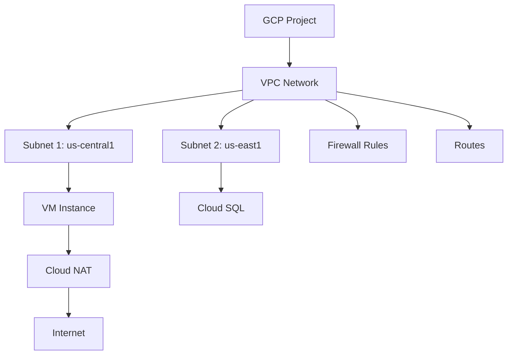

# Terraform GCP VPC

## Introduction

A Virtual Private Cloud (VPC) is one of the fundamental building blocks of cloud infrastructure. It allows you to create an isolated network where you can deploy your cloud resources securely. In Google Cloud Platform (GCP), VPC networks provide global connectivity for your resources, allowing them to communicate with each other and the internet.

In this tutorial, we'll learn how to use Terraform to create and manage VPC networks in GCP. Terraform enables us to define our infrastructure as code, making it repeatable, version-controlled, and easier to manage.

## Prerequisites

Before getting started, ensure you have:

1. A Google Cloud Platform account
2. Terraform installed on your local machine
3. Google Cloud SDK installed
4. Basic understanding of networking concepts
5. Configured Google Cloud authentication

## Understanding GCP VPC Components

Before diving into the code, let's understand the key components of a GCP VPC:

1. **VPC Network**: The main container for all networking resources
2. **Subnets**: Subdivisions of the VPC network with their own IP ranges
3. **Routes**: Define how network traffic is directed
4. **Firewall Rules**: Control what traffic is allowed in and out of your network
5. **Cloud NAT**: Allows instances without external IPs to access the internet

Here's a simple diagram showing the relationship between these components:



## Creating a Basic VPC Network with Terraform

Let's start by creating a simple VPC network with a single subnet using Terraform.

First, create a new file called `main.tf` and add the following provider configuration:

```hcl
terraform {
  required_providers {
    google = {
      source  = "hashicorp/google"
      version = "~> 4.0"
    }
  }
}

provider "google" {
  project = "your-project-id"
  region  = "us-central1"
}
```

Next, let's add the VPC network resource:

```hcl
resource "google_compute_network" "vpc_network" {
  name                    = "terraform-network"
  auto_create_subnetworks = false
  description             = "VPC Network created with Terraform"
}
```

Note the `auto_create_subnetworks = false` parameter. When set to `true`, GCP automatically creates a subnet in each region. By setting it to `false`, we're choosing to manually define our subnets.

Now, let's add a subnet:

```hcl
resource "google_compute_subnetwork" "subnet" {
  name          = "terraform-subnet"
  ip_cidr_range = "10.0.1.0/24"
  region        = "us-central1"
  network       = google_compute_network.vpc_network.id
  
  # Optional: Configure private Google access
  private_ip_google_access = true
  
  # Optional: Configure secondary IP ranges
  secondary_ip_range {
    range_name    = "services-range"
    ip_cidr_range = "10.1.0.0/16"
  }
}
```

This creates a subnet with the primary IP range `10.0.1.0/24` and a secondary IP range `10.1.0.0/16`, which is useful for services like GKE.

## Adding Firewall Rules

Next, let's add some basic firewall rules to allow SSH access and internal communication:

```hcl
# Allow SSH
resource "google_compute_firewall" "allow_ssh" {
  name    = "allow-ssh"
  network = google_compute_network.vpc_network.name

  allow {
    protocol = "tcp"
    ports    = ["22"]
  }

  source_ranges = ["0.0.0.0/0"]
  target_tags   = ["ssh"]
}

# Allow internal communication
resource "google_compute_firewall" "allow_internal" {
  name    = "allow-internal"
  network = google_compute_network.vpc_network.name

  allow {
    protocol = "icmp"
  }

  allow {
    protocol = "tcp"
    ports    = ["0-65535"]
  }

  allow {
    protocol = "udp"
    ports    = ["0-65535"]
  }

  source_ranges = ["10.0.0.0/8"]
}
```

## Setting Up Cloud NAT

If you have instances without external IPs, you can use Cloud NAT to allow them to access the internet:

```hcl
resource "google_compute_router" "router" {
  name    = "nat-router"
  region  = "us-central1"
  network = google_compute_network.vpc_network.id
}

resource "google_compute_router_nat" "nat" {
  name                               = "nat-config"
  router                             = google_compute_router.router.name
  region                             = google_compute_router.router.region
  nat_ip_allocate_option             = "AUTO_ONLY"
  source_subnetwork_ip_ranges_to_nat = "ALL_SUBNETWORKS_ALL_IP_RANGES"
}
```

## Creating a Complete VPC Setup

Now, let's combine all these components into a complete VPC setup with multiple subnets across different regions:

```hcl
# Main VPC Network
resource "google_compute_network" "vpc_network" {
  name                    = "terraform-network"
  auto_create_subnetworks = false
  description             = "VPC Network created with Terraform"
}

# US Central Subnet
resource "google_compute_subnetwork" "us_central1_subnet" {
  name          = "us-central1-subnet"
  ip_cidr_range = "10.0.1.0/24"
  region        = "us-central1"
  network       = google_compute_network.vpc_network.id
  private_ip_google_access = true
}

# US East Subnet
resource "google_compute_subnetwork" "us_east1_subnet" {
  name          = "us-east1-subnet"
  ip_cidr_range = "10.0.2.0/24"
  region        = "us-east1"
  network       = google_compute_network.vpc_network.id
  private_ip_google_access = true
}

# Europe West Subnet
resource "google_compute_subnetwork" "europe_west1_subnet" {
  name          = "europe-west1-subnet"
  ip_cidr_range = "10.0.3.0/24"
  region        = "europe-west1"
  network       = google_compute_network.vpc_network.id
  private_ip_google_access = true
}

# Allow SSH
resource "google_compute_firewall" "allow_ssh" {
  name    = "allow-ssh"
  network = google_compute_network.vpc_network.name

  allow {
    protocol = "tcp"
    ports    = ["22"]
  }

  source_ranges = ["0.0.0.0/0"]
  target_tags   = ["ssh"]
}

# Allow internal communication
resource "google_compute_firewall" "allow_internal" {
  name    = "allow-internal"
  network = google_compute_network.vpc_network.name

  allow {
    protocol = "icmp"
  }

  allow {
    protocol = "tcp"
    ports    = ["0-65535"]
  }

  allow {
    protocol = "udp"
    ports    = ["0-65535"]
  }

  source_ranges = ["10.0.0.0/8"]
}

# Router for NAT
resource "google_compute_router" "router" {
  name    = "nat-router"
  region  = "us-central1"
  network = google_compute_network.vpc_network.id
}

# NAT configuration
resource "google_compute_router_nat" "nat" {
  name                               = "nat-config"
  router                             = google_compute_router.router.name
  region                             = google_compute_router.router.region
  nat_ip_allocate_option             = "AUTO_ONLY"
  source_subnetwork_ip_ranges_to_nat = "ALL_SUBNETWORKS_ALL_IP_RANGES"
}
```

## Using Outputs to Display Information

It's useful to output important information about your created resources. Add an `outputs.tf` file with the following:

```hcl
output "vpc_network_id" {
  value = google_compute_network.vpc_network.id
  description = "The ID of the VPC network"
}

output "subnet_cidr_ranges" {
  value = {
    us_central1 = google_compute_subnetwork.us_central1_subnet.ip_cidr_range
    us_east1   = google_compute_subnetwork.us_east1_subnet.ip_cidr_range
    europe_west1 = google_compute_subnetwork.europe_west1_subnet.ip_cidr_range
  }
  description = "CIDR ranges for each subnet"
}

output "nat_ip" {
  value = google_compute_router_nat.nat.nat_ips
  description = "The NAT IP addresses"
}
```

## Deploying Your Infrastructure

Once you've defined your Terraform configuration, follow these steps to deploy:

1. Initialize Terraform:
```bash
terraform init
```

2. Preview the changes:
```bash
terraform plan
```

3. Apply the changes:
```bash
terraform apply
```

When prompted, type `yes` to confirm and create the resources.

## Sample Output

After running `terraform apply`, you should see output similar to:

```
Apply complete! Resources: 9 added, 0 changed, 0 destroyed.

Outputs:

nat_ip = []
subnet_cidr_ranges = {
  "europe_west1" = "10.0.3.0/24"
  "us_central1" = "10.0.1.0/24"
  "us_east1" = "10.0.2.0/24"
}
vpc_network_id = "projects/your-project-id/global/networks/terraform-network"
```

## Advanced VPC Configurations

### Custom Routes

You can define custom routes in your VPC network:

```hcl
resource "google_compute_route" "custom_route" {
  name        = "custom-route"
  network     = google_compute_network.vpc_network.name
  dest_range  = "192.168.0.0/24"
  next_hop_ip = "10.0.1.5"  # IP of your gateway instance
  priority    = 100
}
```

### VPC Peering

Connect two VPC networks with VPC peering:

```hcl
resource "google_compute_network_peering" "peering" {
  name         = "peering-network"
  network      = google_compute_network.vpc_network.id
  peer_network = "projects/another-project/global/networks/another-network"
  
  # Export custom routes to the peer network
  export_custom_routes = true
  
  # Import custom routes from the peer network
  import_custom_routes = true
}
```

### Shared VPC

For organizations with multiple projects, you can set up a Shared VPC:

```hcl
# In the host project
resource "google_compute_shared_vpc_host_project" "host" {
  project = "host-project-id"
}

# In the service project
resource "google_compute_shared_vpc_service_project" "service" {
  host_project    = "host-project-id"
  service_project = "service-project-id"
}
```

## Best Practices for GCP VPC with Terraform

1. **Network Design**: Plan your CIDR ranges carefully to avoid overlaps
2. **Modularization**: Use Terraform modules to create reusable VPC configurations
3. **Environment Separation**: Use separate VPCs or subnets for production, staging, and development
4. **Least Privilege**: Apply the principle of least privilege in your firewall rules
5. **Documentation**: Document your network architecture and IP addressing scheme
6. **State Management**: Use remote state storage for team collaboration
7. **Version Control**: Keep your Terraform configurations in a version control system

Here's an example of a modular approach:

```hcl
module "vpc" {
  source  = "terraform-google-modules/network/google"
  version = "~> 5.0"

  project_id   = "your-project-id"
  network_name = "terraform-vpc"
  
  subnets = [
    {
      subnet_name   = "subnet-01"
      subnet_ip     = "10.10.10.0/24"
      subnet_region = "us-central1"
    },
    {
      subnet_name   = "subnet-02"
      subnet_ip     = "10.10.20.0/24"
      subnet_region = "us-east1"
    }
  ]
  
  secondary_ranges = {
    subnet-01 = [
      {
        range_name    = "subnet-01-secondary-01"
        ip_cidr_range = "192.168.64.0/24"
      }
    ]
  }
}
```

## Practical Example: Three-Tier Web Application

Let's create a VPC setup for a typical three-tier web application:

```hcl
# VPC Network
resource "google_compute_network" "app_network" {
  name                    = "app-network"
  auto_create_subnetworks = false
}

# Web Tier Subnet (Public)
resource "google_compute_subnetwork" "web_subnet" {
  name          = "web-subnet"
  ip_cidr_range = "10.0.1.0/24"
  region        = "us-central1"
  network       = google_compute_network.app_network.id
}

# Application Tier Subnet (Private)
resource "google_compute_subnetwork" "app_subnet" {
  name          = "app-subnet"
  ip_cidr_range = "10.0.2.0/24"
  region        = "us-central1"
  network       = google_compute_network.app_network.id
  private_ip_google_access = true
}

# Database Tier Subnet (Private)
resource "google_compute_subnetwork" "db_subnet" {
  name          = "db-subnet"
  ip_cidr_range = "10.0.3.0/24"
  region        = "us-central1"
  network       = google_compute_network.app_network.id
  private_ip_google_access = true
}

# Allow HTTP/HTTPS to Web Tier
resource "google_compute_firewall" "web_firewall" {
  name    = "web-firewall"
  network = google_compute_network.app_network.name

  allow {
    protocol = "tcp"
    ports    = ["80", "443"]
  }

  source_ranges = ["0.0.0.0/0"]
  target_tags   = ["web"]
}

# Allow Web to App Tier
resource "google_compute_firewall" "app_firewall" {
  name    = "app-firewall"
  network = google_compute_network.app_network.name

  allow {
    protocol = "tcp"
    ports    = ["8080"]
  }

  source_tags = ["web"]
  target_tags = ["app"]
}

# Allow App to Database Tier
resource "google_compute_firewall" "db_firewall" {
  name    = "db