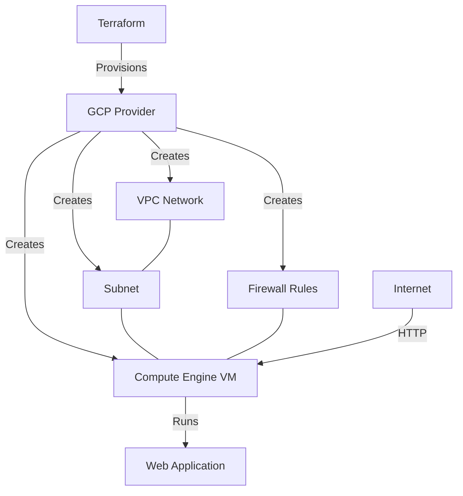

# Terraform GCP Compute Engine

## Introduction

Google Cloud Platform's Compute Engine provides scalable virtual machines (VMs) for your workloads. When combined with Terraform, you can automate the provisioning and management of these VMs using infrastructure as code. This approach ensures consistency, reproducibility, and version control for your cloud infrastructure.

In this tutorial, we'll explore how to use Terraform to create, configure, and manage GCP Compute Engine instances. By the end, you'll be able to define VM instances in code and deploy them to GCP with simple commands.

## Prerequisites

Before starting, ensure you have:

- A Google Cloud Platform account with billing enabled
- The [Google Cloud SDK](https://cloud.google.com/sdk) installed and configured
- [Terraform](https://www.terraform.io/downloads.html) installed (version 1.0.0 or later)
- Basic understanding of Terraform concepts
- A GCP project created and selected as your default

## Setting Up Your Terraform Environment

### Provider Configuration

First, we need to configure the GCP provider in Terraform. Create a file named `provider.tf`:

```hcl
provider "google" {
  project = "your-gcp-project-id"
  region  = "us-central1"
  zone    = "us-central1-a"
}

terraform {
  required_providers {
    google = {
      source  = "hashicorp/google"
      version = "~> 4.0"
    }
  }
}
```

Replace `"your-gcp-project-id"` with your actual GCP project ID.

### Authentication

Terraform needs authentication to interact with GCP. The simplest way is to authenticate with the Google Cloud SDK:

```bash
gcloud auth application-default login
```

This command opens a browser window where you can authenticate with your Google account.

## Creating a Basic Compute Engine Instance

Let's create a basic VM instance. Create a file named `main.tf`:

```hcl
resource "google_compute_instance" "vm_instance" {
  name         = "terraform-instance"
  machine_type = "e2-micro"
  zone         = "us-central1-a"

  boot_disk {
    initialize_params {
      image = "debian-cloud/debian-11"
    }
  }

  network_interface {
    network = "default"
    access_config {
      // Ephemeral public IP
    }
  }
}
```

This configuration creates a VM with the following specifications:
- Name: terraform-instance
- Machine type: e2-micro (2 vCPUs, 1 GB memory)
- Zone: us-central1-a
- Operating system: Debian 11
- Network: Default VPC network with a public IP address

### Deploy the VM

To deploy the VM, run the following commands:

```bash
# Initialize Terraform
terraform init

# Preview the changes
terraform plan

# Apply the changes
terraform apply
```

When prompted, type `yes` to confirm the deployment.

### Output

After successful deployment, you'll see output similar to:

```
Apply complete! Resources: 1 added, 0 changed, 0 destroyed.
```

## Adding Outputs

To easily retrieve information about your VM, add outputs. Create a file named `outputs.tf`:

```hcl
output "instance_name" {
  value = google_compute_instance.vm_instance.name
}

output "instance_external_ip" {
  value = google_compute_instance.vm_instance.network_interface[0].access_config[0].nat_ip
}

output "instance_self_link" {
  value = google_compute_instance.vm_instance.self_link
}
```

Run `terraform apply` again to see these outputs.

## Customizing Your Compute Engine Instance

Let's enhance our VM configuration with more features.

### Adding Startup Script

You can add a startup script to run commands when the VM boots:

```hcl
resource "google_compute_instance" "vm_instance" {
  // previous configuration...

  metadata_startup_script = <<-EOF
    #!/bin/bash
    apt-get update
    apt-get install -y nginx
    systemctl enable nginx
    systemctl start nginx
    echo "Hello from Terraform!" > /var/www/html/index.html
  EOF

  tags = ["http-server"]
}
```

### Configuring Firewall Rules

To access the web server, create a firewall rule:

```hcl
resource "google_compute_firewall" "allow_http" {
  name    = "allow-http"
  network = "default"

  allow {
    protocol = "tcp"
    ports    = ["80"]
  }

  source_ranges = ["0.0.0.0/0"]
  target_tags   = ["http-server"]
}
```

### Adding SSH Keys

To access your instance via SSH:

```hcl
resource "google_compute_instance" "vm_instance" {
  // previous configuration...

  metadata = {
    ssh-keys = "your-username:${file("~/.ssh/id_rsa.pub")}"
  }
}
```

Replace `"your-username"` with your desired username.

## Working with Variables

Using variables makes your configuration more flexible. Create a file named `variables.tf`:

```hcl
variable "project_id" {
  description = "The ID of the GCP project"
  type        = string
}

variable "region" {
  description = "The region to deploy resources to"
  type        = string
  default     = "us-central1"
}

variable "zone" {
  description = "The zone to deploy resources to"
  type        = string
  default     = "us-central1-a"
}

variable "instance_name" {
  description = "The name of the VM instance"
  type        = string
  default     = "terraform-instance"
}

variable "machine_type" {
  description = "The machine type for the VM instance"
  type        = string
  default     = "e2-micro"
}

variable "image" {
  description = "The OS image for the VM"
  type        = string
  default     = "debian-cloud/debian-11"
}
```

Now, update your provider and instance configurations to use these variables:

```hcl
provider "google" {
  project = var.project_id
  region  = var.region
  zone    = var.zone
}

resource "google_compute_instance" "vm_instance" {
  name         = var.instance_name
  machine_type = var.machine_type
  zone         = var.zone

  boot_disk {
    initialize_params {
      image = var.image
    }
  }

  // Rest of the configuration...
}
```

Create a `terraform.tfvars` file to set values for these variables:

```hcl
project_id    = "your-gcp-project-id"
instance_name = "web-server"
machine_type  = "e2-medium"
```

## Advanced Configuration

### Creating Multiple Similar Instances

To create multiple similar instances, use the `count` parameter:

```hcl
variable "instance_count" {
  description = "Number of instances to create"
  type        = number
  default     = 3
}

resource "google_compute_instance" "vm_instances" {
  count        = var.instance_count
  name         = "${var.instance_name}-${count.index}"
  machine_type = var.machine_type
  zone         = var.zone

  boot_disk {
    initialize_params {
      image = var.image
    }
  }

  network_interface {
    network = "default"
    access_config {
      // Ephemeral public IP
    }
  }

  metadata_startup_script = <<-EOF
    #!/bin/bash
    apt-get update
    apt-get install -y nginx
    systemctl enable nginx
    systemctl start nginx
    echo "Hello from VM ${count.index}!" > /var/www/html/index.html
  EOF

  tags = ["http-server"]
}
```

### Using Preemptible Instances for Cost Savings

For non-critical workloads, you can use preemptible instances to save costs:

```hcl
resource "google_compute_instance" "preemptible_instance" {
  name         = "preemptible-instance"
  machine_type = "e2-medium"
  zone         = var.zone

  scheduling {
    preemptible       = true
    automatic_restart = false
  }

  // Rest of the configuration...
}
```

### Attaching Persistent Disks

You can attach additional disks to your VM:

```hcl
resource "google_compute_disk" "data_disk" {
  name = "data-disk"
  size = 100
  type = "pd-standard"
  zone = var.zone
}

resource "google_compute_instance" "vm_with_disk" {
  name         = "vm-with-disk"
  machine_type = "e2-medium"
  zone         = var.zone

  boot_disk {
    initialize_params {
      image = var.image
    }
  }

  attached_disk {
    source      = google_compute_disk.data_disk.self_link
    device_name = "data-disk"
  }

  network_interface {
    network = "default"
    access_config {}
  }
}
```

## Real-World Example: Web Application Deployment

Let's create a more comprehensive example of deploying a web application. We'll use a VM instance with a startup script to deploy a simple web server:

```hcl
// Create a custom VPC network
resource "google_compute_network" "webapp_network" {
  name                    = "webapp-network"
  auto_create_subnetworks = false
}

// Create a subnet
resource "google_compute_subnetwork" "webapp_subnet" {
  name          = "webapp-subnet"
  ip_cidr_range = "10.0.1.0/24"
  region        = var.region
  network       = google_compute_network.webapp_network.id
}

// Create a firewall rule for SSH
resource "google_compute_firewall" "allow_ssh" {
  name    = "allow-ssh"
  network = google_compute_network.webapp_network.name

  allow {
    protocol = "tcp"
    ports    = ["22"]
  }

  source_ranges = ["0.0.0.0/0"]
}

// Create a firewall rule for HTTP
resource "google_compute_firewall" "allow_http" {
  name    = "allow-http"
  network = google_compute_network.webapp_network.name

  allow {
    protocol = "tcp"
    ports    = ["80"]
  }

  source_ranges = ["0.0.0.0/0"]
}

// Create a web server instance
resource "google_compute_instance" "web_server" {
  name         = "web-server"
  machine_type = "e2-medium"
  zone         = var.zone

  boot_disk {
    initialize_params {
      image = "debian-cloud/debian-11"
    }
  }

  network_interface {
    subnetwork = google_compute_subnetwork.webapp_subnet.id
    access_config {
      // Ephemeral public IP
    }
  }

  metadata_startup_script = <<-EOF
    #!/bin/bash
    apt-get update
    apt-get install -y nginx git
    systemctl enable nginx
    systemctl start nginx
    
    # Clone a sample web application
    git clone https://github.com/GoogleCloudPlatform/nodejs-docs-samples.git
    cd nodejs-docs-samples/appengine/hello-world/standard
    
    # Install Node.js
    curl -fsSL https://deb.nodesource.com/setup_16.x | bash -
    apt-get install -y nodejs
    
    # Install dependencies and start the application
    npm install
    npm start &
    
    # Update nginx to proxy requests to the Node.js app
    cat > /etc/nginx/sites-available/default <<-'NGINX'
    server {
        listen 80;
        location / {
            proxy_pass http://localhost:8080;
            proxy_http_version 1.1;
            proxy_set_header Upgrade $http_upgrade;
            proxy_set_header Connection 'upgrade';
            proxy_set_header Host $host;
            proxy_cache_bypass $http_upgrade;
        }
    }
    NGINX
    
    systemctl restart nginx
  EOF

  depends_on = [
    google_compute_firewall.allow_http,
    google_compute_firewall.allow_ssh
  ]
}

// Output the web server's public IP
output "web_server_ip" {
  value = google_compute_instance.web_server.network_interface[0].access_config[0].nat_ip
}
```

This example:
1. Creates a custom VPC network and subnet
2. Sets up firewall rules for SSH and HTTP access
3. Deploys a VM that installs Nginx and a sample Node.js application
4. Configures Nginx as a reverse proxy for the Node.js app
5. Outputs the public IP address to access the web application

## Visualizing the Infrastructure

Let's create a diagram to visualize our infrastructure:



## Best Practices

When working with Terraform and GCP Compute Engine, keep these best practices in mind:

1. **Use modules**: Break your infrastructure into reusable modules for better organization.

2. **State management**: Store your Terraform state in a remote backend like GCS bucket:

```hcl
terraform {
  backend "gcs" {
    bucket = "terraform-state-bucket"
    prefix = "terraform/state"
  }
}
```

3. **Use variables and locals**: Parameterize your configurations and use locals for computed values.

4. **Tag resources**: Use labels to organize and track your resources:

```hcl
resource "google_compute_instance" "vm_instance" {
  // Other configuration...
  
  labels = {
    environment = "dev"
    project     = "webapp"
    managed_by  = "terraform"
  }
}
```

5. **Use service accounts**: Create and use dedicated service accounts for your VMs:

```hcl
resource "google_service_account" "vm_service_account" {
  account_id   = "vm-service-account"
  display_name = "VM Service Account"
}

resource "google_compute_instance" "vm_instance" {
  // Other configuration...
  
  service_account {
    email  = google_service_account.vm_service_account.email
    scopes = ["cloud-platform"]
  }
}
```

## Summary

In this tutorial, we've explored how to use Terraform to provision and manage Google Cloud Platform Compute Engine resources. We've covered:

- Setting up the Terraform environment for GCP
- Creating basic Compute Engine instances
- Customizing VM configurations with startup scripts and firewall rules
- Working with variables for flexible configurations
- Advanced features like creating multiple instances and attaching persistent disks
- A real-world example of deploying a web application
- Best practices for Terraform with GCP

By using Terraform with GCP Compute Engine, you can manage your infrastructure as code, ensuring consistency, reproducibility, and version control for your cloud resources.

## Additional Resources

- [Terraform Google Provider Documentation](https://registry.terraform.io/providers/hashicorp/google/latest/docs)
- [GCP Compute Engine Documentation](https://cloud.google.com/compute/docs)
- [Terraform Best Practices](https://www.terraform-best-practices