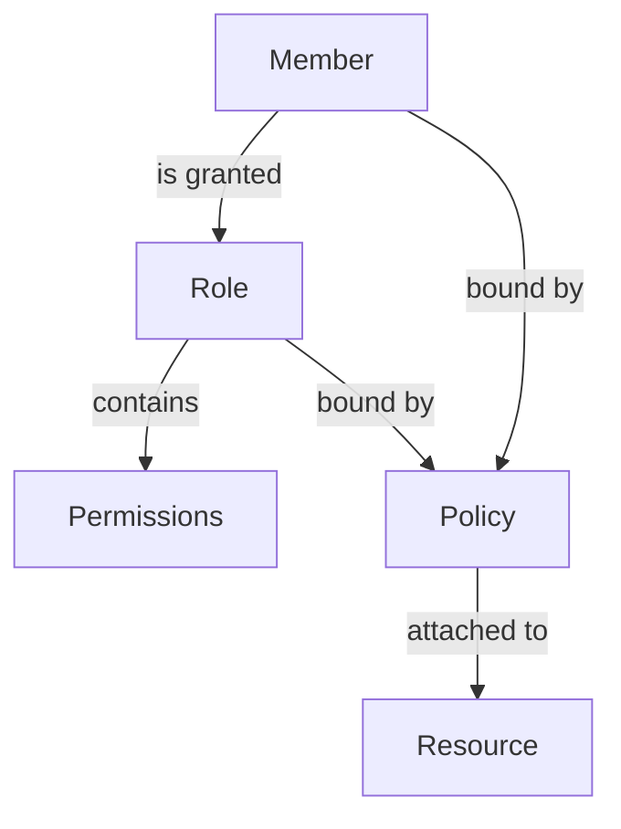

# Terraform GCP IAM

## Introduction

Identity and Access Management (IAM) is a critical component of any cloud infrastructure. It controls who can do what on which resources, forming the foundation of security in Google Cloud Platform (GCP). Managing these permissions manually through the console can become tedious and error-prone as your infrastructure grows.

This is where Terraform comes in. Terraform allows you to define and manage GCP IAM permissions as code, making them:

- **Version controlled**: Track changes over time
- **Repeatable**: Deploy the same permissions consistently across environments
- **Automated**: Reduce human error and manual intervention
- **Auditable**: Easily review who has what permissions

In this guide, we'll explore how to use Terraform to manage GCP IAM resources, roles, and permissions efficiently.

## GCP IAM Basics

Before diving into Terraform, let's understand some key GCP IAM concepts:

1. **Members**: Entities that can be granted access (users, service accounts, groups, domains)
2. **Roles**: Collections of permissions (predefined, basic, or custom)
3. **Permissions**: Specific operations allowed on specific resources
4. **Policies**: Bindings between members and roles for specific resources

These components work together to implement the principle of least privilege, ensuring users only have access to what they need.



## Setting Up Your Environment

Before writing IAM configurations, ensure you have:

1. The Google Cloud SDK installed
2. Terraform installed (v1.0.0 or later)
3. A GCP project with billing enabled
4. The necessary permissions to manage IAM

Let's initialize a new Terraform project:

```hcl
# terraform-gcp-iam-example/main.tf

terraform {
  required_providers {
    google = {
      source  = "hashicorp/google"
      version = "~> 4.0"
    }
  }
}

provider "google" {
  project = "your-project-id"
  region  = "us-central1"
}
```

## Managing IAM Roles and Permissions

### 1. Project-Level IAM Bindings

The simplest way to assign roles is at the project level:

```hcl
# Assign a role to a user at the project level
resource "google_project_iam_member" "project_admin" {
  project = "your-project-id"
  role    = "roles/editor"
  member  = "user:jane@example.com"
}
```

You can also bind multiple members to the same role:

```hcl
# Bind multiple members to the same role
resource "google_project_iam_binding" "project_viewers" {
  project = "your-project-id"
  role    = "roles/viewer"
  
  members = [
    "user:john@example.com",
    "group:analysts@example.com",
    "serviceAccount:my-service@your-project-id.iam.gserviceaccount.com"
  ]
}
```

### 2. Creating Service Accounts

Service accounts are often used for programmatic access to resources:

```hcl
# Create a service account
resource "google_service_account" "app_service_account" {
  account_id   = "app-service-account"
  display_name = "Application Service Account"
  description  = "Service account for our application"
}

# Grant roles to the service account
resource "google_project_iam_member" "service_account_role" {
  project = "your-project-id"
  role    = "roles/storage.objectViewer"
  member  = "serviceAccount:${google_service_account.app_service_account.email}"
}
```

### 3. Resource-Specific IAM

You can assign permissions at the resource level for more granular control:

```hcl
# Create a GCS bucket
resource "google_storage_bucket" "data_bucket" {
  name     = "company-data-bucket"
  location = "US"
}

# Assign a role on the specific bucket
resource "google_storage_bucket_iam_member" "bucket_viewer" {
  bucket = google_storage_bucket.data_bucket.name
  role   = "roles/storage.objectViewer"
  member = "user:data-analyst@example.com"
}
```

### 4. Custom Roles

When predefined roles don't meet your requirements, you can create custom roles:

```hcl
# Create a custom role
resource "google_project_iam_custom_role" "custom_storage_role" {
  role_id     = "customStorageRole"
  title       = "Custom Storage Role"
  description = "A custom role with specific storage permissions"
  permissions = [
    "storage.buckets.get",
    "storage.objects.get",
    "storage.objects.list"
  ]
}

# Assign the custom role
resource "google_project_iam_member" "custom_role_user" {
  project = "your-project-id"
  role    = google_project_iam_custom_role.custom_storage_role.id
  member  = "user:storage-user@example.com"
}
```

## IAM Best Practices with Terraform

### Use Variables for Reusability

Define your IAM assignments using variables to make your code more flexible and reusable:

```hcl
# variables.tf
variable "project_viewers" {
  description = "List of members that should have the viewer role"
  type        = list(string)
  default     = ["user:viewer1@example.com", "user:viewer2@example.com"]
}

# main.tf
resource "google_project_iam_binding" "project_viewers" {
  project = "your-project-id"
  role    = "roles/viewer"
  members = var.project_viewers
}
```

### Organizing IAM Resources

For larger projects, consider organizing your IAM configurations into separate files:

```
terraform-project/
├── main.tf
├── variables.tf
├── outputs.tf
├── service-accounts.tf
├── project-iam.tf
└── resource-iam.tf
```

### Using Modules for IAM

Create reusable modules for common IAM patterns:

```hcl
# modules/service-account/main.tf
resource "google_service_account" "service_account" {
  account_id   = var.account_id
  display_name = var.display_name
  description  = var.description
}

resource "google_project_iam_member" "service_account_roles" {
  for_each = toset(var.roles)
  
  project = var.project_id
  role    = each.value
  member  = "serviceAccount:${google_service_account.service_account.email}"
}
```

Then use the module in your main configuration:

```hcl
module "app_service_account" {
  source       = "./modules/service-account"
  account_id   = "app-service"
  display_name = "Application Service"
  description  = "Service account for our application"
  project_id   = "your-project-id"
  roles        = ["roles/storage.objectViewer", "roles/pubsub.subscriber"]
}
```

## Real-World Example: Multi-Environment Setup

Let's put everything together in a real-world example that creates a multi-environment setup with appropriate IAM permissions:

```hcl
# Define environments
locals {
  environments = {
    dev = {
      admins  = ["user:dev-admin@example.com"]
      viewers = ["group:dev-team@example.com"]
    }
    prod = {
      admins  = ["user:prod-admin@example.com"]
      viewers = ["group:analysts@example.com"]
    }
  }
}

# Create projects for each environment
resource "google_project" "environment_projects" {
  for_each = local.environments
  
  name            = "example-${each.key}"
  project_id      = "example-${each.key}-${random_id.project_suffix.hex}"
  org_id          = "your-org-id"
  billing_account = "your-billing-account"
}

# Assign admins for each environment
resource "google_project_iam_binding" "environment_admins" {
  for_each = local.environments
  
  project = google_project.environment_projects[each.key].project_id
  role    = "roles/editor"
  members = each.value.admins
}

# Assign viewers for each environment
resource "google_project_iam_binding" "environment_viewers" {
  for_each = local.environments
  
  project = google_project.environment_projects[each.key].project_id
  role    = "roles/viewer"
  members = each.value.viewers
}

# Create a service account for each environment
resource "google_service_account" "app_service_account" {
  for_each = local.environments
  
  account_id   = "app-service-${each.key}"
  display_name = "Application Service Account (${each.key})"
  project      = google_project.environment_projects[each.key].project_id
}

# Grant the service account appropriate roles
resource "google_project_iam_member" "app_service_roles" {
  for_each = local.environments
  
  project = google_project.environment_projects[each.key].project_id
  role    = "roles/storage.objectAdmin"
  member  = "serviceAccount:${google_service_account.app_service_account[each.key].email}"
}
```

## Applying and Testing Your IAM Configuration

After defining your IAM configuration, you can apply it using the Terraform workflow:

```bash
# Initialize your Terraform configuration
terraform init

# See what changes will be made
terraform plan

# Apply the changes
terraform apply
```

Once applied, verify the IAM configuration:

1. Using the GCP Console
2. Using the `gcloud` command-line tool:

```bash
# List IAM policies for a project
gcloud projects get-iam-policy your-project-id

# List service accounts
gcloud iam service-accounts list --project=your-project-id
```

## Common IAM Challenges and Solutions

### Challenge: Too Many Individual Bindings

**Problem**: Managing many individual `google_project_iam_member` resources becomes unwieldy.

**Solution**: Use `google_project_iam_binding` or `google_project_iam_policy` for comprehensive management:

```hcl
resource "google_project_iam_policy" "project" {
  project     = "your-project-id"
  policy_data = data.google_iam_policy.admin.policy_data
}

data "google_iam_policy" "admin" {
  binding {
    role = "roles/editor"
    members = [
      "user:jane@example.com",
    ]
  }

  binding {
    role = "roles/viewer"
    members = [
      "user:john@example.com",
      "group:viewers@example.com",
    ]
  }
}
```

### Challenge: Managing Permissions Across Multiple Projects

**Problem**: Repeating similar IAM configurations across multiple projects.

**Solution**: Use Terraform modules and for_each loops:

```hcl
module "project_iam" {
  source   = "./modules/project-iam"
  for_each = toset(["project-1", "project-2", "project-3"])
  
  project_id = each.value
  admins     = ["user:admin@example.com"]
  editors    = ["group:developers@example.com"]
  viewers    = ["group:analysts@example.com"]
}
```

## Summary

In this guide, we've explored how to use Terraform to manage Google Cloud Platform IAM resources effectively. We've covered:

- Understanding GCP IAM concepts
- Setting up your Terraform environment for GCP
- Managing different types of IAM resources (bindings, service accounts, custom roles)
- Implementing best practices for IAM management
- Building real-world examples for multi-environment setups
- Troubleshooting common IAM challenges

By using Terraform to manage your GCP IAM configurations, you gain the benefits of infrastructure as code: version control, automation, consistency, and auditability. This approach scales well as your organization and cloud infrastructure grow.

## Additional Resources

To continue learning about Terraform with GCP IAM:

- Google Cloud IAM documentation: [https://cloud.google.com/iam/docs](https://cloud.google.com/iam/docs)
- Terraform Google Provider documentation: [https://registry.terraform.io/providers/hashicorp/google/latest/docs](https://registry.terraform.io/providers/hashicorp/google/latest/docs)
- IAM best practices: [https://cloud.google.com/iam/docs/recommender-overview](https://cloud.google.com/iam/docs/recommender-overview)

## Exercises

1. Create a Terraform configuration that sets up a new GCP project with basic IAM roles for your team.
2. Define a custom role with specific permissions and assign it to a service account.
3. Build a module that creates a service account with appropriate permissions for a web application that needs access to Cloud Storage and Cloud SQL.
4. Implement a least-privilege IAM structure for a multi-tier application with frontend, backend, and database components.
5. Use Terraform to audit existing IAM permissions in a project and export them to a configuration file.