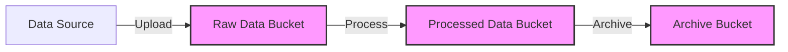

# Terraform GCP Storage

## Introduction

Google Cloud Storage is a highly durable and available object storage service offered by Google Cloud Platform (GCP). When building infrastructure on GCP, storage buckets are often one of the first resources you'll need to create for storing files, backups, static website content, or data for processing.

Terraform allows us to provision and manage these storage resources using Infrastructure as Code (IaC). This means we can version, reuse, and automate the creation of storage buckets and objects, ensuring consistency across environments and simplifying resource management.

In this guide, we'll explore how to use Terraform to:
- Create and configure GCP Storage buckets
- Manage bucket permissions and access control
- Upload files to storage buckets
- Set lifecycle rules
- Implement best practices for secure and efficient storage management

## Prerequisites

Before you begin, ensure you have:

- [Terraform](https://www.terraform.io/downloads.html) installed (v0.12+)
- [Google Cloud SDK](https://cloud.google.com/sdk/docs/install) installed and configured
- A Google Cloud Platform account with a project set up
- Basic knowledge of Terraform and GCP concepts

## Setting Up Provider Configuration

First, let's set up our Terraform configuration with the Google provider:

```hcl
terraform {
  required_providers {
    google = {
      source  = "hashicorp/google"
      version = "~> 4.0"
    }
  }
}

provider "google" {
  project = "your-project-id"
  region  = "us-central1"
}
```

Replace `"your-project-id"` with your actual GCP project ID.

## Creating a Basic Storage Bucket

Let's start with creating a simple Cloud Storage bucket:

```hcl
resource "google_storage_bucket" "static_website" {
  name          = "my-static-website-bucket-${random_id.bucket_suffix.hex}"
  location      = "US"
  force_destroy = true
  
  uniform_bucket_level_access = true
}

resource "random_id" "bucket_suffix" {
  byte_length = 4
}
```

This creates:
- A storage bucket with a unique name (using a random suffix to ensure global uniqueness)
- Located in the US multi-region
- With uniform bucket-level access enabled for better security
- The `force_destroy` flag allows Terraform to delete the bucket even if it contains objects

### Understanding the Output

When you run `terraform apply`, you'll see output similar to:

```
Terraform will perform the following actions:

  # google_storage_bucket.static_website will be created
  + resource "google_storage_bucket" "static_website" {
      + force_destroy               = true
      + id                          = (known after apply)
      + location                    = "US"
      + name                        = (known after apply)
      + project                     = "your-project-id"
      + self_link                   = (known after apply)
      + uniform_bucket_level_access = true
      + url                         = (known after apply)
    }

Plan: 1 to add, 0 to change, 0 to destroy.

Do you want to perform these actions? [yes/no]
```

After applying, you'll have a new storage bucket in your GCP project.

## Configuring Bucket Properties

Let's enhance our storage bucket with additional properties:

```hcl
resource "google_storage_bucket" "data_lake" {
  name          = "my-data-lake-${random_id.bucket_suffix.hex}"
  location      = "US-CENTRAL1"
  force_destroy = true
  
  storage_class = "STANDARD"
  
  versioning {
    enabled = true
  }
  
  lifecycle_rule {
    condition {
      age = 30
    }
    action {
      type = "SetStorageClass"
      storage_class = "NEARLINE"
    }
  }
  
  lifecycle_rule {
    condition {
      age = 90
    }
    action {
      type = "SetStorageClass"
      storage_class = "COLDLINE"
    }
  }
  
  lifecycle_rule {
    condition {
      age = 365
    }
    action {
      type = "Delete"
    }
  }
}
```

This configuration:
- Creates a regional bucket in US-CENTRAL1
- Sets the default storage class to STANDARD
- Enables versioning to maintain file history
- Implements lifecycle rules that:
  - Move objects to NEARLINE storage after 30 days
  - Move objects to COLDLINE storage after 90 days
  - Delete objects after 365 days

## Uploading Objects to the Bucket

To upload files to your bucket:

```hcl
resource "google_storage_bucket_object" "static_file" {
  name   = "index.html"
  bucket = google_storage_bucket.static_website.name
  source = "${path.module}/files/index.html"
  
  content_type = "text/html"
}
```

This will upload the local file `files/index.html` to your bucket with the appropriate content type.

## Setting Up Bucket Access Control

### Public Access

To make a bucket publicly readable (useful for static websites):

```hcl
resource "google_storage_bucket_iam_member" "public_read" {
  bucket = google_storage_bucket.static_website.name
  role   = "roles/storage.objectViewer"
  member = "allUsers"
}
```

### Restricted Access

For more restricted access, you can grant permissions to specific users or service accounts:

```hcl
resource "google_storage_bucket_iam_binding" "admin_access" {
  bucket = google_storage_bucket.data_lake.name
  role   = "roles/storage.admin"
  
  members = [
    "user:admin@example.com",
    "serviceAccount:my-service@${var.project_id}.iam.gserviceaccount.com",
  ]
}
```

## Setting Up a Static Website

Cloud Storage can host static websites. Here's how to configure it:

```hcl
resource "google_storage_bucket" "website" {
  name          = "my-website-${random_id.bucket_suffix.hex}"
  location      = "US"
  force_destroy = true
  
  website {
    main_page_suffix = "index.html"
    not_found_page   = "404.html"
  }
  
  cors {
    origin          = ["*"]
    method          = ["GET", "HEAD", "OPTIONS"]
    response_header = ["*"]
    max_age_seconds = 3600
  }
}

resource "google_storage_default_object_access_control" "website_read" {
  bucket = google_storage_bucket.website.name
  role   = "READER"
  entity = "allUsers"
}
```

This configuration:
- Sets up website configuration with index and 404 pages
- Configures CORS settings to allow access from any origin
- Makes all objects in the bucket publicly readable by default

## Using Variables for Flexible Configuration

To make your Terraform code more reusable, use variables:

```hcl
variable "project_id" {
  description = "The ID of the GCP project"
  type        = string
}

variable "bucket_name_prefix" {
  description = "Prefix for bucket names"
  type        = string
  default     = "tf-managed"
}

variable "location" {
  description = "Location for the bucket"
  type        = string
  default     = "US"
}

resource "google_storage_bucket" "configurable_bucket" {
  name     = "${var.bucket_name_prefix}-${random_id.bucket_suffix.hex}"
  location = var.location
  project  = var.project_id
}
```

Then you can reuse this module with different configurations.

## Real-World Example: Data Processing Pipeline

Let's create a more complex example that might be used in a data processing pipeline:

```hcl
# Create buckets for different stages of data processing
resource "google_storage_bucket" "raw_data" {
  name          = "raw-data-${var.environment}-${random_id.bucket_suffix.hex}"
  location      = var.location
  storage_class = "STANDARD"
  
  uniform_bucket_level_access = true
  
  lifecycle_rule {
    condition {
      age = 60
    }
    action {
      type = "SetStorageClass"
      storage_class = "NEARLINE"
    }
  }
}

resource "google_storage_bucket" "processed_data" {
  name          = "processed-data-${var.environment}-${random_id.bucket_suffix.hex}"
  location      = var.location
  storage_class = "STANDARD"
  
  uniform_bucket_level_access = true
  
  lifecycle_rule {
    condition {
      age = 30
    }
    action {
      type = "SetStorageClass"
      storage_class = "NEARLINE"
    }
  }
}

resource "google_storage_bucket" "archive" {
  name          = "archive-${var.environment}-${random_id.bucket_suffix.hex}"
  location      = var.location
  storage_class = "COLDLINE"
  
  uniform_bucket_level_access = true
  
  # Keep archive data for compliance
  retention_policy {
    retention_period = 2592000 # 30 days in seconds
  }
}

# Create a service account for data processing
resource "google_service_account" "data_processor" {
  account_id   = "data-processor"
  display_name = "Data Processing Service Account"
}

# Grant the service account access to the buckets
resource "google_storage_bucket_iam_member" "raw_data_access" {
  bucket = google_storage_bucket.raw_data.name
  role   = "roles/storage.objectViewer"
  member = "serviceAccount:${google_service_account.data_processor.email}"
}

resource "google_storage_bucket_iam_member" "processed_data_access" {
  bucket = google_storage_bucket.processed_data.name
  role   = "roles/storage.objectAdmin"
  member = "serviceAccount:${google_service_account.data_processor.email}"
}

resource "google_storage_bucket_iam_member" "archive_data_access" {
  bucket = google_storage_bucket.archive.name
  role   = "roles/storage.objectAdmin"
  member = "serviceAccount:${google_service_account.data_processor.email}"
}
```

This example:
1. Creates three buckets for different stages of data processing
2. Sets appropriate storage classes for each stage
3. Configures lifecycle rules based on data freshness requirements
4. Sets up a retention policy for the archive bucket
5. Creates a service account for data processing
6. Grants the service account appropriate permissions on each bucket

## Visualizing the Data Flow

Here's a diagram showing the data flow in our processing pipeline:



## Best Practices for GCP Storage with Terraform

1. **Use unique bucket names**: Cloud Storage bucket names must be globally unique. Use a random suffix or project-specific prefix.

2. **Enable versioning for important data**: Versioning helps protect against accidental deletions or modifications.

3. **Set appropriate lifecycle rules**: Move older data to colder storage tiers to optimize costs.

4. **Use uniform bucket-level access**: This simplifies permission management and enhances security.

5. **Apply principle of least privilege**: Grant only the permissions necessary for each user or service.

6. **Use variables and modules**: Make your Terraform code reusable across projects.

7. **Set retention policies for regulatory compliance**: When required, ensure data cannot be deleted before the retention period.

8. **Consider encryption options**: Use customer-managed encryption keys for sensitive data.

## Testing Your Configuration

Before applying your Terraform configuration in production, test it:

```hcl
output "bucket_url" {
  value = google_storage_bucket.static_website.url
}

output "website_url" {
  value = "https://storage.googleapis.com/${google_storage_bucket.website.name}/index.html"
}
```

These outputs will provide URLs to verify your bucket setup after applying the configuration.

## Summary

In this guide, we've explored how to use Terraform to manage Google Cloud Storage resources. We've covered:

- Basic bucket creation and configuration
- Setting storage classes and lifecycle policies
- Uploading objects to buckets
- Configuring access control
- Setting up static websites
- Building a real-world data processing pipeline

Terraform makes it easy to provision and manage GCP Storage resources in a consistent, repeatable way. By using Infrastructure as Code, you can ensure that your storage resources are properly configured, secure, and cost-optimized.

## Exercises

1. Create a Terraform configuration that sets up a storage bucket for backup data with appropriate lifecycle rules.

2. Modify the static website example to include custom CORS settings for a specific domain.

3. Create a module that provisions a set of buckets for a three-tier application (frontend assets, backend uploads, and logs).

4. Implement customer-managed encryption keys (CMEK) for a storage bucket containing sensitive data.

5. Set up object versioning with a lifecycle rule that deletes previous versions after 14 days.

## Additional Resources

- [Terraform Google Provider Documentation](https://registry.terraform.io/providers/hashicorp/google/latest/docs/resources/storage_bucket)
- [Google Cloud Storage Documentation](https://cloud.google.com/storage/docs)
- [Google Cloud Storage Best Practices](https://cloud.google.com/storage/docs/best-practices)
- [Terraform Best Practices](https://www.terraform-best-practices.com/)