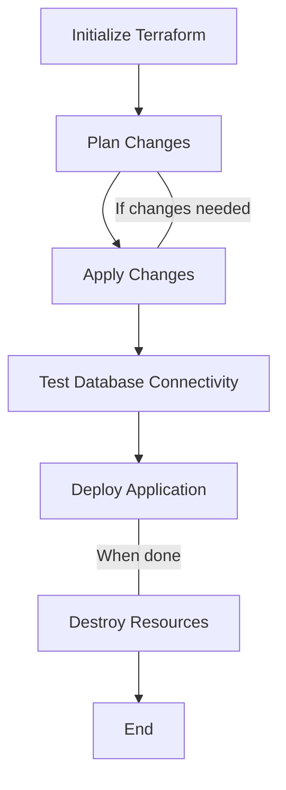

# Terraform GCP Cloud SQL

## Introduction

Welcome to our guide on using Terraform to manage Google Cloud SQL instances! Cloud SQL is Google Cloud Platform's fully managed relational database service that makes it easy to set up, maintain, and administer your databases in the cloud. Using Terraform to provision and manage your Cloud SQL instances brings all the benefits of Infrastructure as Code (IaC) to your database management workflow.

In this tutorial, you'll learn how to:
- Provision a Cloud SQL MySQL instance using Terraform
- Configure database settings, users, and databases
- Implement best practices for security and optimization
- Create, modify, and destroy Cloud SQL resources through code

## Prerequisites

Before we begin, make sure you have:

1. A Google Cloud Platform account
2. Terraform installed on your local machine (version 1.0.0+)
3. Google Cloud SDK installed
4. Basic familiarity with Terraform concepts
5. Access to a project on GCP with the necessary permissions

## Setting Up Your Project

Let's start by creating a new Terraform project for our Cloud SQL resources:

```bash
mkdir terraform-gcp-cloud-sql
cd terraform-gcp-cloud-sql
touch main.tf variables.tf outputs.tf
```

## Provider Configuration

First, let's set up the Google Cloud provider in your `main.tf`:

```hcl
terraform {
  required_providers {
    google = {
      source  = "hashicorp/google"
      version = "~> 4.0"
    }
  }
}

provider "google" {
  project = var.project_id
  region  = var.region
}
```

In your `variables.tf` file, define these variables:

```hcl
variable "project_id" {
  description = "The ID of the GCP project"
  type        = string
}

variable "region" {
  description = "The region to deploy resources to"
  type        = string
  default     = "us-central1"
}

variable "zone" {
  description = "The zone to deploy resources in"
  type        = string
  default     = "us-central1-a"
}
```

## Creating a Basic Cloud SQL Instance

Now, let's create a basic MySQL instance in Cloud SQL:

```hcl
resource "google_sql_database_instance" "main" {
  name             = "my-database-instance"
  database_version = "MYSQL_8_0"
  region           = var.region
  
  settings {
    tier = "db-f1-micro"  # Smallest tier, good for development
    
    backup_configuration {
      enabled            = true
      binary_log_enabled = true
      start_time         = "23:00"
    }
  }
  
  # Set deletion_protection to prevent accidental deletion
  deletion_protection = false  # Set to true in production
}
```

This creates a simple MySQL 8.0 database instance with automatic backups enabled.

## Understanding the Settings Block

The `settings` block in the `google_sql_database_instance` resource is where most of the configuration happens:

```hcl
settings {
  tier = "db-f1-micro"
  
  ip_configuration {
    ipv4_enabled    = true
    private_network = null  # You can specify a VPC network here
    
    authorized_networks {
      name  = "allow-office"
      value = "192.168.1.0/24"  # Replace with your IP range
    }
  }
  
  database_flags {
    name  = "max_connections"
    value = "100"
  }
  
  maintenance_window {
    day          = 7  # Sunday
    hour         = 2  # 2 AM
    update_track = "stable"
  }
}
```

## Creating a Database

Once we have our instance, let's create a database:

```hcl
resource "google_sql_database" "database" {
  name     = "my-database"
  instance = google_sql_database_instance.main.name
  charset  = "utf8mb4"
  collation = "utf8mb4_general_ci"
}
```

## Creating a Database User

Every database needs users who can access it:

```hcl
resource "google_sql_user" "users" {
  name     = "my-database-user"
  instance = google_sql_database_instance.main.name
  password = "changeme123"  # Use a secure password or reference a secret
}
```

:::warning
Never hardcode passwords in your Terraform files for production usage. Instead, use secret management solutions like Google Secret Manager, environment variables, or Terraform variables marked as sensitive.
:::

For better security, consider this approach:

```hcl
variable "db_password" {
  description = "Database password"
  type        = string
  sensitive   = true  # This ensures the value isn't shown in logs
}

resource "google_sql_user" "users" {
  name     = "my-database-user"
  instance = google_sql_database_instance.main.name
  password = var.db_password
}
```

## Handling High Availability Configuration

For production workloads, you might want to enable high availability:

```hcl
resource "google_sql_database_instance" "ha_instance" {
  name             = "my-ha-instance"
  database_version = "MYSQL_8_0"
  region           = var.region
  
  settings {
    tier = "db-n1-standard-1"
    
    availability_type = "REGIONAL"  # This enables high availability
    
    backup_configuration {
      enabled            = true
      binary_log_enabled = true
      start_time         = "23:00"
    }
  }
  
  deletion_protection = true
}
```

The `availability_type = "REGIONAL"` setting creates a standby instance in a different zone that automatically takes over if the primary instance fails.

## Working with Private IP

For better security, you might want to use private IP to connect to your database:

```hcl
resource "google_compute_network" "private_network" {
  name                    = "private-network"
  auto_create_subnetworks = false
}

resource "google_compute_global_address" "private_ip_address" {
  name          = "private-ip-address"
  purpose       = "VPC_PEERING"
  address_type  = "INTERNAL"
  prefix_length = 16
  network       = google_compute_network.private_network.id
}

resource "google_service_networking_connection" "private_vpc_connection" {
  network                 = google_compute_network.private_network.id
  service                 = "servicenetworking.googleapis.com"
  reserved_peering_ranges = [google_compute_global_address.private_ip_address.name]
}

resource "google_sql_database_instance" "private_instance" {
  name             = "private-instance"
  database_version = "MYSQL_8_0"
  region           = var.region
  
  depends_on = [google_service_networking_connection.private_vpc_connection]
  
  settings {
    tier = "db-f1-micro"
    
    ip_configuration {
      ipv4_enabled    = false
      private_network = google_compute_network.private_network.id
    }
  }
}
```

## Setting Up Read Replicas

For read-heavy workloads, you can set up read replicas:

```hcl
resource "google_sql_database_instance" "read_replica" {
  name                 = "read-replica"
  master_instance_name = google_sql_database_instance.main.name
  region               = var.region
  database_version     = "MYSQL_8_0"
  
  replica_configuration {
    failover_target = false
  }
  
  settings {
    tier = "db-f1-micro"
    
    backup_configuration {
      enabled = false
    }
  }
}
```

## Complete Example: Production-Ready MySQL Setup

Here's a more complete example that brings together several best practices:

```hcl
# Provider configuration
provider "google" {
  project = var.project_id
  region  = var.region
}

# Private network setup
resource "google_compute_network" "db_network" {
  name                    = "db-network"
  auto_create_subnetworks = false
}

resource "google_compute_subnetwork" "db_subnet" {
  name          = "db-subnet"
  ip_cidr_range = "10.0.0.0/24"
  region        = var.region
  network       = google_compute_network.db_network.id
}

resource "google_compute_global_address" "private_ip_address" {
  name          = "private-ip-address"
  purpose       = "VPC_PEERING"
  address_type  = "INTERNAL"
  prefix_length = 16
  network       = google_compute_network.db_network.id
}

resource "google_service_networking_connection" "private_vpc_connection" {
  network                 = google_compute_network.db_network.id
  service                 = "servicenetworking.googleapis.com"
  reserved_peering_ranges = [google_compute_global_address.private_ip_address.name]
}

# Cloud SQL instance
resource "google_sql_database_instance" "production" {
  name             = "production-db"
  database_version = "MYSQL_8_0"
  region           = var.region
  
  depends_on = [google_service_networking_connection.private_vpc_connection]
  
  settings {
    tier              = "db-n1-standard-2"
    availability_type = "REGIONAL"
    disk_type         = "PD_SSD"
    disk_size         = 100
    
    backup_configuration {
      enabled            = true
      binary_log_enabled = true
      start_time         = "02:00"
      retention_days     = 7
    }
    
    ip_configuration {
      ipv4_enabled    = false
      private_network = google_compute_network.db_network.id
      
      # If you need public access for specific IPs:
      # authorized_networks {
      #   name  = "office-network"
      #   value = "203.0.113.0/24"
      # }
    }
    
    maintenance_window {
      day          = 7
      hour         = 3
      update_track = "stable"
    }
    
    database_flags {
      name  = "max_connections"
      value = "300"
    }
    
    database_flags {
      name  = "slow_query_log"
      value = "on"
    }
  }
  
  deletion_protection = true
}

# Database
resource "google_sql_database" "production_db" {
  name     = "production"
  instance = google_sql_database_instance.production.name
  charset  = "utf8mb4"
  collation = "utf8mb4_general_ci"
}

# Database users
resource "google_sql_user" "app_user" {
  name     = "app_user"
  instance = google_sql_database_instance.production.name
  password = var.app_db_password
}

resource "google_sql_user" "readonly_user" {
  name     = "readonly_user"
  instance = google_sql_database_instance.production.name
  password = var.readonly_db_password
}

# Read replica for reporting workloads
resource "google_sql_database_instance" "replica" {
  name                 = "reporting-replica"
  master_instance_name = google_sql_database_instance.production.name
  region               = var.region
  database_version     = "MYSQL_8_0"
  
  replica_configuration {
    failover_target = false
  }
  
  settings {
    tier              = "db-n1-standard-1"
    availability_type = "ZONAL"
    
    backup_configuration {
      enabled = false
    }
    
    ip_configuration {
      ipv4_enabled    = false
      private_network = google_compute_network.db_network.id
    }
  }
}
```

## PostgreSQL Example

If you prefer PostgreSQL over MySQL, here's how you can set it up:

```hcl
resource "google_sql_database_instance" "postgres" {
  name             = "postgres-instance"
  database_version = "POSTGRES_14"
  region           = var.region
  
  settings {
    tier = "db-custom-1-3840"
    
    backup_configuration {
      enabled  = true
      point_in_time_recovery_enabled = true
      start_time = "20:00"
    }
    
    ip_configuration {
      ipv4_enabled    = true
      authorized_networks {
        name  = "allow-office"
        value = "203.0.113.0/24"
      }
    }
  }
}

resource "google_sql_database" "postgres_db" {
  name     = "mydb"
  instance = google_sql_database_instance.postgres.name
}

resource "google_sql_user" "postgres_user" {
  name     = "postgres"
  instance = google_sql_database_instance.postgres.name
  password = var.postgres_password
}
```

## Best Practices

When working with Cloud SQL and Terraform, keep these best practices in mind:

1. **Security**:
   - Use private IP connections where possible
   - Limit authorized networks for public IP
   - Never hardcode sensitive information like passwords
   - Enable SSL for connections
   - Use least-privilege service accounts

2. **Reliability**:
   - Enable backups for production databases
   - Use high availability for critical workloads
   - Set up proper maintenance windows
   - Configure appropriate flags for your workload

3. **Performance**:
   - Choose appropriate instance types and disk sizes
   - Set up read replicas for read-heavy workloads
   - Use SSD for better performance
   - Monitor and adjust database flags as needed

4. **Cost Management**:
   - Start with smaller instances for development
   - Set up billing alerts
   - Schedule automated backups during off-hours
   - Consider Cloud SQL's automatic storage increases

## Common Operations and Workflow

Here's a typical workflow when managing GCP Cloud SQL with Terraform:



### Initialize

```bash
terraform init
```

### Plan

```bash
terraform plan -var "project_id=your-project-id" -var "db_password=securepassword"
```

### Apply

```bash
terraform apply -var "project_id=your-project-id" -var "db_password=securepassword"
```

### Connect to Your Database

After provisioning, you can connect to your database using:

```bash
# For public IP
gcloud sql connect my-database-instance --user=my-database-user

# For private IP, you'll need to connect from a VM in the same VPC network
```

### Destruction (When No Longer Needed)

```bash
# First, disable deletion protection if enabled
terraform apply -var "project_id=your-project-id" -var "deletion_protection=false"

# Then destroy
terraform destroy -var "project_id=your-project-id"
```

## Troubleshooting Common Issues

### Connection Issues

If you can't connect to your database:

1. Check IP allowlist settings
2. Verify network connectivity
3. Ensure service networking API is enabled
4. Check VPC peering status for private IP
5. Verify firewall rules

### Permission Issues

If you encounter permission errors:

1. Ensure your account has the necessary roles:
   - `Cloud SQL Admin`
   - `Compute Network Admin` (for private IP)
2. Check service