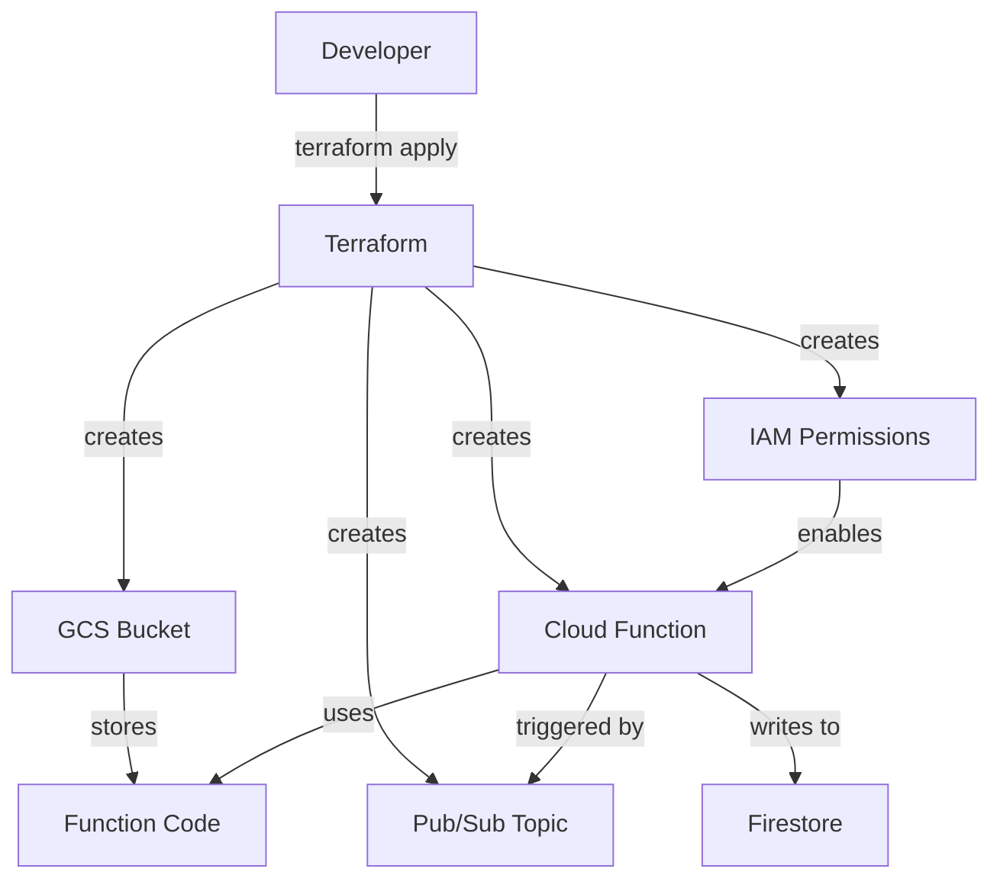

# Terraform GCP Cloud Functions

## Introduction

Google Cloud Functions is a serverless execution environment that allows you to run code without provisioning or managing servers. With Terraform, you can automate the deployment and management of these functions using infrastructure as code. This approach brings consistency, version control, and scalability to your serverless applications.

In this tutorial, we'll explore how to use Terraform to deploy, configure, and manage Google Cloud Functions. We'll cover everything from basic setup to advanced configurations, making it accessible for beginners while providing enough depth for practical applications.

## Prerequisites

Before we begin, ensure you have:

1. A Google Cloud Platform (GCP) account
2. Terraform installed on your local machine (version 0.12+)
3. Google Cloud SDK installed and configured
4. Basic understanding of Terraform concepts
5. Basic understanding of JavaScript or Python (for our function examples)

## Setting Up Your Environment

First, let's create a basic Terraform configuration for GCP:

```hcl
# main.tf
terraform {
  required_providers {
    google = {
      source  = "hashicorp/google"
      version = "~> 4.0"
    }
  }
}

provider "google" {
  project = "your-gcp-project-id"
  region  = "us-central1"
}
```

Replace `your-gcp-project-id` with your actual GCP project ID.

## Your First Cloud Function with Terraform

Let's create a simple HTTP-triggered Cloud Function:

1. Create a directory structure for your project:

```
terraform-gcp-function/
├── main.tf
├── variables.tf
├── outputs.tf
└── function-source/
    └── index.js
```

2. Add the following code to `function-source/index.js`:

```javascript
exports.helloWorld = (req, res) => {
  const message = req.query.message || "Hello, World!";
  res.status(200).send(message);
};
```

3. Now, let's define the Terraform configuration to deploy this function:

```hcl
# Create a Cloud Storage bucket for the function source code
resource "google_storage_bucket" "function_bucket" {
  name     = "${var.project_id}-function-bucket"
  location = var.region
  uniform_bucket_level_access = true
}

# Archive the function source code
data "archive_file" "source" {
  type        = "zip"
  source_dir  = "${path.module}/function-source"
  output_path = "${path.module}/function-source.zip"
}

# Upload the function source code to the bucket
resource "google_storage_bucket_object" "archive" {
  name   = "function-source-${data.archive_file.source.output_md5}.zip"
  bucket = google_storage_bucket.function_bucket.name
  source = data.archive_file.source.output_path
}

# Deploy the Cloud Function
resource "google_cloudfunctions_function" "hello_world" {
  name        = "hello-world-function"
  description = "A simple HTTP Cloud Function"
  runtime     = "nodejs16"

  available_memory_mb   = 128
  source_archive_bucket = google_storage_bucket.function_bucket.name
  source_archive_object = google_storage_bucket_object.archive.name
  trigger_http          = true
  entry_point           = "helloWorld"
}

# Make the Cloud Function publicly accessible
resource "google_cloudfunctions_function_iam_member" "invoker" {
  project        = google_cloudfunctions_function.hello_world.project
  region         = google_cloudfunctions_function.hello_world.region
  cloud_function = google_cloudfunctions_function.hello_world.name

  role   = "roles/cloudfunctions.invoker"
  member = "allUsers"
}
```

4. Create a `variables.tf` file:

```hcl
variable "project_id" {
  description = "The Google Cloud Project ID"
  type        = string
}

variable "region" {
  description = "The GCP region for deployment"
  type        = string
  default     = "us-central1"
}
```

5. Create an `outputs.tf` file to display the function URL:

```hcl
output "function_url" {
  description = "The URL of the deployed Cloud Function"
  value       = google_cloudfunctions_function.hello_world.https_trigger_url
}
```

## Deploying Your Cloud Function

Now that we've defined our Terraform configuration, let's deploy it:

1. Initialize Terraform:

```bash
terraform init
```

2. Plan the deployment:

```bash
terraform plan -var="project_id=your-gcp-project-id"
```

3. Apply the configuration:

```bash
terraform apply -var="project_id=your-gcp-project-id"
```

After successful deployment, Terraform will output the function URL. You can test it with:

```bash
curl https://your-function-url
# Output: Hello, World!

curl https://your-function-url?message=Welcome%20to%20Terraform%20on%20GCP
# Output: Welcome to Terraform on GCP
```

## Understanding Cloud Function Configurations

Let's explore the various configuration options available for GCP Cloud Functions in Terraform:

### Trigger Types

GCP Cloud Functions support various triggers:

#### HTTP Trigger (as shown above)

```hcl
trigger_http = true
```

#### Pub/Sub Trigger

```hcl
event_trigger {
  event_type = "google.pubsub.topic.publish"
  resource   = google_pubsub_topic.my_topic.name
}
```

#### Cloud Storage Trigger

```hcl
event_trigger {
  event_type = "google.storage.object.finalize"
  resource   = google_storage_bucket.my_bucket.name
}
```

### Memory and Timeout Settings

You can customize the memory allocation and timeout:

```hcl
available_memory_mb = 256
timeout            = 60
```

### Environment Variables

To set environment variables for your function:

```hcl
environment_variables = {
  API_KEY = "your-api-key"
  DEBUG   = "true"
}
```

## Advanced Example: Cloud Function with Pub/Sub Trigger

Let's create a more advanced example - a Cloud Function triggered by Pub/Sub messages that processes data and stores results in Firestore:

1. First, create the function source:

```
function-source/
└── index.js
```

Add this code to `index.js`:

```javascript
const { Firestore } = require('@google-cloud/firestore');
const firestore = new Firestore();

exports.processMessage = async (event, context) => {
  try {
    // Parse the Pub/Sub message
    const pubsubMessage = event.data
      ? Buffer.from(event.data, 'base64').toString()
      : 'No message data';
    
    console.log(`Processing message: ${pubsubMessage}`);
    
    // Parse the message as JSON
    const messageData = JSON.parse(pubsubMessage);
    
    // Store in Firestore
    const docRef = firestore.collection('processed_messages').doc();
    await docRef.set({
      originalMessage: messageData,
      processedAt: new Date().toISOString(),
      messageId: context.eventId
    });
    
    console.log(`Message stored with ID: ${docRef.id}`);
    return `Message processed successfully: ${docRef.id}`;
  } catch (error) {
    console.error('Error processing message:', error);
    throw error;
  }
};
```

2. Now, update the Terraform configuration:

```hcl
# Create a Pub/Sub topic
resource "google_pubsub_topic" "data_topic" {
  name = "data-processing-topic"
}

# Archive and upload function source
data "archive_file" "source" {
  type        = "zip"
  source_dir  = "${path.module}/function-source"
  output_path = "${path.module}/function-source.zip"
}

resource "google_storage_bucket_object" "archive" {
  name   = "function-source-${data.archive_file.source.output_md5}.zip"
  bucket = google_storage_bucket.function_bucket.name
  source = data.archive_file.source.output_path
}

# Deploy the Cloud Function with Pub/Sub trigger
resource "google_cloudfunctions_function" "data_processor" {
  name        = "data-processor-function"
  description = "Processes data from Pub/Sub and stores in Firestore"
  runtime     = "nodejs16"

  available_memory_mb   = 256
  source_archive_bucket = google_storage_bucket.function_bucket.name
  source_archive_object = google_storage_bucket_object.archive.name
  entry_point           = "processMessage"
  
  event_trigger {
    event_type = "google.pubsub.topic.publish"
    resource   = google_pubsub_topic.data_topic.name
  }

  # Grant the function service account access to Firestore
  service_account_email = google_service_account.function_account.email
}

# Create a service account for the function
resource "google_service_account" "function_account" {
  account_id   = "data-processor-sa"
  display_name = "Data Processor Service Account"
}

# Grant the service account Firestore access
resource "google_project_iam_member" "firestore_user" {
  project = var.project_id
  role    = "roles/datastore.user"
  member  = "serviceAccount:${google_service_account.function_account.email}"
}
```

3. Test your function by publishing a message to the Pub/Sub topic:

```bash
gcloud pubsub topics publish data-processing-topic --message='{"name":"Test User","action":"login","timestamp":"2023-06-15T10:30:00Z"}'
```

## Visualizing Terraform GCP Cloud Functions Architecture

Let's visualize the architecture we've created:



## Best Practices for Terraform GCP Cloud Functions

1. **Version Your Function Code**: Ensure your function source is versioned alongside your Terraform configuration.

2. **Use Variables and Modules**: Create reusable modules for common function patterns.

3. **Secure Function Access**: Only expose functions publicly when necessary. Use IAM for fine-grained access control.

4. **Monitor Resource Usage**: Set up appropriate monitoring for your functions.

5. **Use Terraform Workspaces**: For managing multiple environments (dev, staging, prod).

6. **Clean Up Unused Assets**: Regularly clean up unused function versions and associated resources.

7. **Follow Least Privilege Principle**: Create dedicated service accounts with minimal permissions.

Example of a modular approach:

```hcl
module "http_function" {
  source     = "./modules/http-function"
  name       = "api-endpoint"
  project_id = var.project_id
  region     = var.region
  source_dir = "${path.module}/functions/api"
  memory     = 128
  public     = true
}
```

## Working with Multiple Environments

To manage different environments (development, staging, production), you can use Terraform workspaces:

```bash
# Create workspaces
terraform workspace new dev
terraform workspace new staging
terraform workspace new prod

# Select workspace
terraform workspace select dev

# Apply with workspace-specific variables
terraform apply -var-file=dev.tfvars
```

Then structure your configuration to use workspace-specific names:

```hcl
locals {
  env = terraform.workspace
}

resource "google_cloudfunctions_function" "function" {
  name = "my-function-${local.env}"
  # Other configurations...
}
```

## Implementing CI/CD for Terraform GCP Cloud Functions

Here's a sample workflow for GitHub Actions:

```yaml
name: Deploy Cloud Functions

on:
  push:
    branches: [ main ]
  pull_request:
    branches: [ main ]

jobs:
  terraform:
    runs-on: ubuntu-latest
    steps:
    - uses: actions/checkout@v3
    
    - name: Setup Terraform
      uses: hashicorp/setup-terraform@v2
      
    - name: Terraform Init
      run: terraform init
      
    - name: Terraform Format
      run: terraform fmt -check
      
    - name: Terraform Plan
      run: terraform plan -var="project_id=${{ secrets.GCP_PROJECT_ID }}"
    
    - name: Terraform Apply
      if: github.ref == 'refs/heads/main' && github.event_name == 'push'
      run: terraform apply -auto-approve -var="project_id=${{ secrets.GCP_PROJECT_ID }}"
```

## Common Issues and Troubleshooting

### 1. Permission Issues

If you encounter permission errors, check:
- The service account has the necessary roles
- The Cloud Functions API is enabled

```hcl
resource "google_project_service" "cloudfunctions" {
  service            = "cloudfunctions.googleapis.com"
  disable_on_destroy = false
}
```

### 2. Deployment Failures

If your function fails to deploy:
- Check the function logs: `gcloud functions logs read function-name`
- Verify runtime compatibility
- Check for syntax errors in your function code

### 3. Trigger Issues

If triggers aren't working:
- For HTTP: Check IAM permissions
- For Pub/Sub: Verify topic existence and permissions
- For Storage: Check bucket configurations

## Summary

In this tutorial, we've covered:

1. Setting up Terraform for GCP Cloud Functions
2. Creating your first HTTP-triggered Cloud Function
3. Understanding trigger types and configuration options
4. Implementing a more advanced Pub/Sub triggered function
5. Best practices for managing Cloud Functions with Terraform
6. Working with multiple environments
7. Implementing CI/CD pipelines
8. Troubleshooting common issues

By using Terraform to manage your GCP Cloud Functions, you've gained the ability to version, automate, and scale your serverless infrastructure as code.

## Additional Resources

- [Terraform GCP Provider Documentation](https://registry.terraform.io/providers/hashicorp/google/latest/docs)
- [Google Cloud Functions Documentation](https://cloud.google.com/functions/docs)
- [Serverless Framework vs. Terraform](https://www.serverless.com/blog/serverless-framework-vs-terraform)

## Exercises

1. Create a Cloud Function triggered by a Cloud Storage bucket upload.
2. Implement a scheduled Cloud Function using Cloud Scheduler and Pub/Sub.
3. Create a module for reusable Cloud Function deployment patterns.
4. Set up a multi-environment configuration using Terraform workspaces.
5. Implement a CI/CD pipeline for your Cloud Functions project.

Remember that Terraform provides a powerful way to manage your cloud infrastructure, and Google Cloud Functions allow you to implement serverless logic. Together, they create a robust foundation for modern cloud applications.