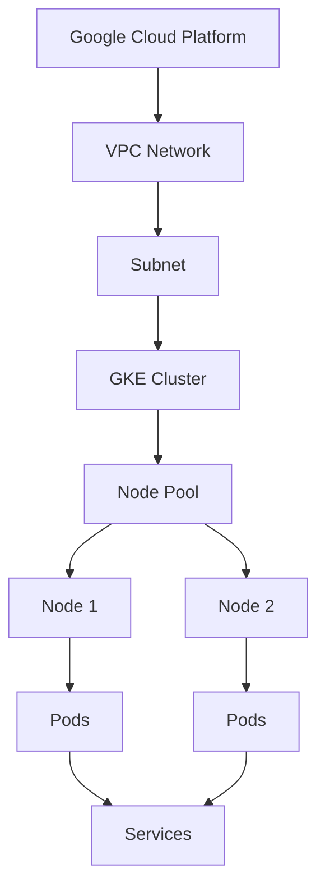

# Terraform GCP Kubernetes Engine

## Introduction

Google Kubernetes Engine (GKE) is a managed Kubernetes service that allows you to deploy, manage, and scale containerized applications on Google Cloud Platform using Kubernetes. Terraform, as an Infrastructure as Code tool, enables you to define and provision GKE clusters in a declarative way, making your infrastructure reproducible, version-controlled, and easier to maintain.

In this tutorial, we'll explore how to use Terraform to provision and manage GKE clusters on Google Cloud Platform. We'll cover everything from setting up the initial configuration to deploying a sample application on your newly created cluster.

## Prerequisites

Before we begin, make sure you have:

- A Google Cloud Platform account
- [Google Cloud SDK](https://cloud.google.com/sdk/docs/install) installed and configured
- [Terraform](https://www.terraform.io/downloads.html) installed (version 0.13+)
- [kubectl](https://kubernetes.io/docs/tasks/tools/) installed
- Basic understanding of Kubernetes concepts

## Setting Up Your Terraform Project

Let's start by creating a new directory for our Terraform project and setting up the basic configuration files.

```bash
mkdir terraform-gke-demo
cd terraform-gke-demo
touch main.tf variables.tf outputs.tf versions.tf
```

### Provider Configuration

First, let's define the required providers and their versions in `versions.tf`:

```hcl
terraform {
  required_providers {
    google = {
      source  = "hashicorp/google"
      version = "~> 4.0"
    }
  }
  required_version = ">= 0.13"
}
```

Next, configure the Google Cloud provider in `main.tf`:

```hcl
provider "google" {
  project = var.project_id
  region  = var.region
}
```

### Variables Definition

Define the variables in `variables.tf`:

```hcl
variable "project_id" {
  description = "GCP Project ID"
  type        = string
}

variable "region" {
  description = "GCP region"
  type        = string
  default     = "us-central1"
}

variable "zone" {
  description = "GCP zone"
  type        = string
  default     = "us-central1-a"
}

variable "cluster_name" {
  description = "Name of the GKE cluster"
  type        = string
  default     = "my-gke-cluster"
}

variable "network" {
  description = "VPC network to host the cluster"
  type        = string
  default     = "gke-network"
}

variable "subnetwork" {
  description = "Subnetwork to host the cluster"
  type        = string
  default     = "gke-subnet"
}

variable "ip_range_pods" {
  description = "IP range for pods"
  type        = string
  default     = "10.1.0.0/16"
}

variable "ip_range_services" {
  description = "IP range for services"
  type        = string
  default     = "10.2.0.0/16"
}

variable "node_count" {
  description = "Number of nodes in the node pool"
  type        = number
  default     = 2
}

variable "machine_type" {
  description = "Machine type for nodes"
  type        = string
  default     = "e2-medium"
}
```

## Creating a VPC Network

Let's create a dedicated VPC network for our GKE cluster. Add the following to your `main.tf`:

```hcl
resource "google_compute_network" "vpc" {
  name                    = var.network
  auto_create_subnetworks = false
}

resource "google_compute_subnetwork" "subnet" {
  name          = var.subnetwork
  region        = var.region
  network       = google_compute_network.vpc.name
  ip_cidr_range = "10.0.0.0/16"

  secondary_ip_range {
    range_name    = "pod-ranges"
    ip_cidr_range = var.ip_range_pods
  }

  secondary_ip_range {
    range_name    = "services-ranges"
    ip_cidr_range = var.ip_range_services
  }
}
```

## Creating a GKE Cluster

Now, let's define our GKE cluster resource. Add this to your `main.tf`:

```hcl
resource "google_container_cluster" "primary" {
  name     = var.cluster_name
  location = var.zone

  # We can't create a cluster with no node pool defined, but we want to only use
  # separately managed node pools. So we create the smallest possible default
  # node pool and immediately delete it.
  remove_default_node_pool = true
  initial_node_count       = 1

  network    = google_compute_network.vpc.name
  subnetwork = google_compute_subnetwork.subnet.name

  ip_allocation_policy {
    cluster_secondary_range_name  = "pod-ranges"
    services_secondary_range_name = "services-ranges"
  }

  # Enable Workload Identity
  workload_identity_config {
    workload_pool = "${var.project_id}.svc.id.goog"
  }
}

resource "google_container_node_pool" "primary_nodes" {
  name       = "${var.cluster_name}-node-pool"
  location   = var.zone
  cluster    = google_container_cluster.primary.name
  node_count = var.node_count

  node_config {
    oauth_scopes = [
      "https://www.googleapis.com/auth/logging.write",
      "https://www.googleapis.com/auth/monitoring",
      "https://www.googleapis.com/auth/devstorage.read_only",
      "https://www.googleapis.com/auth/compute",
    ]

    labels = {
      env = "dev"
    }

    machine_type = var.machine_type
    preemptible  = true
    metadata = {
      disable-legacy-endpoints = "true"
    }
  }
}
```

## Output Values

Let's define some useful output values in `outputs.tf`:

```hcl
output "kubernetes_cluster_name" {
  value       = google_container_cluster.primary.name
  description = "GKE Cluster Name"
}

output "kubernetes_cluster_host" {
  value       = google_container_cluster.primary.endpoint
  description = "GKE Cluster Host"
}

output "project_id" {
  value       = var.project_id
  description = "GCP Project ID"
}

output "region" {
  value       = var.region
  description = "GCP Region"
}

output "zone" {
  value       = var.zone
  description = "GCP Zone"
}
```

## Deploying the Infrastructure

Now that we have defined our infrastructure, let's deploy it. Create a `terraform.tfvars` file to set your variable values:

```hcl
project_id = "your-gcp-project-id"
region     = "us-central1"
zone       = "us-central1-a"
```

Initialize Terraform:

```bash
terraform init
```

Plan the deployment:

```bash
terraform plan
```

Apply the changes:

```bash
terraform apply
```

When prompted, type `yes` to confirm the deployment.

## Accessing Your GKE Cluster

After Terraform has finished deploying your infrastructure, you can configure `kubectl` to access your new GKE cluster:

```bash
gcloud container clusters get-credentials $(terraform output -raw kubernetes_cluster_name) \
    --zone $(terraform output -raw zone) \
    --project $(terraform output -raw project_id)
```

Verify your connection:

```bash
kubectl get nodes
```

You should see your GKE nodes listed.

## Deploying a Sample Application

Let's deploy a simple application to our new GKE cluster. Create a file named `deployment.yaml`:

```yaml
apiVersion: apps/v1
kind: Deployment
metadata:
  name: hello-app
spec:
  replicas: 3
  selector:
    matchLabels:
      app: hello
  template:
    metadata:
      labels:
        app: hello
    spec:
      containers:
      - name: hello
        image: gcr.io/google-samples/hello-app:1.0
        ports:
        - containerPort: 8080
---
apiVersion: v1
kind: Service
metadata:
  name: hello-service
spec:
  type: LoadBalancer
  selector:
    app: hello
  ports:
  - port: 80
    targetPort: 8080
```

Apply this configuration:

```bash
kubectl apply -f deployment.yaml
```

Check the deployment status:

```bash
kubectl get deployments
```

Check the service status:

```bash
kubectl get services
```

Once the external IP is provisioned, you can access your application at that IP address.

## Advanced Configuration

### Enabling Add-ons

You can enable various GKE add-ons to enhance your cluster's capabilities. Here's an example of enabling the HTTP load balancing add-on:

```hcl
resource "google_container_cluster" "primary" {
  # ... other configurations ...

  addons_config {
    http_load_balancing {
      disabled = false
    }
    horizontal_pod_autoscaling {
      disabled = false
    }
  }
}
```

### Private Clusters

For enhanced security, you might want to create a private GKE cluster. Here's how to modify your configuration:

```hcl
resource "google_container_cluster" "primary" {
  # ... other configurations ...

  private_cluster_config {
    enable_private_nodes    = true
    enable_private_endpoint = false
    master_ipv4_cidr_block  = "172.16.0.0/28"
  }

  master_authorized_networks_config {
    cidr_blocks {
      cidr_block   = "10.0.0.0/8"
      display_name = "internal"
    }
  }
}
```

### Auto-scaling Node Pools

Instead of setting a fixed node count, you can configure auto-scaling for your node pools:

```hcl
resource "google_container_node_pool" "primary_nodes" {
  # ... other configurations ...

  autoscaling {
    min_node_count = 1
    max_node_count = 5
  }
}
```

## Visualizing the Infrastructure

Let's use a Mermaid diagram to visualize our infrastructure:



## Cleaning Up

When you're finished with your GKE cluster, you can destroy the infrastructure to avoid incurring charges:

```bash
terraform destroy
```

When prompted, type `yes` to confirm.

## Summary

In this tutorial, we've learned how to use Terraform to provision and manage Google Kubernetes Engine clusters on Google Cloud Platform. We covered:

1. Setting up a Terraform project structure
2. Creating a dedicated VPC network
3. Provisioning a GKE cluster
4. Configuring node pools
5. Connecting to the cluster with kubectl
6. Deploying a sample application
7. Advanced configurations like add-ons, private clusters, and auto-scaling
8. Cleaning up resources

Using Terraform for managing your GKE infrastructure offers several benefits:

- Infrastructure as Code: Your infrastructure is defined in code, making it version-controlled and reproducible
- Declarative approach: You define the desired state, and Terraform handles the implementation details
- Resource dependency management: Terraform automatically handles the correct order of resource creation
- Easy updates and modifications: Changing your infrastructure is as simple as updating your Terraform code

## Additional Resources

To continue learning about Terraform and GKE, check out these resources:

- [Terraform Documentation for Google Provider](https://registry.terraform.io/providers/hashicorp/google/latest/docs)
- [Google Kubernetes Engine Documentation](https://cloud.google.com/kubernetes-engine/docs)
- [Kubernetes Official Documentation](https://kubernetes.io/docs/home/)

## Exercises

1. Modify the Terraform configuration to use a regional cluster instead of a zonal cluster.
2. Add another node pool with different machine types for specialized workloads.
3. Implement a continuous deployment pipeline for your application.
4. Configure cluster autoscaling to handle varying loads.
5. Set up monitoring and logging for your GKE cluster using Cloud Monitoring and Cloud Logging.