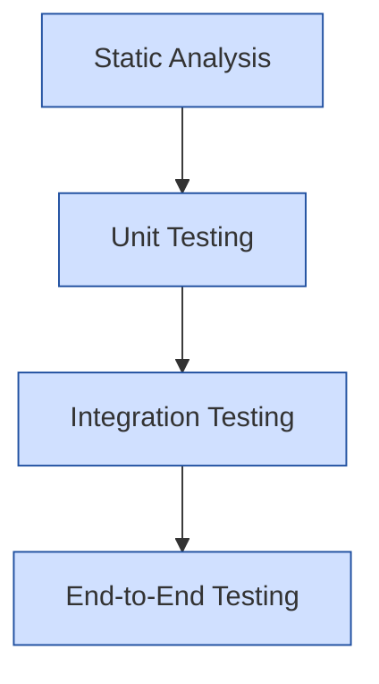

# Terraform Testing Introduction

## What is Terraform Testing?

Terraform testing is the practice of validating your infrastructure code before applying it to real environments. Just like application code needs testing, infrastructure code also requires validation to prevent errors, security vulnerabilities, and unexpected behaviors when deploying resources.

As your infrastructure grows in complexity, manual verification becomes impractical. Automated testing helps ensure your Terraform configurations are reliable, secure, and behave as intended.

## Why Test Terraform Code?

Testing your Terraform configurations offers several benefits:

1. **Catch errors early** - Identify syntax errors, misconfigurations, and logical issues before deploying
2. **Prevent costly mistakes** - Avoid provisioning unwanted or expensive resources in production
3. **Improve reliability** - Ensure consistent infrastructure deployments across environments
4. **Enable collaboration** - Allow teams to confidently make changes without breaking existing infrastructure
5. **Document expected behavior** - Tests serve as documentation for how your infrastructure should function

## Testing Hierarchy for Terraform

Terraform testing follows a similar hierarchy to traditional software testing:



Let's explore each level:

### 1. Static Analysis

Static analysis examines your code without executing it, checking for syntax errors, style issues, and potential problems.

#### Example: Using `terraform validate`

```bash
# Initialize the working directory
terraform init

# Run validation
terraform validate
```

**Output:**
```
Success! The configuration is valid.
```

#### Example: Using `terraform fmt`

```bash
# Format Terraform code according to conventions
terraform fmt

# Check for formatting issues (in CI/CD pipelines)
terraform fmt -check
```

### 2. Unit Testing

Unit tests verify individual components (modules) work correctly in isolation.

#### Example: Testing a Module with Terratest

First, create a simple module in `modules/s3_bucket/main.tf`:

```hcl
resource "aws_s3_bucket" "bucket" {
  bucket = var.bucket_name
  
  tags = {
    Environment = var.environment
    Project     = var.project_name
  }
}

variable "bucket_name" {
  type        = string
  description = "Name of the S3 bucket"
}

variable "environment" {
  type        = string
  description = "Deployment environment"
  default     = "dev"
}

variable "project_name" {
  type        = string
  description = "Project name for tagging"
  default     = "terraform-testing-demo"
}

output "bucket_name" {
  value       = aws_s3_bucket.bucket.bucket
  description = "Name of the created bucket"
}
```

Then, create a unit test in Go using Terratest in `test/s3_bucket_test.go`:

```go
package test

import (
  "testing"
  "github.com/gruntwork-io/terratest/modules/terraform"
  "github.com/stretchr/testify/assert"
)

func TestS3BucketModule(t *testing.T) {
  // Arrange
  terraformOptions := terraform.WithDefaultRetryableErrors(t, &terraform.Options{
    TerraformDir: "../modules/s3_bucket",
    Vars: map[string]interface{}{
      "bucket_name":  "test-bucket-terratest",
      "environment":  "test",
      "project_name": "terraform-testing-tutorial",
    },
  })

  // Act
  defer terraform.Destroy(t, terraformOptions)
  terraform.InitAndApply(t, terraformOptions)

  // Assert
  bucketName := terraform.Output(t, terraformOptions, "bucket_name")
  assert.Equal(t, "test-bucket-terratest", bucketName)
}
```

Run the test:

```bash
cd test
go test -v s3_bucket_test.go
```

### 3. Integration Testing

Integration tests verify that multiple modules work together correctly.

#### Example: Testing Multiple Resources

Create a test configuration that combines several modules:

```hcl
module "storage" {
  source      = "../modules/s3_bucket"
  bucket_name = "integration-test-storage"
  environment = "test"
}

module "lambda" {
  source        = "../modules/lambda_function"
  function_name = "test-processor"
  s3_bucket     = module.storage.bucket_name
  environment   = "test"
}
```

Then use Terratest to validate that the Lambda function can access the S3 bucket:

```go
func TestS3AndLambdaIntegration(t *testing.T) {
  terraformOptions := terraform.WithDefaultRetryableErrors(t, &terraform.Options{
    TerraformDir: "./test_fixtures/integration",
  })

  defer terraform.Destroy(t, terraformOptions)
  terraform.InitAndApply(t, terraformOptions)

  // Test that Lambda has correct permissions to access the bucket
  // ...additional assertions checking the integration
}
```

### 4. End-to-End Testing

End-to-end tests verify that your entire infrastructure works as expected in a real environment.

#### Example: Deploying and Testing a Complete Environment

```go
func TestCompleteEnvironment(t *testing.T) {
  terraformOptions := terraform.WithDefaultRetryableErrors(t, &terraform.Options{
    TerraformDir: "../environments/staging",
    Vars: map[string]interface{}{
      "region": "us-west-2",
    },
  })

  // Deploy the entire environment
  defer terraform.Destroy(t, terraformOptions)
  terraform.InitAndApply(t, terraformOptions)

  // Get outputs
  apiEndpoint := terraform.Output(t, terraformOptions, "api_endpoint")
  
  // Test the deployed infrastructure
  statusCode, body := testHttpEndpoint(t, apiEndpoint + "/health")
  assert.Equal(t, 200, statusCode)
  assert.Contains(t, body, "healthy")
}
```

## Popular Terraform Testing Tools

Several tools can help you implement testing for your Terraform code:

### 1. Built-in Terraform Commands

- `terraform validate` - Checks syntax and configuration
- `terraform plan` - Shows execution plan without applying
- `terraform fmt` - Formats code to standard style

### 2. Terratest

Terratest is a Go library that makes it easier to write automated tests for your infrastructure code.

Example installation:

```bash
go get github.com/gruntwork-io/terratest/modules/terraform
```

### 3. Kitchen-Terraform

Kitchen-Terraform combines Test Kitchen with Terraform, allowing you to test your configurations in isolated environments.

Example `.kitchen.yml` configuration:

```yaml
driver:
  name: terraform
  variable_files:
    - test/fixtures/variables.tfvars

provisioner:
  name: terraform

verifier:
  name: terraform
  groups:
    - name: default
      controls:
        - bucket_access
        - security_settings
      hostnames: test_instances.*.public_dns

platforms:
  - name: aws

suites:
  - name: default
    driver:
      root_module_directory: test/fixtures/default
```

### 4. Terraform AWS Provider Mock

For unit testing without actually creating resources, you can use mock providers.

Example:

```hcl
provider "aws" {
  region                      = "us-west-2"
  skip_credentials_validation = true
  skip_requesting_account_id  = true
  skip_metadata_api_check     = true
  s3_use_path_style           = true
  access_key                  = "mock_access_key"
  secret_key                  = "mock_secret_key"
  
  endpoints {
    s3 = "http://localhost:4566"  # LocalStack endpoint
  }
}
```

## Implementing a Basic Testing Workflow

Let's combine these concepts into a practical testing workflow:

1. **Set up a testing directory structure**:

```
project/
├── main.tf
├── variables.tf
├── outputs.tf  
├── modules/
│   └── network/
│       ├── main.tf
│       ├── variables.tf
│       └── outputs.tf
└── test/
    ├── go.mod
    ├── go.sum
    └── network_test.go
```

2. **Create a simple module to test** in `modules/network/main.tf`:

```hcl
resource "aws_vpc" "main" {
  cidr_block = var.vpc_cidr
  
  tags = {
    Name = var.vpc_name
    Environment = var.environment
  }
}

resource "aws_subnet" "public" {
  count = length(var.public_subnet_cidrs)
  
  vpc_id     = aws_vpc.main.id
  cidr_block = var.public_subnet_cidrs[count.index]
  
  tags = {
    Name = "${var.vpc_name}-public-${count.index}"
    Environment = var.environment
  }
}

variable "vpc_cidr" {
  type = string
  description = "CIDR block for the VPC"
}

variable "vpc_name" {
  type = string
  description = "Name of the VPC"
}

variable "environment" {
  type = string
  description = "Deployment environment"
}

variable "public_subnet_cidrs" {
  type = list(string)
  description = "List of public subnet CIDR blocks"
}

output "vpc_id" {
  value = aws_vpc.main.id
  description = "ID of the created VPC"
}

output "public_subnet_ids" {
  value = aws_subnet.public[*].id
  description = "IDs of the created public subnets"
}
```

3. **Write a test** in `test/network_test.go`:

```go
package test

import (
  "testing"
  "github.com/gruntwork-io/terratest/modules/terraform"
  "github.com/stretchr/testify/assert"
)

func TestNetworkModule(t *testing.T) {
  terraformOptions := terraform.WithDefaultRetryableErrors(t, &terraform.Options{
    TerraformDir: "../modules/network",
    Vars: map[string]interface{}{
      "vpc_cidr": "10.0.0.0/16",
      "vpc_name": "test-vpc",
      "environment": "test",
      "public_subnet_cidrs": []string{"10.0.1.0/24", "10.0.2.0/24"},
    },
  })

  // Clean up resources after the test
  defer terraform.Destroy(t, terraformOptions)
  
  // Initialize and apply the Terraform code
  terraform.InitAndApply(t, terraformOptions)
  
  // Validate VPC ID output
  vpcID := terraform.Output(t, terraformOptions, "vpc_id")
  assert.NotEmpty(t, vpcID)
  
  // Validate subnet IDs output
  subnetIDs := terraform.OutputList(t, terraformOptions, "public_subnet_ids")
  assert.Equal(t, 2, len(subnetIDs))
}
```

4. **Run the test**:

```bash
cd test
go mod init terraform-testing
go mod tidy
go test -v network_test.go
```

## Best Practices for Testing Terraform

1. **Start simple**: Begin with basic validation and gradually add more complex tests
2. **Test in isolation**: Use separate state files for tests to avoid interference
3. **Clean up resources**: Always destroy test resources when tests are complete
4. **Use test fixtures**: Create dedicated test configurations rather than testing production code directly
5. **Mock external dependencies**: Use local mocks or lightweight alternatives for external services when possible
6. **Test for failure**: Verify that your code fails appropriately with invalid inputs
7. **Automate testing**: Integrate tests into your CI/CD pipeline
8. **Tag test resources**: Add tags to identify resources created during testing for easier cleanup
9. **Minimize costs**: Use smaller resource sizes and limit test duration to control expenses
10. **Focus on critical paths**: Prioritize testing infrastructure components that present the highest risk

## Summary

Testing is an essential practice for maintaining reliable Terraform configurations. By implementing a comprehensive testing strategy that includes static analysis, unit testing, integration testing, and end-to-end testing, you can catch issues early and ensure your infrastructure performs as expected.

Start with simple validation using built-in Terraform commands, then gradually incorporate specialized testing tools like Terratest as your infrastructure grows in complexity. Remember that the goal of testing is to increase confidence in your infrastructure code and reduce the risk of errors in production environments.

## Additional Resources

- [Terraform Documentation](https://www.terraform.io/docs)
- [Terratest GitHub Repository](https://github.com/gruntwork-io/terratest)
- [Kitchen-Terraform](https://github.com/newcontext-oss/kitchen-terraform)

## Practice Exercises

1. Write a static analysis check for an existing Terraform project
2. Create a simple module and write a unit test for it using Terratest
3. Implement an integration test for two related modules
4. Set up a CI pipeline that runs your Terraform tests automatically
5. Create a mock provider configuration to test your AWS resources locally