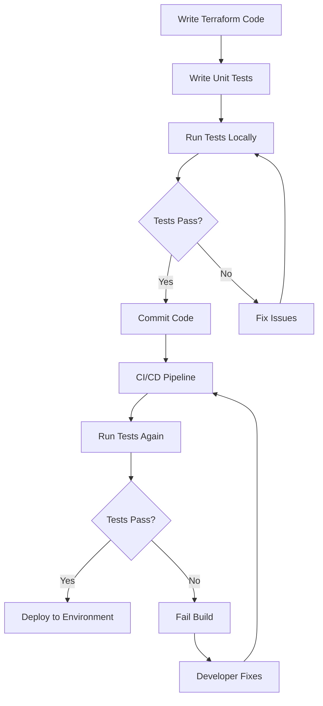

# Terraform Unit Testing

## Introduction

Unit testing is a fundamental practice in software development that helps ensure code quality and reliability. When applied to Infrastructure as Code (IaC) with Terraform, unit testing allows you to validate your infrastructure configurations before deploying them to any environment. This practice can catch errors early, ensure your code behaves as expected, and provide documentation for how your infrastructure should work.

In this guide, we'll explore how to implement unit testing for Terraform code, the tools available, and best practices to follow. By the end, you'll be able to write effective tests that verify your infrastructure definitions and prevent issues before they reach production.

## Why Unit Test Terraform Code?

Before diving into the "how," let's understand the "why" of Terraform unit testing:

1. **Early Detection of Issues**: Catch configuration errors before applying changes to actual infrastructure
2. **Validation of Logic**: Ensure conditional logic and variable transformations work correctly
3. **Documentation**: Tests serve as executable documentation of expected behavior
4. **Confidence in Changes**: Make changes with the assurance that critical functionality remains intact
5. **Consistent Infrastructure**: Guarantee that infrastructure meets expected standards

## Popular Tools for Terraform Unit Testing

Several tools can help you implement unit testing for Terraform code:

### Terratest

[Terratest](https://github.com/gruntwork-io/terratest) is a Go library that provides patterns and helper functions for testing infrastructure code.

### Terraform's Built-in Testing Framework

As of Terraform 0.15+, Terraform offers native testing capabilities through the `terraform test` command.

### Kitchen-Terraform

[Kitchen-Terraform](https://github.com/newcontext-oss/kitchen-terraform) combines Test Kitchen with Terraform to provide a testing framework that can validate the state after provisioning.

For this guide, we'll focus primarily on Terratest and Terraform's built-in testing framework as they are the most commonly used options.

## Getting Started with Terraform's Built-in Testing Framework

Terraform introduced a native testing framework that allows you to write tests directly in Terraform's own language (HCL). Let's explore how to use it:

### Setting Up Your Testing Environment

First, let's create a simple Terraform module that we want to test. For this example, we'll create a module that provisions an AWS S3 bucket:

```hcl
# main.tf
resource "aws_s3_bucket" "example" {
  bucket = var.bucket_name
  tags   = var.tags
}

variable "bucket_name" {
  description = "Name of the S3 bucket"
  type        = string
}

variable "tags" {
  description = "Tags to apply to the bucket"
  type        = map(string)
  default     = {}
}

output "bucket_id" {
  value = aws_s3_bucket.example.id
}
```

Next, create a test file in a `tests` directory:

```hcl
# tests/s3_bucket_test.tf
variables {
  bucket_name = "test-bucket-name"
  tags = {
    Environment = "test"
    Project     = "terraform-testing"
  }
}

run "verify_bucket_creation" {
  command = plan

  assert {
    condition     = aws_s3_bucket.example.bucket == var.bucket_name
    error_message = "Bucket name does not match input variable"
  }
}

run "verify_tags_are_applied" {
  command = plan

  assert {
    condition     = aws_s3_bucket.example.tags["Environment"] == "test"
    error_message = "Environment tag is not set correctly"
  }

  assert {
    condition     = aws_s3_bucket.example.tags["Project"] == "terraform-testing"
    error_message = "Project tag is not set correctly"
  }
}
```

To run the test:

```bash
terraform test
```

This will execute the tests defined in your test files and report on their success or failure.

## Using Terratest for More Complex Testing

When you need more complex testing scenarios or want to validate the actual deployed infrastructure, Terratest provides a powerful solution. Here's how to get started:

### Setting Up Terratest

1. First, ensure you have Go installed on your system
2. Create a `test` directory in your Terraform module
3. Initialize a Go module in this directory:

```bash
cd test
go mod init mymodule/test
go get github.com/gruntwork-io/terratest/modules/terraform
```

### Writing Your First Terratest Test

Create a file named `s3_bucket_test.go` in your test directory:

```go
package test

import (
    "testing"
    
    "github.com/gruntwork-io/terratest/modules/terraform"
    "github.com/stretchr/testify/assert"
)

func TestS3BucketCreation(t *testing.T) {
    // Construct the terraform options with default retryable errors
    terraformOptions := terraform.WithDefaultRetryableErrors(t, &terraform.Options{
        // The path to where our Terraform code is located
        TerraformDir: "../",
        
        // Variables to pass to our Terraform code using -var options
        Vars: map[string]interface{}{
            "bucket_name": "terratest-example-bucket",
            "tags": map[string]string{
                "Environment": "test",
                "Project":     "terratest-example",
            },
        },
    })
    
    // At the end of the test, run `terraform destroy` to clean up any resources that were created
    defer terraform.Destroy(t, terraformOptions)
    
    // Run `terraform init` and `terraform apply` and fail the test if there are any errors
    terraform.InitAndApply(t, terraformOptions)
    
    // Run `terraform output` to get the value of an output variable
    bucketID := terraform.Output(t, terraformOptions, "bucket_id")
    
    // Verify that the bucket has the expected name format
    assert.Equal(t, "terratest-example-bucket", bucketID)
}
```

To run the test:

```bash
cd test
go test -v
```

This will execute your test, provisioning real infrastructure, validating it, and then cleaning it up.

## Best Practices for Terraform Unit Testing

To make the most of your Terraform unit tests, follow these best practices:

### 1. Keep Tests Fast and Focused

Write tests that focus on specific functionality rather than testing everything in one go. This makes tests faster to run and easier to maintain.

```hcl
# Good practice: Focused test
run "verify_bucket_encryption" {
  command = plan

  assert {
    condition     = aws_s3_bucket.example.server_side_encryption_configuration[0].rule[0].apply_server_side_encryption_by_default[0].sse_algorithm == "AES256"
    error_message = "S3 bucket is not properly encrypted"
  }
}
```

### 2. Use Test Fixtures

For complex modules, create test fixtures - simplified versions of your infrastructure that focus on the specific aspects you want to test.

```
my-terraform-module/
├── main.tf
├── variables.tf
├── outputs.tf
├── test/
│   ├── fixtures/
│   │   ├── basic/
│   │   │   ├── main.tf
│   │   │   └── variables.tf
│   │   └── advanced/
│   │       ├── main.tf
│   │       └── variables.tf
│   └── s3_bucket_test.go
```

### 3. Mock External Dependencies

When possible, mock external dependencies to make tests more reliable and faster:

```go
// In Terratest, you can use mock AWS endpoints or the AWS LocalStack
localstackEndpoint := "http://localhost:4566"
os.Setenv("AWS_ENDPOINT", localstackEndpoint)
```

### 4. Test Both Success and Failure Scenarios

Don't just test that your infrastructure provisions correctly; also test that it fails when it should:

```hcl
run "should_fail_with_invalid_bucket_name" {
  command = plan
  expect_failures = [
    aws_s3_bucket.example,
  ]
  
  variables {
    bucket_name = "Invalid Bucket Name With Spaces"
  }
}
```

### 5. Include Compliance Tests

Test that your infrastructure meets organizational compliance requirements:

```hcl
run "verify_compliance" {
  command = plan

  assert {
    condition     = alltrue([for tag_key in ["Owner", "CostCenter"] : contains(keys(aws_s3_bucket.example.tags), tag_key)])
    error_message = "Required compliance tags are missing"
  }
}
```

## Unit Testing for Terraform Modules

When testing modules, you'll want to focus on the module's interface (inputs and outputs) and behavior. Here's an approach:

### Testing Module Outputs

```hcl
# Testing a module's outputs
module "s3_bucket" {
  source      = "../"
  bucket_name = "test-module-bucket"
  tags        = { Environment = "test" }
}

run "verify_module_outputs" {
  command = apply

  assert {
    condition     = module.s3_bucket.bucket_id != ""
    error_message = "Module should output a bucket ID"
  }
  
  assert {
    condition     = module.s3_bucket.bucket_arn != ""
    error_message = "Module should output a bucket ARN"
  }
}
```

### Testing Different Input Combinations

```hcl
# Test with minimal inputs
run "minimal_configuration" {
  variables {
    bucket_name = "minimal-test-bucket"
  }
  
  assert {
    condition     = aws_s3_bucket.example.bucket == "minimal-test-bucket"
    error_message = "Bucket name doesn't match with minimal configuration"
  }
}

# Test with full configuration
run "full_configuration" {
  variables {
    bucket_name = "full-test-bucket"
    tags = {
      Environment = "test"
      Project     = "terraform-testing"
      Owner       = "DevOps Team"
    }
  }
  
  assert {
    condition     = length(aws_s3_bucket.example.tags) == 3
    error_message = "Not all tags were applied in full configuration"
  }
}
```

## Real-world Example: Testing a Web Application Infrastructure

Let's walk through a more complex example of testing a module that provisions infrastructure for a web application:

```hcl
# modules/web_app/main.tf
resource "aws_s3_bucket" "static_files" {
  bucket = "${var.app_name}-static-files"
  acl    = "private"
  
  website {
    index_document = "index.html"
    error_document = "error.html"
  }
  
  tags = var.tags
}

resource "aws_cloudfront_distribution" "cdn" {
  origin {
    domain_name = aws_s3_bucket.static_files.bucket_regional_domain_name
    origin_id   = "S3-${aws_s3_bucket.static_files.bucket}"
  }
  
  enabled             = true
  default_root_object = "index.html"
  
  default_cache_behavior {
    allowed_methods  = ["GET", "HEAD"]
    cached_methods   = ["GET", "HEAD"]
    target_origin_id = "S3-${aws_s3_bucket.static_files.bucket}"
    
    forwarded_values {
      query_string = false
      cookies {
        forward = "none"
      }
    }
    
    viewer_protocol_policy = "redirect-to-https"
    min_ttl                = 0
    default_ttl            = 3600
    max_ttl                = 86400
  }
  
  restrictions {
    geo_restriction {
      restriction_type = "none"
    }
  }
  
  viewer_certificate {
    cloudfront_default_certificate = true
  }
  
  tags = var.tags
}
```

Here's how we might test this module:

```hcl
# tests/web_app_test.tf
variables {
  app_name = "test-webapp"
  tags = {
    Environment = "test"
    Project     = "terraform-testing-demo"
  }
}

run "verify_s3_configuration" {
  command = plan

  assert {
    condition     = aws_s3_bucket.static_files.bucket == "test-webapp-static-files"
    error_message = "S3 bucket name is not correctly generated"
  }
  
  assert {
    condition     = aws_s3_bucket.static_files.website[0].index_document == "index.html"
    error_message = "S3 website configuration is incorrect"
  }
}

run "verify_cloudfront_configuration" {
  command = plan

  assert {
    condition     = aws_cloudfront_distribution.cdn.enabled == true
    error_message = "CloudFront distribution should be enabled"
  }
  
  assert {
    condition     = aws_cloudfront_distribution.cdn.default_cache_behavior[0].viewer_protocol_policy == "redirect-to-https"
    error_message = "CloudFront should redirect to HTTPS"
  }
}

run "verify_security_configuration" {
  command = plan

  assert {
    condition     = aws_s3_bucket.static_files.acl == "private"
    error_message = "S3 bucket should be private"
  }
}
```

## Testing Workflow Visualization

Here's a visualization of the Terraform testing workflow:



## Integrating Tests in CI/CD Pipeline

To get the most value from your Terraform tests, integrate them into your CI/CD pipeline:

### Example GitLab CI Configuration

```yaml
stages:
  - validate
  - test
  - apply

validate:
  stage: validate
  script:
    - terraform init
    - terraform validate

unit_test:
  stage: test
  script:
    - terraform init
    - terraform test

terratest:
  stage: test
  image: golang:1.17
  script:
    - cd test
    - go mod download
    - go test -v -timeout 30m

apply:
  stage: apply
  script:
    - terraform init
    - terraform apply -auto-approve
  only:
    - main
```

### Example GitHub Actions Workflow

```yaml
name: Terraform Tests

on:
  push:
    branches: [ main ]
  pull_request:
    branches: [ main ]

jobs:
  test:
    runs-on: ubuntu-latest
    steps:
    - uses: actions/checkout@v2
    
    - name: Setup Terraform
      uses: hashicorp/setup-terraform@v1
      with:
        terraform_version: 1.0.0
    
    - name: Terraform Init
      run: terraform init
    
    - name: Terraform Validate
      run: terraform validate
    
    - name: Terraform Unit Tests
      run: terraform test
    
    - name: Setup Go
      uses: actions/setup-go@v2
      with:
        go-version: 1.17
    
    - name: Run Terratest
      run: |
        cd test
        go mod download
        go test -v -timeout 30m
```

## Common Testing Patterns

Here are some common patterns for Terraform testing:

### 1. Testing Required Variables

Test that your module fails when required variables are not provided:

```hcl
run "test_missing_required_variable" {
  command           =