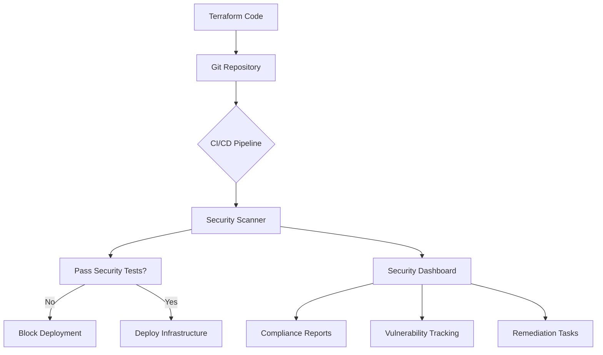

# Terraform Security Testing

## Introduction

Security is a critical aspect of infrastructure as code (IaC). When you define your infrastructure with Terraform, you're not just automating deployment—you're codifying security configurations that could potentially introduce vulnerabilities if not properly tested. Terraform security testing helps identify and mitigate security risks before they reach production environments.

In this guide, we'll explore how to implement security testing in your Terraform workflows. We'll cover static analysis tools, policy-as-code frameworks, and best practices to ensure your infrastructure remains secure and compliant.

## Why Security Testing in Terraform Matters

Infrastructure as code brings many benefits, but it also introduces new security challenges:

- Misconfigurations can be rapidly deployed at scale
- Security vulnerabilities in code can persist across multiple deployments
- Traditional security tools often don't work well with IaC

By implementing proper security testing, you can:

- Catch security issues early in the development cycle
- Enforce organizational security policies automatically
- Create auditable records of security compliance
- Reduce the risk of breaches and data loss

## Static Analysis Tools for Terraform

### Terraform Validate

The simplest form of security testing begins with Terraform's built-in validation:

```bash
terraform validate
```

While this command primarily checks syntax and configuration errors, it can catch issues that might lead to security problems. However, it doesn't perform deep security analysis.

### Example output:

```
Success! The configuration is valid.
```

Or if there's an error:

```
Error: Invalid resource type

  on main.tf line 15:
  15: resource "aws_security_group" "too_permissive" {

The provider provider.aws does not support resource type "aws_security_group".
```

### TFLint

TFLint is an open-source linter for Terraform code that can help identify potential issues:

```bash
# Install TFLint
brew install tflint  # macOS
# Or for Linux
curl -s https://raw.githubusercontent.com/terraform-linters/tflint/master/install_linux.sh | bash

# Run TFLint in your Terraform directory
tflint
```

Example configuration file (`.tflint.hcl`):

```hcl
plugin "aws" {
  enabled = true
  version = "0.13.4"
  source  = "github.com/terraform-linters/tflint-ruleset-aws"
}

rule "aws_resource_missing_tags" {
  enabled = true
  tags = ["Environment", "Owner"]
}
```

### Terrascan

Terrascan is a static code analyzer for infrastructure as code that detects security vulnerabilities and compliance issues:

```bash
# Install Terrascan
brew install terrascan  # macOS
# Or for Linux
curl -L "$(curl -s https://api.github.com/repos/accurics/terrascan/releases/latest | grep -o -E "https://.+?_Linux_x86_64.tar.gz")" > terrascan.tar.gz
tar -xf terrascan.tar.gz terrascan && rm terrascan.tar.gz
sudo mv terrascan /usr/local/bin/ && sudo chmod +x /usr/local/bin/terrascan

# Run Terrascan
terrascan scan -d /path/to/terraform/code
```

Example output:

```
Violation Details -

  Description    :  Instance does not have a monitoring role attached. Default role recommended: EMMonitoringRole
  File           :  demo.tf
  Module Name    :  root
  Plan Root      :  ./
  Line           :  23
  Severity       :  MEDIUM
  
Scan Summary -

  File/Folder         :  /path/to/terraform/code
  IaC Type            :  terraform
  Scanned At          :  2023-10-24 15:16:52.347006 +0000 UTC
  Policies Validated  :  615
  Violated Policies   :  1
  Low                 :  0
  Medium              :  1
  High                :  0
```

## Policy-as-Code with Terraform

### Sentinel (Terraform Cloud/Enterprise)

Sentinel is HashiCorp's policy-as-code framework for Terraform Cloud and Enterprise. It allows you to enforce policies on your Terraform configurations.

Example Sentinel policy to enforce encrypted S3 buckets:

```hcl
# require_s3_encryption.sentinel
import "tfplan"

# Get all S3 buckets from tfplan
s3_buckets = filter tfplan.resource_changes as _, rc {
    rc.type is "aws_s3_bucket" and
    (rc.change.actions contains "create" or rc.change.actions contains "update")
}

# Rule to check if S3 buckets have encryption enabled
encryption_enabled = rule {
    all s3_buckets as _, bucket {
        bucket.change.after.server_side_encryption_configuration is not null
    }
}

# Main rule that requires encryption to be enabled
main = rule {
    encryption_enabled
}
```

To use Sentinel, you need to:

1. Define policies in `.sentinel` files
2. Configure policy sets in Terraform Cloud/Enterprise
3. Specify enforcement levels (advisory, soft-mandatory, hard-mandatory)

### Open Policy Agent (OPA) with Conftest

For open-source alternatives, Open Policy Agent (OPA) with Conftest provides similar policy testing capabilities:

```bash
# Install Conftest
brew install conftest  # macOS
# Or for Linux
wget https://github.com/open-policy-agent/conftest/releases/download/v0.30.0/conftest_0.30.0_Linux_x86_64.tar.gz
tar xzf conftest_0.30.0_Linux_x86_64.tar.gz
sudo mv conftest /usr/local/bin

# Run Conftest on Terraform plan JSON
terraform plan -out=tfplan.binary
terraform show -json tfplan.binary > tfplan.json
conftest test tfplan.json -p security_policies/
```

Example OPA policy for Conftest:

```rego
package main

deny[msg] {
    resource := input.resource_changes[_]
    resource.type == "aws_security_group_rule"
    resource.change.after.cidr_blocks[_] == "0.0.0.0/0"
    resource.change.after.to_port == 22
    
    msg := "Security group rule allows SSH from the internet (0.0.0.0/0)"
}
```

## Terraform Security Scanner: Checkov

Checkov is a popular static code analysis tool for infrastructure as code that supports Terraform:

```bash
# Install Checkov
pip install checkov

# Run Checkov on Terraform directory
checkov -d /path/to/terraform/code
```

Example output:

```
Check: CKV_AWS_41: "Ensure no hard coded AWS access key and secret key in provider"
	PASSED for resource: aws.default
	File: /provider.tf:1-5

Check: CKV_AWS_23: "Ensure every security groups rule has a description"
	FAILED for resource: aws_security_group.allow_http
	File: /security_groups.tf:1-13
	Guide: https://docs.bridgecrew.io/docs/bc_aws_networking_4

...

SUMMARY
-------
Passed checks: 12, Failed checks: 3, Skipped checks: 0
```

### Integration with CI/CD Pipeline

Here's an example GitHub Actions workflow to run Checkov on your Terraform code:

```yaml
name: Terraform Security Scan

on:
  push:
    branches: [ main ]
  pull_request:
    branches: [ main ]

jobs:
  security-scan:
    runs-on: ubuntu-latest
    steps:
      - uses: actions/checkout@v2
      
      - name: Set up Python
        uses: actions/setup-python@v2
        with:
          python-version: 3.8
      
      - name: Install Checkov
        run: pip install checkov
      
      - name: Run Checkov
        run: checkov -d . --quiet --framework terraform
```

## Practical Example: Securing AWS Infrastructure

Let's walk through a practical example of identifying and fixing security issues in a Terraform configuration for AWS:

### Insecure Initial Configuration

```hcl
# main.tf - Insecure version
provider "aws" {
  region = "us-west-2"
}

resource "aws_s3_bucket" "data_bucket" {
  bucket = "my-important-data-bucket"
}

resource "aws_security_group" "web_server" {
  name        = "web-server-sg"
  description = "Allow web traffic"
  
  ingress {
    from_port   = 22
    to_port     = 22
    protocol    = "tcp"
    cidr_blocks = ["0.0.0.0/0"]
  }
  
  ingress {
    from_port   = 80
    to_port     = 80
    protocol    = "tcp"
    cidr_blocks = ["0.0.0.0/0"]
  }
  
  egress {
    from_port   = 0
    to_port     = 0
    protocol    = "-1"
    cidr_blocks = ["0.0.0.0/0"]
  }
}

resource "aws_instance" "web" {
  ami           = "ami-0c55b159cbfafe1f0"
  instance_type = "t2.micro"
  
  vpc_security_group_ids = [aws_security_group.web_server.id]
  
  root_block_device {
    volume_size = 8
  }
}
```

### Running Security Tests

Using Checkov:

```bash
checkov -f main.tf
```

Potential findings:
1. S3 bucket has no encryption
2. S3 bucket is not configured with versioning
3. SSH port 22 is open to the world
4. No security group rule descriptions
5. EC2 instance has no monitoring enabled

### Secure Version

```hcl
# main.tf - Secure version
provider "aws" {
  region = "us-west-2"
}

resource "aws_s3_bucket" "data_bucket" {
  bucket = "my-important-data-bucket"
  
  versioning {
    enabled = true
  }
  
  server_side_encryption_configuration {
    rule {
      apply_server_side_encryption_by_default {
        sse_algorithm = "AES256"
      }
    }
  }
  
  logging {
    target_bucket = aws_s3_bucket.log_bucket.id
    target_prefix = "log/"
  }
  
  tags = {
    Environment = "Production"
    Purpose     = "Data Storage"
  }
}

resource "aws_s3_bucket" "log_bucket" {
  bucket = "my-log-bucket"
  acl    = "log-delivery-write"
  
  server_side_encryption_configuration {
    rule {
      apply_server_side_encryption_by_default {
        sse_algorithm = "AES256"
      }
    }
  }
}

resource "aws_security_group" "web_server" {
  name        = "web-server-sg"
  description = "Allow restricted web traffic"
  
  ingress {
    description = "SSH from company VPN only"
    from_port   = 22
    to_port     = 22
    protocol    = "tcp"
    cidr_blocks = ["10.0.0.0/16"]  # Company VPN range
  }
  
  ingress {
    description = "HTTP from anywhere"
    from_port   = 80
    to_port     = 80
    protocol    = "tcp"
    cidr_blocks = ["0.0.0.0/0"]
  }
  
  egress {
    description = "Allow all outbound traffic"
    from_port   = 0
    to_port     = 0
    protocol    = "-1"
    cidr_blocks = ["0.0.0.0/0"]
  }
  
  tags = {
    Environment = "Production"
    Purpose     = "Web Server"
  }
}

resource "aws_instance" "web" {
  ami           = "ami-0c55b159cbfafe1f0"
  instance_type = "t2.micro"
  
  vpc_security_group_ids = [aws_security_group.web_server.id]
  
  monitoring = true
  
  root_block_device {
    volume_size = 8
    encrypted   = true
  }
  
  tags = {
    Environment = "Production"
    Purpose     = "Web Server"
  }
}
```

## Advanced Security Testing Techniques

### Custom Security Policies

You can create custom security policies tailored to your organization's needs. For example, a policy to enforce mandatory tagging with Checkov:

```python
# custom_checks/tag_enforcement.py
from checkov.common.models.enums import CheckResult, CheckCategories
from checkov.terraform.checks.resource.base_resource_check import BaseResourceCheck

class ResourceHasRequiredTags(BaseResourceCheck):
    def __init__(self):
        name = "Ensure all resources have required tags"
        id = "CKV_CUSTOM_1"
        supported_resources = ['aws_instance', 'aws_s3_bucket']
        categories = [CheckCategories.CONVENTION]
        super().__init__(name=name, id=id, categories=categories, supported_resources=supported_resources)
        
    def scan_resource_conf(self, conf):
        if 'tags' in conf.keys():
            tags = conf['tags'][0]
            required_tags = ['Environment', 'Owner', 'Purpose']
            
            for tag in required_tags:
                if tag not in tags:
                    return CheckResult.FAILED
                    
            return CheckResult.PASSED
            
        return CheckResult.FAILED

check = ResourceHasRequiredTags()
```

### Continuous Compliance with Security Dashboards

For ongoing security monitoring, you can integrate with security dashboard tools:



## Security Testing Best Practices

1. **Shift Left**: Integrate security testing as early as possible in your development workflow
2. **Test Configuration and Data**: Test both infrastructure configuration and data that will be used
3. **Use Multiple Tools**: Different tools catch different issues
4. **Automate Testing**: Run security tests automatically in CI/CD pipelines
5. **Define Security Baselines**: Create baseline policies for your organization
6. **Regular Audits**: Perform regular security audits of your Terraform code
7. **Keep Tools Updated**: Security tools need frequent updates to catch new vulnerabilities
8. **Validate Fixes**: Always re-test after fixing security issues

## Common Terraform Security Issues to Test For

1. **Overly Permissive Access**: Security groups with 0.0.0.0/0 CIDR ranges
2. **Unencrypted Data**: Storage resources without encryption enabled
3. **Public Resource Exposure**: S3 buckets or other storage made public
4. **Default Credentials**: Using default or hardcoded credentials
5. **Lack of Monitoring**: Resources without logging or monitoring
6. **Missing Tags**: Resources without proper identification tags
7. **Insecure Defaults**: Not overriding insecure default configurations
8. **Inadequate IAM Policies**: Too broad permissions in IAM roles

## Summary

Security testing is an essential part of the Terraform development lifecycle. By incorporating the tools and practices we've covered, you can identify and remediate security issues early, enforce organizational policies