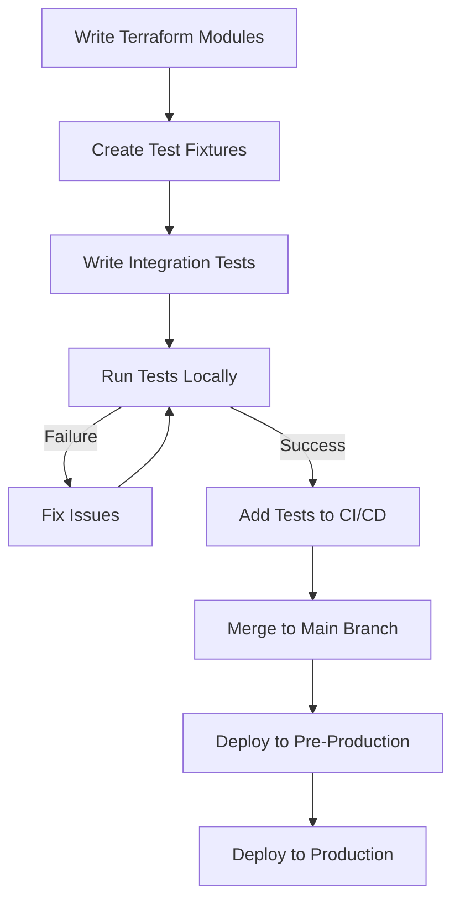

# Terraform Integration Testing

## Introduction

When working with Infrastructure as Code (IaC) using Terraform, testing becomes crucial to ensure your infrastructure definitions work as expected. While unit tests focus on validating individual components, **integration testing** verifies that different parts of your infrastructure work correctly together. This approach helps catch issues that might only appear when multiple resources interact in a real environment.

Integration testing for Terraform involves deploying actual resources to a test environment and verifying they function correctly. This process ensures your modules work in real-world scenarios before you deploy to production.

## Why Integration Testing Matters

Unlike unit tests that validate syntax and basic logic, integration tests verify that:

- Resources can be provisioned correctly
- Dependencies between resources work as expected
- Your infrastructure behaves properly in different environments
- Authentication and permissions are configured correctly
- Any external services your infrastructure depends on work as expected

## Setting Up Integration Tests

### Prerequisites

Before we begin, you'll need:

- Terraform CLI installed
- Access to a cloud provider (AWS, Azure, GCP, etc.)
- A test environment/account separate from production
- Basic understanding of testing concepts

### Directory Structure

A common structure for organizing Terraform integration tests looks like:

```
project/
├── main.tf
├── variables.tf
├── outputs.tf
├── modules/
│   └── my_module/
│       ├── main.tf
│       ├── variables.tf
│       └── outputs.tf
└── tests/
    └── integration/
        ├── fixtures/
        │   └── basic_usage/
        │       ├── main.tf
        │       ├── variables.tf
        │       └── outputs.tf
        ├── basic_test.go
        └── go.mod
```

### Testing Frameworks

While several frameworks exist, two popular options for Terraform integration testing are:

1. **Terratest** - A Go library that makes it easier to write automated tests for your infrastructure code
2. **Kitchen-Terraform** - A test framework allowing you to test Terraform configurations across different platforms

Let's explore both options.

## Integration Testing with Terratest

[Terratest](https://terratest.gruntwork.io/) is a Go library that provides patterns and helper functions for testing infrastructure code. It's designed to work with Terraform and other IaC tools.

### Installation

First, you'll need to set up a Go environment and create a test file:

```bash
mkdir -p tests/integration
cd tests/integration
go mod init integration
go get github.com/gruntwork-io/terratest/modules/terraform
```

### Creating Your First Test

Here's a basic example of a Terratest test for a simple AWS S3 bucket module:

```go
package test

import (
	"testing"

	"github.com/gruntwork-io/terratest/modules/aws"
	"github.com/gruntwork-io/terratest/modules/terraform"
	"github.com/stretchr/testify/assert"
)

func TestS3BucketCreation(t *testing.T) {
	// Terraform options with the path to your test fixture
	terraformOptions := terraform.WithDefaultRetryableErrors(t, &terraform.Options{
		TerraformDir: "./fixtures/s3-bucket",
		Vars: map[string]interface{}{
			"bucket_name": "terratest-bucket-example",
			"region":      "us-west-2",
		},
	})

	// Clean up resources after the test
	defer terraform.Destroy(t, terraformOptions)

	// Deploy the infrastructure
	terraform.InitAndApply(t, terraformOptions)

	// Validate that the bucket was created
	bucketName := terraform.Output(t, terraformOptions, "bucket_name")
	region := terraform.Output(t, terraformOptions, "region")
	
	// Verify bucket exists
	exists := aws.S3BucketExists(t, region, bucketName)
	assert.True(t, exists, "S3 bucket should exist")
	
	// Additional checks could include bucket properties, access policies, etc.
}
```

### Test fixture

You would need a test fixture (the actual Terraform code to test) in `./fixtures/s3-bucket/main.tf`:

```hcl
provider "aws" {
  region = var.region
}

resource "aws_s3_bucket" "test_bucket" {
  bucket = var.bucket_name
}

variable "bucket_name" {
  description = "Name of the S3 bucket"
  type        = string
}

variable "region" {
  description = "AWS region"
  type        = string
  default     = "us-west-2"
}

output "bucket_name" {
  value = aws_s3_bucket.test_bucket.bucket
}

output "region" {
  value = var.region
}
```

### Running the Test

Execute the test with:

```bash
cd tests/integration
go test -v
```

This will:
1. Initialize Terraform
2. Apply the configuration
3. Verify the S3 bucket exists
4. Destroy the infrastructure when done

## Integration Testing with Kitchen-Terraform

[Kitchen-Terraform](https://github.com/newcontext-oss/kitchen-terraform) combines Test Kitchen with Terraform to provide a flexible testing framework.

### Installation

```bash
gem install kitchen-terraform
```

### Configuration Files

Create a `.kitchen.yml` file:

```yaml
---
driver:
  name: terraform

provisioner:
  name: terraform

verifier:
  name: terraform

platforms:
  - name: aws

suites:
  - name: basic
    driver:
      root_module_directory: test/fixtures/basic
    verifier:
      systems:
        - name: aws
          backend: aws
          controls:
            - bucket_created
```

Create a control file `test/integration/basic/controls/bucket_created.rb`:

```ruby
control 'bucket_created' do
  impact 1.0
  title 'Confirm S3 bucket was created properly'
  desc 'Confirm S3 bucket exists and has the right properties'
  
  describe aws_s3_bucket(bucket_name: attribute('bucket_name')) do
    it { should exist }
    its('region') { should eq attribute('region') }
  end
end
```

### Test Fixture for Kitchen-Terraform

Create the test fixture at `test/fixtures/basic/main.tf`:

```hcl
provider "aws" {
  region = var.region
}

resource "aws_s3_bucket" "test" {
  bucket = var.bucket_name
}

variable "bucket_name" {
  description = "Name of the bucket"
  type        = string
  default     = "kitchen-test-bucket"
}

variable "region" {
  description = "AWS region"
  type        = string
  default     = "us-west-2"
}

output "bucket_name" {
  value = aws_s3_bucket.test.bucket
}

output "region" {
  value = var.region
}
```

### Running Kitchen-Terraform Tests

```bash
kitchen converge   # Apply the Terraform code
kitchen verify     # Run the tests
kitchen destroy    # Clean up
```

Or run the full test cycle with:

```bash
kitchen test
```

## Real-World Example: Testing a Multi-Tier Application

Let's create a more complex integration test for a multi-tier application with a database and web server.

### Project Structure

```
project/
├── modules/
│   ├── database/
│   │   ├── main.tf
│   │   ├── variables.tf
│   │   └── outputs.tf
│   └── webserver/
│       ├── main.tf
│       ├── variables.tf
│       └── outputs.tf
└── tests/
    └── integration/
        ├── fixtures/
        │   └── full_stack/
        │       ├── main.tf
        │       ├── variables.tf
        │       └── outputs.tf
        └── full_stack_test.go
```

### Test Fixture

Create a test fixture that combines both modules in `tests/integration/fixtures/full_stack/main.tf`:

```hcl
provider "aws" {
  region = var.region
}

module "database" {
  source         = "../../../../modules/database"
  db_name        = var.db_name
  instance_type  = "db.t3.micro"  # Test with smaller instance
}

module "webserver" {
  source           = "../../../../modules/webserver"
  instance_type    = "t3.micro"
  db_endpoint      = module.database.endpoint
  db_name          = var.db_name
  db_username      = module.database.username
  db_password      = module.database.password
}

variable "region" {
  description = "AWS region"
  type        = string
  default     = "us-west-2"
}

variable "db_name" {
  description = "Database name"
  type        = string
  default     = "test_db"
}

output "website_url" {
  value = module.webserver.public_url
}

output "db_endpoint" {
  value = module.database.endpoint
}
```

### Integration Test in Go

Create a test file `tests/integration/full_stack_test.go`:

```go
package test

import (
	"fmt"
	"testing"
	"time"
	"net/http"

	"github.com/gruntwork-io/terratest/modules/terraform"
	"github.com/stretchr/testify/assert"
)

func TestFullStackDeployment(t *testing.T) {
	terraformOptions := terraform.WithDefaultRetryableErrors(t, &terraform.Options{
		TerraformDir: "./fixtures/full_stack",
		Vars: map[string]interface{}{
			"db_name": fmt.Sprintf("test-db-%s", time.Now().Format("20060102150405")),
		},
	})
	
	// Clean up resources
	defer terraform.Destroy(t, terraformOptions)
	
	// Deploy the infrastructure
	terraform.InitAndApply(t, terraformOptions)
	
	// Get outputs
	websiteURL := terraform.Output(t, terraformOptions, "website_url")
	dbEndpoint := terraform.Output(t, terraformOptions, "db_endpoint")
	
	// Verify database endpoint is accessible
	assert.Contains(t, dbEndpoint, "rds.amazonaws.com", "Database endpoint should be an RDS instance")
	
	// Give some time for the web server to initialize
	time.Sleep(30 * time.Second)
	
	// Test web server response
	response, err := http.Get(fmt.Sprintf("http://%s", websiteURL))
	assert.NoError(t, err, "HTTP request to web server should succeed")
	assert.Equal(t, 200, response.StatusCode, "Web server should return HTTP 200")
}
```

## Best Practices for Terraform Integration Testing

### 1. Use Unique Resource Names

To avoid conflicts with other tests or existing resources, use unique naming patterns:

```hcl
locals {
  timestamp = replace(timestamp(), ":", "-")
  unique_id = "${var.prefix}-${local.timestamp}"
}

resource "aws_s3_bucket" "test" {
  bucket = "test-bucket-${local.unique_id}"
  # ...
}
```

### 2. Isolate Test Environments

Create separate accounts or projects for testing to avoid interfering with production resources.

### 3. Clean Up Resources

Always make sure your tests clean up resources after completion, even if they fail:

```go
defer terraform.Destroy(t, terraformOptions)
```

### 4. Test Real-World Scenarios

Test actual use cases rather than just verifying resource creation:

- Test connectivity between components
- Verify correct permissions and access control
- Check that applications can connect to databases
- Test failover and recovery scenarios

### 5. Use Smaller Resources

Use smaller, less expensive resources for testing:

```hcl
resource "aws_instance" "test" {
  instance_type = "t3.micro"  # Instead of larger instances
  # ...
}
```

### 6. Parallel Testing Considerations

When running tests in parallel, ensure they don't interfere with each other:

```go
t.Parallel()  // Mark test for parallel execution

// Use unique identifiers for resources
uniqueName := fmt.Sprintf("test-%s", random.UniqueId())
```

## Integration Testing in CI/CD Pipelines

Incorporating integration tests into your CI/CD pipeline ensures that infrastructure changes are validated before deployment.

Here's a sample workflow for GitHub Actions:

```yaml
name: Terraform Integration Tests

on:
  push:
    branches: [ main ]
  pull_request:
    branches: [ main ]

jobs:
  test:
    runs-on: ubuntu-latest
    steps:
    - uses: actions/checkout@v3
    
    - name: Set up Go
      uses: actions/setup-go@v3
      with:
        go-version: '1.20'
    
    - name: Set up Terraform
      uses: hashicorp/setup-terraform@v2
      with:
        terraform_version: '1.5.0'
    
    - name: Configure AWS credentials
      uses: aws-actions/configure-aws-credentials@v1
      with:
        aws-access-key-id: ${{ secrets.AWS_ACCESS_KEY_ID }}
        aws-secret-access-key: ${{ secrets.AWS_SECRET_ACCESS_KEY }}
        aws-region: us-west-2
    
    - name: Run Integration Tests
      run: |
        cd tests/integration
        go test -v -timeout 30m
```

## Visualizing the Testing Process

Here's a visual representation of the Terraform integration testing workflow:



## Common Challenges and Solutions

### Challenge: Slow Test Execution

**Solution**: Test only what's necessary and use parallel testing when possible:

```go
func TestMultipleComponents(t *testing.T) {
  t.Parallel() // Run tests in parallel
  
  // Test code...
}
```

### Challenge: Flaky Tests

**Solution**: Add retries and better error handling:

```go
func TestWithRetries(t *testing.T) {
  maxRetries := 3
  
  for i := 0; i < maxRetries; i++ {
    err := attemptTest()
    if err == nil {
      return // Success
    }
    
    t.Logf("Test attempt %d failed: %v. Retrying...", i+1, err)
    time.Sleep(10 * time.Second)
  }
  
  t.Fatalf("Test failed after %d attempts", maxRetries)
}
```

### Challenge: Managing Test Credentials

**Solution**: Use environment variables and secure CI/CD storage:

```go
accessKey := os.Getenv("AWS_ACCESS_KEY_ID")
secretKey := os.Getenv("AWS_SECRET_ACCESS_KEY")

if accessKey == "" || secretKey == "" {
  t.Fatal("AWS credentials must be set as environment variables")
}
```

## Summary

Integration testing is a crucial part of the Terraform development lifecycle. By validating that your infrastructure components work together correctly, you can catch issues early and deploy with confidence.

Key takeaways:

- Integration tests deploy real resources to verify actual behavior
- Tools like Terratest and Kitchen-Terraform make testing easier
- Clean up resources after testing to avoid unnecessary costs
- Include integration tests in your CI/CD pipeline
- Test realistic scenarios that reflect actual usage

## Additional Resources

- [Terratest Documentation](https://terratest.gruntwork.io/)
- [Kitchen-Terraform GitHub](https://github.com/newcontext-