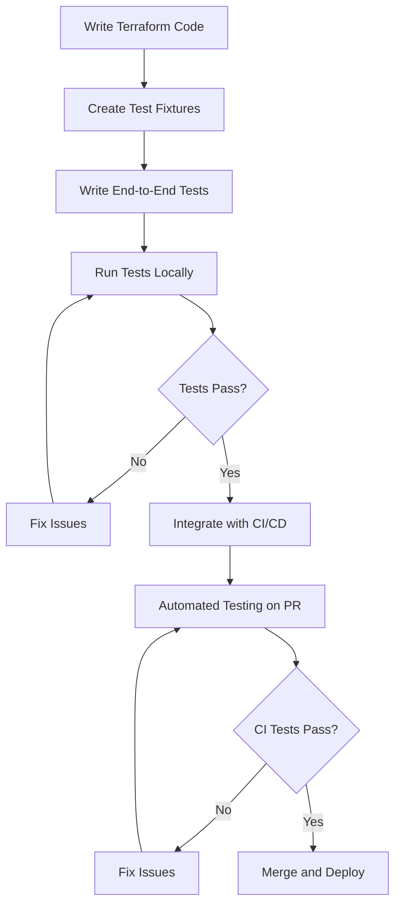

# Terraform End-to-End Testing

## Introduction

End-to-end testing is a critical component of any robust Terraform workflow. While unit testing helps validate individual resources and modules, end-to-end testing ensures that your entire infrastructure deployment functions correctly when all components interact with each other. 

In this guide, we'll explore how to implement comprehensive end-to-end testing for Terraform configurations, allowing you to catch potential issues before they impact your production environment.

## Why End-to-End Testing Matters

End-to-end testing for Terraform provides several key benefits:

1. **Validates Complete Workflows**: Tests the entire infrastructure provisioning process from start to finish
2. **Catches Integration Issues**: Identifies problems that only appear when components interact with each other
3. **Verifies Actual Behavior**: Confirms that resources work as expected in real environments
4. **Reduces Deployment Risks**: Prevents costly errors in production deployments

## End-to-End Testing Approaches

### Using Terratest

[Terratest](https://terratest.gruntwork.io/) is a popular Go library that makes it easier to write automated tests for your infrastructure code. It provides a collection of helper functions and patterns for testing Terraform code.

Here's a simple example of a Terratest test:

```go
package test

import (
	"testing"
	
	"github.com/gruntwork-io/terratest/modules/terraform"
	"github.com/stretchr/testify/assert"
)

func TestTerraformBasicExample(t *testing.T) {
	// Arrange
	terraformOptions := terraform.WithDefaultRetryableErrors(t, &terraform.Options{
		TerraformDir: "../examples/basic",
		Vars: map[string]interface{}{
			"region":      "us-west-2",
			"server_name": "terratest-example",
			"environment": "test",
		},
	})
	
	// Act
	// Clean up resources when the test completes
	defer terraform.Destroy(t, terraformOptions)
	
	// Initialize and apply Terraform
	terraform.InitAndApply(t, terraformOptions)
	
	// Assert
	// Get the outputs and make assertions
	instanceID := terraform.Output(t, terraformOptions, "instance_id")
	assert.NotEmpty(t, instanceID, "Instance ID should not be empty")
	
	publicIP := terraform.Output(t, terraformOptions, "public_ip")
	assert.NotEmpty(t, publicIP, "Public IP should not be empty")
}
```

This test:
1. Sets up Terraform options for your test environment
2. Runs `terraform init` and `terraform apply`
3. Validates the outputs match expected values
4. Cleans up resources with `terraform destroy` after tests complete

### Kitchen-Terraform

Another popular approach is [kitchen-terraform](https://github.com/newcontext-oss/kitchen-terraform), which integrates Terraform with Test Kitchen.

First, create a `.kitchen.yml` configuration file:

```yaml
---
driver:
  name: terraform
  root_module_directory: test/fixtures/basic_example

provisioner:
  name: terraform

verifier:
  name: terraform
  systems:
    - name: basic
      backend: local
      controls:
        - ec2
      hostnames: terraform::outputs::public_dns

platforms:
  - name: aws

suites:
  - name: default
```

Then create InSpec tests in `test/integration/default/controls/ec2.rb`:

```ruby
# frozen_string_literal: true

control 'ec2' do
  title 'EC2 Instance'

  describe aws_ec2_instance(terraform_state_output: 'instance_id') do
    it { should be_running }
    its('instance_type') { should eq 't2.micro' }
    
    it 'should have the correct tags' do
      expect(subject.tags).to include('Name' => 'test-instance')
      expect(subject.tags).to include('Environment' => 'test')
    end
  end
end
```

To run these tests:

```bash
$ kitchen converge   # Apply Terraform configuration
$ kitchen verify     # Run the tests
$ kitchen destroy    # Clean up resources
```

## Creating a Complete End-to-End Testing Pipeline

For a robust end-to-end testing workflow, follow these steps:

1. **Set Up a Test Environment**: Create an isolated environment for testing

2. **Implement the Testing Framework**: Choose between Terratest, Kitchen-Terraform, or other testing tools

3. **Write Test Cases**: Create comprehensive tests that verify your infrastructure

4. **Automate Tests in CI/CD**: Integrate tests into your CI/CD pipeline

### Example CI/CD Configuration for GitHub Actions

```yaml
name: 'Terraform E2E Tests'

on:
  push:
    branches: [ main ]
  pull_request:
    branches: [ main ]

jobs:
  terratest:
    name: 'Terratest'
    runs-on: ubuntu-latest
    
    steps:
    - name: Checkout
      uses: actions/checkout@v3
      
    - name: Set up Go
      uses: actions/setup-go@v3
      with:
        go-version: '1.19'
        
    - name: Configure AWS Credentials
      uses: aws-actions/configure-aws-credentials@v1
      with:
        aws-access-key-id: ${{ secrets.AWS_ACCESS_KEY_ID }}
        aws-secret-access-key: ${{ secrets.AWS_SECRET_ACCESS_KEY }}
        aws-region: us-west-2
        
    - name: Run Terratest
      run: |
        cd test
        go test -v -timeout 30m
```

## Best Practices for End-to-End Testing

### 1. Use Isolated Test Environments

Create dedicated testing environments that are completely separate from production:

```hcl
# variables.tf
variable "environment" {
  description = "The environment to deploy to (dev, test, prod)"
  type        = string
  default     = "test"
}

# main.tf
resource "aws_vpc" "main" {
  cidr_block = "10.0.0.0/16"
  
  tags = {
    Name        = "${var.environment}-vpc"
    Environment = var.environment
  }
}
```

### 2. Implement Test Fixtures

Create test fixtures to set up test scenarios:

```
project/
├── modules/
│   └── web_server/
├── test/
│   ├── fixtures/
│   │   └── basic_web_server/
│   │       ├── main.tf
│   │       ├── outputs.tf
│   │       └── variables.tf
│   └── web_server_test.go
```

Example fixture (`test/fixtures/basic_web_server/main.tf`):

```hcl
provider "aws" {
  region = "us-west-2"
}

module "web_server" {
  source = "../../../modules/web_server"
  
  instance_type  = "t2.micro"
  environment    = "test"
  server_name    = "test-web-server"
  vpc_id         = "vpc-12345678"  # Use a real VPC ID or create one in the fixture
}
```

### 3. Implement Idempotency Tests

Verify that your Terraform configurations are idempotent:

```go
func TestTerraformIdempotence(t *testing.T) {
	terraformOptions := terraform.WithDefaultRetryableErrors(t, &terraform.Options{
		TerraformDir: "../examples/basic",
	})
	
	// Clean up resources when test completes
	defer terraform.Destroy(t, terraformOptions)
	
	// Run init and apply
	terraform.InitAndApply(t, terraformOptions)
	
	// Store the outputs from the first apply
	firstApplyOutputs := terraform.OutputAll(t, terraformOptions)
	
	// Run apply again to verify idempotence
	terraform.Apply(t, terraformOptions)
	
	// Get outputs from second apply
	secondApplyOutputs := terraform.OutputAll(t, terraformOptions)
	
	// Verify outputs are identical between runs
	assert.Equal(t, firstApplyOutputs, secondApplyOutputs, "Outputs should be identical across terraform apply runs")
}
```

### 4. Test Real-World Scenarios

Create tests that verify the functionality, not just the existence of resources:

```go
func TestWebServerResponds(t *testing.T) {
	terraformOptions := terraform.WithDefaultRetryableErrors(t, &terraform.Options{
		TerraformDir: "../examples/web_server",
	})
	
	// Clean up resources when test completes
	defer terraform.Destroy(t, terraformOptions)
	
	// Run init and apply
	terraform.InitAndApply(t, terraformOptions)
	
	// Get the URL from the Terraform outputs
	webserverURL := terraform.Output(t, terraformOptions, "website_url")
	
	// Verify the web server returns a 200 OK
	http_helper.HttpGetWithRetry(t, webserverURL, nil, 200, "Hello, World!", 30, 5*time.Second)
}
```

## Visualizing the Testing Flow



## Common Challenges and Solutions

### Challenge 1: Long Test Execution Times

**Solution**: Parallelize tests and reuse resources when possible.

```go
func TestParallel(t *testing.T) {
    t.Parallel()
    
    // Test implementation
}
```

### Challenge 2: Managing Test State

**Solution**: Use unique resource names and clean up properly.

```hcl
locals {
  # Generate a unique ID for this test run
  unique_id = random_id.this.hex
}

resource "random_id" "this" {
  byte_length = 4
}

resource "aws_s3_bucket" "test" {
  bucket = "test-bucket-${local.unique_id}"
}
```

### Challenge 3: Testing Authorization and Authentication

**Solution**: Create test users and service accounts specifically for testing.

```hcl
resource "aws_iam_user" "test_user" {
  name = "terraform-test-user-${local.unique_id}"
}

resource "aws_iam_access_key" "test_user" {
  user = aws_iam_user.test_user.name
}

resource "aws_iam_user_policy" "test_policy" {
  user   = aws_iam_user.test_user.name
  policy = data.aws_iam_policy_document.test_permissions.json
}
```

## Example: Testing a Complete Web Application Infrastructure

Here's an example of testing a more complex setup with a web server, database, and load balancer:

```go
func TestCompleteWebApplication(t *testing.T) {
	terraformOptions := terraform.WithDefaultRetryableErrors(t, &terraform.Options{
		TerraformDir: "../examples/web_application",
		Vars: map[string]interface{}{
			"environment": "test",
			"db_username": "test",
			"db_password": "Password123!", // For testing only
		},
	})
	
	// Clean up resources when test completes
	defer terraform.Destroy(t, terraformOptions)
	
	// Run init and apply
	terraform.InitAndApply(t, terraformOptions)
	
	// Test the load balancer URL
	lbURL := terraform.Output(t, terraformOptions, "load_balancer_url")
	http_helper.HttpGetWithRetry(t, lbURL, nil, 200, "Welcome", 30, 5*time.Second)
	
	// Test the database connection
	dbHost := terraform.Output(t, terraformOptions, "database_host")
	// Use a database client to test connectivity
	// ...
	
	// Test scaling and load handling
	// ...
}
```

## Summary

End-to-end testing is an essential part of a mature Terraform workflow. By implementing comprehensive testing strategies, you can:

- Ensure your infrastructure works correctly before deployment
- Catch integration issues early in the development cycle
- Build confidence in your infrastructure-as-code implementation
- Reduce the risk of production outages

Remember that end-to-end testing complements, rather than replaces, other forms of Terraform testing like unit tests and static analysis. For the most robust infrastructure, implement a testing strategy that incorporates all these approaches.

## Additional Resources

- [Terratest Documentation](https://terratest.gruntwork.io/)
- [Kitchen-Terraform GitHub Repository](https://github.com/newcontext-oss/kitchen-terraform)
- [AWS Provider Testing Documentation](https://registry.terraform.io/providers/hashicorp/aws/latest/docs/guides/resource-tagging)
- [Testing Terraform Configurations Blog Series](https://www.hashicorp.com/blog/testing-hashicorp-terraform)

## Exercises

1. **Basic Integration Test**: Create a simple Terratest test for a Terraform configuration that provisions an AWS S3 bucket and verifies its properties.

2. **Multi-Environment Test**: Modify an existing Terraform configuration to support different environments (dev, test, prod) and write tests to verify environment-specific settings.

3. **Failure Testing**: Write tests that verify your Terraform configuration handles failure scenarios gracefully, such as when AWS service limits are reached.

4. **CI/CD Integration**: Set up a GitHub Actions workflow that runs your Terraform end-to-end tests automatically on each pull request.

5. **Advanced Testing**: Create a complete end-to-end test for a three-tier application with web servers, application servers, and a database. Verify that all components can communicate with each other correctly.