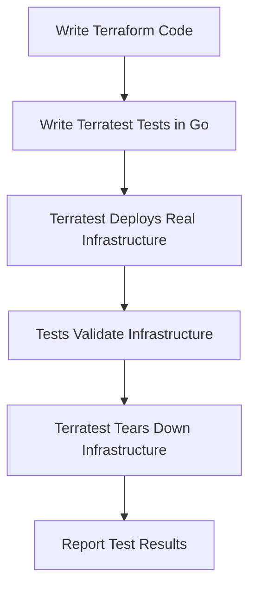

# Terraform with Terratest

## Introduction

Testing infrastructure code is just as important as testing application code. However, testing infrastructure presents unique challenges since it often involves creating real resources in cloud providers. Terratest is a Go library developed by Gruntwork that provides a powerful framework for testing Terraform code. It allows you to write automated tests that deploy your infrastructure, validate it works as expected, and then tear it down safely.

In this tutorial, we'll explore how to use Terratest to effectively test your Terraform configurations. We'll learn how to set up your testing environment, write basic and advanced tests, and integrate testing into your development workflow.

## Prerequisites

Before getting started with Terratest, make sure you have:

- Basic knowledge of Terraform concepts
- Go installed on your machine (version 1.13+)
- Terraform installed (version 0.12+)
- AWS account (for examples) or another cloud provider

## Understanding Terratest

Terratest is not a standalone application but a Go library that provides:

1. **Utility functions** - Helper functions to work with Terraform, AWS, GCP, Kubernetes, etc.
2. **Testing patterns** - Common testing patterns for infrastructure code
3. **Parallel execution** - Ability to run tests in parallel to speed up execution

Here's how Terratest fits into your infrastructure testing workflow:



## Setting Up Your Testing Environment

Let's start by setting up a simple project structure:

```
project/
├── main.tf              # Your Terraform configuration
├── variables.tf         # Terraform variables
├── outputs.tf           # Terraform outputs
└── test/
    └── terraform_test.go # Your Terratest test file
```

### 1. Install Go and set up a Go module

First, you need to initialize a Go module:

```bash
mkdir -p test
cd test
go mod init terraform-test
```

### 2. Install Terratest and required packages

```bash
go get github.com/gruntwork-io/terratest/modules/terraform
go get github.com/stretchr/testify/assert
```

## Your First Terratest Test

Let's create a simple Terraform configuration that provisions an AWS S3 bucket:

### main.tf

```hcl
provider "aws" {
  region = var.aws_region
}

resource "aws_s3_bucket" "test_bucket" {
  bucket = var.bucket_name
  
  tags = {
    Name        = var.bucket_name
    Environment = "Test"
  }
}
```

### variables.tf

```hcl
variable "aws_region" {
  description = "The AWS region to deploy to"
  default     = "us-east-1"
}

variable "bucket_name" {
  description = "The name of the S3 bucket"
  type        = string
}
```

### outputs.tf

```hcl
output "bucket_id" {
  value = aws_s3_bucket.test_bucket.id
}

output "bucket_arn" {
  value = aws_s3_bucket.test_bucket.arn
}
```

Now, let's write a Terratest test to verify this Terraform code. Create a file called `terraform_test.go` in the test directory:

```go
package test

import (
	"fmt"
	"testing"
	"time"

	"github.com/gruntwork-io/terratest/modules/random"
	"github.com/gruntwork-io/terratest/modules/terraform"
	"github.com/stretchr/testify/assert"
)

func TestTerraformAwsS3Example(t *testing.T) {
	// Generate a unique bucket name to avoid conflicts
	uniqueID := random.UniqueId()
	bucketName := fmt.Sprintf("terratest-s3-example-%s", uniqueID)

	// Construct the terraform options with default retryable errors
	terraformOptions := &terraform.Options{
		// The path to where our Terraform code is located
		TerraformDir: "..",

		// Variables to pass to our Terraform code using -var options
		Vars: map[string]interface{}{
			"bucket_name": bucketName,
		},
	}

	// At the end of the test, run `terraform destroy` to clean up any resources that were created
	defer terraform.Destroy(t, terraformOptions)

	// Run `terraform init` and `terraform apply`
	terraform.InitAndApply(t, terraformOptions)

	// Get the bucket ID from the Terraform outputs
	bucketID := terraform.Output(t, terraformOptions, "bucket_id")
	
	// Verify that the bucket exists
	assert.Equal(t, bucketName, bucketID)
}
```

## Running Your Terratest Tests

To run your test, navigate to the test directory and execute:

```bash
go test -v
```

This will:
1. Run `terraform init` and `terraform apply` with your Terraform configuration
2. Create the actual S3 bucket in AWS
3. Validate that the bucket ID matches what you expect
4. Clean up by running `terraform destroy`

## Advanced Testing Techniques

### 1. Testing Infrastructure Properties

We can extend our tests to validate specific properties of the created infrastructure:

```go
func TestS3BucketProperties(t *testing.T) {
	// Setup code (same as before)...

	// Get the bucket ARN from the Terraform outputs
	bucketARN := terraform.Output(t, terraformOptions, "bucket_arn")
	
	// Verify the bucket ARN format
	assert.Contains(t, bucketARN, "arn:aws:s3:::")
	assert.Contains(t, bucketARN, bucketName)
	
	// You could also use the AWS SDK to check bucket properties
	// (requires additional AWS SDK Go packages)
}
```

### 2. Testing Multiple Terraform Modules Together

Terratest allows you to test multiple modules working together:

```go
func TestMultipleModules(t *testing.T) {
	// For a VPC module
	vpcOptions := &terraform.Options{
		TerraformDir: "../modules/vpc",
		Vars: map[string]interface{}{
			"vpc_name": "terratest-vpc",
		},
	}
	
	// For an EC2 module that depends on the VPC
	ec2Options := &terraform.Options{
		TerraformDir: "../modules/ec2",
		Vars: map[string]interface{}{
			"vpc_id": terraform.Output(t, vpcOptions, "vpc_id"),
		},
	}
	
	// Clean up in reverse order
	defer terraform.Destroy(t, ec2Options)
	defer terraform.Destroy(t, vpcOptions)
	
	// Deploy VPC first
	terraform.InitAndApply(t, vpcOptions)
	
	// Then deploy EC2 instances
	terraform.InitAndApply(t, ec2Options)
	
	// Run your assertions...
}
```

### 3. Testing HTTP Endpoints

If your infrastructure sets up web servers or APIs, you can test them:

```go
func TestWebServer(t *testing.T) {
	// Deploy infrastructure...
	
	// Get the public URL output
	url := terraform.Output(t, terraformOptions, "public_url")
	
	// Make HTTP requests to verify the server works
	http_helper.HttpGetWithRetry(t, url, nil, 200, "Hello, World!", 30, 5*time.Second)
}
```

### 4. Parallel Test Execution

To speed up testing, Terratest supports parallel execution:

```go
func TestInParallel(t *testing.T) {
	t.Parallel()
	
	// Your test code here...
}
```

When running multiple tests with the `-parallel` flag, Go will run them concurrently:

```bash
go test -v -parallel 4
```

## Best Practices for Terratest

1. **Use unique identifiers**: Always use random generators to create unique resource names to avoid conflicts in concurrent tests.

```go
uniqueID := random.UniqueId()
bucketName := fmt.Sprintf("test-bucket-%s", uniqueID)
```

2. **Always clean up resources**: Use `defer` statements to ensure resources are cleaned up even if the test fails.

```go
defer terraform.Destroy(t, terraformOptions)
```

3. **Set short timeouts for dev/test**: Configure shorter retry attempts during development to fail fast.

```go
terraformOptions := &terraform.Options{
    TerraformDir: "..",
    MaxRetries:   3,
    TimeBetweenRetries: 5 * time.Second,
}
```

4. **Use test stages**: Break your tests into setup, validation, and teardown stages.

5. **Mock external services**: For faster tests, consider mocking external services when possible.

## Real-World Example: Testing an AWS Web Application

Let's create a more comprehensive example that tests a web application deployed on AWS:

### Terraform Configuration (main.tf)

```hcl
provider "aws" {
  region = var.aws_region
}

module "vpc" {
  source = "./modules/vpc"
  vpc_cidr_block = var.vpc_cidr_block
}

module "web_server" {
  source = "./modules/web_server"
  vpc_id = module.vpc.vpc_id
  subnet_id = module.vpc.public_subnet_id
  instance_type = var.instance_type
  app_name = var.app_name
}

output "web_url" {
  value = module.web_server.public_url
}
```

### Terratest Test

```go
package test

import (
	"fmt"
	"testing"
	"time"

	http_helper "github.com/gruntwork-io/terratest/modules/http-helper"
	"github.com/gruntwork-io/terratest/modules/random"
	"github.com/gruntwork-io/terratest/modules/terraform"
	"github.com/stretchr/testify/assert"
)

func TestWebApplication(t *testing.T) {
	t.Parallel()

	// Generate a unique app name
	uniqueID := random.UniqueId()
	appName := fmt.Sprintf("terratest-app-%s", uniqueID)

	terraformOptions := &terraform.Options{
		TerraformDir: "..",
		Vars: map[string]interface{}{
			"app_name":       appName,
			"instance_type":  "t3.micro",
			"vpc_cidr_block": "10.0.0.0/16",
		},
	}

	// Clean up resources when the test completes
	defer terraform.Destroy(t, terraformOptions)

	// Deploy the infrastructure
	terraform.InitAndApply(t, terraformOptions)

	// Get the URL of the deployed web server
	webURL := terraform.Output(t, terraformOptions, "web_url")

	// Test that the web server returns a 200 status code and contains the expected text
	maxRetries := 30
	timeBetweenRetries := 10 * time.Second
	
	http_helper.HttpGetWithRetry(
		t,
		webURL,
		nil,
		200,
		"Welcome to my web application",
		maxRetries,
		timeBetweenRetries,
	)

	// Additional tests for specific application functionality
	// For example, testing API endpoints
	apiURL := fmt.Sprintf("%s/api/status", webURL)
	statusCode, body := http_helper.HttpGet(t, apiURL, nil)
	
	assert.Equal(t, 200, statusCode)
	assert.Contains(t, body, "\"status\":\"ok\"")
}
```

## Integrating Terratest into CI/CD Pipelines

For effective infrastructure testing, you should integrate Terratest into your CI/CD pipeline:

### GitHub Actions Example

```yaml
name: Terraform Tests

on:
  push:
    branches: [ main, develop ]
  pull_request:
    branches: [ main ]

jobs:
  test:
    runs-on: ubuntu-latest

    steps:
    - uses: actions/checkout@v2

    - name: Set up Go
      uses: actions/setup-go@v2
      with:
        go-version: 1.17

    - name: Install Terraform
      uses: hashicorp/setup-terraform@v1
      with:
        terraform_version: 1.0.0

    - name: Configure AWS Credentials
      uses: aws-actions/configure-aws-credentials@v1
      with:
        aws-access-key-id: ${{ secrets.AWS_ACCESS_KEY_ID }}
        aws-secret-access-key: ${{ secrets.AWS_SECRET_ACCESS_KEY }}
        aws-region: us-east-1

    - name: Run Tests
      run: |
        cd test
        go test -v -timeout 30m
```

## Common Testing Patterns

### 1. Deployment Testing

Tests that infrastructure can be deployed without errors.

### 2. Functional Testing

Tests that infrastructure performs its intended function (e.g., serving web pages).

### 3. Integration Testing 

Tests that multiple infrastructure components work together.

### 4. Security Testing

Tests that infrastructure meets security requirements:

```go
func TestSecurityGroups(t *testing.T) {
	// Deploy infrastructure...
	
	// Get security group ID
	sgID := terraform.Output(t, terraformOptions, "security_group_id")
	
	// Use AWS SDK to verify no ports are exposed to 0.0.0.0/0 except 443
	// This would require AWS SDK code
}
```

### 5. Performance Testing

Tests that infrastructure meets performance requirements:

```go
func TestLoadBalancerPerformance(t *testing.T) {
	// Deploy infrastructure...
	
	// Get endpoint URL
	url := terraform.Output(t, terraformOptions, "load_balancer_url")
	
	// Make concurrent requests to verify response time
	// This would require custom HTTP benchmarking code
}
```

## Debugging Terratest

When your tests fail, here are some strategies to debug:

1. **Examine Terraform logs**: Terratest stores Terraform output in `.test-data` directory
2. **Add `t.Log` statements**: Add detailed logging to your tests
3. **Turn off auto-destroy**: To inspect resources, use `SkipCleanupOnError` option:

```go
terraformOptions := &terraform.Options{
	TerraformDir: "..",
	Vars: map[string]interface{}{
		"bucket_name": bucketName,
	},
	// For debugging: skip destroy if test fails
	NoDestroy: testing.Short(),
}
```

Then run tests with the `-short` flag to skip cleanup on failures:

```bash
go test -v -short
```

Remember to clean up resources manually after debugging!

## Summary

Terratest provides a powerful framework for testing Terraform code by deploying real infrastructure and validating it works as expected. In this tutorial, we covered:

- Setting up your Terratest environment
- Writing basic and advanced infrastructure tests
- Testing multiple modules together
- Validating infrastructure properties
- Integrating tests into CI/CD pipelines
- Common testing patterns and debugging strategies

By incorporating Terratest into your infrastructure development workflow, you can catch issues early, validate infrastructure functionality, and deploy with confidence.

## Additional Resources

- [Terratest GitHub Repository](https://github.com/gruntwork-io/terratest)
- [Terratest Documentation](https://terratest.gruntwork.io/docs/)
- [Go Testing Package Documentation](https://golang.org/pkg/testing/)

## Exercises

1. Create a Terraform configuration that deploys a simple VPC with a public subnet, then write Terratest tests to verify the CIDR blocks and route tables.

2.