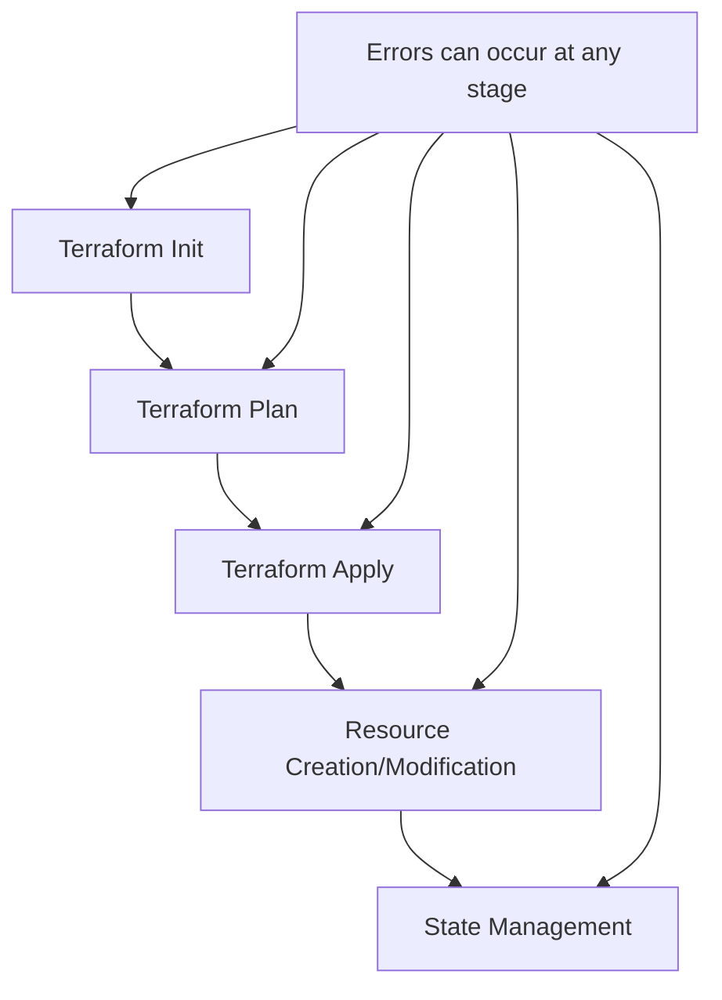

# Terraform Debugging Techniques

## Introduction

When working with Terraform to manage your infrastructure as code, you'll inevitably encounter situations where things don't work as expected. Whether it's a syntax error, a failed resource creation, or unexpected state behavior, effective debugging skills are essential to resolve these issues efficiently. This guide will walk you through various debugging techniques in Terraform that will help you identify, understand, and fix problems in your infrastructure code.

## Understanding Terraform's Execution Flow

Before diving into debugging techniques, it's helpful to understand how Terraform executes your code:



Knowing where in this process an error occurs can help narrow down the debugging approach needed.

## Basic Debugging Techniques

### 1. Enabling Verbose Logging

Terraform provides different verbosity levels that can help you understand what's happening under the hood.

```bash
# Set the TF_LOG environment variable to one of: TRACE, DEBUG, INFO, WARN, ERROR
export TF_LOG=TRACE

# Run your terraform command
terraform apply
```

Example output with TRACE logging:

```
2023-10-15T14:30:22.123Z [TRACE] Executing graph transform *terraform.ConfigTransformer
2023-10-15T14:30:22.124Z [TRACE] ConfigTransformer: Starting for path: 
2023-10-15T14:30:22.124Z [TRACE] Building resource graph for module: root
2023-10-15T14:30:22.125Z [TRACE] ReferenceTransformer: aws_instance.example references: [aws_security_group.example]
```

You can also output logs to a file:

```bash
export TF_LOG_PATH=./terraform.log
```

### 2. Using `terraform fmt` for Syntax Validation

The `terraform fmt` command helps identify and fix formatting issues, which can sometimes reveal syntax problems:

```bash
terraform fmt -check -diff
```

Example output:
```
main.tf
--- old/main.tf
+++ new/main.tf
@@ -5,7 +5,7 @@
 resource "aws_instance" "example" {
   ami           = "ami-0c55b159cbfafe1f0"
   instance_type = "t2.micro"
-  tags = {
+  tags          = {
     Name = "ExampleInstance"
   }
 }
```

### 3. Terraform Validate

The `terraform validate` command checks your configuration files for syntax errors and other issues:

```bash
terraform validate
```

Output for a valid configuration:
```
Success! The configuration is valid.
```

Output for an invalid configuration:
```
Error: Missing required argument

  on main.tf line 4, in resource "aws_instance" "example":
   4: resource "aws_instance" "example" {

The argument "ami" is required, but no definition was found.
```

## Intermediate Debugging Techniques

### 1. Using `terraform console`

The Terraform console provides an interactive environment to test expressions and functions:

```bash
terraform console
```

Inside the console, you can evaluate expressions:

```
> var.environment
"development"

> length(var.subnet_ids)
3

> formatdate("YYYY-MM-DD", timestamp())
"2023-10-15"
```

### 2. Targeted Plan and Apply

To focus on specific resources for debugging:

```bash
terraform plan -target=aws_instance.example
```

This generates a plan that only includes the specified resource and its dependencies.

### 3. Terraform State Examination

The `terraform state` command helps debug issues related to state:

```bash
# List all resources in state
terraform state list

# Show details about a specific resource
terraform state show aws_instance.example
```

Example output of `terraform state show`:

```
# aws_instance.example:
resource "aws_instance" "example" {
    ami                          = "ami-0c55b159cbfafe1f0"
    arn                          = "arn:aws:ec2:us-west-2:123456789012:instance/i-0123456789abcdef"
    associate_public_ip_address  = true
    availability_zone            = "us-west-2a"
    cpu_core_count               = 1
    cpu_threads_per_core         = 1
    # ... other attributes ...
}
```

## Advanced Debugging Techniques

### 1. Customizing the Terraform Provider Debug Output

For provider-specific debugging:

```bash
# For AWS provider
export AWS_DEBUG=true
export AWS_SDK_LOAD_CONFIG=1

# For Azure provider
export ARM_CLIENT_DEBUG=true
```

### 2. Using `-refresh=false` to Skip State Refresh

When dealing with state inconsistencies:

```bash
terraform plan -refresh=false
```

This helps isolate whether the issue is related to the current state or the configuration.

### 3. Debugging Provider API Calls

To see the actual API calls made by Terraform to your cloud provider:

```bash
# For AWS provider
export TF_LOG=DEBUG
export AWS_DEBUG=true

terraform apply
```

Example output snippet:
```
2023-10-15T15:45:30.456Z [DEBUG] plugin.terraform-provider-aws: [aws-sdk-go] DEBUG: Request ec2/DescribeInstances Details:
---[ REQUEST POST-SIGN ]-----------------------------
POST / HTTP/1.1
Host: ec2.us-west-2.amazonaws.com
User-Agent: aws-sdk-go/1.40.0 (go1.17; linux; amd64)
Content-Length: 128
Authorization: AWS4-HMAC-SHA256 ...
```

## Debugging Common Issues

### 1. State Lock Issues

When Terraform can't acquire a state lock:

```bash
terraform force-unlock LOCK_ID
```

Replace `LOCK_ID` with the ID from the error message.

### 2. Dependency Problems

Use the `-detailed-exitcode` flag to get more information about dependencies:

```bash
terraform plan -detailed-exitcode
```

### 3. Provider Authentication Issues

Check provider configuration and authentication:

```bash
# For AWS
aws sts get-caller-identity

# For Azure
az account show
```

## Working with Terraform Debugging Tools

### 1. Sentinel Policy Debugging

For organizations using Terraform Enterprise with Sentinel policies:

```bash
terraform plan -out=tfplan
terraform show -json tfplan > plan.json
sentinel apply -trace my-policy.sentinel
```

### 2. Using `terraform graph`

Visualize resource dependencies:

```bash
terraform graph | dot -Tsvg > graph.svg
```

This generates a visual representation of your Terraform resource graph.

### 3. Using External Linters and Validators

Tools like `tflint` can identify issues that Terraform's native validation might miss:

```bash
tflint --module

# Sample output
main.tf:10:1: Error: instance_type is t2.micro, but has less than 4 GB memory. This is too small for the application and may fail to run. (aws_instance_invalid_type)
```

## Real-world Debugging Scenario

Let's walk through a common scenario: debugging a failed AWS EC2 instance creation.

**The Issue:** Terraform fails to create an EC2 instance with the following error:

```
Error: Error launching source instance: VPCIdNotSpecified: No default VPC for this user
```

**Debugging Process:**

1. **Identify the problem:** The error indicates an issue with VPC configuration.

2. **Check the resource configuration:**

```hcl
resource "aws_instance" "web" {
  ami           = "ami-0c55b159cbfafe1f0"
  instance_type = "t2.micro"
  
  # Missing subnet_id or vpc_security_group_ids
}
```

3. **Add the necessary configuration:**

```hcl
resource "aws_instance" "web" {
  ami                    = "ami-0c55b159cbfafe1f0"
  instance_type          = "t2.micro"
  subnet_id              = aws_subnet.main.id
  vpc_security_group_ids = [aws_security_group.allow_web.id]
}

resource "aws_subnet" "main" {
  vpc_id     = aws_vpc.main.id
  cidr_block = "10.0.1.0/24"
}

resource "aws_vpc" "main" {
  cidr_block = "10.0.0.0/16"
}
```

4. **Run plan to verify:**

```bash
terraform plan
```

5. **Apply the fix:**

```bash
terraform apply
```

## Error Patterns and Solutions

Here's a quick reference guide for common Terraform errors:

| Error Pattern | Possible Cause | Solution |
|---------------|---------------|----------|
| `Error: No configuration files` | Running Terraform outside of a configuration directory | Change to the directory containing .tf files |
| `Error: Failed to load state` | State file is corrupted or inaccessible | Check state storage backend configuration |
| `Error: Provider configuration not present` | Provider not initialized | Run `terraform init` |
| `Error: Invalid resource type` | Typo in resource type | Check resource type spelling |
| `Error: Reference to undeclared resource` | Referenced a resource that doesn't exist | Check resource names and dependencies |

## Best Practices for Testable Terraform Code

To minimize debugging in the first place:

1. **Modularize your code:** Smaller, focused modules are easier to test and debug

2. **Use variables and locals for clarity:**

```hcl
locals {
  common_tags = {
    Environment = var.environment
    Project     = var.project_name
    ManagedBy   = "Terraform"
  }
}

resource "aws_instance" "example" {
  # ... other configurations ...
  tags = merge(local.common_tags, {
    Name = "ExampleInstance"
  })
}
```

3. **Always run `terraform plan` before `apply`**

4. **Set up automated testing** with tools like Terratest or Kitchen-Terraform

5. **Use descriptive naming** for resources to make debugging easier

## Summary

Debugging Terraform configurations requires a systematic approach and understanding of both Terraform's behavior and the underlying infrastructure providers. By mastering these debugging techniques, you'll be able to:

- Quickly identify the root cause of issues
- Understand the state of your infrastructure
- Efficiently resolve problems in your Terraform code
- Write more robust infrastructure as code

Remember that effective debugging is as much about prevention as it is about fixing issues. Use good practices like code modularity, version control, and thorough testing to minimize debugging needs.

## Additional Resources

- [Terraform Documentation on Debugging](https://www.terraform.io/docs/internals/debugging.html)
- [Terraform Best Practices](https://www.terraform-best-practices.com/)
- [AWS Provider Documentation](https://registry.terraform.io/providers/hashicorp/aws/latest/docs)

## Exercises

1. Set up a simple EC2 instance with Terraform, intentionally omit the AMI ID, and use debugging techniques to identify and fix the issue.

2. Create a module with circular dependencies, then use `terraform graph` to visualize and resolve the problem.

3. Use `terraform console` to test different variable combinations before implementing them in your configuration.

4. Experiment with different log levels (`TF_LOG` values) to understand what information each provides.

5. Create a configuration with resources spread across multiple providers, then use targeted applies to debug specific portions of your infrastructure.