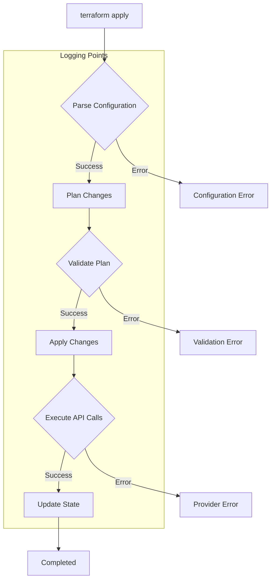

# Terraform Logging

In the world of Infrastructure as Code (IaC), understanding what's happening behind the scenes can be crucial for troubleshooting issues and optimizing your deployments. Terraform, as a powerful IaC tool, provides various logging capabilities that can help you gain insights into its operations. This guide will walk you through Terraform logging, from basic concepts to advanced techniques.

## Introduction to Terraform Logging

Terraform logging refers to the process of capturing, viewing, and analyzing the logs generated during Terraform operations. These logs contain valuable information about what Terraform is doing, any errors or warnings it encounters, and the state of your infrastructure.

Logging is particularly important when:
- Debugging deployment failures
- Understanding resource dependencies
- Investigating performance issues
- Auditing infrastructure changes
- Monitoring automated deployments

## Terraform Log Levels

Terraform uses different log levels to categorize messages based on their importance and severity. The primary log levels include:

1. **TRACE** - Most detailed information
2. **DEBUG** - Detailed information useful for debugging
3. **INFO** - General information about operation progress
4. **WARN** - Warning messages that don't prevent execution
5. **ERROR** - Error messages that might cause operations to fail

By default, Terraform only shows warnings and errors in its output. To access more detailed logs, you need to configure the logging level explicitly.

## Enabling Detailed Logging

### Using the TF_LOG Environment Variable

The most common way to enable detailed logging in Terraform is by setting the `TF_LOG` environment variable. This variable controls the verbosity of log messages.

```bash
# Set logging level to DEBUG
export TF_LOG=DEBUG

# Run Terraform command
terraform apply
```

You can set the log level to any of the values mentioned earlier: TRACE, DEBUG, INFO, WARN, or ERROR.

### Log Output Example

When you enable DEBUG logging, your output will look something like this:

```
2023-07-15T14:32:18.123Z [DEBUG] Provider configured for AWS with region: us-west-2
2023-07-15T14:32:19.456Z [INFO] Building AWS auth structure
2023-07-15T14:32:20.789Z [DEBUG] [aws-sdk-go] Setting AWS MaxRetries to 25
2023-07-15T14:32:21.012Z [DEBUG] Service discovery for ec2 begin
...
```

### Saving Logs to a File

To save the logs to a file instead of displaying them in the terminal, you can use the `TF_LOG_PATH` environment variable:

```bash
# Set logging level
export TF_LOG=DEBUG

# Set log file path
export TF_LOG_PATH=./terraform.log

# Run Terraform command
terraform plan
```

This will create a file named `terraform.log` in your current directory that contains all the log messages.

## Provider-Specific Logging

Sometimes you may want to focus on logs from a specific provider rather than seeing all Terraform logs. This can be accomplished using provider-specific environment variables.

For example, for the AWS provider:

```bash
# Only enable DEBUG logging for AWS provider
export TF_LOG_PROVIDER_AWS=DEBUG

# Run Terraform command
terraform apply
```

This approach is useful when you're troubleshooting issues with a specific provider and don't want to be overwhelmed by logs from other parts of Terraform.

## Structured Logging with JSON Format

For advanced debugging or integration with log analysis tools, Terraform supports JSON-formatted logs. To enable this, set the `TF_LOG_FORMAT` environment variable to `JSON`:

```bash
export TF_LOG=DEBUG
export TF_LOG_FORMAT=JSON
terraform plan
```

The output will look like this:

```json
{"@level":"debug","@message":"Provider configured for AWS with region: us-west-2","@module":"terraform.ui","@timestamp":"2023-07-15T14:35:22.123Z"}
{"@level":"info","@message":"Building AWS auth structure","@module":"terraform.ui","@timestamp":"2023-07-15T14:35:23.456Z"}
```

This format is particularly useful for:
- Parsing logs programmatically
- Importing logs into analysis tools like Elasticsearch, Splunk, or CloudWatch
- Creating customized dashboards and alerts

## Logging in CI/CD Pipelines

In continuous integration and continuous deployment (CI/CD) environments, logging becomes even more important as there's no interactive terminal to troubleshoot issues.

Here's an example of configuring logging in a GitHub Actions workflow:

```yaml
name: Terraform Apply

on:
  push:
    branches: [ main ]

jobs:
  terraform:
    runs-on: ubuntu-latest
    
    steps:
    - uses: actions/checkout@v3
    
    - name: Setup Terraform
      uses: hashicorp/setup-terraform@v2
      
    - name: Terraform Init
      env:
        TF_LOG: INFO
        TF_LOG_PATH: terraform-init.log
      run: terraform init
      
    - name: Terraform Apply
      env:
        TF_LOG: DEBUG
        TF_LOG_PATH: terraform-apply.log
      run: terraform apply -auto-approve
      
    - name: Upload Logs
      uses: actions/upload-artifact@v3
      with:
        name: terraform-logs
        path: terraform-*.log
```

This workflow:
1. Sets different log levels for different Terraform commands
2. Saves logs to separate files
3. Uploads the log files as artifacts, making them available for review even if the workflow fails

## Analyzing Terraform Logs

Once you've captured logs, analyzing them effectively is key to resolving issues. Here are some patterns to look for:

### 1. Resource Creation Failures

When a resource fails to create, look for ERROR messages followed by the resource details:

```
[ERROR] Error creating EC2 instance: InvalidParameterValue: Invalid value 't9.micro' for InstanceType.
```

This clearly indicates that you're trying to use an instance type (`t9.micro`) that doesn't exist.

### 2. State Lock Issues

If you see messages about state locks, it might indicate that another Terraform operation is in progress or didn't release the lock properly:

```
[ERROR] Error acquiring the state lock: state lock acquisition failed: the state is already locked
```

### 3. Dependency Resolution Problems

Logs can help identify resource dependency issues:

```
[ERROR] Error creating CloudWatch Log Group: ResourceNotFoundException: The specified resource does not exist
```

This might indicate that you're trying to reference a resource that hasn't been created yet or doesn't exist.

## Visualizing Infrastructure Changes with Mermaid

When explaining complex changes that Terraform is making, visualization can be helpful:



This diagram shows the key points where Terraform logs information during the apply process, helping you understand where to look when troubleshooting specific issues.

## Best Practices for Terraform Logging

1. **Be Selective with Log Levels**: Use TRACE or DEBUG only when necessary, as they generate very verbose output.

2. **Use Log Files for Complex Operations**: Always redirect logs to files when working with large infrastructure changes:
   ```bash
   export TF_LOG=INFO
   export TF_LOG_PATH=./terraform-$(date +%Y%m%d%H%M%S).log
   terraform apply
   ```

3. **Implement Log Rotation**: For automated systems, implement log rotation to prevent disks from filling up.

4. **Preserve Logs for Auditing**: Store logs securely for auditing and compliance purposes.

5. **Use JSON Format for Programmatic Analysis**: When integrating with log analysis tools, use the JSON log format.

6. **Separate Provider Logs**: Use provider-specific log variables when troubleshooting provider-related issues.

## Practical Example: Troubleshooting a Failed Deployment

Let's walk through a practical example of using logs to troubleshoot a failed deployment.

Imagine you have the following Terraform configuration for creating an AWS S3 bucket:

```hcl
provider "aws" {
  region = "us-west-2"
}

resource "aws_s3_bucket" "example" {
  bucket = "my-example-bucket-12345"
}

resource "aws_s3_bucket_public_access_block" "example" {
  bucket = aws_s3_bucket.example.id
  
  block_public_acls       = true
  block_public_policy     = true
  ignore_public_acls      = true
  restrict_public_buckets = true
}
```

When you run `terraform apply`, it fails with a generic error. To identify the problem, you can use detailed logging:

```bash
export TF_LOG=DEBUG
export TF_LOG_PATH=./terraform-debug.log
terraform apply
```

By examining the log file, you might find entries like:

```
[DEBUG] [aws-sdk-go] Request S3/CreateBucket Details:
[DEBUG] [aws-sdk-go] Error: BucketAlreadyExists
[DEBUG] [aws-sdk-go] Message: The requested bucket name is not available. The bucket namespace is shared by all users of the system. Please select a different name and try again.
```

This clearly indicates that the S3 bucket name `my-example-bucket-12345` is already taken by someone else, as S3 bucket names must be globally unique.

The solution would be to change the bucket name in your configuration:

```hcl
resource "aws_s3_bucket" "example" {
  bucket = "my-unique-example-bucket-abc12345"
}
```

Without detailed logging, you might have only seen a generic "operation failed" message, but with proper logging, you were able to pinpoint the exact cause of the failure.

## Summary

Terraform logging is an essential tool for debugging, monitoring, and understanding your infrastructure deployments. Key points to remember:

- Use the `TF_LOG` environment variable to control log verbosity
- Save logs to files using `TF_LOG_PATH` for analysis
- Consider JSON-formatted logs for integration with log analysis tools
- Use provider-specific logging when troubleshooting specific providers
- Implement proper log management in CI/CD pipelines
- Analyze logs systematically to identify common patterns and issues

By mastering Terraform logging, you'll be better equipped to troubleshoot issues, optimize your infrastructure code, and ensure smooth deployments.

## Additional Resources

- [Official Terraform Debugging Documentation](https://www.terraform.io/docs/internals/debugging.html)
- [Terraform AWS Provider Documentation](https://registry.terraform.io/providers/hashicorp/aws/latest/docs)
- [Terraform in GitHub Actions](https://learn.hashicorp.com/tutorials/terraform/github-actions)

## Exercises

1. **Basic Logging Exercise**: Set up a simple Terraform configuration and capture logs at different verbosity levels. Compare the output and note the differences.

2. **Troubleshooting Challenge**: Create a Terraform configuration with an intentional error (like referencing a non-existent resource). Use logging to identify and fix the issue.

3. **CI/CD Integration**: Configure Terraform logging in a CI/CD pipeline of your choice (GitHub Actions, Jenkins, etc.) and implement log artifact storage.

4. **Log Analysis Practice**: Take a complex Terraform log file and identify patterns of resource creation, modification, and destruction. Create a timeline of events from the log.

5. **Custom Logging Solution**: Create a script that parses Terraform JSON logs and generates a simplified summary report of the most important events and any errors.