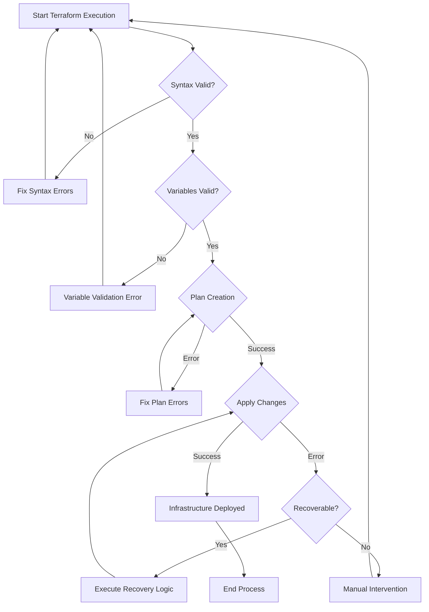

# Terraform Error Handling

## Introduction

When working with Infrastructure as Code (IaC) using Terraform, you'll inevitably encounter errors. These errors can occur during the planning phase, application phase, or even during runtime. Effective error handling is crucial for creating robust Terraform configurations that can gracefully handle unexpected situations, provide meaningful feedback, and maintain infrastructure integrity.

In this guide, we'll explore various error handling techniques in Terraform, from built-in functions to best practices that will help you write more resilient infrastructure code.

## Understanding Terraform Errors

Before diving into error handling strategies, let's understand the types of errors you might encounter in Terraform:

1. **Syntax Errors**: Basic syntax issues in your Terraform configuration files
2. **Validation Errors**: Errors that occur during the validation phase
3. **Plan Errors**: Issues that arise when Terraform creates an execution plan
4. **Apply Errors**: Problems during the application of changes to your infrastructure
5. **Provider Errors**: Issues related to provider-specific operations
6. **State Errors**: Problems with Terraform state management

## Basic Error Handling Techniques

### Using Conditionals

One of the simplest forms of error handling in Terraform is using conditionals to avoid creating invalid configurations.

```hcl
resource "aws_instance" "example" {
  count = var.environment == "production" ? 2 : 1
  
  ami           = var.ami_id
  instance_type = var.environment == "production" ? "t3.medium" : "t3.micro"
  
  tags = {
    Name = "example-instance-${count.index}"
  }
}
```

In this example, we're using the conditional operator to adjust our configuration based on the environment. This prevents errors that might occur if we tried to use inappropriate instance types in certain environments.

### The `try` Function

Terraform's `try` function allows you to attempt to evaluate a series of expressions, returning the result of the first one that doesn't produce an error.

```hcl
locals {
  instance_type = try(
    var.instance_type,
    var.environment == "production" ? "t3.large" : "t3.micro",
    "t2.micro"  # Safe fallback
  )
}

resource "aws_instance" "server" {
  ami           = var.ami_id
  instance_type = local.instance_type
  
  # Other configuration...
}
```

In this example, we try to use the provided `var.instance_type`. If that's not available, we try a conditional expression based on the environment. If that fails too, we fall back to a safe default of "t2.micro".

### Error Handling with `can` Function

The `can` function evaluates an expression and returns a boolean value indicating whether the expression produced a value or an error.

```hcl
locals {
  has_subnet_ids = can(var.subnet_ids[0])
  
  # Use default subnet if no subnet IDs are provided
  subnet_id = local.has_subnet_ids ? var.subnet_ids[0] : aws_subnet.default[0].id
}

resource "aws_instance" "example" {
  # Other configuration...
  subnet_id = local.subnet_id
}
```

This approach allows you to check if a variable contains valid data before attempting to use it, preventing potential errors.

## Advanced Error Handling Patterns

### Custom Validation Rules

Terraform 0.13 and later allow you to add custom validation rules to your variable definitions, which can prevent errors before they occur.

```hcl
variable "environment" {
  description = "The deployment environment"
  type        = string
  
  validation {
    condition     = contains(["dev", "staging", "production"], var.environment)
    error_message = "The environment value must be one of: dev, staging, production."
  }
}

variable "instance_count" {
  description = "Number of instances to create"
  type        = number
  
  validation {
    condition     = var.instance_count > 0 && var.instance_count <= 10
    error_message = "Instance count must be between 1 and 10."
  }
}
```

These validation rules provide immediate feedback when someone tries to apply a configuration with invalid values, preventing downstream errors.

### Precondition and Postcondition Checks

In Terraform 1.2.0 and later, you can use preconditions and postconditions to validate resources before and after they're created or modified.

```hcl
resource "aws_s3_bucket" "example" {
  bucket = "my-terraform-bucket"
  
  lifecycle {
    precondition {
      condition     = length(var.bucket_name) <= 63
      error_message = "S3 bucket names must be less than 63 characters."
    }
    
    postcondition {
      condition     = self.bucket_regional_domain_name != null
      error_message = "Failed to get the regional domain name for the bucket."
    }
  }
}
```

Preconditions verify prerequisites before Terraform attempts to create or modify a resource, while postconditions validate the result after the operation.

### Error Handling with Modules

Breaking your infrastructure into modules helps with error isolation and handling. You can implement robust validation within each module:

```hcl
# modules/vpc/variables.tf
variable "cidr_block" {
  description = "CIDR block for the VPC"
  type        = string
  
  validation {
    condition     = can(cidrnetmask(var.cidr_block))
    error_message = "The provided CIDR block is not valid."
  }
  
  validation {
    condition     = cidrnetmask(var.cidr_block) == "255.255.0.0"
    error_message = "The CIDR block must be a /16 network."
  }
}

# modules/vpc/main.tf
resource "aws_vpc" "main" {
  cidr_block = var.cidr_block
  
  lifecycle {
    precondition {
      condition     = can(cidrhost(var.cidr_block, 0))
      error_message = "Invalid CIDR block provided for VPC."
    }
  }
}
```

## Handling Provider-Specific Errors

Different providers may have unique error handling requirements. Here are some examples:

### AWS Provider

```hcl
provider "aws" {
  region = var.aws_region
  
  # Skip credential validation and metadata API lookup
  skip_credentials_validation = true
  skip_metadata_api_check     = true
  
  # Specify maximum number of retries for API calls
  max_retries = 10
  
  # Configure timeouts for API operations
  dynamodb {
    endpoint = var.dynamodb_endpoint
    
    timeouts {
      create = "30m"
      update = "20m"
      delete = "10m"
    }
  }
}
```

### Azure Provider

```hcl
provider "azurerm" {
  features {}
  
  # Configure retry logic for API failures
  client_timeouts {
    read    = "5m"
    create  = "30m"
    update  = "30m"
    delete  = "20m"
    default = "10m"
  }
}
```

## Error Recovery Strategies

### Using Local-Exec Provisioner for Error Recovery

In some cases, you might need custom error recovery logic. The `local-exec` provisioner can help:

```hcl
resource "aws_instance" "example" {
  # Configuration...
  
  provisioner "local-exec" {
    when    = destroy
    command = "./cleanup-script.sh ${self.id}"
    
    on_failure = continue
  }
}
```

The `on_failure = continue` directive tells Terraform to continue with other operations even if this provisioner fails, which can help prevent cascading failures.

### Using Terraform Ignore Changes

Sometimes, you need to tell Terraform to ignore certain changes to prevent unnecessary errors:

```hcl
resource "aws_instance" "example" {
  ami           = var.ami_id
  instance_type = var.instance_type
  
  tags = {
    Name = "example-instance"
  }
  
  lifecycle {
    ignore_changes = [
      # Ignore changes to tags, e.g. because a management agent
      # updates these based on some ruleset managed elsewhere.
      tags,
    ]
  }
}
```

This prevents Terraform from trying to "fix" changes made outside of Terraform, which could lead to errors.

## Debugging Terraform Errors

When you encounter errors, Terraform provides several tools to help you diagnose and fix them:

### Terraform Logging

Set the `TF_LOG` environment variable to get detailed logs:

```bash
export TF_LOG=DEBUG
terraform apply
```

Log levels include:
- TRACE (most verbose)
- DEBUG
- INFO
- WARN
- ERROR

### Saving Logs to a File

```bash
export TF_LOG=DEBUG
export TF_LOG_PATH=./terraform.log
terraform apply
```

### Using `-detailed-exitcode`

The `plan` command accepts a `-detailed-exitcode` flag that provides more information:

```bash
terraform plan -detailed-exitcode
```

This will return:
- 0: No changes
- 1: Error
- 2: Succeeded with non-empty diff (changes present)

## Real-World Example: Robust AWS Deployment

Here's a comprehensive example that implements several error handling techniques:

```hcl
# Define allowed instance types
locals {
  allowed_instance_types = {
    "dev"        = ["t2.micro", "t3.micro"]
    "staging"    = ["t3.small", "t3.medium"]
    "production" = ["t3.large", "t3.xlarge", "m5.large"]
  }
  
  # Validate chosen instance type against allowed types
  is_valid_instance = contains(
    local.allowed_instance_types[var.environment],
    var.instance_type
  )
  
  # Choose appropriate instance type with fallback
  chosen_instance_type = local.is_valid_instance ? var.instance_type : (
    var.environment == "production" ? "t3.large" : "t3.micro"
  )
}

# Pre-validate the configuration
resource "null_resource" "validation" {
  count = local.is_valid_instance ? 0 : 1
  
  provisioner "local-exec" {
    command = "echo 'WARNING: Invalid instance type ${var.instance_type} for ${var.environment} environment. Using ${local.chosen_instance_type} instead.' >&2"
  }
}

# Define the EC2 instance with error handling
resource "aws_instance" "application" {
  ami           = var.ami_id
  instance_type = local.chosen_instance_type
  
  vpc_security_group_ids = try(
    var.security_group_ids,
    [aws_security_group.default[0].id]
  )
  
  subnet_id = try(
    var.subnet_id,
    tolist(data.aws_subnets.default.ids)[0]
  )
  
  root_block_device {
    volume_size = try(
      var.root_volume_size,
      var.environment == "production" ? 100 : 20
    )
    volume_type = "gp3"
    encrypted   = true
  }
  
  lifecycle {
    precondition {
      condition     = var.ami_id != null && var.ami_id != ""
      error_message = "AMI ID must be provided."
    }
    
    postcondition {
      condition     = self.instance_state == "running"
      error_message = "Failed to start the EC2 instance."
    }
    
    # Create replacement before destroying old instance
    create_before_destroy = true
    
    # Prevent destruction in production
    prevent_destroy = var.environment == "production"
  }
  
  # Implement error recovery
  provisioner "local-exec" {
    when    = destroy
    command = "./scripts/cleanup-resources.sh ${self.id}"
    on_failure = continue
  }
  
  tags = merge(
    var.tags,
    {
      Name        = "${var.environment}-application"
      Environment = var.environment
      ManagedBy   = "Terraform"
    }
  )
}

# Default security group (fallback)
resource "aws_security_group" "default" {
  count = length(var.security_group_ids) > 0 ? 0 : 1
  
  name        = "${var.environment}-default-sg"
  description = "Default security group created by Terraform"
  vpc_id      = data.aws_vpc.default.id
  
  # Basic rules
  ingress {
    from_port   = 22
    to_port     = 22
    protocol    = "tcp"
    cidr_blocks = ["10.0.0.0/8"]
    description = "SSH access from internal network"
  }
  
  egress {
    from_port   = 0
    to_port     = 0
    protocol    = "-1"
    cidr_blocks = ["0.0.0.0/0"]
    description = "Allow all outbound traffic"
  }
}

# Output with error handling
output "instance_ip" {
  description = "The public IP of the instance"
  value       = try(aws_instance.application.public_ip, "No public IP assigned")
}
```

## Visualizing Error Handling Flow

Here's a flowchart showing the decision-making process for error handling in Terraform:



## Common Terraform Errors and Solutions

| Error | Possible Cause | Solution |
|-------|----------------|----------|
| `No provider configuration` | Missing or incorrect provider block | Add the required provider configuration |
| `Invalid resource type` | Typo in resource type or missing provider | Check resource type spelling and ensure provider is installed |
| `Error: Invalid index` | Trying to access a non-existent list element | Use the `try` function or check list length before accessing |
| `Error: Invalid function argument` | Incorrect data type passed to a function | Verify argument types and use type conversion functions if needed |
| `Error: Missing required argument` | Required attribute not provided | Provide the required attribute or use dynamic blocks |
| `Error: unsupported attribute` | Trying to access a non-existent attribute | Check resource documentation for available attributes |
| `Error: Provider configuration not present` | Provider not properly initialized | Add provider configuration and run `terraform init` |
| `Error: Resource already exists` | Resource exists but not in Terraform state | Import existing resources or use `terraform import` |

## Best Practices for Terraform Error Handling

1. **Use Validation Rules**: Define validation rules for all variables to catch errors early.
2. **Implement Graceful Defaults**: Use the `try` function to provide sensible defaults.
3. **Layer Your Error Handling**: Combine multiple techniques (validation, try, can, etc.).
4. **Modularize Infrastructure**: Break complex infrastructure into manageable modules.
5. **Use Preconditions and Postconditions**: Verify conditions before and after resource operations.
6. **Log Everything**: Set appropriate log levels during development and troubleshooting.
7. **Plan Before Apply**: Always run `terraform plan` before `terraform apply`.
8. **Version Control Your Terraform Files**: Track changes to help identify when errors were introduced.
9. **Use Terraform Workspaces**: