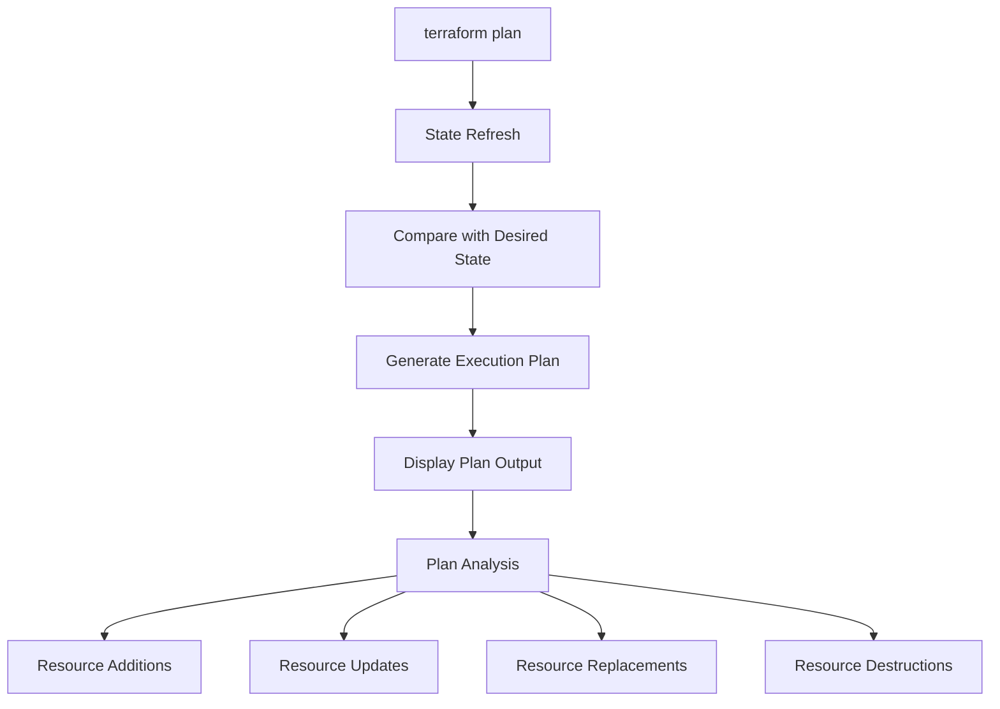

# Terraform Plan Analysis

## Introduction

When working with Terraform to manage your infrastructure as code, one of the most crucial steps in the deployment workflow is analyzing the execution plan before making any changes to your actual infrastructure. The `terraform plan` command generates a preview of what Terraform will do when you run `terraform apply`, allowing you to verify that the changes align with your expectations.

In this guide, we'll explore how to analyze Terraform plans effectively, understand their output format, identify potential issues, and make informed decisions about your infrastructure changes.

## Understanding the Terraform Plan Command

The `terraform plan` command is used to create an execution plan, showing what actions Terraform will take to change your infrastructure to match the desired state defined in your configuration files.

```bash
terraform plan
```

When you run this command, Terraform:

1. Refreshes the state file to ensure it has up-to-date information about your existing resources
2. Compares the current state with the desired state
3. Generates a plan for making changes to achieve the desired state

## Anatomy of a Terraform Plan Output

A Terraform plan output typically contains several sections. Let's break down what each part means:

### Plan Header

```
Terraform used the selected providers to generate the following execution plan. 
Resource actions are indicated with the following symbols:
  + create
  - destroy
  ~ update in-place
-/+ destroy and then create replacement
```

This section explains the symbols used in the plan to indicate different types of changes:

- `+` create: A new resource will be created
- `-` destroy: An existing resource will be destroyed
- `~` update in-place: An existing resource will be modified without being destroyed
- `-/+` destroy and then create replacement: A resource will be destroyed and recreated (usually due to changes that can't be made in-place)

### Resource Changes

```
Terraform will perform the following actions:

  # aws_instance.example will be created
  + resource "aws_instance" "example" {
      + ami                          = "ami-0c55b159cbfafe1f0"
      + instance_type                = "t2.micro"
      + vpc_security_group_ids       = [
          + "sg-0123456789abcdef",
        ]
      # (other attributes hidden)
    }

Plan: 1 to add, 0 to change, 0 to destroy.
```

This section shows each resource that will be modified, along with the specific attributes that will change. The symbols at the beginning of each line indicate what's happening to that specific attribute:

- `+` indicates a new attribute or resource
- `-` indicates an attribute or resource being removed
- `~` indicates an attribute being modified

### Plan Summary

```
Plan: 1 to add, 0 to change, 0 to destroy.
```

This summary line gives you a quick overview of how many resources will be added, changed, or destroyed when the plan is applied.

## Analyzing Common Plan Scenarios

Let's examine some common scenarios you might encounter in Terraform plans and how to interpret them.

### 1. Creating New Resources

```
  # aws_s3_bucket.data will be created
  + resource "aws_s3_bucket" "data" {
      + bucket = "my-terraform-bucket"
      + acl    = "private"
      # (other attributes hidden)
    }
```

**Analysis:** Terraform will create a new S3 bucket with the specified configuration. All attributes with `+` symbols will be set during creation.

### 2. In-place Updates

```
  # aws_security_group.allow_http will be updated in-place
  ~ resource "aws_security_group" "allow_http" {
      ~ description = "Allow HTTP inbound traffic" -> "Allow HTTP and HTTPS inbound traffic"
        name        = "allow_http"
        
      ~ ingress {
          # (changes in ingress rules)
        }
    }
```

**Analysis:** The security group will be updated without being destroyed and recreated. The description will change from "Allow HTTP inbound traffic" to "Allow HTTP and HTTPS inbound traffic", and there are changes to the ingress rules.

### 3. Resource Replacement

```
  # aws_instance.web must be replaced
-/+ resource "aws_instance" "web" {
      ~ ami                          = "ami-0a1b2c3d4e5f6g7h8" -> "ami-1a2b3c4d5e6f7g8h9"
        instance_type                = "t2.micro"
      # (other attributes hidden)
    }
```

**Analysis:** The EC2 instance will be destroyed and recreated because the AMI attribute is changing. This is a replacement rather than an in-place update because changing the AMI requires a new instance.

### 4. Resource Destruction

```
  # aws_eip.example will be destroyed
  - resource "aws_eip" "example" {
      - vpc      = true
      - instance = "i-0a1b2c3d4e5f6g7h8"
      # (other attributes hidden)
    }
```

**Analysis:** The Elastic IP resource will be completely removed from your infrastructure.

## Reading Complex Change Attributes

Sometimes Terraform plans show more complex changes, particularly with nested attributes or computed values.

### Known vs. Unknown Values

```
  # aws_instance.example will be created
  + resource "aws_instance" "example" {
      + id                           = (known after apply)
      + private_ip                   = (known after apply)
      + public_ip                    = (known after apply)
      + instance_type                = "t2.micro"
      # (other attributes hidden)
    }
```

Attributes marked as `(known after apply)` are values that Terraform cannot determine in advance because they will be generated by the provider during resource creation.

### Sensitive Values

```
  # aws_db_instance.database will be created
  + resource "aws_db_instance" "database" {
      + password                     = (sensitive value)
      + username                     = "admin"
      # (other attributes hidden)
    }
```

For security reasons, Terraform hides sensitive values like passwords, showing `(sensitive value)` instead of the actual value.

## Practical Example: Analyzing a Complete Terraform Plan

Let's examine a more comprehensive example of a Terraform plan that creates a basic AWS infrastructure with multiple resources:

```bash
terraform plan
```

Output:

```
Terraform will perform the following actions:

  # aws_vpc.main will be created
  + resource "aws_vpc" "main" {
      + cidr_block           = "10.0.0.0/16"
      + enable_dns_hostnames = true
      + enable_dns_support   = true
      + id                   = (known after apply)
    }

  # aws_subnet.public will be created
  + resource "aws_subnet" "public" {
      + vpc_id                  = (known after apply)
      + cidr_block              = "10.0.1.0/24"
      + availability_zone       = "us-west-2a"
      + map_public_ip_on_launch = true
      + id                      = (known after apply)
    }

  # aws_instance.web will be created
  + resource "aws_instance" "web" {
      + ami                          = "ami-0c55b159cbfafe1f0"
      + instance_type                = "t2.micro"
      + subnet_id                    = (known after apply)
      + vpc_security_group_ids       = (known after apply)
      + associate_public_ip_address  = true
      + id                           = (known after apply)
      + private_ip                   = (known after apply)
      + public_ip                    = (known after apply)
    }

Plan: 3 to add, 0 to change, 0 to destroy.
```

### Analysis Steps:

1. **Resource Dependencies**: Notice that `aws_subnet.public` depends on `aws_vpc.main` (its `vpc_id` will be the ID of the VPC). Similarly, `aws_instance.web` depends on the subnet.

2. **Attribute References**: Values like `(known after apply)` indicate that these attributes will be determined during the apply phase, often because they depend on resources that don't exist yet.

3. **Resource Count**: The plan summary shows 3 resources will be added.

## Advanced Plan Analysis

### Using the `-out` Flag

You can save a plan to a file using the `-out` flag:

```bash
terraform plan -out=tfplan
```

This creates a binary plan file that can be applied later with `terraform apply tfplan`. This is particularly useful in CI/CD pipelines where you want to ensure that what you're applying is exactly what was reviewed.

### Detailed Output

For more verbose output, you can use the `-detailed-exitcode` flag:

```bash
terraform plan -detailed-exitcode
```

This will return:
- Exit code 0: No changes
- Exit code 1: Error
- Exit code 2: Changes present

### JSON Output for Programmatic Analysis

Terraform can output the plan in JSON format for programmatic analysis:

```bash
terraform plan -out=tfplan
terraform show -json tfplan > plan.json
```

You can then analyze the JSON output using tools like `jq` or custom scripts.

## Common Plan Analysis Patterns

Here are some key things to look for when analyzing a Terraform plan:

### 1. Unintended Resource Destruction

Always check if any critical resources are marked for destruction. If you see a `-` or `-/+` symbol for an important production resource, investigate why Terraform wants to replace it instead of updating it in place.

### 2. Resource Count Changes

If you're using count or for_each, be especially careful about changes in the count or for_each values, as these can cause resources to be destroyed and recreated.

```
  # aws_instance.cluster[0] will be destroyed
  - resource "aws_instance" "cluster" {
      # (attributes hidden)
    }

  # aws_instance.cluster[1] will be destroyed
  - resource "aws_instance" "cluster" {
      # (attributes hidden)
    }

  # aws_instance.cluster[0] will be created
  + resource "aws_instance" "cluster" {
      # (attributes hidden)
    }
```

This often indicates a change in the count value or a change in the way resources are indexed.

### 3. Attribute Changes That Require Replacement

Some attribute changes trigger resource replacement rather than in-place updates. For AWS instances, these often include:

- `ami`
- `instance_type` (for some instance types)
- `subnet_id`

When you see a `-/+` symbol, check which attribute change is causing the replacement and consider if that's what you want.

## Visualizing Terraform Plans

For complex infrastructures, visualizing your Terraform plan can help understand the changes better. You can use the Terraform graph feature along with tools like Graphviz:

```bash
terraform graph | dot -Tsvg > graph.svg
```

This creates a visual representation of your resource dependencies.



## Best Practices for Plan Analysis

1. **Always run `terraform plan` before `terraform apply`** to understand what changes will be made.

2. **Review resource replacements carefully**, especially for stateful resources like databases.

3. **Use version control for your Terraform code** so you can see what code changes led to particular plan changes.

4. **Create a checklist** for reviewing plans in production environments:
   - Are any critical resources being replaced?
   - Are there any unexpected resource destructions?
   - Do the changes align with the intended modifications?

5. **Consider implementing a peer review process** for plan analysis before applying changes to production environments.

## Troubleshooting Unexpected Plan Results

If your plan shows unexpected changes, consider these common issues:

### 1. State Drift

If someone has made manual changes to your infrastructure outside of Terraform, your state may be out of sync with reality. Run `terraform refresh` to update the state.

### 2. Provider Version Changes

Different provider versions might generate different plans. Check if you've updated your provider versions recently.

### 3. Implicit Dependencies

Sometimes Terraform doesn't correctly identify dependencies between resources. Use `depends_on` to make these dependencies explicit.

```hcl
resource "aws_instance" "web" {
  ami           = "ami-0c55b159cbfafe1f0"
  instance_type = "t2.micro"
  
  depends_on = [
    aws_internet_gateway.main
  ]
}
```

## Summary

Analyzing Terraform plans is a critical skill for anyone working with infrastructure as code. By understanding the plan output format, recognizing different types of changes, and following best practices, you can confidently manage your infrastructure and avoid unexpected changes.

Remember that the plan is a preview - always review it carefully before applying changes, especially in production environments. A careful plan analysis process can save you from costly mistakes and downtime.

## Additional Resources

- Try using `terraform plan` with different flags like `-out` and `-detailed-exitcode`
- Experiment with exporting plans to JSON format and analyze them programmatically
- Practice identifying which attribute changes cause replacements vs. in-place updates
- Create a plan review checklist for your team's specific infrastructure needs

## Exercises

1. Run `terraform plan` on a simple configuration and identify all resource creation symbols
2. Modify an attribute that requires replacement and analyze the resulting plan
3. Create a configuration with resource dependencies and observe how these are reflected in the plan
4. Use the `-out` flag to save a plan and then apply it with `terraform apply`
5. Export a plan to JSON format and use `jq` to extract specific information about the changes