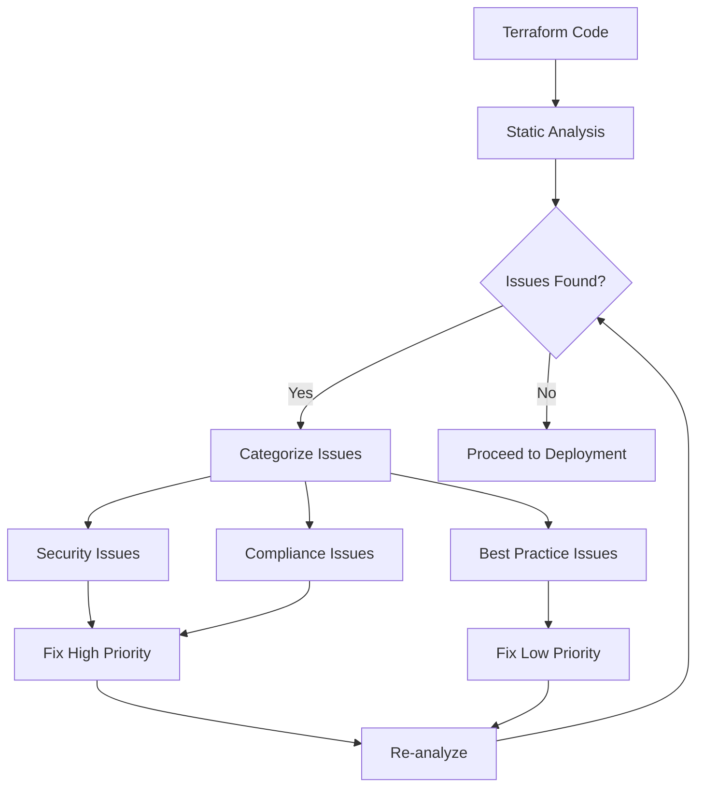

# Terraform Static Analysis

## Introduction

Static analysis is a method of debugging and analyzing your code without actually executing it. For Terraform, this means identifying potential issues, security vulnerabilities, and style inconsistencies in your infrastructure code before you apply it to your environment.

Unlike dynamic testing which verifies that your infrastructure behaves correctly at runtime, static analysis looks at your Terraform code in isolation to find problems early in the development process. This preventative approach helps catch issues before they make it to production, saving time and reducing risks.

## Why Static Analysis Matters for Terraform

Infrastructure as Code (IaC) has revolutionized how we manage cloud resources, but with this power comes responsibility. Errors in Terraform code can lead to:

- Misconfigured resources that don't work as expected
- Security vulnerabilities exposing your infrastructure
- Compliance violations that might affect your organization
- Unexpected costs from inefficient resource definitions

Static analysis tools help address these concerns by automatically scanning your code for common pitfalls and best practice violations.

## Popular Terraform Static Analysis Tools

### 1. Terraform validate

The simplest form of static analysis comes built into Terraform itself with the `terraform validate` command.

```bash
terraform validate
```

**Example output for valid configuration:**

```
Success! The configuration is valid.
```

**Example output with errors:**

```
Error: Invalid resource type

  on main.tf line 15, in resource "aws_ec2_instanc" "example":
  15: resource "aws_ec2_instanc" "example" {

The provider provider.aws does not support resource type "aws_ec2_instanc".
Did you mean "aws_ec2_instance"?
```

While `terraform validate` is useful for catching syntax errors and undefined variables, it has limitations. It doesn't check for security best practices or style issues, which is where specialized tools come in.

### 2. TFLint

TFLint is a powerful linter specifically designed for Terraform. It goes beyond basic validation by checking for:

- Possible errors that `terraform validate` might miss
- Deprecated syntax or provider features
- Provider-specific issues and recommendations
- Naming conventions and stylistic problems

**Installation:**

```bash
# For macOS
brew install tflint

# For Linux
curl -s https://raw.githubusercontent.com/terraform-linters/tflint/master/install_linux.sh | bash
```

**Basic usage:**

```bash
tflint
```

**Example configuration (.tflint.hcl):**

```hcl
plugin "aws" {
  enabled = true
  version = "0.21.1"
  source  = "github.com/terraform-linters/tflint-ruleset-aws"
}

rule "terraform_documented_outputs" {
  enabled = true
}

rule "terraform_documented_variables" {
  enabled = true
}
```

**Example output:**

```
1 issue(s) found:

Warning: The "t2.micro" instance type is previous generation (aws_instance_previous_type)

  on main.tf line 23:
  23:   instance_type = "t2.micro"

Reference: https://github.com/terraform-linters/tflint-ruleset-aws/blob/master/docs/rules/aws_instance_previous_type.md
```

### 3. Checkov

Checkov is an open-source static analysis tool focused on security and compliance checks for infrastructure as code. It scans your Terraform files for misconfigurations that could lead to security vulnerabilities.

**Installation:**

```bash
pip install checkov
```

**Basic usage:**

```bash
checkov -d .
```

**Example output:**

```
Check: CKV_AWS_79: "Ensure Instance Metadata Service Version 1 is not enabled"
	FAILED for resource: aws_instance.example
	File: /main.tf:23-45

		23 | resource "aws_instance" "example" {
		24 |   ami           = "ami-0c55b159cbfafe1f0"
		25 |   instance_type = "t2.micro"

Check: CKV_AWS_126: "Ensure that detailed monitoring is enabled for EC2 instances"
	FAILED for resource: aws_instance.example
	File: /main.tf:23-45

		23 | resource "aws_instance" "example" {
		24 |   ami           = "ami-0c55b159cbfafe1f0"
		25 |   instance_type = "t2.micro"

...

Summary:
	Passed checks: 7
	Failed checks: 4
	Skipped checks: 0
```

### 4. Terrascan

Terrascan is another security-focused static analysis tool that detects compliance and security violations across Infrastructure as Code.

**Installation:**

```bash
# For macOS
brew install terrascan

# For Linux
curl -L "$(curl -s https://api.github.com/repos/accurics/terrascan/releases/latest | grep -o -E "https://.+?_Linux_x86_64.tar.gz")" > terrascan.tar.gz
tar -xf terrascan.tar.gz terrascan && rm terrascan.tar.gz
sudo install terrascan /usr/local/bin && rm terrascan
```

**Basic usage:**

```bash
terrascan scan
```

**Example output:**

```
Violation Details -

	Description    :	Ensure all data stored in the S3 bucket is securely encrypted at rest
	File           :	main.tf
	Line           :	42
	Severity       :	HIGH
	Rule Name      :	aws_s3_bucket_encryption
	Rule ID        :	AWS.S3Bucket.EncryptionandKeyManagement.High.0405
	Resource Name  :	aws_s3_bucket.data
	Resource Type  :	aws_s3_bucket
	Category       :	Encryption & Key Management
```

## Implementing Static Analysis in Your Workflow

To get the most out of static analysis, integrate it into your development workflow. Here's a step-by-step guide:

### 1. Set Up Pre-commit Hooks

Pre-commit hooks can run static analysis tools automatically before you commit your changes.

**Example .pre-commit-config.yaml:**

```yaml
repos:
- repo: https://github.com/antonbabenko/pre-commit-terraform
  rev: v1.77.1
  hooks:
    - id: terraform_fmt
    - id: terraform_validate
    - id: terraform_tflint
    - id: checkov
    - id: terrascan
```

### 2. Integrate with CI/CD Pipelines

Adding static analysis to your CI/CD pipeline ensures all code is checked before deployment.

**Example GitHub Actions workflow (.github/workflows/terraform-analysis.yml):**

```yaml
name: "Terraform Static Analysis"

on:
  push:
    branches: [ main ]
  pull_request:
    branches: [ main ]

jobs:
  analyze:
    runs-on: ubuntu-latest
    steps:
    - uses: actions/checkout@v3

    - name: Setup Terraform
      uses: hashicorp/setup-terraform@v2

    - name: Terraform Format Check
      run: terraform fmt -check -recursive

    - name: Terraform Validate
      run: |
        terraform init -backend=false
        terraform validate

    - name: Setup TFLint
      uses: terraform-linters/setup-tflint@v3

    - name: Run TFLint
      run: tflint --format=compact

    - name: Run Checkov
      uses: bridgecrewio/checkov-action@master
      with:
        directory: .
        framework: terraform
```

## Real-world Example: Static Analysis in Action

Let's examine a Terraform configuration with multiple issues and see how static analysis tools can help identify them.

**Original main.tf with issues:**

```hcl
provider "aws" {
  region = "us-west-2"
}

resource "aws_s3_bucket" "log_bucket" {
  bucket = "my-tf-log-bucket"
  acl    = "public-read"  # Security issue: public access
}

resource "aws_instance" "web" {
  ami           = "ami-0c55b159cbfafe1f0"
  instance_type = "t1.micro"  # Deprecated instance type
  
  root_block_device {
    volume_size = 8
    # Missing encryption
  }
  
  # Missing tags
}

resource "aws_security_group" "allow_all" {
  name        = "allow_all"
  description = "Allow all inbound traffic"
  
  ingress {
    from_port   = 0
    to_port     = 0
    protocol    = "-1"
    cidr_blocks = ["0.0.0.0/0"]  # Security issue: open to the world
  }
  
  egress {
    from_port   = 0
    to_port     = 0
    protocol    = "-1"
    cidr_blocks = ["0.0.0.0/0"]
  }
}
```

After running static analysis tools, we would find issues like:

1. **TFLint** would flag the deprecated `t1.micro` instance type
2. **Checkov** would identify:
   - Public S3 bucket (security risk)
   - Unencrypted EBS volume
   - Missing resource tags
   - Overly permissive security group

**Corrected main.tf:**

```hcl
provider "aws" {
  region = "us-west-2"
}

resource "aws_s3_bucket" "log_bucket" {
  bucket = "my-tf-log-bucket"
}

resource "aws_s3_bucket_acl" {
  bucket = aws_s3_bucket.log_bucket.id
  acl    = "private"  # Corrected: private access
}

resource "aws_s3_bucket_server_side_encryption_configuration" {
  bucket = aws_s3_bucket.log_bucket.id

  rule {
    apply_server_side_encryption_by_default {
      sse_algorithm = "AES256"
    }
  }
}

resource "aws_instance" "web" {
  ami           = "ami-0c55b159cbfafe1f0"
  instance_type = "t3.micro"  # Corrected: current generation
  
  root_block_device {
    volume_size = 8
    encrypted   = true  # Added encryption
  }
  
  monitoring = true  # Added detailed monitoring
  
  tags = {  # Added tags
    Name        = "WebServer"
    Environment = "Production"
    ManagedBy   = "Terraform"
  }
}

resource "aws_security_group" "web_access" {
  name        = "web_access"
  description = "Allow web traffic"
  
  ingress {
    from_port   = 80
    to_port     = 80
    protocol    = "tcp"
    cidr_blocks = ["10.0.0.0/16"]  # Corrected: restricted network
  }
  
  ingress {
    from_port   = 443
    to_port     = 443
    protocol    = "tcp"
    cidr_blocks = ["10.0.0.0/16"]  # Corrected: restricted network
  }
  
  egress {
    from_port   = 0
    to_port     = 0
    protocol    = "-1"
    cidr_blocks = ["0.0.0.0/0"]
  }
}
```

## Best Practices for Terraform Static Analysis

To maximize the effectiveness of static analysis in your Terraform projects:

1. **Run static analysis early and often** - Catch issues during development, not during deployment
2. **Use multiple tools** - Different tools catch different problems
3. **Customize rules based on your needs** - Not all warnings are relevant to every project
4. **Fix issues incrementally** - Address high-severity issues first
5. **Document exceptions** - When you must ignore a warning, document why
6. **Keep tools updated** - New rules are added as cloud providers evolve

## Custom Rules and Policies

Many static analysis tools allow you to create custom rules for organization-specific requirements.

**Example custom TFLint rule (.tflint.hcl):**

```hcl
rule "terraform_required_tags" {
  enabled = true
  tags = ["Environment", "Owner", "Project"]
}
```

**Example custom Checkov check:**

```python
from checkov.common.models.enums import CheckResult, CheckCategories
from checkov.terraform.checks.resource.base_resource_check import BaseResourceCheck

class RequireInstanceMonitoring(BaseResourceCheck):
    def __init__(self):
        name = "Ensure detailed monitoring is enabled for EC2 instances"
        id = "CKV_CUSTOM_1"
        supported_resources = ['aws_instance']
        categories = [CheckCategories.MONITORING]
        super().__init__(name=name, id=id, categories=categories, supported_resources=supported_resources)

    def scan_resource_conf(self, conf):
        if 'monitoring' in conf.keys():
            if conf['monitoring'][0]:
                return CheckResult.PASSED
        return CheckResult.FAILED

check = RequireInstanceMonitoring()
```

## Visualizing Static Analysis Results

Visual representation of static analysis results can help teams understand and prioritize issues.



## Summary

Static analysis is an essential practice for maintaining high-quality Terraform code. By integrating tools like TFLint, Checkov, and Terrascan into your development workflow, you can catch issues early, improve security, and ensure compliance with best practices.

Remember that static analysis is just one part of a comprehensive testing strategy for infrastructure as code. It works best when combined with dynamic testing, peer reviews, and proper documentation.

## Additional Resources and Exercises

### Resources
- [Terraform Documentation on terraform validate](https://developer.hashicorp.com/terraform/cli/commands/validate)
- [TFLint GitHub Repository](https://github.com/terraform-linters/tflint)
- [Checkov Documentation](https://www.checkov.io/1.Welcome/What%20is%20Checkov.html)
- [Terrascan Documentation](https://runterrascan.io/docs/)

### Exercises

1. **Basic Setup**: Install TFLint and run it against an existing Terraform project. How many issues does it find?

2. **Tool Comparison**: Run both Checkov and Terrascan against the same Terraform configuration. Compare the results and identify which issues are found by both tools and which are unique to each.

3. **Custom Rules**: Create a custom TFLint rule that enforces a naming convention for your resources.

4. **CI Integration**: Set up a GitHub Actions workflow that runs static analysis on your Terraform code when you push changes.

5. **Fix and Verify**: Take a Terraform configuration with known issues, run static analysis, fix the identified problems, and verify the improvements with a second scan.