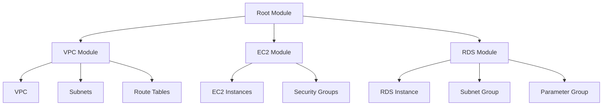

# Terraform Project Structure

When working with Terraform to manage infrastructure as code, how you organize your project can significantly impact its maintainability, collaboration potential, and scalability. This guide explores best practices for structuring your Terraform projects.

## Introduction

A well-organized Terraform project structure helps you:

- Manage complex infrastructure logically
- Promote code reusability
- Enhance collaboration within teams
- Implement environment-specific configurations
- Streamline testing and deployment processes

Let's dive into how to structure your Terraform projects effectively.

## Basic Project Structure

At a minimum, a Terraform project should include these files:

```
project-root/
├── main.tf       # Primary entry point with main resources
├── variables.tf  # Input variable declarations
├── outputs.tf    # Output value declarations
├── providers.tf  # Provider configurations
└── terraform.tfvars # Variable values (gitignored for sensitive data)
```

### Explanation of Core Files

- **main.tf**: Contains the primary infrastructure resources
- **variables.tf**: Defines input variables used across your configuration
- **outputs.tf**: Specifies output values that will be displayed after applying
- **providers.tf**: Configures the providers (AWS, Azure, GCP, etc.)
- **terraform.tfvars**: Contains actual values for variables (often gitignored if containing sensitive data)

## Advanced Project Structure

For larger projects, a more comprehensive structure is recommended:

```
project-root/
├── environments/
│   ├── dev/
│   │   ├── main.tf
│   │   ├── variables.tf
│   │   ├── outputs.tf
│   │   ├── terraform.tfvars
│   │   └── backend.tf
│   ├── staging/
│   │   └── ...
│   └── prod/
│       └── ...
├── modules/
│   ├── networking/
│   │   ├── main.tf
│   │   ├── variables.tf
│   │   └── outputs.tf
│   ├── compute/
│   │   └── ...
│   └── database/
│       └── ...
├── .gitignore
└── README.md
```

## Understanding the Structure

Let's break down this advanced structure:

### Environments Directory

The `environments` directory contains environment-specific configurations:

```terraform
# environments/dev/main.tf
module "networking" {
  source = "../../modules/networking"
  
  vpc_cidr       = var.vpc_cidr
  subnet_cidrs   = var.subnet_cidrs
  environment    = "dev"
}

module "compute" {
  source = "../../modules/compute"
  
  instance_type  = var.instance_type
  subnet_ids     = module.networking.subnet_ids
  environment    = "dev"
}
```

Each environment directory typically contains:

- **main.tf**: Calls modules with environment-specific parameters
- **variables.tf**: Declares variables for this environment
- **terraform.tfvars**: Sets environment-specific values
- **backend.tf**: Configures the backend for state storage

### Modules Directory

The `modules` directory contains reusable infrastructure components:

```terraform
# modules/networking/main.tf
resource "aws_vpc" "main" {
  cidr_block = var.vpc_cidr
  
  tags = {
    Name        = "${var.environment}-vpc"
    Environment = var.environment
  }
}

resource "aws_subnet" "main" {
  count      = length(var.subnet_cidrs)
  vpc_id     = aws_vpc.main.id
  cidr_block = var.subnet_cidrs[count.index]
  
  tags = {
    Name        = "${var.environment}-subnet-${count.index}"
    Environment = var.environment
  }
}
```

Each module should have:

- **main.tf**: Core resources for this module
- **variables.tf**: Input variables for the module
- **outputs.tf**: Values to export from the module

## Real-World Example: Multi-Environment AWS Infrastructure

Let's look at a practical example of organizing a project for multiple environments on AWS:

### Project Structure

```
aws-infrastructure/
├── environments/
│   ├── dev/
│   │   ├── main.tf
│   │   ├── variables.tf
│   │   ├── terraform.tfvars
│   │   └── backend.tf
│   └── prod/
│       ├── main.tf
│       ├── variables.tf
│       ├── terraform.tfvars
│       └── backend.tf
├── modules/
│   ├── vpc/
│   │   ├── main.tf
│   │   ├── variables.tf
│   │   └── outputs.tf
│   ├── ec2/
│   │   ├── main.tf
│   │   ├── variables.tf
│   │   └── outputs.tf
│   └── rds/
│       ├── main.tf
│       ├── variables.tf
│       └── outputs.tf
└── README.md
```

### Module Implementation

```terraform
# modules/vpc/main.tf
resource "aws_vpc" "main" {
  cidr_block           = var.vpc_cidr
  enable_dns_support   = true
  enable_dns_hostnames = true

  tags = {
    Name        = "${var.environment}-vpc"
    Environment = var.environment
  }
}

resource "aws_subnet" "public" {
  count             = length(var.public_subnet_cidrs)
  vpc_id            = aws_vpc.main.id
  cidr_block        = var.public_subnet_cidrs[count.index]
  availability_zone = var.availability_zones[count.index]
  
  tags = {
    Name        = "${var.environment}-public-subnet-${count.index}"
    Environment = var.environment
  }
}

# Additional resources like route tables, internet gateways, etc.
```

### Environment Configuration

```terraform
# environments/dev/main.tf
provider "aws" {
  region = var.aws_region
}

module "vpc" {
  source = "../../modules/vpc"
  
  environment         = "dev"
  vpc_cidr            = var.vpc_cidr
  public_subnet_cidrs = var.public_subnet_cidrs
  availability_zones  = var.availability_zones
}

module "ec2" {
  source = "../../modules/ec2"
  
  environment     = "dev"
  vpc_id          = module.vpc.vpc_id
  subnet_ids      = module.vpc.public_subnet_ids
  instance_type   = "t2.micro"  # Smaller instance for dev
}

module "rds" {
  source = "../../modules/rds"
  
  environment     = "dev"
  vpc_id          = module.vpc.vpc_id
  subnet_ids      = module.vpc.private_subnet_ids
  instance_class  = "db.t3.small"  # Smaller instance for dev
  database_name   = var.database_name
}
```

```terraform
# environments/dev/variables.tf
variable "aws_region" {
  description = "AWS region to deploy resources"
  type        = string
  default     = "us-west-2"
}

variable "vpc_cidr" {
  description = "CIDR block for the VPC"
  type        = string
}

variable "public_subnet_cidrs" {
  description = "CIDR blocks for public subnets"
  type        = list(string)
}

variable "availability_zones" {
  description = "Availability zones for subnets"
  type        = list(string)
}

variable "database_name" {
  description = "Name of the database"
  type        = string
}
```

```terraform
# environments/dev/terraform.tfvars
vpc_cidr            = "10.0.0.0/16"
public_subnet_cidrs = ["10.0.1.0/24", "10.0.2.0/24"]
availability_zones  = ["us-west-2a", "us-west-2b"]
database_name       = "devdb"
```

```terraform
# environments/dev/backend.tf
terraform {
  backend "s3" {
    bucket         = "my-terraform-states"
    key            = "dev/terraform.tfstate"
    region         = "us-west-2"
    dynamodb_table = "terraform-locks"
    encrypt        = true
  }
}
```

## Working with Terraform Workspaces

For teams looking to avoid duplicating code across environments, Terraform workspaces provide an alternative approach:

```
project-root/
├── main.tf
├── variables.tf
├── outputs.tf
├── providers.tf
└── environments/
    ├── dev.tfvars
    ├── staging.tfvars
    └── prod.tfvars
```

You can then use workspaces to switch between environments:

```bash
terraform workspace new dev
terraform workspace select dev
terraform apply -var-file=environments/dev.tfvars
```

This approach works well for projects with minimal differences between environments.

## Visualizing Your Structure

Terraform project structures can be visualized to understand relationships between resources:



## Best Practices

1. **Use consistent naming conventions**
   - Use lowercase names with hyphens for readability
   - Include the environment name in resource names

2. **Limit module depth**
   - Avoid nesting modules too deeply
   - Aim for a maximum of 2-3 levels of nesting

3. **Use remote state storage**
   - Configure a backend like S3 with locking for team collaboration
   - Create separate state files for each environment

4. **Document your structure**
   - Include a README.md in the root directory
   - Document the purpose of each module

5. **Version your modules**
   - Use Git tags or semantic versioning for modules
   - Reference specific versions in your configurations

6. **Keep sensitive data out of version control**
   - Use `.gitignore` to exclude `.tfvars` files with sensitive data
   - Consider using Terraform Cloud or AWS Secrets Manager for secrets

7. **Implement state locking**
   - Use DynamoDB table for state locking when working in teams

## Implementing DRY Principles

To avoid repetition in your code, consider these techniques:

1. **Use Terraform modules**
   - Create reusable modules for common infrastructure patterns

2. **Implement variables with defaults**
   - Define sensible defaults in variables.tf

```terraform
variable "tags" {
  description = "Default tags to apply to all resources"
  type        = map(string)
  default     = {
    Managed_By = "Terraform"
    Project    = "Infrastructure"
  }
}
```

3. **Use locals for derived values**

```terraform
locals {
  name_prefix = "${var.project_name}-${var.environment}"
  common_tags = merge(
    var.tags,
    {
      Environment = var.environment
    }
  )
}
```

## Summary

Organizing your Terraform projects with a clean, logical structure is crucial for maintainability and collaboration. Key points to remember:

- Use a modular approach with reusable components
- Separate environment-specific configurations
- Implement consistent naming conventions
- Keep sensitive data secure
- Document your structure and decisions
- Leverage Terraform features like workspaces and remote state when appropriate

By following these practices, you'll create Terraform projects that are easier to understand, maintain, and scale as your infrastructure grows.

## Additional Resources

- [Terraform Module Registry](https://registry.terraform.io/)
- [Terraform Best Practices](https://www.terraform-best-practices.com/)
- Terraform Up & Running by Yevgeniy Brikman
- [AWS Architecture Center](https://aws.amazon.com/architecture/)

## Exercises

1. Convert an existing Terraform project to use the modular structure described in this guide.
2. Create a module that provisions a VPC with public and private subnets.
3. Set up a project structure for a multi-environment deployment (dev, staging, prod) using workspaces.
4. Implement a remote state configuration using S3 and DynamoDB.
5. Create a module to deploy a containerized application with networking and security groups.