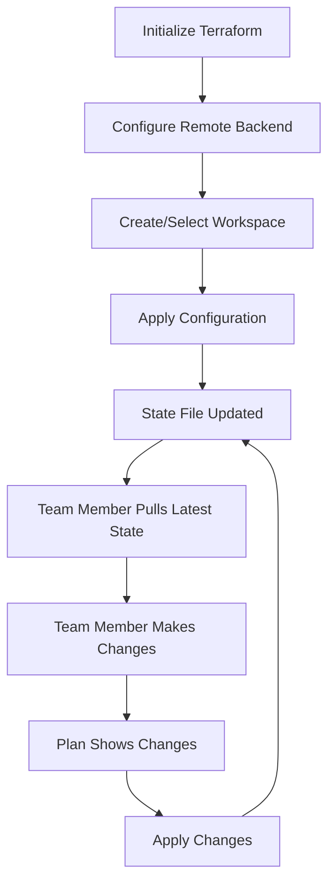

# Terraform State Management Strategies

## Introduction

Terraform state is a crucial component of the Terraform workflow that tracks the resources managed by your infrastructure code. The state file is a JSON document that maps resources in your configuration to real-world infrastructure objects. Without proper state management, Terraform cannot track what resources exist or determine what changes need to be applied.

In this guide, we'll explore different strategies for managing Terraform state effectively, especially in team environments and production scenarios.

## Why State Management Matters

Terraform state serves several critical purposes:

1. **Resource Tracking**: Maps resources in your configuration to real-world objects
2. **Dependency Management**: Tracks dependencies between resources
3. **Performance Optimization**: Caches resource attributes to improve plan speed
4. **Team Collaboration**: Enables multiple team members to work on the same infrastructure

Poor state management can lead to:
- Inconsistent infrastructure deployments
- Resource conflicts and duplication
- Accidental destruction of resources
- Difficulty collaborating in teams

## Local State vs. Remote State

### Local State

By default, Terraform stores state locally in a file named `terraform.tfstate`. This approach works for individual developers but presents challenges in team environments.

```hcl
# Default behavior - state stored locally
terraform {
  # No backend configuration means local state
}
```

**Drawbacks of local state:**
- Not accessible to team members
- Risk of losing state if local file is deleted
- No locking mechanism to prevent concurrent modifications
- Sensitive information stored in plain text locally

### Remote State

Remote state stores the Terraform state in a shared location accessible to all team members.

```hcl
# AWS S3 remote backend configuration
terraform {
  backend "s3" {
    bucket         = "my-terraform-state"
    key            = "prod/terraform.tfstate"
    region         = "us-west-2"
    encrypt        = true
    dynamodb_table = "terraform-locks"
  }
}
```

**Benefits of remote state:**
- Enables team collaboration
- Provides state locking to prevent concurrent modifications
- Can be encrypted for better security
- Versioning and backup capabilities

## Common Remote Backend Options

### AWS S3 + DynamoDB

A popular choice for AWS users, combining S3 for state storage and DynamoDB for state locking.

```hcl
terraform {
  backend "s3" {
    bucket         = "terraform-state-prod"
    key            = "networking/terraform.tfstate"
    region         = "us-east-1"
    encrypt        = true
    dynamodb_table = "terraform-locks"
  }
}
```

To set up the required S3 bucket and DynamoDB table:

```hcl
# Create S3 bucket for state storage
resource "aws_s3_bucket" "terraform_state" {
  bucket = "terraform-state-prod"

  lifecycle {
    prevent_destroy = true
  }
}

# Enable bucket versioning
resource "aws_s3_bucket_versioning" "terraform_state" {
  bucket = aws_s3_bucket.terraform_state.id
  
  versioning_configuration {
    status = "Enabled"
  }
}

# Enable server-side encryption
resource "aws_s3_bucket_server_side_encryption_configuration" "terraform_state" {
  bucket = aws_s3_bucket.terraform_state.id

  rule {
    apply_server_side_encryption_by_default {
      sse_algorithm = "AES256"
    }
  }
}

# Create DynamoDB table for state locking
resource "aws_dynamodb_table" "terraform_locks" {
  name         = "terraform-locks"
  billing_mode = "PAY_PER_REQUEST"
  hash_key     = "LockID"

  attribute {
    name = "LockID"
    type = "S"
  }
}
```

### Azure Storage

For Azure users, Azure Storage provides a reliable backend.

```hcl
terraform {
  backend "azurerm" {
    resource_group_name  = "tfstate"
    storage_account_name = "tfstate023"
    container_name       = "tfstate"
    key                  = "prod.terraform.tfstate"
  }
}
```

### Google Cloud Storage

For Google Cloud users, GCS is a suitable option.

```hcl
terraform {
  backend "gcs" {
    bucket = "tf-state-prod"
    prefix = "terraform/state"
  }
}
```

### Terraform Cloud/Enterprise

Terraform Cloud and Enterprise provide a managed backend with additional features.

```hcl
terraform {
  cloud {
    organization = "my-organization"
    workspaces {
      name = "my-app-prod"
    }
  }
}
```

## State Locking

State locking prevents concurrent modifications to the same state file, which could lead to corruption or conflicts.

Most remote backends support state locking. For example:

- AWS S3 uses DynamoDB tables for locking
- Azure Storage uses blob leases
- GCS uses object versioning

```hcl
# Example showing explicit locking configuration with S3
terraform {
  backend "s3" {
    bucket         = "terraform-state"
    key            = "prod/terraform.tfstate"
    region         = "us-west-2"
    encrypt        = true
    dynamodb_table = "terraform-locks" # Enables locking
  }
}
```

## Workspaces

Terraform workspaces allow you to manage multiple state files for different environments using the same configuration.

```bash
# Create a new workspace
terraform workspace new dev

# List available workspaces
terraform workspace list

# Switch to a different workspace
terraform workspace select prod
```

You can reference the current workspace in your configuration:

```hcl
resource "aws_instance" "example" {
  count = terraform.workspace == "prod" ? 3 : 1
  
  instance_type = terraform.workspace == "prod" ? "t3.large" : "t3.micro"
  
  tags = {
    Environment = terraform.workspace
  }
}
```

### Workspace-Based Backend Configuration

```hcl
terraform {
  backend "s3" {
    bucket         = "terraform-state"
    key            = "env/${terraform.workspace}/terraform.tfstate"
    region         = "us-west-2"
    encrypt        = true
    dynamodb_table = "terraform-locks"
  }
}
```

## State Management Workflow

Here's a visual representation of a typical Terraform state management workflow:



## State Migration

When moving from local to remote state or changing backends, you need to migrate your state.

```bash
# Example: Migrating from local to AWS S3
terraform init -migrate-state

# When prompted, confirm the migration
```

## State Management Best Practices

### 1. Always Use Remote State for Team Environments

```hcl
terraform {
  backend "s3" {
    bucket         = "terraform-state"
    key            = "project/terraform.tfstate"
    region         = "us-east-1"
    encrypt        = true
    dynamodb_table = "terraform-locks"
  }
}
```

### 2. Implement State Locking

Always configure state locking to prevent concurrent modifications.

### 3. Organize State Files

Structure your state files logically, either by environment or component:

```
├── networking/
│   └── terraform.tfstate  # Network infrastructure
├── database/
│   └── terraform.tfstate  # Database resources
└── application/
    └── terraform.tfstate  # Application resources
```

### 4. Use State Files for Outputs

Use remote state data sources to access outputs from other Terraform configurations:

```hcl
data "terraform_remote_state" "vpc" {
  backend = "s3"
  config = {
    bucket = "terraform-state"
    key    = "vpc/terraform.tfstate"
    region = "us-east-1"
  }
}

resource "aws_instance" "app" {
  subnet_id = data.terraform_remote_state.vpc.outputs.private_subnet_id
}
```

### 5. Backup State Files

Enable versioning on your state storage to maintain backups:

```hcl
resource "aws_s3_bucket_versioning" "terraform_state" {
  bucket = aws_s3_bucket.terraform_state.id
  
  versioning_configuration {
    status = "Enabled"
  }
}
```

### 6. Handle Sensitive Data

Mark sensitive outputs to prevent accidental exposure:

```hcl
output "database_password" {
  value     = aws_db_instance.example.password
  sensitive = true
}
```

### 7. Use Terraform Cloud for Enhanced Collaboration

For larger teams, consider Terraform Cloud for additional features like:
- Run triggers
- Policy as code (Sentinel)
- Team access controls
- Integrated CI/CD

## State Commands

Terraform provides several commands for managing state:

### State List

```bash
# List all resources in the state
terraform state list
```

**Output:**
```
aws_instance.web
aws_s3_bucket.data
aws_security_group.allow_http
```

### State Show

```bash
# Show details of a specific resource
terraform state show aws_instance.web
```

**Output:**
```
# aws_instance.web:
resource "aws_instance" "web" {
    ami           = "ami-0c55b159cbfafe1f0"
    instance_type = "t2.micro"
    tags = {
        Name = "WebServer"
    }
}
```

### State Move

```bash
# Move a resource to a different address
terraform state mv aws_instance.web aws_instance.web_server
```

### State Remove

```bash
# Remove a resource from state (without destroying it)
terraform state rm aws_instance.web
```

## Practical Example: Multi-Environment State Management

Let's create a practical example of managing different environments with Terraform workspaces.

First, configure the backend:

```hcl
# backend.tf
terraform {
  backend "s3" {
    bucket         = "terraform-environments"
    key            = "workspaces/terraform.tfstate"
    region         = "us-east-1"
    encrypt        = true
    dynamodb_table = "terraform-locks"
  }
}
```

Next, create workspace-specific configurations:

```hcl
# main.tf
provider "aws" {
  region = "us-east-1"
}

locals {
  environment = terraform.workspace

  # Environment-specific configurations
  env_config = {
    dev = {
      instance_type = "t2.micro"
      instance_count = 1
      allow_public_access = true
    }
    staging = {
      instance_type = "t2.medium"
      instance_count = 2
      allow_public_access = true
    }
    prod = {
      instance_type = "t2.large"
      instance_count = 3
      allow_public_access = false
    }
  }

  # Current environment configuration
  config = local.env_config[local.environment]
}

resource "aws_instance" "app" {
  count         = local.config.instance_count
  ami           = "ami-0c55b159cbfafe1f0"
  instance_type = local.config.instance_type
  
  tags = {
    Name        = "app-${local.environment}-${count.index + 1}"
    Environment = local.environment
  }
}

resource "aws_security_group" "app" {
  name = "app-${local.environment}"
  
  ingress {
    from_port   = 80
    to_port     = 80
    protocol    = "tcp"
    cidr_blocks = local.config.allow_public_access ? ["0.0.0.0/0"] : ["10.0.0.0/8"]
  }
}
```

Now you can manage different environments using workspaces:

```bash
# Create and switch to dev workspace
terraform workspace new dev
terraform apply

# Switch to staging workspace
terraform workspace select staging
terraform apply

# Switch to production workspace
terraform workspace new prod
terraform apply
```

## Terragrunt: Enhanced State Management

For more complex setups, [Terragrunt](https://terragrunt.gruntwork.io/) provides additional features for state management:

```hcl
# terragrunt.hcl
remote_state {
  backend = "s3"
  config = {
    bucket         = "terraform-state"
    key            = "${path_relative_to_include()}/terraform.tfstate"
    region         = "us-east-1"
    encrypt        = true
    dynamodb_table = "terraform-locks"
  }
}
```

Terragrunt allows you to:
- Keep backend configurations DRY
- Automatically create remote state resources
- Manage dependencies between modules

## Summary

Effective Terraform state management is crucial for maintaining infrastructure consistency, especially in team environments. Key strategies include:

1. Using remote backends for team collaboration
2. Implementing state locking to prevent conflicts
3. Organizing state files by environment or component
4. Using workspaces for environment isolation
5. Following best practices for security and backup

By implementing these strategies, you can ensure that your Terraform-managed infrastructure remains consistent, collaborative, and reliable across different environments and team members.

## Additional Resources

- [Terraform State Documentation](https://www.terraform.io/docs/language/state/index.html)
- [Backend Configuration](https://www.terraform.io/docs/language/settings/backends/index.html)
- [Workspaces](https://www.terraform.io/docs/language/state/workspaces.html)
- [Remote State Data Sources](https://www.terraform.io/docs/language/state/remote-state-data.html)

## Exercises

1. Set up a remote state backend using AWS S3 and DynamoDB.
2. Create a Terraform configuration that uses workspaces to manage dev, staging, and production environments.
3. Practice state migration by moving a local state file to a remote backend.
4. Use the `terraform_remote_state` data source to reference outputs from another Terraform configuration.
5. Implement a state backup strategy using versioning and lifecycle policies.