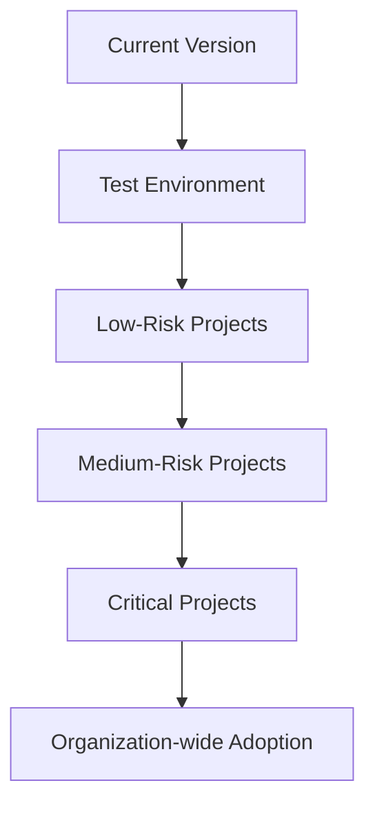

# Terraform Upgrade Strategies

## Introduction

Upgrading Terraform versions is a critical operational task for teams managing infrastructure as code. As HashiCorp releases new Terraform versions with performance improvements, security patches, and new features, having a solid upgrade strategy becomes essential. This guide will walk you through various approaches to safely upgrade Terraform across your projects and teams, minimizing disruption while maximizing benefits.

## Why Upgrade Matters

Before diving into upgrade strategies, let's understand why regular Terraform upgrades are important:

- **Security patches**: Newer versions often include fixes for security vulnerabilities
- **Bug fixes**: Issues with previous versions get resolved
- **New features**: Access to new functionality that can improve your infrastructure management
- **Provider compatibility**: Ensuring compatibility with the latest provider versions
- **Community support**: Older versions eventually lose community and official support

## Understanding Terraform Versioning

Terraform follows semantic versioning (SemVer) with version numbers in the format `MAJOR.MINOR.PATCH`:

- **MAJOR**: Includes breaking changes that might require updates to your code
- **MINOR**: Adds new features in a backward-compatible manner
- **PATCH**: Contains backward-compatible bug fixes

For example, upgrading from Terraform 1.3.7 to 1.3.9 is a patch upgrade, while moving from 1.3.7 to 1.4.0 is a minor upgrade.

## Pre-Upgrade Assessment

Before any upgrade, perform these assessment steps:

1. **Review release notes**: Check HashiCorp's release notes for breaking changes
2. **Verify provider compatibility**: Ensure your providers support the new Terraform version
3. **Test environment preparation**: Set up a test environment that mirrors production
4. **Backup state files**: Create backups of all state files before proceeding

## Upgrade Strategies

### 1. Phased Approach

The phased approach involves upgrading Terraform in stages across your organization.



#### Implementation Steps:

1. Start with non-critical test environments
2. Move to low-risk projects after successful testing
3. Gradually include more critical infrastructure
4. Complete organization-wide adoption once confident

**Real-world Example:**

```hcl
# Before upgrade (Terraform 1.2.x)
terraform {
  required_version = "~> 1.2.0"
  
  required_providers {
    aws = {
      source  = "hashicorp/aws"
      version = "~> 4.0"
    }
  }
}

# After upgrade (Terraform 1.3.x)
terraform {
  required_version = "~> 1.3.0"
  
  required_providers {
    aws = {
      source  = "hashicorp/aws"
      version = "~> 4.16"
    }
  }
}
```

### 2. Parallel Environments

This strategy involves maintaining parallel environments with different Terraform versions.

#### Implementation Steps:

1. Create a duplicate environment with the new Terraform version
2. Run both environments simultaneously
3. Compare infrastructure outputs and behavior
4. Switch traffic gradually to the new environment
5. Decommission the old environment after successful migration

**Real-world Example:**

Suppose you have a staging environment. You could:
- Keep the existing staging environment on Terraform 1.2.x
- Create a "staging-new" environment with Terraform 1.3.x
- Run the same workloads against both
- Compare performance, stability, and outputs
- Gradually shift traffic to "staging-new"
- Eventually rename and make it the primary staging environment

### 3. Targeted Module Upgrades

For large monorepos with many Terraform modules, you can upgrade module by module.

```hcl
# Module versioning approach
module "network" {
  source  = "app.terraform.io/mycompany/network/aws"
  version = "~> 3.0.0"  # Module compatible with Terraform 1.3.x
}

module "database" {
  source  = "app.terraform.io/mycompany/database/aws"
  version = "~> 2.5.0"  # Module still using Terraform 1.2.x compatibility
}
```

#### Implementation Steps:

1. Identify independent modules that can be upgraded separately
2. Start with foundational modules (networking, IAM, etc.)
3. Test thoroughly after each module upgrade
4. Update module version constraints in consuming configurations

### 4. Version Pinning with Gradual Release

Pin specific Terraform versions across teams and gradually increase the minimum version.

```hcl
# Initial version constraint
terraform {
  required_version = ">= 1.2.0, < 1.3.0"
}

# Intermediate step
terraform {
  required_version = ">= 1.2.0, < 1.4.0"
}

# Final target
terraform {
  required_version = ">= 1.3.0, < 1.4.0"
}
```

#### Implementation Steps:

1. Set an initial version constraint across all projects
2. Widen the constraint to allow newer versions (optional usage)
3. Set a deadline for minimum version updates
4. Enforce the new minimum version after the deadline

## Handling Terraform State Files During Upgrades

Terraform state files may need special attention during upgrades:

### State Migration

For major version upgrades, you might need to explicitly migrate state:

```bash
# Backup the current state
terraform state pull > terraform.tfstate.backup

# Upgrade state format if needed
terraform init -reconfigure

# Verify state after upgrade
terraform plan
```

### Remote State Considerations

When using remote state, ensure your state backend supports the new Terraform version:

```hcl
terraform {
  backend "s3" {
    bucket         = "my-terraform-state"
    key            = "prod/terraform.tfstate"
    region         = "us-east-1"
    dynamodb_table = "terraform-locks"
    encrypt        = true
  }
}
```

## Handling Breaking Changes

Major Terraform upgrades might include breaking changes. Here's how to address them:

### 1. Use the `terraform 0.13upgrade` command pattern

For significant version jumps, Terraform often provides upgrade helper commands:

```bash
# Example for upgrading from 0.12 to 0.13
terraform 0.13upgrade .

# Modern versions use init to handle updates
terraform init -upgrade
```

### 2. Update Deprecated Syntax

Example of updating deprecated syntax:

```hcl
# Before (Terraform 0.12)
resource "aws_instance" "example" {
  count = "${var.create_instance ? 1 : 0}"
  # other configuration...
}

# After (Terraform 0.13+)
resource "aws_instance" "example" {
  count = var.create_instance ? 1 : 0
  # other configuration...
}
```

### 3. Use Provider Migration Tools

Some providers offer migration tools for major updates:

```bash
# Example for AWS provider migration
terraform-provider-aws-migrate check
terraform-provider-aws-migrate fix
```

## Testing Your Upgrade

Always follow these testing steps:

1. **terraform init**: Initialize with the new version
2. **terraform validate**: Check for syntax errors
3. **terraform plan**: Verify no unexpected changes
4. **terraform apply**: In test environment only
5. **Validation testing**: Confirm infrastructure works as expected

```bash
# Testing script example
#!/bin/bash
set -e

echo "Initializing Terraform..."
terraform init

echo "Validating Terraform files..."
terraform validate

echo "Running plan to check for unexpected changes..."
terraform plan -out=tfplan

echo "If the plan looks good, apply changes..."
read -p "Apply the above plan? (y/n): " answer
if [ "$answer" == "y" ]; then
  terraform apply tfplan
  echo "Apply completed!"
else
  echo "Apply cancelled."
fi
```

## Real-World Upgrade Scenario

Let's walk through a complete upgrade scenario from Terraform 1.2.9 to 1.3.7:

### Step 1: Update local Terraform CLI

```bash
# For macOS with Homebrew
brew upgrade terraform

# For Linux using tfenv
tfenv install 1.3.7
tfenv use 1.3.7

# Verify version
terraform version
```

### Step 2: Update version constraints in code

```hcl
# Before
terraform {
  required_version = "~> 1.2.0"
  # other configuration...
}

# After
terraform {
  required_version = "~> 1.3.0"
  # other configuration...
}
```

### Step 3: Initialize with upgraded version

```bash
terraform init -upgrade
```

### Step 4: Run validation and plan

```bash
terraform validate
terraform plan
```

Output:
```
Terraform will perform the following actions:

No changes. Your infrastructure matches the configuration.
```

### Step 5: Apply changes (if any)

```bash
terraform apply
```

## Best Practices for Terraform Upgrades

- **Never skip multiple major versions**: Upgrade incrementally through each major version
- **Maintain a versioning policy**: Document your approach to Terraform versioning
- **Use CI/CD pipelines**: Automate testing of new Terraform versions
- **Document changes**: Keep detailed notes about each upgrade
- **Utilize feature flags**: Gradually enable new features in newer versions
- **Enforce version consistency**: Use tooling to ensure consistent versions across teams

## Common Challenges and Solutions

| Challenge | Solution |
|-----------|----------|
| State file compatibility issues | Always back up state files before upgrading; use `terraform init -reconfigure` |
| Team coordination | Use dedicated upgrade windows with team notification |
| Legacy code | Modernize gradually, starting with the most active modules |
| Provider compatibility | Check provider requirements before upgrading Terraform |
| Rollback strategy | Maintain ability to revert to previous version if needed |

## Summary

Upgrading Terraform is a necessary maintenance task that requires careful planning and execution. By following phased approaches, thorough testing, and proper communication, teams can smoothly transition to newer Terraform versions while minimizing risks and disruptions.

Remember these key points:

- Plan upgrades carefully with proper assessment
- Choose an appropriate upgrade strategy for your organization
- Test thoroughly in non-production environments
- Handle state files with extra care
- Follow incremental upgrade paths for major versions
- Document the process for future upgrades

## Additional Resources

- [Official Terraform Upgrade Guides](https://developer.hashicorp.com/terraform/tutorials/configuration-language)
- [HashiCorp Learn: Terraform Versions](https://developer.hashicorp.com/terraform/tutorials)
- [Terraform Module Registry](https://registry.terraform.io/)

## Exercises

1. Create a versioning policy for Terraform in your organization
2. Set up a test environment with a new Terraform version
3. Practice upgrading a simple module from one minor version to another
4. Identify and update deprecated syntax in an existing Terraform configuration
5. Implement a CI/CD pipeline that tests compatibility with multiple Terraform versions