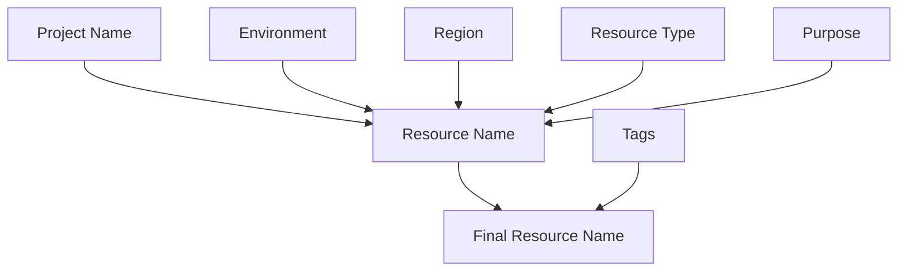

# Terraform Naming Conventions

## Introduction

When working with Terraform to manage infrastructure as code, establishing consistent naming conventions is crucial. Good naming conventions help teams understand resources at a glance, prevent naming conflicts, and make your code more maintainable. This guide will explore best practices for naming your Terraform resources, modules, and files.

## Why Naming Conventions Matter

Proper naming conventions in Terraform provide several benefits:

- **Readability**: Well-named resources make code easier to understand
- **Scalability**: Consistent naming helps manage resources as your infrastructure grows
- **Collaboration**: Team members can quickly understand resource purposes
- **Troubleshooting**: Easier to identify resources when debugging
- **Automation**: Consistent naming patterns enable better scripting and automation

## Basic Naming Convention Principles

### 1. Consistency

Use a consistent pattern across all resources. Consistency makes your code more predictable and easier to understand.

```hcl
# Good - Consistent naming pattern
resource "aws_instance" "web_server" {
  # ...
}
resource "aws_security_group" "web_server_sg" {
  # ...
}

# Bad - Inconsistent naming
resource "aws_instance" "webServer" {
  # ...
}
resource "aws_security_group" "sg-for-web" {
  # ...
}
```

### 2. Descriptiveness

Names should clearly indicate the purpose and type of the resource.

```hcl
# Good - Descriptive name
resource "aws_s3_bucket" "user_uploads_bucket" {
  # ...
}

# Bad - Vague name
resource "aws_s3_bucket" "bucket1" {
  # ...
}
```

### 3. Use of Delimiters

Choose a consistent delimiter (underscore, hyphen) and stick with it.

```hcl
# Using underscores
resource "aws_instance" "prod_web_server" {
  # ...
}

# Using hyphens
resource "aws_instance" "prod-web-server" {
  # ...
}

# Choose one style and be consistent
```

## Naming Conventions for Different Terraform Elements

### File and Directory Structure

```
project-root/
├── main.tf           # Main configuration file
├── variables.tf      # Input variables
├── outputs.tf        # Output values
├── terraform.tfvars  # Variable values
├── providers.tf      # Provider configurations
└── modules/          # Reusable modules
    └── vpc/          # VPC module
        ├── main.tf
        ├── variables.tf
        └── outputs.tf
```

### Resource Naming

A good resource naming convention follows this pattern:

```
[prefix]-[environment]-[region]-[purpose]-[resource_type]
```

Example:

```hcl
resource "aws_s3_bucket" "acme_prod_us_east_1_logs_bucket" {
  bucket = "acme-prod-us-east-1-logs"
  # ...
}
```

### Variable Naming

Variables should be named descriptively and use snake_case:

```hcl
# Good
variable "vpc_cidr_block" {
  description = "CIDR block for the VPC"
  type        = string
  default     = "10.0.0.0/16"
}

# Bad
variable "cidr" {
  description = "CIDR"
  type        = string
  default     = "10.0.0.0/16"
}
```

### Module Naming

Module names should be descriptive and indicate their purpose:

```hcl
module "web_server_cluster" {
  source = "./modules/web-server"
  # ...
}
```

## Practical Examples

### Example 1: AWS Infrastructure

```hcl
# Define a VPC
resource "aws_vpc" "main_vpc" {
  cidr_block = var.vpc_cidr_block
  
  tags = {
    Name        = "${var.project_name}-${var.environment}-vpc"
    Environment = var.environment
  }
}

# Define a subnet
resource "aws_subnet" "public_subnet_a" {
  vpc_id                  = aws_vpc.main_vpc.id
  cidr_block              = var.public_subnet_a_cidr
  availability_zone       = "${var.region}a"
  map_public_ip_on_launch = true
  
  tags = {
    Name        = "${var.project_name}-${var.environment}-public-subnet-a"
    Environment = var.environment
  }
}

# Define a security group
resource "aws_security_group" "web_server_sg" {
  name        = "${var.project_name}-${var.environment}-web-server-sg"
  description = "Security group for web servers"
  vpc_id      = aws_vpc.main_vpc.id
  
  # ...
  
  tags = {
    Name        = "${var.project_name}-${var.environment}-web-server-sg"
    Environment = var.environment
  }
}
```

### Example 2: Azure Resource Naming

```hcl
# Resource group
resource "azurerm_resource_group" "app_rg" {
  name     = "${var.company_name}-${var.environment}-${var.region}-app-rg"
  location = var.region
  
  tags = {
    Environment = var.environment
    Project     = var.project_name
  }
}

# Virtual network
resource "azurerm_virtual_network" "app_vnet" {
  name                = "${var.company_name}-${var.environment}-${var.region}-app-vnet"
  location            = azurerm_resource_group.app_rg.location
  resource_group_name = azurerm_resource_group.app_rg.name
  address_space       = [var.vnet_address_space]
  
  tags = {
    Environment = var.environment
    Project     = var.project_name
  }
}
```

## Advanced Naming Conventions

### Using Terraform Locals for Consistent Naming

Use `locals` to define naming conventions in one place:

```hcl
locals {
  # Define naming conventions
  name_prefix    = "${var.project_name}-${var.environment}"
  resource_tags  = {
    Environment  = var.environment
    Project      = var.project_name
    ManagedBy    = "Terraform"
  }
}

# Use the naming convention
resource "aws_s3_bucket" "logs_bucket" {
  bucket = "${local.name_prefix}-logs"
  
  tags = merge(
    local.resource_tags,
    {
      Name = "${local.name_prefix}-logs"
    }
  )
}

resource "aws_instance" "web_server" {
  ami           = var.ami_id
  instance_type = var.instance_type
  
  tags = merge(
    local.resource_tags,
    {
      Name = "${local.name_prefix}-web-server"
    }
  )
}
```

### Tag Standardization

Define a standard set of tags for all resources:

```hcl
locals {
  common_tags = {
    Environment = var.environment
    Project     = var.project_name
    Owner       = var.team_name
    ManagedBy   = "Terraform"
  }
}

resource "aws_vpc" "main" {
  cidr_block = var.vpc_cidr
  
  tags = merge(
    local.common_tags,
    {
      Name = "${var.project_name}-${var.environment}-vpc"
    }
  )
}
```

## Best Practices Visual Representation

Here's a diagram illustrating the relationship between different naming elements:



## Common Pitfalls to Avoid

1. **Inconsistent casing**: Mixing camelCase, snake_case, and kebab-case
2. **Overly abbreviated names**: Using abbreviations that aren't widely understood
3. **Too generic names**: Using names that don't convey the purpose
4. **Too long names**: Creating names that are difficult to read or hit length limits
5. **Hardcoded environment names**: Not using variables for environment names

## Practical Exercise

### Exercise: Refactor Poor Naming Conventions

Look at the following Terraform code with poor naming conventions:

```hcl
resource "aws_vpc" "vpc" {
  cidr_block = "10.0.0.0/16"
}

resource "aws_subnet" "Subnet1" {
  vpc_id     = aws_vpc.vpc.id
  cidr_block = "10.0.1.0/24"
}

resource "aws_instance" "webserver" {
  ami           = "ami-0c55b159cbfafe1f0"
  instance_type = "t2.micro"
  subnet_id     = aws_subnet.Subnet1.id
}
```

Now, refactor it with better naming conventions:

```hcl
resource "aws_vpc" "main_vpc" {
  cidr_block = "10.0.0.0/16"
  
  tags = {
    Name = "acme-prod-main-vpc"
  }
}

resource "aws_subnet" "public_subnet_a" {
  vpc_id     = aws_vpc.main_vpc.id
  cidr_block = "10.0.1.0/24"
  
  tags = {
    Name = "acme-prod-public-subnet-a"
  }
}

resource "aws_instance" "web_server" {
  ami           = "ami-0c55b159cbfafe1f0"
  instance_type = "t2.micro"
  subnet_id     = aws_subnet.public_subnet_a.id
  
  tags = {
    Name = "acme-prod-web-server"
  }
}
```

## Summary

Implementing consistent naming conventions in your Terraform code is essential for maintaining readable, scalable, and manageable infrastructure. Key takeaways include:

- Use consistent patterns and delimiters
- Make names descriptive and purposeful
- Consider using prefixes for environments and resource types
- Utilize `locals` for centralized naming conventions
- Standardize tags across resources
- Avoid common pitfalls like inconsistent casing and overly abbreviated names

By following these guidelines, you'll create Terraform code that is easier to understand, maintain, and troubleshoot, especially as your infrastructure grows in complexity.

## Additional Resources

- [Terraform Best Practices Repository](https://github.com/ozbillwang/terraform-best-practices)
- [HashiCorp Style Guide](https://www.terraform.io/docs/language/syntax/style.html)
- [Terraform AWS Provider Documentation](https://registry.terraform.io/providers/hashicorp/aws/latest/docs)
- [Terraform Azure Provider Documentation](https://registry.terraform.io/providers/hashicorp/azurerm/latest/docs)