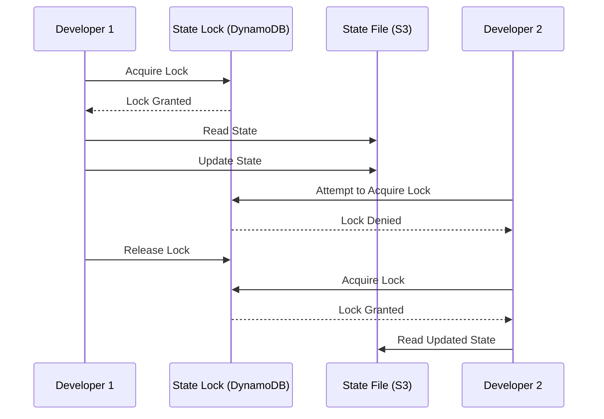

# Terraform Version Control

## Introduction

When working with Terraform to manage your infrastructure as code, version control becomes a critical component of your workflow. Version control allows you to track changes, collaborate with team members, and maintain a history of your infrastructure evolution. In this guide, we'll explore best practices for implementing version control for your Terraform code, ensuring that your infrastructure deployments remain consistent, traceable, and reliable.

## Why Version Control for Terraform?

Infrastructure as Code (IaC) with Terraform means your infrastructure is defined in code files. Like application code, these files benefit from version control for several reasons:

- **History tracking**: Maintain a complete history of infrastructure changes
- **Collaboration**: Enable multiple team members to work on infrastructure safely
- **Rollback capability**: Easily revert to previous working states if issues occur
- **Auditing**: Track who made what changes and when
- **CI/CD integration**: Enable automated testing and deployment pipelines

## Getting Started with Terraform Version Control

### Basic Git Setup for Terraform Projects

The most common version control system for Terraform is Git. Here's how to set up a basic Terraform project with Git:

```bash
# Initialize a new directory
mkdir terraform-project
cd terraform-project

# Initialize Git repository
git init

# Create basic Terraform files
touch main.tf variables.tf outputs.tf

# Initialize Terraform
terraform init

# Add files to Git
git add .
git commit -m "Initial Terraform project setup"
```

### Repository Structure

A well-organized repository structure helps maintain clarity as your Terraform codebase grows. Here's a recommended structure:

```
terraform-project/
├── README.md
├── main.tf
├── variables.tf
├── outputs.tf
├── terraform.tfvars.example
├── .gitignore
├��─ modules/
│   ├── networking/
│   │   ├── main.tf
│   │   ├── variables.tf
│   │   └── outputs.tf
│   └── compute/
│       ├── main.tf
│       ├── variables.tf
│       └── outputs.tf
└── environments/
    ├── dev/
    │   ├── main.tf
    │   └── terraform.tfvars
    ├── staging/
    │   ├── main.tf
    │   └── terraform.tfvars
    └── prod/
        ├── main.tf
        └── terraform.tfvars
```

### Essential .gitignore for Terraform

Properly configuring your `.gitignore` file is crucial to avoid committing sensitive or unnecessary files. Here's a starter `.gitignore` for Terraform projects:

```
# Local .terraform directories
**/.terraform/*

# .tfstate files
*.tfstate
*.tfstate.*

# Crash log files
crash.log

# Exclude all .tfvars files, which are likely to contain sensitive data
*.tfvars
!*.tfvars.example

# Ignore override files as they're usually used for local dev
override.tf
override.tf.json
*_override.tf
*_override.tf.json

# Ignore CLI configuration files
.terraformrc
terraform.rc

# Ignore lock files if you're sharing modules
# .terraform.lock.hcl
```

## Version Control Best Practices for Terraform

### 1. Lock Your Terraform Version

Ensure consistent Terraform behavior by locking the version in your configuration:

```hcl
terraform {
  required_version = "~> 1.5.0"
  
  required_providers {
    aws = {
      source  = "hashicorp/aws"
      version = "~> 4.16.0"
    }
  }
}
```

### 2. Commit the State Lock File

The `.terraform.lock.hcl` file should be committed to your version control system to ensure consistent provider versions:

```bash
git add .terraform.lock.hcl
git commit -m "Add provider lock file"
```

### 3. Use Branches for Changes

Follow a branching strategy for infrastructure changes:

```bash
# Create a feature branch
git checkout -b feature/add-rds-database

# Make your Terraform changes
# ...

# Commit changes
git add .
git commit -m "Add RDS database resources"

# Push branch and create a pull request
git push origin feature/add-rds-database
```

### 4. Pull Request Workflow

Use pull requests to review infrastructure changes before they're applied:

1. Create a branch for your changes
2. Make your Terraform code changes
3. Run `terraform fmt` to standardize code formatting
4. Run `terraform validate` to check for errors
5. Create a pull request with your changes
6. Include a `terraform plan` output in your PR description
7. Have team members review the changes
8. Merge only after approval

## Remote State Management

Managing Terraform state files is a crucial aspect of version control. The state file should not be directly stored in your Git repository.

### Setting Up Remote State

Configure a remote backend to store your state file:

```hcl
terraform {
  backend "s3" {
    bucket         = "my-terraform-state"
    key            = "prod/terraform.tfstate"
    region         = "us-west-2"
    encrypt        = true
    dynamodb_table = "terraform-locks"
  }
}
```

This example uses AWS S3 with DynamoDB for state locking, but Terraform supports many backend types including:

- Azure Storage
- Google Cloud Storage
- HashiCorp Terraform Cloud
- HashiCorp Consul

### State Locking

State locking prevents concurrent modifications, which could corrupt your state file:



## Collaboration Workflow

Here's a step-by-step workflow for collaborating on Terraform code:

### 1. Clone the Repository

```bash
git clone https://github.com/organization/terraform-project.git
cd terraform-project
```

### 2. Create a New Branch

```bash
git checkout -b feature/add-vpc-peering
```

### 3. Make Changes and Test Locally

```bash
# Edit Terraform files
vim main.tf

# Format and validate
terraform fmt
terraform validate

# See what changes would be made
terraform plan
```

### 4. Commit and Push

```bash
git add .
git commit -m "Add VPC peering configuration"
git push origin feature/add-vpc-peering
```

### 5. Create a Pull Request

Create a pull request in your Git hosting platform (GitHub, GitLab, etc.) that includes:

- Description of the changes
- Output from `terraform plan`
- Any related issues or tickets

### 6. Review and Merge

After peer review and approval, merge the changes to the main branch.

### 7. Apply Changes

```bash
git checkout main
git pull
terraform apply
```

## Advanced Version Control Strategies

### Using Git Tags for Releases

Tag significant infrastructure states for easy reference:

```bash
# After a successful deployment
git tag -a v1.2.0 -m "Release v1.2.0 - Added RDS instances"
git push origin v1.2.0
```

### Module Versioning

When creating reusable modules, implement semantic versioning:

```hcl
module "vpc" {
  source  = "terraform-aws-modules/vpc/aws"
  version = "3.14.0"
  
  # Module configuration
}
```

For internal modules stored in Git:

```hcl
module "custom_security" {
  source = "git::https://github.com/org/terraform-modules.git//security?ref=v1.0.0"
}
```

### Managing Sensitive Data

Use tools like HashiCorp Vault or AWS Secrets Manager for sensitive data rather than storing it in your repository:

```hcl
data "vault_generic_secret" "db_credentials" {
  path = "secret/database/credentials"
}

resource "aws_db_instance" "database" {
  username = data.vault_generic_secret.db_credentials.data["username"]
  password = data.vault_generic_secret.db_credentials.data["password"]
  # Other configuration
}
```

## Integrating with CI/CD

### GitHub Actions Example

Here's a basic GitHub Actions workflow for Terraform:

```yaml
name: Terraform CI

on:
  pull_request:
    branches: [ main ]

jobs:
  terraform:
    runs-on: ubuntu-latest
    steps:
    - uses: actions/checkout@v3

    - name: Setup Terraform
      uses: hashicorp/setup-terraform@v2
      with:
        terraform_version: 1.5.0

    - name: Terraform Init
      run: terraform init

    - name: Terraform Format
      run: terraform fmt -check

    - name: Terraform Validate
      run: terraform validate

    - name: Terraform Plan
      run: terraform plan -no-color
      env:
        AWS_ACCESS_KEY_ID: ${{ secrets.AWS_ACCESS_KEY_ID }}
        AWS_SECRET_ACCESS_KEY: ${{ secrets.AWS_SECRET_ACCESS_KEY }}
```

### Atlantis for Pull Request Automation

Atlantis is a tool that automates Terraform workflows on pull requests:

```yaml
# atlantis.yaml
version: 3
projects:
- name: dev
  dir: environments/dev
  workflow: terraform
  autoplan:
    when_modified: ["*.tf", "../modules/**/*.tf"]
    enabled: true
- name: prod
  dir: environments/prod
  workflow: terraform
  autoplan:
    when_modified: ["*.tf", "../modules/**/*.tf"]
    enabled: true
```

## Common Challenges and Solutions

### Challenge: State Conflicts

**Solution**: Use remote state with locking and follow a strict workflow where only CI/CD systems apply changes in shared environments.

### Challenge: Managing Multiple Environments

**Solution**: Use separate state files for each environment and consider tools like Terragrunt for DRY configurations:

```
├── terragrunt.hcl
├── dev/
│   ├── terragrunt.hcl
│   └── database/
│       └── terragrunt.hcl
├── staging/
│   ├── terragrunt.hcl
│   └── database/
│       └── terragrunt.hcl
└── prod/
    ├── terragrunt.hcl
    └── database/
        └── terragrunt.hcl
```

### Challenge: Code Reviews for Infrastructure

**Solution**: Generate and include detailed plans in pull requests and use tools like Infracost to show cost implications of changes.

## Summary

Implementing proper version control for your Terraform code is essential for maintaining consistent, reliable infrastructure deployments. By following the best practices outlined in this guide, you can:

- Track the history of your infrastructure changes
- Collaborate effectively with team members
- Rollback to previous states when needed
- Implement automated testing and deployment pipelines
- Maintain consistent environments

Remember that version control is not just about using Git—it's about implementing a complete workflow that includes code organization, state management, collaboration practices, and CI/CD integration.

## Additional Resources

- [Terraform Documentation on State](https://www.terraform.io/docs/language/state/index.html)
- [HashiCorp Learn: Terraform Modules](https://learn.hashicorp.com/collections/terraform/modules)
- [Terraform Cloud and Enterprise](https://www.terraform.io/cloud)
- [Terragrunt Documentation](https://terragrunt.gruntwork.io/docs/)

## Practice Exercises

1. Set up a basic Terraform project with the recommended repository structure
2. Configure remote state using an S3 bucket and DynamoDB table
3. Create a GitHub Actions workflow for Terraform validation
4. Implement a module versioning strategy for a simple infrastructure component
5. Practice the full collaboration workflow with a teammate