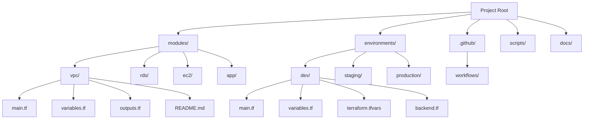

# Terraform Code Organization

## Introduction

Organizing your Terraform code is crucial for maintaining clean, scalable, and reusable infrastructure as code. As your infrastructure grows in complexity, well-structured code becomes essential for collaboration, testing, and long-term maintenance. This guide covers best practices for organizing Terraform code, from basic file structures to advanced modular designs.

## Why Code Organization Matters

Good Terraform code organization provides several benefits:

- **Maintainability**: Easier to understand and modify the codebase
- **Reusability**: Promotes component reuse across projects
- **Collaboration**: Enables team members to work on different components simultaneously
- **Scalability**: Supports growing infrastructure without increasing complexity
- **Testing**: Facilitates testing of individual components

## Basic File Structure

Let's start with a simple but effective file structure for a Terraform project:

```
project-root/
├── main.tf       # Primary entry point
├── variables.tf  # Input variables
├── outputs.tf    # Output values
├── providers.tf  # Provider configurations
├── versions.tf   # Terraform and provider version constraints
└── terraform.tfvars # Variable values (not committed to version control)
```

### Example: Basic File Structure

Here's how you might organize a simple AWS VPC deployment:

**versions.tf**
```hcl
terraform {
  required_version = ">= 1.0.0"
  required_providers {
    aws = {
      source  = "hashicorp/aws"
      version = ">= 4.0.0"
    }
  }
}
```

**providers.tf**
```hcl
provider "aws" {
  region = var.aws_region
}
```

**variables.tf**
```hcl
variable "aws_region" {
  description = "AWS region to deploy resources"
  type        = string
  default     = "us-west-2"
}

variable "vpc_cidr" {
  description = "CIDR block for the VPC"
  type        = string
  default     = "10.0.0.0/16"
}

variable "environment" {
  description = "Deployment environment"
  type        = string
  default     = "dev"
}
```

**main.tf**
```hcl
resource "aws_vpc" "main" {
  cidr_block = var.vpc_cidr
  
  tags = {
    Name        = "${var.environment}-vpc"
    Environment = var.environment
  }
}

resource "aws_subnet" "public" {
  vpc_id            = aws_vpc.main.id
  cidr_block        = cidrsubnet(var.vpc_cidr, 8, 1)
  availability_zone = "${var.aws_region}a"
  
  tags = {
    Name        = "${var.environment}-public-subnet"
    Environment = var.environment
  }
}
```

**outputs.tf**
```hcl
output "vpc_id" {
  description = "ID of the created VPC"
  value       = aws_vpc.main.id
}

output "public_subnet_id" {
  description = "ID of the public subnet"
  value       = aws_subnet.public.id
}
```

## Workspaces for Multiple Environments

For managing multiple environments (dev, staging, production), Terraform workspaces provide a simple solution:

```bash
# Create workspaces
terraform workspace new dev
terraform workspace new staging
terraform workspace new production

# Select workspace
terraform workspace select dev
```

Then, you can use the workspace in your configuration:

```hcl
locals {
  environment = terraform.workspace
  
  # Environment-specific configurations
  cidr_blocks = {
    dev        = "10.0.0.0/16"
    staging    = "10.1.0.0/16"
    production = "10.2.0.0/16"
  }
}

resource "aws_vpc" "main" {
  cidr_block = local.cidr_blocks[local.environment]
  
  tags = {
    Name        = "${local.environment}-vpc"
    Environment = local.environment
  }
}
```

## Using Modules for Code Reuse

Modules are containers for multiple resources that are used together. A module can encapsulate a specific piece of infrastructure logic like a VPC, a database cluster, or a complete application stack.

### Module Structure

```
modules/
├── vpc/
│   ├── main.tf
│   ├── variables.tf
│   ├── outputs.tf
│   └── README.md
├── rds/
│   ├── main.tf
│   ├── variables.tf
│   ├── outputs.tf
│   └── README.md
└── ec2/
    ├── main.tf
    ├── variables.tf
    ├── outputs.tf
    └── README.md
```

### Example: Creating and Using a VPC Module

First, let's create a VPC module:

**modules/vpc/variables.tf**
```hcl
variable "cidr_block" {
  description = "CIDR block for the VPC"
  type        = string
}

variable "environment" {
  description = "Deployment environment"
  type        = string
}

variable "public_subnet_count" {
  description = "Number of public subnets to create"
  type        = number
  default     = 2
}
```

**modules/vpc/main.tf**
```hcl
resource "aws_vpc" "this" {
  cidr_block           = var.cidr_block
  enable_dns_support   = true
  enable_dns_hostnames = true
  
  tags = {
    Name        = "${var.environment}-vpc"
    Environment = var.environment
  }
}

data "aws_availability_zones" "available" {}

resource "aws_subnet" "public" {
  count = var.public_subnet_count
  
  vpc_id            = aws_vpc.this.id
  cidr_block        = cidrsubnet(var.cidr_block, 8, count.index)
  availability_zone = data.aws_availability_zones.available.names[count.index]
  
  map_public_ip_on_launch = true
  
  tags = {
    Name        = "${var.environment}-public-subnet-${count.index + 1}"
    Environment = var.environment
  }
}

resource "aws_internet_gateway" "this" {
  vpc_id = aws_vpc.this.id
  
  tags = {
    Name        = "${var.environment}-igw"
    Environment = var.environment
  }
}

resource "aws_route_table" "public" {
  vpc_id = aws_vpc.this.id
  
  route {
    cidr_block = "0.0.0.0/0"
    gateway_id = aws_internet_gateway.this.id
  }
  
  tags = {
    Name        = "${var.environment}-public-rt"
    Environment = var.environment
  }
}

resource "aws_route_table_association" "public" {
  count = var.public_subnet_count
  
  subnet_id      = aws_subnet.public[count.index].id
  route_table_id = aws_route_table.public.id
}
```

**modules/vpc/outputs.tf**
```hcl
output "vpc_id" {
  description = "ID of the created VPC"
  value       = aws_vpc.this.id
}

output "public_subnet_ids" {
  description = "IDs of the public subnets"
  value       = aws_subnet.public[*].id
}
```

Now, use this module in your root configuration:

**main.tf**
```hcl
module "vpc" {
  source = "./modules/vpc"
  
  cidr_block         = "10.0.0.0/16"
  environment        = var.environment
  public_subnet_count = 2
}

# Use the VPC outputs
resource "aws_security_group" "example" {
  name        = "${var.environment}-example-sg"
  description = "Example security group"
  vpc_id      = module.vpc.vpc_id
  
  ingress {
    from_port   = 80
    to_port     = 80
    protocol    = "tcp"
    cidr_blocks = ["0.0.0.0/0"]
  }
  
  egress {
    from_port   = 0
    to_port     = 0
    protocol    = "-1"
    cidr_blocks = ["0.0.0.0/0"]
  }
  
  tags = {
    Name        = "${var.environment}-example-sg"
    Environment = var.environment
  }
}
```

## Environment-Specific Configurations

For a more robust environment separation, use directory-based organization:

```
environments/
├── dev/
│   ├── main.tf
│   ├── variables.tf
│   └── terraform.tfvars
├── staging/
│   ├── main.tf
│   ├── variables.tf
│   └── terraform.tfvars
└── production/
    ├── main.tf
    ├── variables.tf
    └── terraform.tfvars
```

Each environment directory uses the same modules but with different configurations:

**environments/dev/main.tf**
```hcl
module "vpc" {
  source = "../../modules/vpc"
  
  cidr_block         = var.vpc_cidr
  environment        = "dev"
  public_subnet_count = 2
}

module "app" {
  source = "../../modules/app"
  
  vpc_id            = module.vpc.vpc_id
  subnet_ids        = module.vpc.public_subnet_ids
  environment       = "dev"
  instance_type     = "t3.small"
  instance_count    = 2
}
```

**environments/production/main.tf**
```hcl
module "vpc" {
  source = "../../modules/vpc"
  
  cidr_block         = var.vpc_cidr
  environment        = "production"
  public_subnet_count = 3
}

module "app" {
  source = "../../modules/app"
  
  vpc_id            = module.vpc.vpc_id
  subnet_ids        = module.vpc.public_subnet_ids
  environment       = "production"
  instance_type     = "t3.large"
  instance_count    = 5
}
```

## Terraform Project Structure Visualization

Here's a visualization of a comprehensive Terraform project structure:



## Advanced Organization Techniques

### Remote State Management

For team collaboration, use remote state storage:

**backend.tf**
```hcl
terraform {
  backend "s3" {
    bucket         = "my-terraform-state"
    key            = "environments/dev/terraform.tfstate"
    region         = "us-west-2"
    encrypt        = true
    dynamodb_table = "terraform-locks"
  }
}
```

### Using Terragrunt for DRY Configurations

Terragrunt is a thin wrapper for Terraform that provides extra tools for keeping configurations DRY:

**terragrunt.hcl**
```hcl
remote_state {
  backend = "s3"
  config = {
    bucket         = "my-terraform-state"
    key            = "${path_relative_to_include()}/terraform.tfstate"
    region         = "us-west-2"
    encrypt        = true
    dynamodb_table = "terraform-locks"
  }
}

inputs = {
  aws_region = "us-west-2"
}
```

### Component-Based Structure

For large projects, a component-based structure can be effective:

```
infrastructure/
├── networking/
│   ├── vpc/
│   ├── dns/
│   └── cdn/
├── data/
│   ├── rds/
│   ├── elasticache/
│   └── s3/
└── compute/
    ├── ecs/
    ├── ec2/
    └── lambda/
```

## Best Practices Summary

1. **Separate Configuration by Environment**: Use separate directories or workspaces for dev, staging, and production.
2. **Use Modules for Reusability**: Create reusable modules for common infrastructure components.
3. **Version Control Configuration**: Store all Terraform code in version control, except sensitive values.
4. **Document Your Code**: Add READMEs to explain the purpose and usage of modules.
5. **Use Remote State**: Store state remotely for team collaboration and state locking.
6. **Keep It DRY**: Avoid duplicating code and configurations.
7. **Validate and Format**: Use `terraform fmt` and `terraform validate` to ensure code quality.
8. **Use Variables and Locals**: Parameterize your code with variables and use locals for derived values.
9. **Implement Consistent Naming**: Follow a consistent naming convention for resources.
10. **Test Your Modules**: Verify that modules work as expected in isolation.

## Implementing Terraform Code Organization in a Real Project

Let's walk through a real-world example of refactoring a monolithic Terraform configuration into a well-organized structure:

### Before: Monolithic Configuration

```hcl
# Single main.tf file with everything
provider "aws" {
  region = "us-west-2"
}

resource "aws_vpc" "main" {
  cidr_block = "10.0.0.0/16"
}

resource "aws_subnet" "public1" {
  vpc_id     = aws_vpc.main.id
  cidr_block = "10.0.1.0/24"
}

resource "aws_subnet" "public2" {
  vpc_id     = aws_vpc.main.id
  cidr_block = "10.0.2.0/24"
}

resource "aws_instance" "app" {
  ami           = "ami-0c55b159cbfafe1f0"
  instance_type = "t3.micro"
  subnet_id     = aws_subnet.public1.id
}

resource "aws_db_instance" "database" {
  allocated_storage = 20
  engine           = "mysql"
  engine_version   = "5.7"
  instance_class   = "db.t3.micro"
  name             = "mydb"
  username         = "admin"
  password         = "password"
  skip_final_snapshot = true
}
```

### After: Well-Organized Structure

After refactoring, we'll have:

1. A module for networking
2. A module for the database
3. A module for the application
4. Environment-specific configurations

#### Directory Structure

```
project/
├── modules/
│   ├── networking/
│   │   ├── main.tf
│   │   ├── variables.tf
│   │   └── outputs.tf
│   ├── database/
│   │   ├── main.tf
│   │   ├── variables.tf
│   │   └── outputs.tf
│   └── app/
│       ├── main.tf
│       ├── variables.tf
│       └── outputs.tf
└── environments/
    ├── dev/
    │   ├── main.tf
    │   ├── variables.tf
    │