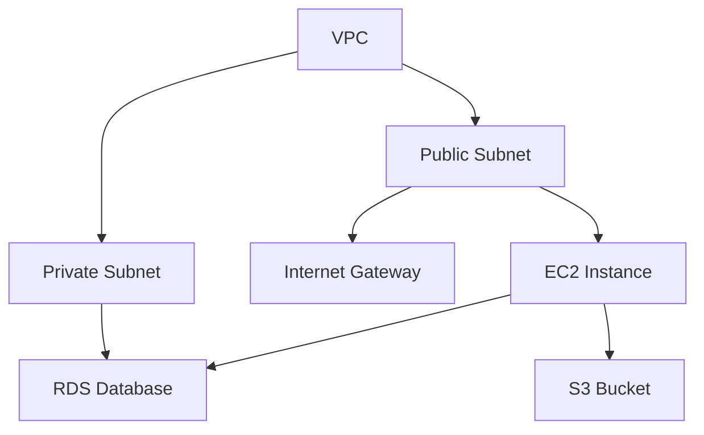

# Terraform Documentation

## Introduction

Documentation is a critical component of any successful Terraform project. Well-documented Terraform code enables teams to understand, maintain, and collaborate effectively on infrastructure as code. In this guide, we'll explore best practices for documenting your Terraform configurations, from basic commenting to comprehensive module documentation.

Good documentation serves multiple purposes:
- Helps team members understand how and why infrastructure is configured a certain way
- Makes onboarding new developers easier and faster
- Serves as a historical record of infrastructure decisions
- Provides context that code alone cannot express
- Enables easier troubleshooting when issues arise

Let's dive into how you can create effective documentation for your Terraform projects.

## In-line Comments

The simplest form of documentation is adding comments directly within your Terraform code. Terraform supports single-line comments with the `#` character or `//`, and multi-line comments with `/* ... */`.

```hcl
# This is a single-line comment
// This is also a single-line comment

/* 
This is a 
multi-line comment
*/

resource "aws_instance" "web" {
  ami           = "ami-0c55b159cbfafe1f0"
  instance_type = "t2.micro"  # Use t2.micro for development environments
  
  tags = {
    Name = "WebServer"
    /* 
    Environment = "Development"
    Purpose     = "Web Hosting"
    */
  }
}
```

### Best Practices for Comments:

1. **Explain "why" not just "what"**: The code itself shows what's happening; comments should explain why.
2. **Document unusual or complex configurations**: If you're doing something non-standard, explain your reasoning.
3. **Keep comments updated**: Outdated comments are worse than no comments at all.
4. **Don't over-comment**: Not every line needs a comment; focus on what's important.

## README Files

Each Terraform project should include a README.md file at the root that provides an overview of the project. This serves as the entry point for anyone new to the codebase.

A good Terraform README typically includes:

```markdown
# Project Name

Brief description of what this Terraform code creates and manages.

## Prerequisites

* Terraform v1.0+
* AWS CLI configured (or other relevant provider)
* Required permissions/credentials

## Usage

```bash
terraform init
terraform plan
terraform apply
```

## Modules

This project contains the following modules:
- `networking`: Sets up VPC, subnets, and security groups
- `compute`: Provisions EC2 instances and related resources
- `database`: Creates and configures RDS instances

## Inputs

| Name | Description | Type | Default | Required |
|------|-------------|------|---------|:--------:|
| region | AWS region to deploy into | string | `"us-west-2"` | yes |
| environment | Deployment environment | string | `"dev"` | no |

## Outputs

| Name | Description |
|------|-------------|
| vpc_id | ID of the created VPC |
| instance_ips | Public IPs of created instances |
```

## Module Documentation

For larger Terraform projects organized into modules, each module should have its own documentation. Create a `README.md` file in each module directory with the following structure:

1. **Purpose**: What the module does and when to use it
2. **Providers**: Which providers the module requires
3. **Resources Created**: List of resources this module creates
4. **Input Variables**: All variables the module accepts
5. **Outputs**: All outputs the module produces
6. **Example Usage**: A simple example showing how to use the module

## Automated Documentation

You can automate the generation of documentation for your Terraform modules using tools like `terraform-docs`. This ensures documentation stays in sync with your code.

```bash
# Install terraform-docs
brew install terraform-docs  # On macOS
# Or download from https://github.com/terraform-docs/terraform-docs/releases

# Generate markdown documentation
terraform-docs markdown table . > README.md
```

Here's what the generated documentation might look like:

```markdown
## Requirements

| Name | Version |
|------|---------|
| terraform | >= 1.0.0 |
| aws | >= 3.27 |

## Providers

| Name | Version |
|------|---------|
| aws | >= 3.27 |

## Modules

No modules.

## Resources

| Name | Type |
|------|------|
| [aws_instance.app](https://registry.terraform.io/providers/hashicorp/aws/latest/docs/resources/instance) | resource |
| [aws_security_group.allow_web](https://registry.terraform.io/providers/hashicorp/aws/latest/docs/resources/security_group) | resource |
| [aws_ami.ubuntu](https://registry.terraform.io/providers/hashicorp/aws/latest/docs/data-sources/ami) | data source |

## Inputs

| Name | Description | Type | Default | Required |
|------|-------------|------|---------|:--------:|
| instance_type | EC2 instance type | `string` | `"t2.micro"` | no |
| subnet_id | ID of subnet to place the instance in | `string` | n/a | yes |

## Outputs

| Name | Description |
|------|-------------|
| instance_id | ID of the created EC2 instance |
| public_ip | Public IP address of the EC2 instance |
```

## Using TF_VAR_FILES for Environment Documentation

A well-documented Terraform project often includes variable definition files for different environments. These files both configure and document the specific settings for each environment.

For example, create files like:
- `dev.tfvars`
- `staging.tfvars`
- `prod.tfvars`

```hcl
# prod.tfvars
region = "us-west-2"
instance_type = "m5.large"
vpc_cidr = "10.0.0.0/16"
enable_monitoring = true
backup_retention_days = 30
```

This approach documents your infrastructure configuration across environments and simplifies deployment.

## Using Diagrams

Infrastructure diagrams help visualize your Terraform resources and their relationships. You can include diagrams in your documentation using tools like Mermaid:



## Documenting Decisions with ADRs

For significant infrastructure decisions, consider using Architecture Decision Records (ADRs). These document the context and reasoning behind important architectural choices.

Create an `adr` directory in your repository with numbered markdown files:

```markdown
# ADR-001: Using AWS Transit Gateway for Network Connectivity

## Status
Accepted

## Context
We need to connect multiple VPCs and our on-premises network.

## Decision
We will use AWS Transit Gateway as a central hub for all network connectivity.

## Consequences
- Simplified network architecture
- Reduced number of VPC peering connections
- Additional cost for Transit Gateway
- Dependency on a single regional service
```

## Real-World Example: Complete Project Documentation

Let's look at a complete example for a project that deploys a three-tier web application:

```hcl
# main.tf
module "networking" {
  source = "./modules/networking"
  
  vpc_cidr       = var.vpc_cidr
  public_subnets = var.public_subnets
  private_subnets = var.private_subnets
}

module "web_tier" {
  source = "./modules/web_tier"
  
  vpc_id         = module.networking.vpc_id
  public_subnets = module.networking.public_subnet_ids
  instance_type  = var.web_instance_type
  min_size       = var.web_min_size
  max_size       = var.web_max_size
}

module "app_tier" {
  source = "./modules/app_tier"
  
  vpc_id          = module.networking.vpc_id
  private_subnets = module.networking.private_subnet_ids
  instance_type   = var.app_instance_type
  min_size        = var.app_min_size
  max_size        = var.app_max_size
  db_endpoint     = module.db_tier.db_endpoint
}

module "db_tier" {
  source = "./modules/db_tier"
  
  vpc_id          = module.networking.vpc_id
  private_subnets = module.networking.private_subnet_ids
  db_instance_class = var.db_instance_class
  db_name         = var.db_name
  db_username     = var.db_username
  db_password     = var.db_password
}
```

The documentation for this might include:

1. Main README.md explaining the overall architecture
2. Environment-specific variable files with comments
3. Module-specific READMEs with detailed documentation
4. A diagram showing the three-tier architecture
5. ADRs explaining key decisions like why we chose a three-tier architecture

## Terraform Comments vs. Description Fields

Terraform allows you to add descriptions to variables, outputs, and resources. These descriptions serve as embedded documentation:

```hcl
variable "instance_type" {
  description = "The EC2 instance type to use for application servers. Choose t2.micro for development, and m5.large or higher for production."
  type        = string
  default     = "t2.micro"
}

output "load_balancer_dns" {
  description = "The DNS name of the load balancer. Use this to access the web application."
  value       = aws_lb.main.dns_name
}
```

These descriptions appear in the Terraform CLI output and in automatically generated documentation.

## Best Practices Summary

1. **Document as you code**: Don't leave documentation for later.
2. **Use a consistent format**: Standardize your documentation approach.
3. **Automate when possible**: Use tools like terraform-docs.
4. **Include diagrams**: Visual representations help understand complex infrastructure.
5. **Keep documentation updated**: Update docs when you change code.
6. **Document "why" not just "what"**: Explain the reasoning behind your choices.
7. **Use version control**: Keep documentation in the same repository as your code.
8. **Include examples**: Show how to use your modules and resources.

## Summary

Effective Terraform documentation is a key component of infrastructure as code best practices. By implementing proper documentation strategies, you can ensure your Terraform projects remain maintainable, understandable, and collaborative. Remember that documentation is not just for others—it's also for your future self who may need to revisit the code months or years later.

## Additional Resources

- [Terraform Documentation](https://www.terraform.io/docs)
- [terraform-docs](https://github.com/terraform-docs/terraform-docs)
- [Architecture Decision Records](https://adr.github.io/)
- [HashiCorp Learn: Terraform](https://learn.hashicorp.com/terraform)

## Exercises

1. Take an existing Terraform project and add comprehensive README documentation.
2. Generate automated documentation using terraform-docs for a module.
3. Create variable definition files (.tfvars) for different environments.
4. Document a complex infrastructure design using a Mermaid diagram.
5. Write an Architecture Decision Record for a significant infrastructure decision in your project.