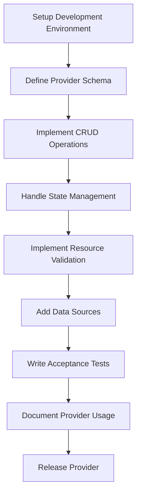

# Terraform Provider Development

## Introduction

Terraform providers are plugins that allow Terraform to interact with various APIs, services, and platforms. While HashiCorp and the community maintain hundreds of providers, you might need to create a custom provider for internal tools or services that don't have an official provider. This guide will walk you through the process of developing your own Terraform provider.

A custom provider allows you to:
- Integrate Terraform with proprietary or internal systems
- Add functionality not covered by existing providers
- Implement organization-specific workflows and validations
- Control the exact behavior of your infrastructure provisioning

## Prerequisites

Before diving into provider development, you should have:

- Working knowledge of Terraform configuration and usage
- Familiarity with the Go programming language (all Terraform providers are written in Go)
- Understanding of the APIs or services you want to integrate with
- Terraform CLI installed (version 0.12+)
- Go development environment set up (version 1.16+)

## Provider Development Workflow

The process of developing a Terraform provider involves several key steps:



## Setting Up Your Development Environment

First, create a new Go module for your provider:

```go
mkdir terraform-provider-example
cd terraform-provider-example
go mod init github.com/yourusername/terraform-provider-example
```

Install the required Terraform SDK dependencies:

```go
go get github.com/hashicorp/terraform-plugin-sdk/v2/helper/schema
go get github.com/hashicorp/terraform-plugin-sdk/v2/plugin
```

## Provider Structure

A typical Terraform provider has the following structure:

```
terraform-provider-example/
├── examples/              # Example configurations using your provider
├── internal/              # Internal provider code
│   └── provider/          # Provider implementation
│       ├── provider.go    # Provider definition
│       ├── resource_*.go  # Resource implementations
│       └── data_source_*.go # Data source implementations
├── main.go                # Entry point for the provider
├── go.mod                 # Go module file
└── go.sum                 # Go dependencies checksum
```

## Creating the Provider Entry Point

Start by creating the `main.go` file:

```go
package main

import (
    "github.com/hashicorp/terraform-plugin-sdk/v2/helper/schema"
    "github.com/hashicorp/terraform-plugin-sdk/v2/plugin"
    "github.com/yourusername/terraform-provider-example/internal/provider"
)

func main() {
    plugin.Serve(&plugin.ServeOpts{
        ProviderFunc: func() *schema.Provider {
            return provider.Provider()
        },
    })
}
```

## Implementing the Provider

Create the `internal/provider/provider.go` file:

```go
package provider

import (
    "context"
    "github.com/hashicorp/terraform-plugin-sdk/v2/diag"
    "github.com/hashicorp/terraform-plugin-sdk/v2/helper/schema"
)

func Provider() *schema.Provider {
    return &schema.Provider{
        Schema: map[string]*schema.Schema{
            "api_key": {
                Type:        schema.TypeString,
                Required:    true,
                Sensitive:   true,
                Description: "The API key for accessing the service",
            },
            "endpoint": {
                Type:        schema.TypeString,
                Optional:    true,
                Default:     "https://api.example.com",
                Description: "The API endpoint URL",
            },
        },
        ResourcesMap: map[string]*schema.Resource{
            "example_resource": resourceExampleResource(),
        },
        DataSourcesMap: map[string]*schema.Resource{
            "example_data_source": dataSourceExampleData(),
        },
        ConfigureContextFunc: providerConfigure,
    }
}

type apiClient struct {
    apiKey   string
    endpoint string
}

func providerConfigure(ctx context.Context, d *schema.ResourceData) (interface{}, diag.Diagnostics) {
    apiKey := d.Get("api_key").(string)
    endpoint := d.Get("endpoint").(string)

    // You would typically initialize your actual API client here
    client := &apiClient{
        apiKey:   apiKey,
        endpoint: endpoint,
    }

    return client, nil
}
```

## Implementing Resources

Resources are the main building blocks of Terraform. Let's create a simple example resource:

```go
// internal/provider/resource_example.go
package provider

import (
    "context"
    "fmt"
    "github.com/hashicorp/terraform-plugin-sdk/v2/diag"
    "github.com/hashicorp/terraform-plugin-sdk/v2/helper/schema"
)

func resourceExampleResource() *schema.Resource {
    return &schema.Resource{
        CreateContext: resourceExampleCreate,
        ReadContext:   resourceExampleRead,
        UpdateContext: resourceExampleUpdate,
        DeleteContext: resourceExampleDelete,
        Schema: map[string]*schema.Schema{
            "name": {
                Type:        schema.TypeString,
                Required:    true,
                Description: "The name of the resource",
            },
            "description": {
                Type:        schema.TypeString,
                Optional:    true,
                Description: "A description of the resource",
            },
            "tags": {
                Type:        schema.TypeMap,
                Elem:        &schema.Schema{Type: schema.TypeString},
                Optional:    true,
                Description: "Tags to associate with the resource",
            },
            "id": {
                Type:        schema.TypeString,
                Computed:    true,
                Description: "The ID of the resource",
            },
        },
    }
}

func resourceExampleCreate(ctx context.Context, d *schema.ResourceData, m interface{}) diag.Diagnostics {
    client := m.(*apiClient)
    
    // Extract values from the resource data
    name := d.Get("name").(string)
    description := d.Get("description").(string)
    
    // Make API call to create the resource
    // This is where you would use your client to call the actual API
    fmt.Printf("Creating resource with name: %s using API key: %s at endpoint: %s
", 
               name, client.apiKey, client.endpoint)
    
    // For demonstration, we're setting a dummy ID
    resourceID := "example-resource-id-12345"
    d.SetId(resourceID)
    
    return resourceExampleRead(ctx, d, m)
}

func resourceExampleRead(ctx context.Context, d *schema.ResourceData, m interface{}) diag.Diagnostics {
    client := m.(*apiClient)
    
    // Get the resource ID
    resourceID := d.Id()
    
    // Make API call to read the resource
    // This is where you would use your client to call the actual API
    fmt.Printf("Reading resource with ID: %s using API key: %s at endpoint: %s
", 
               resourceID, client.apiKey, client.endpoint)
    
    // For demonstration, we're setting dummy values
    // In a real provider, you'd use the values from the API response
    d.Set("name", "example-name")
    d.Set("description", "This is an example resource")
    
    return nil
}

func resourceExampleUpdate(ctx context.Context, d *schema.ResourceData, m interface{}) diag.Diagnostics {
    client := m.(*apiClient)
    
    // Get the resource ID
    resourceID := d.Id()
    
    // Check what changed
    if d.HasChange("name") || d.HasChange("description") {
        // Extract new values
        name := d.Get("name").(string)
        description := d.Get("description").(string)
        
        // Make API call to update the resource
        // This is where you would use your client to call the actual API
        fmt.Printf("Updating resource with ID: %s, new name: %s using API key: %s at endpoint: %s
", 
                   resourceID, name, client.apiKey, client.endpoint)
    }
    
    return resourceExampleRead(ctx, d, m)
}

func resourceExampleDelete(ctx context.Context, d *schema.ResourceData, m interface{}) diag.Diagnostics {
    client := m.(*apiClient)
    
    // Get the resource ID
    resourceID := d.Id()
    
    // Make API call to delete the resource
    // This is where you would use your client to call the actual API
    fmt.Printf("Deleting resource with ID: %s using API key: %s at endpoint: %s
", 
               resourceID, client.apiKey, client.endpoint)
    
    // Clear the ID to tell Terraform the resource no longer exists
    d.SetId("")
    
    return nil
}
```

## Implementing Data Sources

Data sources allow Terraform to fetch information from external systems without creating or modifying resources:

```go
// internal/provider/data_source_example.go
package provider

import (
    "context"
    "github.com/hashicorp/terraform-plugin-sdk/v2/diag"
    "github.com/hashicorp/terraform-plugin-sdk/v2/helper/schema"
    "strconv"
    "time"
)

func dataSourceExampleData() *schema.Resource {
    return &schema.Resource{
        ReadContext: dataSourceExampleRead,
        Schema: map[string]*schema.Schema{
            "name": {
                Type:        schema.TypeString,
                Required:    true,
                Description: "The name to search for",
            },
            "items": {
                Type:        schema.TypeList,
                Computed:    true,
                Description: "List of items found",
                Elem: &schema.Resource{
                    Schema: map[string]*schema.Schema{
                        "id": {
                            Type:        schema.TypeString,
                            Computed:    true,
                            Description: "The ID of the item",
                        },
                        "name": {
                            Type:        schema.TypeString,
                            Computed:    true,
                            Description: "The name of the item",
                        },
                        "description": {
                            Type:        schema.TypeString,
                            Computed:    true,
                            Description: "The description of the item",
                        },
                    },
                },
            },
        },
    }
}

func dataSourceExampleRead(ctx context.Context, d *schema.ResourceData, m interface{}) diag.Diagnostics {
    client := m.(*apiClient)
    
    name := d.Get("name").(string)
    
    // Make API call to search for items
    // This is where you would use your client to call the actual API
    
    // For demonstration, we're setting dummy values
    // In a real provider, you'd use the values from the API response
    items := []map[string]interface{}{
        {
            "id":          "item-1",
            "name":        name + "-1",
            "description": "This is the first example item",
        },
        {
            "id":          "item-2",
            "name":        name + "-2",
            "description": "This is the second example item",
        },
    }
    
    if err := d.Set("items", items); err != nil {
        return diag.FromErr(err)
    }
    
    // Generate a unique ID for this data source
    d.SetId(strconv.FormatInt(time.Now().Unix(), 10))
    
    return nil
}
```

## Building and Testing Your Provider

To build your provider:

```bash
go build -o terraform-provider-example
```

For local testing, you'll need to set up a development override in your Terraform configuration:

```hcl
# ~/.terraformrc
provider_installation {
  dev_overrides {
    "yourusername/example" = "/path/to/your/terraform-provider-example"
  }
  direct {}
}
```

Then create a test configuration:

```hcl
# main.tf
terraform {
  required_providers {
    example = {
      source = "yourusername/example"
    }
  }
}

provider "example" {
  api_key = "test-api-key"
  endpoint = "https://api.example.com"
}

resource "example_resource" "test" {
  name = "test-resource"
  description = "This is a test resource"
  
  tags = {
    Environment = "Development"
    Project     = "Provider Testing"
  }
}

data "example_data_source" "search" {
  name = "test"
}

output "resource_id" {
  value = example_resource.test.id
}

output "data_source_items" {
  value = data.example_data_source.search.items
}
```

Run Terraform commands to test your provider:

```bash
terraform init
terraform plan
terraform apply
terraform destroy
```

## Writing Acceptance Tests

Acceptance tests are essential for provider development. They ensure your provider works correctly against the actual API:

```go
// internal/provider/resource_example_test.go
package provider

import (
    "testing"
    "github.com/hashicorp/terraform-plugin-sdk/v2/helper/resource"
)

func TestAccExampleResource_basic(t *testing.T) {
    resource.Test(t, resource.TestCase{
        PreCheck:          func() { testAccPreCheck(t) },
        ProviderFactories: providerFactories,
        Steps: []resource.TestStep{
            {
                Config: testAccExampleResourceConfig_basic,
                Check: resource.ComposeTestCheckFunc(
                    resource.TestCheckResourceAttr("example_resource.test", "name", "test-resource"),
                    resource.TestCheckResourceAttr("example_resource.test", "description", "This is a test resource"),
                ),
            },
        },
    })
}

const testAccExampleResourceConfig_basic = `
resource "example_resource" "test" {
  name        = "test-resource"
  description = "This is a test resource"
}
`

func testAccPreCheck(t *testing.T) {
    // Verify required environment variables are set
}

var providerFactories = map[string]func() (*schema.Provider, error){
    "example": func() (*schema.Provider, error) {
        return Provider(), nil
    },
}
```

## Documenting Your Provider

Good documentation is crucial for users of your provider. Create a `docs/` directory in your repository:

```
docs/
├── index.md              # Provider overview and configuration
├── resources/
│   └── example_resource.md  # Documentation for example_resource
└── data-sources/
    └── example_data_source.md  # Documentation for example_data_source
```

Example of `docs/index.md`:

```markdown
# Example Provider

The Example Provider allows Terraform to manage Example resources.

## Example Usage

```hcl
terraform {
  required_providers {
    example = {
      source = "yourusername/example"
      version = "1.0.0"
    }
  }
}

provider "example" {
  api_key  = var.api_key
  endpoint = var.endpoint
}
```

## Authentication

The Example provider requires an API key for authentication.

## Provider Arguments

* `api_key` - (Required) The API key for accessing the service.
* `endpoint` - (Optional) The API endpoint URL. Defaults to `https://api.example.com`.
```

## Publishing Your Provider

To publish your provider:

1. Host your provider on GitHub
2.