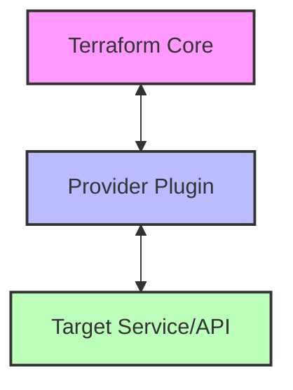

# Terraform Custom Providers

## Introduction

Terraform is a powerful Infrastructure as Code (IaC) tool that allows you to define and provision infrastructure using a declarative configuration language. While Terraform includes numerous official providers for popular services like AWS, Azure, and Google Cloud, you might encounter situations where you need to manage resources not covered by existing providers. This is where custom providers come in.

A Terraform custom provider is an extension that enables Terraform to manage new types of resources or data sources. By creating your own provider, you can extend Terraform's capabilities to manage virtually any API-enabled service or system specific to your organization's needs.

In this guide, we'll explore:
- What custom providers are and when you might need them
- The architecture of Terraform providers
- How to develop a basic custom provider in Go
- How to test and use your custom provider
- Best practices for provider development

## Understanding Terraform Providers

Before diving into custom provider development, let's understand how providers work in the Terraform ecosystem.

### Provider Architecture

Terraform providers serve as plugins that implement resource types and data sources. They act as a bridge between Terraform core and the infrastructure APIs they manage.



A provider typically consists of:

1. **Provider Configuration** - Defines how to authenticate and connect to the service
2. **Resources** - Manageable infrastructure components
3. **Data Sources** - Read-only information about existing infrastructure

### When to Create a Custom Provider

Consider developing a custom provider when:

- You need to manage internal services with no existing Terraform provider
- You want to integrate with a third-party API not covered by official providers
- You require specialized functionality beyond what existing providers offer
- You want to standardize infrastructure management across your organization

## Prerequisites for Custom Provider Development

Before creating a custom provider, you'll need:

1. **Go Language Knowledge** - Providers are written in Go
2. **Basic Terraform Understanding** - Familiarity with Terraform concepts and HCL
3. **Development Environment** - Go installed (version 1.18+ recommended)
4. **API Knowledge** - Understanding of the API you want to integrate with

## Creating Your First Custom Provider

Let's build a simple custom provider that manages a hypothetical "Note" service. Our provider will allow creating, reading, updating, and deleting text notes through a REST API.

### Step 1: Set Up Your Development Environment

First, create a new Go module for your provider:

```bash
mkdir terraform-provider-notes
cd terraform-provider-notes
go mod init terraform-provider-notes
```

### Step 2: Define Provider Structure

Create the main provider file:

```go
package main

import (
	"github.com/hashicorp/terraform-plugin-sdk/v2/helper/schema"
	"github.com/hashicorp/terraform-plugin-sdk/v2/plugin"
)

func main() {
	plugin.Serve(&plugin.ServeOpts{
		ProviderFunc: Provider,
	})
}

// Provider returns a terraform.ResourceProvider.
func Provider() *schema.Provider {
	return &schema.Provider{
		Schema: map[string]*schema.Schema{
			"api_endpoint": {
				Type:        schema.TypeString,
				Required:    true,
				DefaultFunc: schema.EnvDefaultFunc("NOTES_API_ENDPOINT", nil),
				Description: "The endpoint for the Notes API",
			},
			"api_key": {
				Type:        schema.TypeString,
				Required:    true,
				Sensitive:   true,
				DefaultFunc: schema.EnvDefaultFunc("NOTES_API_KEY", nil),
				Description: "API key for authentication",
			},
		},
		ResourcesMap: map[string]*schema.Resource{
			"notes_note": resourceNote(),
		},
		DataSourcesMap: map[string]*schema.Resource{
			"notes_note": dataSourceNote(),
		},
	}
}
```

### Step 3: Implement a Resource

Now, let's implement the resource for our Notes service:

```go
func resourceNote() *schema.Resource {
	return &schema.Resource{
		Create: resourceNoteCreate,
		Read:   resourceNoteRead,
		Update: resourceNoteUpdate,
		Delete: resourceNoteDelete,

		Schema: map[string]*schema.Schema{
			"title": {
				Type:     schema.TypeString,
				Required: true,
			},
			"content": {
				Type:     schema.TypeString,
				Required: true,
			},
			"tags": {
				Type:     schema.TypeList,
				Optional: true,
				Elem: &schema.Schema{
					Type: schema.TypeString,
				},
			},
			"last_updated": {
				Type:     schema.TypeString,
				Computed: true,
			},
		},
	}
}
```

### Step 4: Implement CRUD Functions

Next, we need to implement the CRUD (Create, Read, Update, Delete) operations for our resource:

```go
func resourceNoteCreate(d *schema.ResourceData, m interface{}) error {
	// Extract configuration values
	apiClient := m.(*NotesClient)
	
	title := d.Get("title").(string)
	content := d.Get("content").(string)
	
	// Convert tags from interface{} to []string
	tagsList := d.Get("tags").([]interface{})
	tags := make([]string, len(tagsList))
	for i, tag := range tagsList {
		tags[i] = tag.(string)
	}
	
	// Call API to create note
	note, err := apiClient.CreateNote(title, content, tags)
	if err != nil {
		return err
	}
	
	// Set the ID from the created resource
	d.SetId(note.ID)
	
	// Set computed fields
	d.Set("last_updated", note.LastUpdated)
	
	return nil
}

func resourceNoteRead(d *schema.ResourceData, m interface{}) error {
	// Implementation for reading a note
	apiClient := m.(*NotesClient)
	
	note, err := apiClient.GetNote(d.Id())
	if err != nil {
		// If the note doesn't exist, remove it from state
		d.SetId("")
		return nil
	}
	
	d.Set("title", note.Title)
	d.Set("content", note.Content)
	d.Set("tags", note.Tags)
	d.Set("last_updated", note.LastUpdated)
	
	return nil
}

func resourceNoteUpdate(d *schema.ResourceData, m interface{}) error {
	// Implementation for updating a note
	apiClient := m.(*NotesClient)
	
	// Check which fields have changed
	if d.HasChanges("title", "content", "tags") {
		title := d.Get("title").(string)
		content := d.Get("content").(string)
		
		// Convert tags from interface{} to []string
		tagsList := d.Get("tags").([]interface{})
		tags := make([]string, len(tagsList))
		for i, tag := range tagsList {
			tags[i] = tag.(string)
		}
		
		// Call API to update note
		note, err := apiClient.UpdateNote(d.Id(), title, content, tags)
		if err != nil {
			return err
		}
		
		// Update computed fields
		d.Set("last_updated", note.LastUpdated)
	}
	
	return nil
}

func resourceNoteDelete(d *schema.ResourceData, m interface{}) error {
	// Implementation for deleting a note
	apiClient := m.(*NotesClient)
	
	err := apiClient.DeleteNote(d.Id())
	if err != nil {
		return err
	}
	
	// Remove the resource from state
	d.SetId("")
	
	return nil
}
```

### Step 5: Implement API Client

Now let's implement a simple API client to interact with our Notes service:

```go
package main

import (
	"bytes"
	"encoding/json"
	"fmt"
	"net/http"
	"time"
)

// NotesClient handles API communication
type NotesClient struct {
	APIEndpoint string
	APIKey      string
	HTTPClient  *http.Client
}

// Note represents a note in our system
type Note struct {
	ID          string   `json:"id"`
	Title       string   `json:"title"`
	Content     string   `json:"content"`
	Tags        []string `json:"tags"`
	LastUpdated string   `json:"last_updated"`
}

// NewClient creates a new API client
func NewClient(endpoint, apiKey string) *NotesClient {
	return &NotesClient{
		APIEndpoint: endpoint,
		APIKey:      apiKey,
		HTTPClient: &http.Client{
			Timeout: 10 * time.Second,
		},
	}
}

// CreateNote creates a new note via the API
func (c *NotesClient) CreateNote(title, content string, tags []string) (*Note, error) {
	noteData := map[string]interface{}{
		"title":   title,
		"content": content,
		"tags":    tags,
	}
	
	jsonData, err := json.Marshal(noteData)
	if err != nil {
		return nil, err
	}
	
	req, err := http.NewRequest("POST", fmt.Sprintf("%s/notes", c.APIEndpoint), bytes.NewBuffer(jsonData))
	if err != nil {
		return nil, err
	}
	
	req.Header.Set("Content-Type", "application/json")
	req.Header.Set("Authorization", fmt.Sprintf("Bearer %s", c.APIKey))
	
	resp, err := c.HTTPClient.Do(req)
	if err != nil {
		return nil, err
	}
	defer resp.Body.Close()
	
	if resp.StatusCode != http.StatusCreated {
		return nil, fmt.Errorf("API returned error: %s", resp.Status)
	}
	
	var note Note
	if err := json.NewDecoder(resp.Body).Decode(&note); err != nil {
		return nil, err
	}
	
	return &note, nil
}

// Similar implementations for GetNote, UpdateNote, and DeleteNote methods...
```

### Step 6: Connect Provider Configuration to Client

We need to create a configuration function that initializes our API client:

```go
func providerConfigure(d *schema.ResourceData) (interface{}, error) {
	endpoint := d.Get("api_endpoint").(string)
	apiKey := d.Get("api_key").(string)
	
	client := NewClient(endpoint, apiKey)
	
	return client, nil
}
```

Then add this to our Provider function:

```go
func Provider() *schema.Provider {
	return &schema.Provider{
		Schema: map[string]*schema.Schema{
			// ... schema fields as before
		},
		ResourcesMap: map[string]*schema.Resource{
			// ... resources as before
		},
		DataSourcesMap: map[string]*schema.Resource{
			// ... data sources as before
		},
		ConfigureFunc: providerConfigure,
	}
}
```

## Building and Installing Your Provider

### Step 1: Build the Provider

To build your provider, run:

```bash
go build -o terraform-provider-notes
```

### Step 2: Install the Provider Locally

Move the compiled binary to the Terraform plugin directory:

For Terraform 0.13 and later:

```bash
mkdir -p ~/.terraform.d/plugins/example.com/myorg/notes/1.0.0/linux_amd64
cp terraform-provider-notes ~/.terraform.d/plugins/example.com/myorg/notes/1.0.0/linux_amd64
```

### Step 3: Use Your Provider

Create a terraform configuration file that uses your provider:

```hcl
terraform {
  required_providers {
    notes = {
      source = "example.com/myorg/notes"
      version = "1.0.0"
    }
  }
}

provider "notes" {
  api_endpoint = "https://notes-api.example.com/api/v1"
  api_key      = "your-api-key"
}

resource "notes_note" "example" {
  title   = "My First Terraform Note"
  content = "This note was created via a custom Terraform provider!"
  tags    = ["terraform", "custom", "example"]
}

output "note_last_updated" {
  value = notes_note.example.last_updated
}
```

## Testing Your Custom Provider

Testing is crucial for ensuring your provider works correctly. Terraform provider development typically involves three types of tests:

1. **Unit Tests** - Test individual functions
2. **Acceptance Tests** - Test real API interactions

Here's an example of a unit test for our provider schema:

```go
func TestProvider(t *testing.T) {
	if err := Provider().InternalValidate(); err != nil {
		t.Fatalf("err: %s", err)
	}
}
```

And an acceptance test example:

```go
func TestAccNote_basic(t *testing.T) {
	resource.Test(t, resource.TestCase{
		PreCheck:     func() { testAccPreCheck(t) },
		Providers:    testAccProviders,
		CheckDestroy: testAccCheckNoteDestroy,
		Steps: []resource.TestStep{
			{
				Config: testAccNoteConfig_basic,
				Check: resource.ComposeTestCheckFunc(
					testAccCheckNoteExists("notes_note.test"),
					resource.TestCheckResourceAttr("notes_note.test", "title", "test"),
					resource.TestCheckResourceAttr("notes_note.test", "content", "Hello, Terraform!"),
				),
			},
		},
	})
}

const testAccNoteConfig_basic = `
resource "notes_note" "test" {
  title   = "test"
  content = "Hello, Terraform!"
  tags    = ["test", "terraform"]
}
`
```

## Advanced Custom Provider Features

As you become more comfortable with provider development, consider implementing these advanced features:

### Data Sources

Data sources allow users to fetch information about existing resources:

```go
func dataSourceNote() *schema.Resource {
	return &schema.Resource{
		Read: dataSourceNoteRead,
		Schema: map[string]*schema.Schema{
			"id": {
				Type:     schema.TypeString,
				Required: true,
			},
			"title": {
				Type:     schema.TypeString,
				Computed: true,
			},
			"content": {
				Type:     schema.TypeString,
				Computed: true,
			},
			"tags": {
				Type:     schema.TypeList,
				Computed: true,
				Elem: &schema.Schema{
					Type: schema.TypeString,
				},
			},
			"last_updated": {
				Type:     schema.TypeString,
				Computed: true,
			},
		},
	}
}

func dataSourceNoteRead(d *schema.ResourceData, m interface{}) error {
	apiClient := m.(*NotesClient)
	
	noteID := d.Get("id").(string)
	
	note, err := apiClient.GetNote(noteID)
	if err != nil {
		return err
	}
	
	d.SetId(note.ID)
	d.Set("title", note.Title)
	d.Set("content", note.Content)
	d.Set("tags", note.Tags)
	d.Set("last_updated", note.LastUpdated)
	
	return nil
}
```

### Import Support

Adding import functionality allows users to bring existing resources under Terraform management:

```