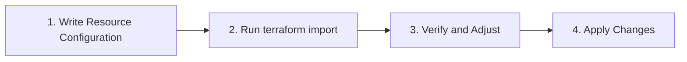

# Terraform Import

## Introduction

When adopting Infrastructure as Code (IaC) with Terraform, you'll likely encounter situations where you need to bring existing infrastructure under Terraform's management. This is where the `terraform import` command becomes invaluable.

Terraform Import allows you to take resources that were created outside of Terraform (manually through a console, via other tools, or inherited from previous teams) and bring them under Terraform's management without having to recreate them.

In this guide, we'll explore:
- Why and when to use Terraform Import
- The import process step by step
- Practical examples with different resource types
- Best practices and common challenges

## Why Use Terraform Import?

Before diving into the how, let's understand why importing existing resources is beneficial:

1. **Avoid Recreating Resources**: Importing allows you to manage existing resources without tearing them down and rebuilding them.

2. **Consistent Management**: After importing, you can manage all your infrastructure through the same Terraform workflow.

3. **Documentation as Code**: Your infrastructure becomes documented in your Terraform configuration files.

4. **Easier Collaboration**: Team members can understand and modify infrastructure through version-controlled code.

5. **Gradual Migration**: You can incrementally move from manual management to IaC.

## The Import Process

Importing resources into Terraform involves three main steps:



### Step 1: Write Resource Configuration

Before importing, you need to create a Terraform configuration file (`.tf`) that describes the resource you want to import. You don't need to know all the attributes, but you must define the resource type and name.

```hcl
resource "aws_instance" "web_server" {
  # Minimal configuration - we'll fill in details after import
  # You must specify the resource type and a name
}
```

### Step 2: Run `terraform import`

The basic syntax for the import command is:

```
terraform import [options] ADDRESS ID
```

Where:
- `ADDRESS` is the Terraform resource address (e.g., `aws_instance.web_server`)
- `ID` is the ID of the existing infrastructure resource as recognized by the provider

For example:

```
terraform import aws_instance.web_server i-1234567890abcdef0
```

### Step 3: Verify and Adjust

After importing, you should:

1. Run `terraform plan` to see what changes Terraform would make
2. Update your configuration to match the imported resource's actual attributes
3. Run `terraform plan` again to confirm there are no differences

### Step 4: Apply Changes

Once your configuration matches the imported state, you can run `terraform apply` to apply any changes you've made to your configuration.

## Practical Examples

Let's walk through some common scenarios where Terraform Import proves useful.

### Example 1: Importing an AWS EC2 Instance

Imagine you have an EC2 instance that was created manually through the AWS console.

**Step 1**: Create a configuration file (`main.tf`):

```hcl
provider "aws" {
  region = "us-west-2"
}

resource "aws_instance" "web_server" {
  # Minimal configuration to start with
}
```

**Step 2**: Run the import command:

```
terraform import aws_instance.web_server i-1234567890abcdef0
```

**Output**:
```
aws_instance.web_server: Importing from ID "i-1234567890abcdef0"...
aws_instance.web_server: Import prepared!
  Prepared aws_instance for import
aws_instance.web_server: Refreshing state... [id=i-1234567890abcdef0]

Import successful!

The resources that were imported are shown above. These resources are now in
your Terraform state and will henceforth be managed by Terraform.
```

**Step 3**: After import, run `terraform state show` to see the resource details:

```
terraform state show aws_instance.web_server
```

**Output**:
```
# aws_instance.web_server:
resource "aws_instance" "web_server" {
    ami                         = "ami-0c55b159cbfafe1f0"
    instance_type               = "t2.micro"
    key_name                    = "my-key"
    subnet_id                   = "subnet-1234567890abcdef0"
    vpc_security_group_ids      = ["sg-1234567890abcdef0"]
    # ... other attributes ...
}
```

**Step 4**: Update your configuration to match the actual resource:

```hcl
resource "aws_instance" "web_server" {
  ami                         = "ami-0c55b159cbfafe1f0"
  instance_type               = "t2.micro"
  key_name                    = "my-key"
  subnet_id                   = "subnet-1234567890abcdef0"
  vpc_security_group_ids      = ["sg-1234567890abcdef0"]
  
  tags = {
    Name = "Web Server"
  }
}
```

**Step 5**: Run `terraform plan` to verify there are no differences between your configuration and the imported state:

```
terraform plan
```

**Output**:
```
No changes. Your infrastructure matches the configuration.
```

### Example 2: Importing an Azure Resource Group

For Azure resources, the process is similar but with provider-specific IDs.

**Step 1**: Create your configuration:

```hcl
provider "azurerm" {
  features {}
}

resource "azurerm_resource_group" "example" {
  # Minimal configuration
}
```

**Step 2**: Run the import command:

```
terraform import azurerm_resource_group.example /subscriptions/00000000-0000-0000-0000-000000000000/resourceGroups/example-resources
```

**Step 3**: Update your configuration based on the imported state:

```hcl
resource "azurerm_resource_group" "example" {
  name     = "example-resources"
  location = "East US"
  
  tags = {
    environment = "production"
  }
}
```

### Example 3: Importing Multiple Resources

For more complex scenarios, you might need to import multiple related resources.

Let's say you have an AWS VPC with subnets and route tables:

```hcl
# First, import the VPC
terraform import aws_vpc.main vpc-1234567890abcdef0

# Then import the subnets
terraform import aws_subnet.public subnet-public1234567890
terraform import aws_subnet.private subnet-private1234567890

# Finally, import the route tables
terraform import aws_route_table.public rtb-public1234567890
terraform import aws_route_table.private rtb-private1234567890
```

You would then update your Terraform configuration to accurately reflect all these resources.

## Advanced Import Techniques

### Using Import Block (Terraform 1.5+)

Starting with Terraform 1.5, you can use the `import` block in your configuration to declaratively specify imports:

```hcl
import {
  to = aws_instance.web_server
  id = "i-1234567890abcdef0"
}

resource "aws_instance" "web_server" {
  # Configuration will be filled in during import
}
```

Then run:

```
terraform plan -generate-config -out=import.tfplan
```

This will generate the configuration for the imported resource.

### Importing Modules

When your infrastructure is organized into modules, you can import resources into a module:

```
terraform import module.vpc.aws_vpc.this vpc-1234567890abcdef0
```

## Common Challenges and Solutions

### 1. Missing Required Attributes

**Challenge**: After importing, Terraform might complain about missing required attributes.

**Solution**: Use `terraform state show` to see all attributes of the imported resource and add them to your configuration.

### 2. Dependent Resources

**Challenge**: Some resources depend on others, and importing them in the wrong order can cause issues.

**Solution**: Import resources in the correct dependency order, typically starting with foundational resources (like VPCs) before more specific ones (like EC2 instances).

### 3. Generated Names and IDs

**Challenge**: Some resources have provider-generated names or IDs that Terraform expects to manage.

**Solution**: Use the `lifecycle` block with `ignore_changes` for attributes that should not be managed by Terraform:

```hcl
resource "aws_instance" "example" {
  # ... configuration ...
  
  lifecycle {
    ignore_changes = [
      # Ignore changes to tags that are managed externally
      tags["AutoScalingGroupName"],
    ]
  }
}
```

## Best Practices

1. **Import One Resource at a Time**: This makes troubleshooting easier.

2. **Version Control**: Commit your Terraform files to version control before and after imports.

3. **Backup State**: Always back up your Terraform state before importing resources.

4. **Validate Before Apply**: Always run `terraform plan` after importing to check for any unexpected changes.

5. **Documentation**: Document the import process and reasons for any special configurations.

6. **Use Modules**: For repeated imports of similar resources, consider creating a module.

## Summary

Terraform Import is a powerful tool that bridges the gap between existing infrastructure and Infrastructure as Code. By following the steps outlined in this guide, you can gradually bring your infrastructure under Terraform management without disruption.

Remember:
- Write resource configurations before importing
- Use `terraform import` to bring resources into state
- Adjust configurations to match the actual resources
- Validate with `terraform plan` before applying changes

With proper use of Terraform Import, you can achieve a fully managed, version-controlled infrastructure even when starting with existing resources.

## Additional Resources

- [Terraform Import Official Documentation](https://www.terraform.io/docs/cli/commands/import.html)
- [Terraform Import Block Documentation](https://developer.hashicorp.com/terraform/language/import)
- [Terraform State Commands](https://www.terraform.io/docs/cli/commands/state/index.html)

## Exercises

1. Import an existing cloud storage bucket (S3 on AWS or Cloud Storage on GCP) into Terraform.
2. Import a network security group with multiple rules.
3. Create a small module that imports and manages a set of related resources (e.g., a VPC with subnets).
4. Practice using the `terraform plan -generate-config` workflow with an imported resource.
5. Import a resource and then modify one of its attributes through Terraform.