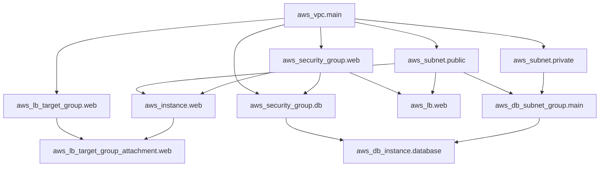

# Terraform Graph Visualization

## Introduction

When working with Terraform configurations that span multiple resources, understanding the relationships between those resources becomes critical. Terraform internally creates a dependency graph that determines the order of resource creation, modification, and deletion. Visualizing this graph can help you:

- Understand resource dependencies
- Debug complex infrastructure code
- Plan changes with confidence
- Document your infrastructure
- Optimize your deployment process

In this tutorial, we'll explore how to generate, visualize, and interpret Terraform dependency graphs, along with practical examples and use cases.

## Understanding the Terraform Dependency Graph

Before diving into visualization, let's understand what the dependency graph is.

Terraform builds a graph where:
- Nodes represent resources, data sources, modules, and other objects
- Edges represent dependencies between these objects

The graph is directed (arrows show dependency direction) and acyclic (no circular dependencies), allowing Terraform to determine the correct order for creating resources.

## Basic Graph Generation

Terraform provides a built-in command to generate the dependency graph:

```bash
terraform graph
```

This command outputs a description of the dependency graph in DOT format, which looks like this:

```
digraph {
  compound = "true"
  newrank = "true"
  subgraph "root" {
    "[root] aws_instance.web" [label = "aws_instance.web", shape = "box"]
    "[root] aws_security_group.allow_http" [label = "aws_security_group.allow_http", shape = "box"]
    "[root] provider[\"registry.terraform.io/hashicorp/aws\"]" [label = "provider[\"registry.terraform.io/hashicorp/aws\"]", shape = "diamond"]
    "[root] aws_instance.web" -> "[root] aws_security_group.allow_http"
    "[root] aws_security_group.allow_http" -> "[root] provider[\"registry.terraform.io/hashicorp/aws\"]"
  }
}
```

While this raw output isn't easy to interpret, we can convert it to a visual format.

## Visualizing the Graph

### Option 1: Using GraphvizOnline

The easiest way to visualize the Terraform graph is:

1. Run `terraform graph` to generate the DOT output
2. Copy the output
3. Paste it into an online Graphviz tool like [GraphvizOnline](https://dreampuf.github.io/GraphvizOnline/)

### Option 2: Using Graphviz Locally

If you prefer a local solution:

1. Install Graphviz:

```bash
# For macOS
brew install graphviz

# For Ubuntu/Debian
sudo apt-get install graphviz

# For Windows
# Download from https://graphviz.org/download/
```

2. Generate and visualize the graph:

```bash
terraform graph | dot -Tpng > graph.png
```

This creates a PNG image of your infrastructure graph.

### Option 3: Using Terraform Graph-Builder

For more advanced visualization, you can use [Terraform Graph Builder](https://github.com/28mm/blast-radius):

```bash
pip install blastradius
blast-radius --serve .
```

This provides an interactive web interface showing your graph.

## Graph Types

Terraform can generate different types of graphs:

### Plan Graph

Shows what changes Terraform plans to make:

```bash
terraform graph -type=plan
```

### Apply Graph

Shows the dependencies for resource creation:

```bash
terraform graph -type=apply
```

### Destroy Graph

Shows the order of resource destruction:

```bash
terraform graph -type=destroy
```

## Practical Example: Visualizing a Web Application Infrastructure

Let's look at a simple web application architecture with:
- VPC and subnets
- EC2 instances
- Load balancer
- Database

Here's the Terraform configuration:

```hcl
provider "aws" {
  region = "us-west-2"
}

resource "aws_vpc" "main" {
  cidr_block = "10.0.0.0/16"
  tags = {
    Name = "main-vpc"
  }
}

resource "aws_subnet" "public" {
  vpc_id            = aws_vpc.main.id
  cidr_block        = "10.0.1.0/24"
  availability_zone = "us-west-2a"
  tags = {
    Name = "public-subnet"
  }
}

resource "aws_subnet" "private" {
  vpc_id            = aws_vpc.main.id
  cidr_block        = "10.0.2.0/24"
  availability_zone = "us-west-2b"
  tags = {
    Name = "private-subnet"
  }
}

resource "aws_security_group" "web" {
  name        = "web-sg"
  description = "Allow HTTP traffic"
  vpc_id      = aws_vpc.main.id

  ingress {
    from_port   = 80
    to_port     = 80
    protocol    = "tcp"
    cidr_blocks = ["0.0.0.0/0"]
  }
}

resource "aws_security_group" "db" {
  name        = "db-sg"
  description = "Allow MySQL traffic from web tier"
  vpc_id      = aws_vpc.main.id

  ingress {
    from_port       = 3306
    to_port         = 3306
    protocol        = "tcp"
    security_groups = [aws_security_group.web.id]
  }
}

resource "aws_instance" "web" {
  count         = 2
  ami           = "ami-0c55b159cbfafe1f0"
  instance_type = "t2.micro"
  subnet_id     = aws_subnet.public.id
  security_groups = [aws_security_group.web.id]

  tags = {
    Name = "web-server-${count.index}"
  }
}

resource "aws_db_instance" "database" {
  allocated_storage    = 10
  engine               = "mysql"
  engine_version       = "5.7"
  instance_class       = "db.t2.micro"
  db_name              = "mydb"
  username             = "admin"
  password             = "password"
  skip_final_snapshot  = true
  vpc_security_group_ids = [aws_security_group.db.id]
  db_subnet_group_name = aws_db_subnet_group.main.name
}

resource "aws_db_subnet_group" "main" {
  name       = "main"
  subnet_ids = [aws_subnet.private.id, aws_subnet.public.id]
}

resource "aws_lb" "web" {
  name               = "web-lb"
  internal           = false
  load_balancer_type = "application"
  security_groups    = [aws_security_group.web.id]
  subnets            = [aws_subnet.public.id]
}

resource "aws_lb_target_group" "web" {
  name     = "web-target-group"
  port     = 80
  protocol = "HTTP"
  vpc_id   = aws_vpc.main.id
}

resource "aws_lb_target_group_attachment" "web" {
  count            = 2
  target_group_arn = aws_lb_target_group.web.arn
  target_id        = aws_instance.web[count.index].id
  port             = 80
}
```

When we run `terraform graph` on this configuration, we'll see a complex network of dependencies, which might look overwhelming. Let's visualize it using a Mermaid diagram:



This visualization shows that:
1. The VPC is a foundation resource many other resources depend on
2. Security groups depend on the VPC
3. Instances depend on subnets and security groups
4. The database depends on its subnet group and security group
5. Load balancer components have their own dependency chain

## Interpreting Common Graph Patterns

When analyzing your Terraform graphs, look for these patterns:

### Hub and Spoke

When one resource has many dependencies pointing to it (like the VPC in our example), it's a critical resource. Changes to this resource will affect many others.

### Long Chains

A long chain of dependencies (A → B → C → D → E) indicates sequential creation. This can slow down your deployments and increase the risk of failure.

### Isolated Subgraphs

Completely separate parts of the graph indicate independent infrastructure components that could potentially be split into separate Terraform configurations.

## Advanced Graph Analysis

### Finding Bottlenecks

Look for resources with many incoming edges. These resources might become bottlenecks in your application architecture.

### Identifying Circular Dependencies

If Terraform reports a circular dependency error, use the graph to identify and resolve the cycle:

```bash
terraform graph | grep -A 3 -B 3 "circular"
```

### Optimizing Module Structure

Use graph visualization to organize your modules better:

```bash
terraform graph -draw-cycles | dot -Tpng > module_structure.png
```

## Practical Applications

### Troubleshooting Dependency Errors

If you encounter an error like:

```
Error: Resource depends on non-existent resource
```

Generate a graph to visualize the dependency path and identify the issue.

### Planning Infrastructure Changes

Before making significant changes, visualize the current and planned states:

```bash
# Current state graph
terraform graph > before.dot

# Apply changes and generate new graph
terraform apply
terraform graph > after.dot

# Compare the differences
diff before.dot after.dot
```

### Documenting Infrastructure

Include graph visualizations in your documentation to help team members understand the infrastructure:

```bash
terraform graph | dot -Tsvg > infrastructure_diagram.svg
```

## Best Practices

1. **Generate graphs regularly** during development to catch dependency issues early
2. **Keep modules focused** on logical infrastructure components to avoid complex graphs
3. **Include graph visualizations** in your documentation
4. **Review graphs before applying** changes to production infrastructure
5. **Look for unexpected dependencies** that might indicate design flaws

## Extending Graph Visualization

### Custom Graph Styling

You can modify the DOT output to customize your graph visualization:

```bash
terraform graph | sed 's/shape = "box"/shape = "box" style="filled" fillcolor="lightblue"/g' | dot -Tpng > styled_graph.png
```

### Graph Analysis Scripts

Create scripts to analyze graph properties:

```python
import networkx as nx
import pydot

# Parse DOT file
graphs = pydot.graph_from_dot_file("terraform_graph.dot")
graph = graphs[0]

# Convert to NetworkX graph
nx_graph = nx.nx_pydot.from_pydot(graph)

# Find critical paths
critical_path = nx.dag_longest_path(nx_graph)
print(f"Critical path: {critical_path}")

# Identify hub resources
hub_nodes = sorted(nx_graph.nodes(), key=lambda x: nx_graph.degree(x), reverse=True)[:5]
print(f"Hub resources: {hub_nodes}")
```

## Summary

Terraform graph visualization is a powerful tool for understanding, debugging, and optimizing your infrastructure code. By generating and analyzing dependency graphs, you can:

- Gain insights into resource relationships
- Identify potential bottlenecks and critical paths
- Document your infrastructure visually
- Troubleshoot dependency issues more effectively
- Plan changes with greater confidence

As your Terraform configurations grow in complexity, graph visualization becomes increasingly important for maintaining a clear understanding of your infrastructure architecture.

## Additional Resources

- [Terraform Graph Documentation](https://www.terraform.io/docs/cli/commands/graph.html)
- [Graphviz Documentation](https://graphviz.org/documentation/)
- [BlastRadius Tool](https://github.com/28mm/blast-radius)
- [NetworkX for Graph Analysis](https://networkx.org/)

## Exercises

1. Generate a graph for your existing Terraform configuration and identify the most critical resources.
2. Compare the apply graph and destroy graph for the same configuration. What differences do you notice?
3. Create a module structure that minimizes cross-module dependencies, using graph visualization to validate your design.
4. Write a script to analyze your Terraform graph and identify resources that could be created in parallel.
5. Generate a visual representation of how your infrastructure would change after adding a new component, before actually applying the changes.