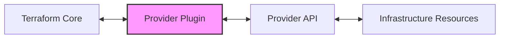

# Terraform Provider Plugins

## Introduction

Terraform Provider Plugins are essential components that allow Terraform to manage resources across various infrastructure platforms. They serve as the bridge between Terraform's core functionality and the APIs of different service providers like AWS, Azure, Google Cloud, and many others. In this guide, we'll explore what provider plugins are, how they function, and how you can work with them to extend Terraform's capabilities.

## What Are Terraform Provider Plugins?

Provider plugins in Terraform are executable binaries that implement the Terraform Plugin Protocol. They enable communication between Terraform Core and the APIs of infrastructure service providers. Each provider plugin is responsible for understanding the API of a specific service and exposing resources that can be managed via Terraform.



### Key Characteristics of Provider Plugins

- **Modular Design**: Providers are separate from Terraform Core, allowing independent development and updates
- **Extensible**: The provider ecosystem can grow without changing Terraform itself
- **Consistent Interface**: All providers follow a standard protocol to interact with Terraform
- **Versioned**: Providers are versioned independently of Terraform Core

## How Provider Plugins Work

When you run Terraform commands, the following process occurs:

1. Terraform Core identifies which providers are needed based on your configuration
2. It downloads the required provider plugins (if not already present)
3. Terraform Core launches the provider plugins as separate processes
4. Communication occurs between Terraform Core and the provider plugins via RPC (Remote Procedure Call)
5. The provider plugins translate Terraform's requests into API calls to the respective services

## Finding and Using Provider Plugins

### Official, Partner, and Community Providers

Terraform providers fall into three categories:

1. **Official Providers**: Developed and maintained by HashiCorp (e.g., AWS, Azure, Google Cloud)
2. **Partner Providers**: Developed by third-party companies in partnership with HashiCorp
3. **Community Providers**: Developed by the Terraform community

You can find providers in the [Terraform Registry](https://registry.terraform.io/browse/providers).

### Configuring Providers in Your Terraform Configuration

To use a provider, you need to declare it in your Terraform configuration:

```hcl
terraform {
  required_providers {
    aws = {
      source  = "hashicorp/aws"
      version = "~> 4.0"
    }
  }
}

provider "aws" {
  region = "us-west-2"
}
```

### Provider Configuration and Authentication

Most providers require authentication to interact with their APIs. Authentication methods vary by provider:

```hcl
# AWS Provider with explicit credentials
provider "aws" {
  region     = "us-west-2"
  access_key = "my-access-key"
  secret_key = "my-secret-key"
}

# Azure Provider with service principal authentication
provider "azurerm" {
  features {}
  subscription_id = "00000000-0000-0000-0000-000000000000"
  client_id       = "00000000-0000-0000-0000-000000000000"
  client_secret   = "00000000-0000-0000-0000-000000000000"
  tenant_id       = "00000000-0000-0000-0000-000000000000"
}
```

:::caution
Never hardcode sensitive credentials in your Terraform files. Use environment variables, credential files, or other secure methods instead.
:::

## Managing Provider Versions

### Specifying Version Constraints

You can specify version constraints to ensure compatibility:

```hcl
terraform {
  required_providers {
    aws = {
      source  = "hashicorp/aws"
      version = "~> 4.16"
    }
  }
}
```

Common version constraints include:
- `= 4.0.0`: Exact version
- `>= 4.0.0`: Version 4.0.0 or newer
- `~> 4.0`: Any version in the 4.x range
- `>= 4.0, < 5.0`: Version 4.x but not 5.x

### Provider Dependency Lock File

Terraform maintains a `.terraform.lock.hcl` file to lock provider versions:

```hcl
# This file is maintained automatically by "terraform init".
# Manual edits may be lost in future updates.

provider "registry.terraform.io/hashicorp/aws" {
  version     = "4.16.0"
  constraints = "~> 4.16"
  hashes = [
    "h1:6V8jLqXdtHjCkMIuxg77BrTVchqpaRK1UUYeTuXDPmE=",
    "zh:0aa204fead7c431796386cc9e73ccda9a7d8cb8da2b6e8b963479f9f50c4e429",
    # ... more hash values ...
  ]
}
```

## Multiple Provider Configurations

You can configure multiple instances of the same provider:

```hcl
# Default AWS provider configuration
provider "aws" {
  region = "us-west-2"
}

# Alternative AWS provider configuration for us-east-1
provider "aws" {
  alias  = "east"
  region = "us-east-1"
}

# Resource using the default provider
resource "aws_instance" "west_instance" {
  ami           = "ami-0c55b159cbfafe1f0"
  instance_type = "t2.micro"
}

# Resource using the alternate provider
resource "aws_instance" "east_instance" {
  provider      = aws.east
  ami           = "ami-0be2609ba883822ec"
  instance_type = "t2.micro"
}
```

## Practical Example: Setting Up Multi-Cloud Infrastructure

Let's create a practical example that uses multiple providers to deploy resources across different cloud platforms:

```hcl
terraform {
  required_providers {
    aws = {
      source  = "hashicorp/aws"
      version = "~> 4.16"
    }
    azurerm = {
      source  = "hashicorp/azurerm"
      version = "~> 3.0"
    }
    google = {
      source  = "hashicorp/google"
      version = "~> 4.0"
    }
  }
}

# AWS Provider Configuration
provider "aws" {
  region = "us-west-2"
}

# Azure Provider Configuration
provider "azurerm" {
  features {}
}

# Google Cloud Provider Configuration
provider "google" {
  project = "my-project-id"
  region  = "us-central1"
}

# AWS Resources
resource "aws_instance" "web_server" {
  ami           = "ami-0c55b159cbfafe1f0"
  instance_type = "t2.micro"
  tags = {
    Name = "WebServer"
    Environment = "Development"
  }
}

# Azure Resources
resource "azurerm_resource_group" "example" {
  name     = "example-resources"
  location = "West Europe"
}

resource "azurerm_virtual_network" "example" {
  name                = "example-network"
  address_space       = ["10.0.0.0/16"]
  location            = azurerm_resource_group.example.location
  resource_group_name = azurerm_resource_group.example.name
}

# Google Cloud Resources
resource "google_compute_instance" "app_server" {
  name         = "app-server"
  machine_type = "e2-medium"
  zone         = "us-central1-a"

  boot_disk {
    initialize_params {
      image = "debian-cloud/debian-10"
    }
  }

  network_interface {
    network = "default"
    access_config {}
  }
}
```

This configuration uses three different providers (AWS, Azure, and Google Cloud) to create resources across multiple cloud platforms.

## Developing Custom Providers

For advanced users, you can develop custom providers to manage resources not covered by existing providers. Here's a high-level overview of the process:

### Setting Up a Custom Provider Project

1. Create a new Go project for your provider:

```bash
mkdir terraform-provider-example
cd terraform-provider-example
go mod init github.com/yourusername/terraform-provider-example
```

2. Install the required dependencies:

```bash
go get github.com/hashicorp/terraform-plugin-sdk/v2/plugin
go get github.com/hashicorp/terraform-plugin-sdk/v2/helper/schema
```

### Implementing a Basic Provider

Here's a simple example of a custom provider implementation:

```go
package main

import (
	"github.com/hashicorp/terraform-plugin-sdk/v2/helper/schema"
	"github.com/hashicorp/terraform-plugin-sdk/v2/plugin"
)

func main() {
	plugin.Serve(&plugin.ServeOpts{
		ProviderFunc: Provider,
	})
}

// Provider returns a terraform.ResourceProvider.
func Provider() *schema.Provider {
	return &schema.Provider{
		ResourcesMap: map[string]*schema.Resource{
			"example_resource": resourceExampleResource(),
		},
		DataSourcesMap: map[string]*schema.Resource{
			"example_data_source": dataSourceExampleResource(),
		},
	}
}

func resourceExampleResource() *schema.Resource {
	return &schema.Resource{
		Create: resourceExampleResourceCreate,
		Read:   resourceExampleResourceRead,
		Update: resourceExampleResourceUpdate,
		Delete: resourceExampleResourceDelete,

		Schema: map[string]*schema.Schema{
			"name": {
				Type:     schema.TypeString,
				Required: true,
			},
		},
	}
}

// Implementation of CRUD functions
func resourceExampleResourceCreate(d *schema.ResourceData, m interface{}) error {
	// Implementation for creating a resource
	name := d.Get("name").(string)
	d.SetId(name)
	return nil
}

func resourceExampleResourceRead(d *schema.ResourceData, m interface{}) error {
	// Implementation for reading a resource
	return nil
}

func resourceExampleResourceUpdate(d *schema.ResourceData, m interface{}) error {
	// Implementation for updating a resource
	return nil
}

func resourceExampleResourceDelete(d *schema.ResourceData, m interface{}) error {
	// Implementation for deleting a resource
	d.SetId("")
	return nil
}

// Data source implementation
func dataSourceExampleResource() *schema.Resource {
	// Implementation for data source
	return nil
}
```

### Building and Installing Your Provider

1. Build your provider:

```bash
go build -o terraform-provider-example
```

2. Move the binary to the Terraform plugins directory:

```bash
mkdir -p ~/.terraform.d/plugins/github.com/yourusername/example/1.0.0/linux_amd64
cp terraform-provider-example ~/.terraform.d/plugins/github.com/yourusername/example/1.0.0/linux_amd64/
```

3. Use your custom provider in Terraform:

```hcl
terraform {
  required_providers {
    example = {
      source  = "github.com/yourusername/example"
      version = "1.0.0"
    }
  }
}

provider "example" {}

resource "example_resource" "my_resource" {
  name = "example"
}
```

## Debugging Provider Issues

When working with providers, you may encounter issues. Here are some debugging techniques:

### Enabling Terraform Logs

Set the `TF_LOG` environment variable to enable detailed logging:

```bash
export TF_LOG=TRACE
terraform apply
```

Log levels include: TRACE, DEBUG, INFO, WARN, ERROR

### Checking Provider Authentication

Verify that your provider authentication is correct:

1. Check environment variables
2. Validate IAM permissions
3. Ensure service accounts have appropriate permissions

### Common Provider Issues

1. **Version Compatibility**: Ensure your provider version is compatible with your Terraform version
2. **API Rate Limiting**: Providers may hit API rate limits during large deployments
3. **Resource Dependencies**: Check for missing dependencies between resources

## Summary

Terraform Provider Plugins are the foundation of Terraform's multi-cloud capabilities. They:

- Connect Terraform to various infrastructure platforms
- Abstract away API differences between providers
- Enable consistent management of resources across platforms
- Can be extended with custom providers for specialized needs

Understanding how providers work and how to configure them properly is crucial for effectively using Terraform in your infrastructure management workflow.

## Additional Resources

Here are some resources to continue learning about Terraform providers:

- [Terraform Provider Development Program](https://www.terraform.io/docs/partnerships/index.html)
- [Terraform Registry](https://registry.terraform.io/)
- [Writing Custom Providers](https://www.terraform.io/docs/extend/writing-custom-providers.html)

## Exercises

1. Implement a Terraform configuration that uses at least three different providers.
2. Create a configuration that uses multiple instances of the same provider with different configurations.
3. Explore the Terraform Registry and find a community provider that interests you. Implement a small project using it.
4. For advanced users: Create a basic custom provider that manages a simple resource type.